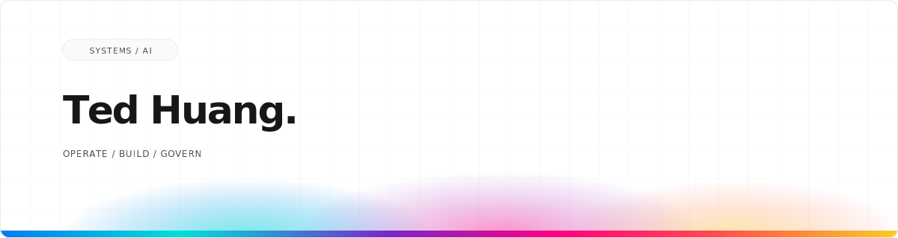

<a id="english"></a>

<p align="right">
  <strong>English</strong> · <a href="./README.zh-TW.md">繁體中文</a>
</p>

<p align="center">
  <picture>
    <source media="(prefers-color-scheme: dark) and (max-width: 600px)" srcset="./assets/profile-hero-mobile-dark.svg">
    <source media="(prefers-color-scheme: light) and (max-width: 600px)" srcset="./assets/profile-hero-mobile-light.svg">
    <source media="(prefers-color-scheme: dark)" srcset="./assets/profile-hero-dark.svg">
    <source media="(prefers-color-scheme: light)" srcset="./assets/profile-hero-light.svg">
    
  </picture>
</p>

<p align="center">
  <strong>Enterprise IT operator building practical AI systems.</strong><br>
  Multi-AI workflows · Agent governance · Durable memory
</p>

<p align="center">
  <a href="https://ai-sister.com"><strong>Visit Ai-Sister ↗</strong></a>
  &nbsp;·&nbsp;
  <a href="./projects/README.md"><strong>Explore 9 case studies →</strong></a>
  &nbsp;·&nbsp;
  <a href="mailto:ted@ted-h.com"><strong>Email ↗</strong></a>
</p>

<table width="100%">
  <tr>
    <td width="33%" align="center">
      <strong>20 years</strong><br><sub>Enterprise IT</sub>
    </td>
    <td width="33%" align="center">
      <strong>9 projects</strong><br><sub>Public case studies</sub>
    </td>
    <td width="33%" align="center">
      <strong>4 AI systems</strong><br><sub>Claude · GPT · Gemini · Grok</sub>
    </td>
  </tr>
</table>

---

## In production.

<table width="100%">
  <tr>
    <td width="32%" valign="top">
      <code>LIVE / MULTI-AI</code><br><br>
      <strong><a href="https://ai-sister.com">Ai-Sister ↗</a></strong><br>
      <sub>One input. Four AI systems.</sub>
    </td>
    <td width="68%" valign="top">
      A production web app that orchestrates ChatGPT, Claude, Gemini, and Grok through parallel chat, structured debate, an eight-step coding loop, roundtables, and focused single-agent modes.<br><br>
      <code>Hono</code> <code>React</code> <code>SQLite</code> <code>SSE</code> <code>Oracle Cloud ARM</code><br><br>
      <a href="./projects/multi-ai-chat.md">See where it started →</a>
    </td>
  </tr>
</table>

---

## Public work.

Nine original public repositories across multi-AI experiences, agent infrastructure, security, and learning—72 GitHub stars at the July 18 snapshot. Star badges below stay live; each title opens a full case study with architecture, decisions, setup, current limits, and license status.

<p><code>01 / MULTI-AI EXPERIENCES</code></p>

<table width="100%">
  <tr>
    <td width="32%" valign="top">
      <strong><a href="./projects/multi-ai-chat-desktop.md">Multi-AI Chat Desktop</a></strong><br>
      <code>DESKTOP</code> <code>LOCAL-FIRST</code>
    </td>
    <td width="68%" valign="top">
      The stable v1.6.3 desktop edition: coordinate logged-in ChatGPT, Claude, Gemini, and Grok through six guided presets over five local workflow engines—including a 48-contribution Brainstorm—without model API keys.<br><br>
      <a href="https://github.com/teddashh/multi-ai-chat-desktop/stargazers"></a> <a href="https://github.com/teddashh/multi-ai-chat-desktop/releases/latest"></a><br><br>
      <code>Tauri 2</code> <code>React</code> <code>TypeScript</code> <code>Rust</code><br><br>
      <a href="https://github.com/teddashh/multi-ai-chat-desktop">Source ↗</a>
    </td>
  </tr>
  <tr>
    <td width="32%" valign="top">
      <strong><a href="./projects/multi-ai-chat.md">Multi-AI Chat</a></strong><br>
      <code>CHROME</code> <code>NO API KEYS</code>
    </td>
    <td width="68%" valign="top">
      Turn the AI tabs already open in Chrome into one lightweight multi-model workflow surface, with bounded same-conversation context and structure-preserving Markdown transcripts.<br><br>
      <a href="https://github.com/teddashh/multi-ai-chat/stargazers"></a> <code>source v0.2.0</code><br><br>
      <code>Manifest V3</code> <code>React</code> <code>TypeScript</code><br><br>
      <a href="https://github.com/teddashh/multi-ai-chat">Source ↗</a>
    </td>
  </tr>
  <tr>
    <td width="32%" valign="top">
      <strong><a href="./projects/ai-brainstorming.md">AI Brainstorming</a></strong><br>
      <code>WEB MVP</code> <code>ASYNC REVIEW</code>
    </td>
    <td width="68%" valign="top">
      Submit an idea for a 5-, 12-, or 16-round review, leave, then return by private resume link or optional email report.<br><br>
      <a href="https://github.com/teddashh/ai-brainstorming/stargazers"></a> <code>source v0.1.0</code><br><br>
      <code>Hono</code> <code>React</code> <code>SQLite</code> <code>OpenRouter</code><br><br>
      <a href="https://github.com/teddashh/ai-brainstorming">Source ↗</a>
    </td>
  </tr>
</table>

<p><code>02 / AGENT INFRASTRUCTURE</code></p>

<table width="100%">
  <tr>
    <td width="32%" valign="top">
      <strong><a href="./projects/openclaw-hermes-watcher.md">openclaw-hermes-watcher</a></strong><br>
      <code>GOVERNANCE</code> <code>OPERATIONS</code>
    </td>
    <td width="68%" valign="top">
      Add a guarded, auditable evolution layer to an OpenClaw host while keeping upgrade authority with the human operator.<br><br>
      <a href="https://github.com/teddashh/openclaw-hermes-watcher/stargazers"></a> <a href="https://github.com/teddashh/openclaw-hermes-watcher/releases/latest"></a><br><br>
      <code>Bash</code> <code>systemd</code> <code>OpenClaw</code> <code>Hermes</code><br><br>
      <a href="https://github.com/teddashh/openclaw-hermes-watcher">Source ↗</a>
    </td>
  </tr>
  <tr>
    <td width="32%" valign="top">
      <strong><a href="./projects/clawd-lobster.md">Clawd-Lobster</a></strong><br>
      <code>CLAUDE CODE</code> <code>FILE-FIRST</code>
    </td>
    <td width="68%" valign="top">
      A curated operating layer for reviewed specifications, persistent memory, reusable skills, workspaces, and multi-machine continuity.<br><br>
      <a href="https://github.com/teddashh/clawd-lobster/stargazers"></a> <code>source v0.6.0 beta</code><br><br>
      <code>Python</code> <code>MCP</code> <code>SQLite</code> <code>Claude Code</code><br><br>
      <a href="https://github.com/teddashh/clawd-lobster">Source ↗</a>
    </td>
  </tr>
  <tr>
    <td width="32%" valign="top">
      <strong><a href="./projects/claude-idea-review-skill.md">Claude Idea Review Skill</a></strong><br>
      <code>SKILL</code> <code>VALIDATION</code>
    </td>
    <td width="68%" valign="top">
      Give product, creator, community, and business ideas an adversarial review before serious time is spent building them.<br><br>
      <a href="https://github.com/teddashh/claude-idea-review-skill/stargazers"></a> <code>installable skill</code><br><br>
      <code>Claude Code Skill</code> <code>Python</code> <code>Static reports</code><br><br>
      <a href="https://github.com/teddashh/claude-idea-review-skill">Source ↗</a>
    </td>
  </tr>
  <tr>
    <td width="32%" valign="top">
      <strong><a href="./projects/mcp-memory-server.md">MCP Memory Server</a></strong><br>
      <code>MEMORY</code> <code>EARLY-STAGE</code>
    </td>
    <td width="68%" valign="top">
      Model decisions, resolved issues, questions, and knowledge through an inspectable MCP memory server.<br><br>
      <a href="https://github.com/teddashh/mcp-memory-server/stargazers"></a> <code>source v0.1.0</code><br><br>
      <code>Python</code> <code>FastMCP</code> <code>SQLite</code> <code>Oracle</code><br><br>
      <a href="https://github.com/teddashh/mcp-memory-server">Source ↗</a>
    </td>
  </tr>
</table>

<p><code>03 / SECURITY &amp; LEARNING</code></p>

<table width="100%">
  <tr>
    <td width="32%" valign="top">
      <strong><a href="./projects/idn-homograph-example.md">Homograph Attack Demo</a></strong><br>
      <code>SECURITY</code> <code>BILINGUAL</code>
    </td>
    <td width="68%" valign="top">
      Make a visually deceptive Unicode domain understandable in a short, hands-on security-awareness lesson.<br><br>
      <a href="https://github.com/teddashh/idn-homograph-example/stargazers"></a><br><br>
      <code>HTML</code> <code>CSS</code> <code>JavaScript</code> <code>Vercel</code><br><br>
      <a href="https://project-9ogsa.vercel.app">Live ↗</a> · <a href="https://github.com/teddashh/idn-homograph-example">Source ↗</a>
    </td>
  </tr>
  <tr>
    <td width="32%" valign="top">
      <strong><a href="./projects/zhan-dou-tuo-luo.md">AI Beyblade X Field Guide</a></strong><br>
      <code>KNOWLEDGE</code> <code>AI-ASSISTED</code>
    </td>
    <td width="68%" valign="top">
      Turn scattered discussions into a score-aware 3v3 deck-building, buying, practice, and match-review framework.<br><br>
      <a href="https://github.com/teddashh/zhan-dou-tuo-luo/stargazers"></a><br><br>
      <code>Markdown</code> <code>Research notes</code> <code>Traditional Chinese</code><br><br>
      <a href="https://github.com/teddashh/zhan-dou-tuo-luo">Source ↗</a>
    </td>
  </tr>
</table>

<p align="right"><a href="./projects/README.md"><strong>Browse the full project directory →</strong></a></p>

---

## How I build.

<table width="100%">
  <tr>
    <td width="10%" align="center"><code>01</code></td>
    <td width="90%"><strong>Operations first.</strong><br>Working for months in a real environment matters more than looking clever in a demo.</td>
  </tr>
  <tr>
    <td width="10%" align="center"><code>02</code></td>
    <td width="90%"><strong>Human authority.</strong><br>Agents can research and act within limits. Permissions and upgrade decisions stay explicit.</td>
  </tr>
  <tr>
    <td width="10%" align="center"><code>03</code></td>
    <td width="90%"><strong>Durable by default.</strong><br>State survives, work resumes, decisions stay inspectable, and failures leave evidence.</td>
  </tr>
</table>

## The stack.

**Product systems**

`TypeScript` · `React` · `Hono` · `Tauri` · `Rust` · `Python` · `MCP` · `SQLite` · `Oracle` · `Bash`

**Enterprise operations**

`M365` · `Entra ID` · `Intune` · `Google Workspace` · `Salesforce` · `Dynamics NAV` · `NIST CSF` · `ISO 27001`

## Now.

```text
current-focus/
├── orchestrate  Claude · GPT · Gemini · local models
├── govern       defined roles · human authority · honest scoring
└── operate      production systems · every day
```

<details>
<summary><strong>The longer story.</strong></summary>

**Taipei, 1985–2008.** Studied computer science at National Central University, ran campus networks, co-built a MUD that is still operating after 20+ years, and managed the university's highest-traffic personal BBS board.

**United States, 2008–today.** Earned a master's in computer information systems, then spent nearly two decades operating identity, endpoints, ERP, BI, CRM, and security programs inside real businesses.

**Now.** I apply that operator's perspective to AI products: not “what is the cleverest code?” but “what will people trust, adopt, recover, and keep running?”

</details>

---

<p align="center">
  <code>TAIPEI → UNITED STATES</code><br><br>
  <a href="https://ted-h.com">ted-h.com</a> · <a href="mailto:ted@ted-h.com">ted@ted-h.com</a>
</p>
