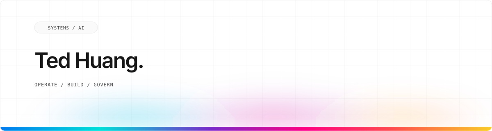

<a id="traditional-chinese"></a>

<p align="right">
  <a href="./README.md">English</a> · <strong>繁體中文</strong>
</p>

<p align="center">
  <picture>
    <source media="(prefers-color-scheme: dark) and (max-width: 600px)" srcset="./assets/profile-hero-mobile-dark.svg">
    <source media="(prefers-color-scheme: light) and (max-width: 600px)" srcset="./assets/profile-hero-mobile-light.svg">
    <source media="(prefers-color-scheme: dark)" srcset="./assets/profile-hero-dark.svg">
    <source media="(prefers-color-scheme: light)" srcset="./assets/profile-hero-light.svg">
    
  </picture>
</p>

<p align="center">
  <strong>企業 IT 維運者，現在打造真正能落地的 AI 系統。</strong><br>
  多 AI 工作流 · Agent 治理 · 長期記憶
</p>

<p align="center">
  <a href="https://ai-sister.com"><strong>前往 Ai-Sister Web ↗</strong></a>
  &nbsp;·&nbsp;
  <a href="https://teddashh.github.io/?lang=zh-TW"><strong>全部 18 個專案介紹頁 →</strong></a>
  &nbsp;·&nbsp;
  <a href="mailto:ted@ted-h.com"><strong>Email ↗</strong></a>
</p>

<table width="100%">
  <tr>
    <td width="33%" align="center">
      <strong>20 年</strong><br><sub>企業 IT</sub>
    </td>
    <td width="33%" align="center">
      <strong>18 個專案</strong><br><sub>中英雙語介紹頁</sub>
    </td>
    <td width="33%" align="center">
      <strong>4 套 AI</strong><br><sub>Claude · GPT · Gemini · Grok</sub>
    </td>
  </tr>
</table>

---

## 正在線上運作。

<table width="100%">
  <tr>
    <td width="32%" valign="top">
      <code>LIVE / MULTI-AI</code><br><br>
      <strong><a href="https://ai-sister.com">Ai-Sister Web ↗</a></strong><br>
      <sub>一個輸入，四套 AI。</sub>
    </td>
    <td width="68%" valign="top">
      原本 Ai-Sister 服務背後、正式上線的 Web App，同時調度 ChatGPT、Claude、Gemini、Grok；支援平行對話、結構化辯論、八步 Coding Loop、多輪圓桌與單一 Agent 模式。它和下方較新的開源 AI-Sister 桌面記憶夥伴是不同產品。<br><br>
      <code>Hono</code> <code>React</code> <code>SQLite</code> <code>SSE</code> <code>Oracle Cloud ARM</code><br><br>
      <a href="https://teddashh.github.io/multi-ai-chat/?lang=zh-TW">看看它從哪裡開始 →</a>
    </td>
  </tr>
</table>

---

## 公開作品。

<!-- projects:start -->
<!-- Generated from hub.json in teddashh/teddashh.github.io by kit/render_profile.py. -->

18 個原創公開專案，分成四組。點標題會打開該專案自己的中英雙語介紹頁，頁面裡也老實寫出目前的狀態。徽章都是即時的。

<p><code>01 / AI 工具</code></p>

<table width="100%">
  <tr>
    <td width="32%" valign="top">
      <strong><a href="https://teddashh.github.io/multi-ai-chat-desktop/?lang=zh-TW">Multi-AI Chat Desktop</a></strong><br>
      <code>持續開發</code>
    </td>
    <td width="68%" valign="top">
      可攜式桌面 app，用引導式流程同時操作你已登入的 ChatGPT、Claude、Gemini、Grok，不需要 API key。<br><br>
      <a href="https://github.com/teddashh/multi-ai-chat-desktop/stargazers"></a> <a href="https://github.com/teddashh/multi-ai-chat-desktop/releases/latest"></a><br><br>
      <code>Tauri 2</code> <code>React</code> <code>TypeScript</code> <code>Rust</code><br><br>
      <a href="https://teddashh.github.io/multi-ai-chat-desktop/?lang=zh-TW">專案介紹 ↗</a> · <a href="https://github.com/teddashh/multi-ai-chat-desktop">原始碼 ↗</a> · <a href="https://github.com/teddashh/multi-ai-chat-desktop/releases/latest">下載 ↗</a>
    </td>
  </tr>
  <tr>
    <td width="32%" valign="top">
      <strong><a href="https://teddashh.github.io/multi-ai-chat/?lang=zh-TW">Multi-AI Chat</a></strong><br>
      <code>持續開發</code>
    </td>
    <td width="68%" valign="top">
      Chrome 側邊面板，把你已經開著的 AI 分頁串成一條多模型工作流程。<br><br>
      <a href="https://github.com/teddashh/multi-ai-chat/stargazers"></a> <a href="https://github.com/teddashh/multi-ai-chat/releases/latest"></a><br><br>
      <code>Chrome MV3</code> <code>React</code> <code>TypeScript</code><br><br>
      <a href="https://teddashh.github.io/multi-ai-chat/?lang=zh-TW">專案介紹 ↗</a> · <a href="https://github.com/teddashh/multi-ai-chat">原始碼 ↗</a>
    </td>
  </tr>
  <tr>
    <td width="32%" valign="top">
      <strong><a href="https://teddashh.github.io/multi-ai-terminal/?lang=zh-TW">Multi-AI Terminal</a></strong><br>
      <code>暫停開發</code>
    </td>
    <td width="68%" valign="top">
      本機工作台，在 Claude Code、Codex、Grok、Antigravity 的 headless runtime 上跑分階段的多 agent 工作流程，有關卡，也有可重播的證據紀錄。<br><br>
      <a href="https://github.com/teddashh/multi-ai-terminal/stargazers"></a> <a href="https://github.com/teddashh/multi-ai-terminal/releases/latest"></a><br><br>
      <code>TypeScript</code> <code>React</code> <code>Node.js</code> <code>Tauri 2</code><br><br>
      <a href="https://teddashh.github.io/multi-ai-terminal/?lang=zh-TW">專案介紹 ↗</a> · <a href="https://github.com/teddashh/multi-ai-terminal">原始碼 ↗</a>
    </td>
  </tr>
  <tr>
    <td width="32%" valign="top">
      <strong><a href="https://teddashh.github.io/AI-Sister/?lang=zh-TW">AI-Sister</a></strong><br>
      <code>持續開發</code>
    </td>
    <td width="68%" valign="top">
      本機優先的桌面陪伴：記得你做過什麼，大部分時間保持安靜，每句回答都附上出處。<br><br>
      <a href="https://github.com/teddashh/AI-Sister/stargazers"></a> <a href="https://github.com/teddashh/AI-Sister/releases"></a><br><br>
      <code>Tauri 2</code> <code>Rust</code> <code>SQLite</code> <code>Windows OCR</code><br><br>
      <a href="https://teddashh.github.io/AI-Sister/?lang=zh-TW">專案介紹 ↗</a> · <a href="https://github.com/teddashh/AI-Sister">原始碼 ↗</a>
    </td>
  </tr>
  <tr>
    <td width="32%" valign="top">
      <strong><a href="https://teddashh.github.io/ai-brainstorming/?lang=zh-TW">AI Brainstorming</a></strong><br>
      <code>暫停開發</code>
    </td>
    <td width="68%" valign="top">
      點子審查的小型網頁 app：選 5、12 或 16 輪，先離開，之後用連結或 email 拿到 Markdown 報告。<br><br>
      <a href="https://github.com/teddashh/ai-brainstorming/stargazers"></a><br><br>
      <code>Hono</code> <code>React</code> <code>SQLite</code> <code>OpenRouter</code><br><br>
      <a href="https://teddashh.github.io/ai-brainstorming/?lang=zh-TW">專案介紹 ↗</a> · <a href="https://github.com/teddashh/ai-brainstorming">原始碼 ↗</a>
    </td>
  </tr>
  <tr>
    <td width="32%" valign="top">
      <strong><a href="https://teddashh.github.io/claude-idea-review-skill/?lang=zh-TW">Claude Idea Review Skill</a></strong><br>
      <code>穩定</code>
    </td>
    <td width="68%" valign="top">
      Claude Code skill：在你花時間動手之前，先讓點子經過 5、12 或 16 輪的審查。<br><br>
      <a href="https://github.com/teddashh/claude-idea-review-skill/stargazers"></a><br><br>
      <code>Claude Code skill</code> <code>Python</code><br><br>
      <a href="https://teddashh.github.io/claude-idea-review-skill/?lang=zh-TW">專案介紹 ↗</a> · <a href="https://github.com/teddashh/claude-idea-review-skill">原始碼 ↗</a>
    </td>
  </tr>
</table>

<p><code>02 / Agent 基礎建設</code></p>

<table width="100%">
  <tr>
    <td width="32%" valign="top">
      <strong><a href="https://teddashh.github.io/bat-agent-connector/?lang=zh-TW">bat-agent-connector</a></strong><br>
      <code>持續開發</code>
    </td>
    <td width="68%" valign="top">
      非官方連接器，讓 AI agent 查看、推動與調度 Better Agent Terminal 的 session，權限分層、需要主動開啟，並有確定性的關卡。<br><br>
      <a href="https://github.com/teddashh/bat-agent-connector/stargazers"></a><br><br>
      <code>Python</code> <code>MCP</code> <code>CLI</code><br><br>
      <a href="https://teddashh.github.io/bat-agent-connector/?lang=zh-TW">專案介紹 ↗</a> · <a href="https://github.com/teddashh/bat-agent-connector">原始碼 ↗</a>
    </td>
  </tr>
  <tr>
    <td width="32%" valign="top">
      <strong><a href="https://teddashh.github.io/bat-cowork/?lang=zh-TW">bat-cowork</a></strong><br>
      <code>早期階段</code>
    </td>
    <td width="68%" valign="top">
      伺服器優先的協作工作站：Paseo 衍生的 daemon，加上 Better Agent Terminal 桌面端。仍在開發中，尚未發布。<br><br>
      <a href="https://github.com/teddashh/bat-cowork/stargazers"></a><br><br>
      <code>TypeScript</code> <code>Node.js</code> <code>Tauri</code><br><br>
      <a href="https://teddashh.github.io/bat-cowork/?lang=zh-TW">專案介紹 ↗</a> · <a href="https://github.com/teddashh/bat-cowork">原始碼 ↗</a>
    </td>
  </tr>
  <tr>
    <td width="32%" valign="top">
      <strong><a href="https://teddashh.github.io/TokenMonster/?lang=zh-TW">TokenMonster</a></strong><br>
      <code>暫停開發</code>
    </td>
    <td width="68%" valign="top">
      在你自己的電腦上追蹤 Claude Code、Codex、Gemini CLI、Grok Build 的 token 用量，有即時儀表板，陪伴角色會隨真實里程碑成長。<br><br>
      <a href="https://github.com/teddashh/TokenMonster/stargazers"></a> <a href="https://github.com/teddashh/TokenMonster/releases"></a><br><br>
      <code>TypeScript</code> <code>Electron</code> <code>Node.js</code> <code>SQLite</code><br><br>
      <a href="https://teddashh.github.io/TokenMonster/?lang=zh-TW">專案介紹 ↗</a> · <a href="https://github.com/teddashh/TokenMonster">原始碼 ↗</a>
    </td>
  </tr>
  <tr>
    <td width="32%" valign="top">
      <strong><a href="https://teddashh.github.io/openclaw-hermes-watcher/?lang=zh-TW">openclaw-hermes-watcher</a></strong><br>
      <code>穩定</code>
    </td>
    <td width="68%" valign="top">
      OpenClaw 主機的守護型演化層：Hermes 研究並提案，Bash watcher 把關，由操作者核准。<br><br>
      <a href="https://github.com/teddashh/openclaw-hermes-watcher/stargazers"></a> <a href="https://github.com/teddashh/openclaw-hermes-watcher/releases/latest"></a><br><br>
      <code>Bash</code> <code>systemd</code> <code>YAML</code><br><br>
      <a href="https://teddashh.github.io/openclaw-hermes-watcher/?lang=zh-TW">專案介紹 ↗</a> · <a href="https://github.com/teddashh/openclaw-hermes-watcher">原始碼 ↗</a>
    </td>
  </tr>
  <tr>
    <td width="32%" valign="top">
      <strong><a href="https://teddashh.github.io/clawd-lobster/?lang=zh-TW">Clawd-Lobster</a></strong><br>
      <code>暫停開發</code>
    </td>
    <td width="68%" valign="top">
      Claude Code 的精選運作層：經過審閱的規格、持久記憶、可重用的 skill，以及跨機器延續的工作區。<br><br>
      <a href="https://github.com/teddashh/clawd-lobster/stargazers"></a><br><br>
      <code>Python</code> <code>MCP</code> <code>SQLite</code> <code>Claude Code</code><br><br>
      <a href="https://teddashh.github.io/clawd-lobster/?lang=zh-TW">專案介紹 ↗</a> · <a href="https://github.com/teddashh/clawd-lobster">原始碼 ↗</a>
    </td>
  </tr>
  <tr>
    <td width="32%" valign="top">
      <strong><a href="https://teddashh.github.io/mcp-memory-server/?lang=zh-TW">MCP Memory Server</a></strong><br>
      <code>暫停開發</code>
    </td>
    <td width="68%" valign="top">
      給 agent 用的長期記憶 MCP 伺服器：決策、已解決的問題、待回答的問題與知識，都可以檢視。<br><br>
      <a href="https://github.com/teddashh/mcp-memory-server/stargazers"></a><br><br>
      <code>Python</code> <code>FastMCP</code> <code>SQLite</code><br><br>
      <a href="https://teddashh.github.io/mcp-memory-server/?lang=zh-TW">專案介紹 ↗</a> · <a href="https://github.com/teddashh/mcp-memory-server">原始碼 ↗</a>
    </td>
  </tr>
</table>

<p><code>03 / 資安與 IT</code></p>

<table width="100%">
  <tr>
    <td width="32%" valign="top">
      <strong><a href="https://teddashh.github.io/ai-security-scanner/?lang=zh-TW">ai-security-scanner</a></strong><br>
      <code>持續開發</code>
    </td>
    <td width="68%" valign="top">
      桌面 app 與 agent skill：執行上游的開源資安工具，把結果整理成一份標準化報告。<br><br>
      <a href="https://github.com/teddashh/ai-security-scanner/stargazers"></a> <a href="https://github.com/teddashh/ai-security-scanner/releases/latest"></a><br><br>
      <code>Rust</code> <code>Tauri</code> <code>React</code><br><br>
      <a href="https://teddashh.github.io/ai-security-scanner/?lang=zh-TW">專案介紹 ↗</a> · <a href="https://github.com/teddashh/ai-security-scanner">原始碼 ↗</a>
    </td>
  </tr>
  <tr>
    <td width="32%" valign="top">
      <strong><a href="https://teddashh.github.io/AI-Intune/?lang=zh-TW">AI-Intune</a></strong><br>
      <code>持續開發</code>
    </td>
    <td width="68%" valign="top">
      以證據為本的控制平面，管理執行 AI agent 與 coding 工具的 Linux 機器。<br><br>
      <a href="https://github.com/teddashh/AI-Intune/stargazers"></a><br><br>
      <code>Go</code> <code>Linux</code><br><br>
      <a href="https://teddashh.github.io/AI-Intune/?lang=zh-TW">專案介紹 ↗</a> · <a href="https://github.com/teddashh/AI-Intune">原始碼 ↗</a>
    </td>
  </tr>
  <tr>
    <td width="32%" valign="top">
      <strong><a href="https://teddashh.github.io/idn-homograph-example/?lang=zh-TW">IDN Homograph Demo</a></strong><br>
      <code>穩定</code>
    </td>
    <td width="68%" valign="top">
      一頁式的中英雙語資安意識示範：看看長得一模一樣的 Unicode 網域，怎麼冒充真的網站。<br><br>
      <a href="https://github.com/teddashh/idn-homograph-example/stargazers"></a><br><br>
      <code>HTML</code> <code>CSS</code> <code>JavaScript</code><br><br>
      <a href="https://teddashh.github.io/idn-homograph-example/?lang=zh-TW">專案介紹 ↗</a> · <a href="https://github.com/teddashh/idn-homograph-example">原始碼 ↗</a> · <a href="https://project-9ogsa.vercel.app">線上示範 ↗</a>
    </td>
  </tr>
</table>

<p><code>04 / 小作品與筆記</code></p>

<table width="100%">
  <tr>
    <td width="32%" valign="top">
      <strong><a href="https://teddashh.github.io/reset-therapy/?lang=zh-TW">重置 Therapy</a></strong><br>
      <code>小玩具</code>
    </td>
    <td width="68%" valign="top">
      中英雙語的抗倦怠小玩具：看著四個假的 AI 額度面板燒光，再讓黃金龍幫你重置。<br><br>
      <a href="https://github.com/teddashh/reset-therapy/stargazers"></a><br><br>
      <code>HTML</code> <code>JavaScript</code><br><br>
      <a href="https://teddashh.github.io/reset-therapy/?lang=zh-TW">專案介紹 ↗</a> · <a href="https://github.com/teddashh/reset-therapy">原始碼 ↗</a> · <a href="https://teddashh.github.io/reset-therapy/play/?lang=zh">開始玩 ↗</a>
    </td>
  </tr>
  <tr>
    <td width="32%" valign="top">
      <strong><a href="https://teddashh.github.io/zhan-dou-tuo-luo/?lang=zh-TW">AI 教你打陀螺</a></strong><br>
      <code>筆記</code>
    </td>
    <td width="68%" valign="top">
      戰鬥陀螺 Beyblade X 中文筆記：為什麼決定勝負的是分數而不是誰轉得最久，以及怎麼配 3v3 牌組。<br><br>
      <a href="https://github.com/teddashh/zhan-dou-tuo-luo/stargazers"></a><br><br>
      <code>Markdown</code> <code>繁體中文</code><br><br>
      <a href="https://teddashh.github.io/zhan-dou-tuo-luo/?lang=zh-TW">專案介紹 ↗</a> · <a href="https://github.com/teddashh/zhan-dou-tuo-luo">原始碼 ↗</a>
    </td>
  </tr>
  <tr>
    <td width="32%" valign="top">
      <strong><a href="https://teddashh.github.io/freeworkshop-issue-assets/?lang=zh-TW">freeworkshop-issue-assets</a></strong><br>
      <code>工具倉庫</code>
    </td>
    <td width="68%" valign="top">
      自由工坊社群機器人從 Discord 開 GitHub issue 時用的圖片倉庫，因為 Discord 附件連結會過期。<br><br>
      <a href="https://github.com/teddashh/freeworkshop-issue-assets/stargazers"></a><br><br>
      <code>GitHub</code> <code>Discord bot</code><br><br>
      <a href="https://teddashh.github.io/freeworkshop-issue-assets/?lang=zh-TW">專案介紹 ↗</a> · <a href="https://github.com/teddashh/freeworkshop-issue-assets">原始碼 ↗</a>
    </td>
  </tr>
</table>

<p align="right"><a href="https://teddashh.github.io/?lang=zh-TW"><strong>全部 18 個專案介紹頁 →</strong></a></p>
<!-- projects:end -->

---

## 我怎麼做。

<table width="100%">
  <tr>
    <td width="10%" align="center"><code>01</code></td>
    <td width="90%"><strong>維運優先。</strong><br>能在真實環境穩定跑幾個月，比在 demo 裡顯得聰明更重要。</td>
  </tr>
  <tr>
    <td width="10%" align="center"><code>02</code></td>
    <td width="90%"><strong>人類保有權限。</strong><br>Agent 可以研究與受限執行；權限和升級決策必須始終明確。</td>
  </tr>
  <tr>
    <td width="10%" align="center"><code>03</code></td>
    <td width="90%"><strong>預設可延續。</strong><br>狀態能保存、工作能恢復、決策可稽核，失敗也必須留下證據。</td>
  </tr>
</table>

## 技術棧。

**產品系統**

`TypeScript` · `React` · `Hono` · `Tauri` · `Rust` · `Python` · `MCP` · `SQLite` · `Oracle` · `Bash`

**企業維運**

`M365` · `Entra ID` · `Intune` · `Google Workspace` · `Salesforce` · `Dynamics NAV` · `NIST CSF` · `ISO 27001`

## 現在。

```text
current-focus/
├── 調度  Claude · GPT · Gemini · 本地模型
├── 治理  明確角色 · 人類權限 · 誠實評分
└── 維運  Production 系統 · 每天運作
```

<details>
<summary><strong>完整經歷。</strong></summary>

**台灣，1985-2008。** 中央大學資工系；管理校園網路、共同開發營運至今 20+ 年的 MUD，也經營過全校最高人氣的 BBS 個版。

**美國，2008 至今。** 取得 CIS 碩士後，在真實企業裡做了近 20 年的身分、端點、ERP、BI、CRM 與資安維運。

**現在。** 把這個 Operator 視角帶進 AI 產品：不只問「哪段 Code 最聰明」，而是問「人們會不會信任、採用、救得回來，而且願意一直使用？」

</details>

---

<p align="center">
  <code>台灣 → 美國</code><br><br>
  <a href="https://ted-h.com">ted-h.com</a> · <a href="mailto:ted@ted-h.com">ted@ted-h.com</a>
</p>
