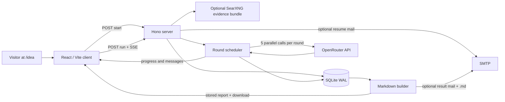
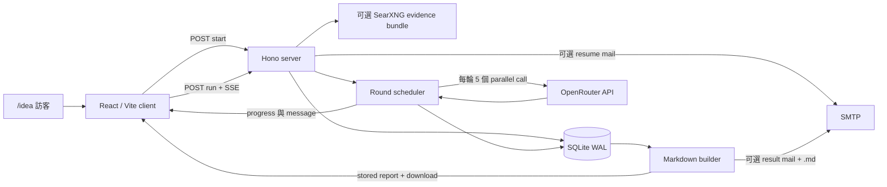

<a id="english"></a>

[← Public GitHub portfolio](./README.md) · [Ted's profile](../README.md) · **English** · [繁體中文](#traditional-chinese) · [GitHub repository](https://github.com/teddashh/ai-brainstorming)

# AI Brainstorming

## Positioning and project snapshot

AI Brainstorming is a standalone web MVP for asynchronous, multi-model review of a product, startup, feature, business-model, or decision idea. A visitor submits an email address and an idea, chooses the depth of the review, and receives a private resume link. Five model “seats” then work through a staged review while the page streams round-by-round progress; the completed transcript remains available as rendered Markdown, a download, and—when SMTP is configured—an email attachment.

This page was verified against the public repository on **July 11, 2026**, with default branch `main` at [`2ef9470`](https://github.com/teddashh/ai-brainstorming/commit/2ef9470a7c6f0a119ce47ab17f31ed684fe677a5).

| Snapshot | Current repository evidence |
|---|---|
| Product form | Single-origin web application mounted at `/idea` |
| Current version | v0.1.0 in the root, server, and web packages |
| Review seats | Claude, Gemini, Grok, ChatGPT, and DeepSeek through OpenRouter's OpenAI-compatible endpoint |
| Review depths | 5, 12, or 16 rounds, producing 25, 60, or 80 model calls respectively |
| Core stack | TypeScript, Hono on Node.js, React 18, Vite, SQLite / better-sqlite3, Server-Sent Events |
| Optional integrations | SearXNG evidence snippets and SMTP delivery via Nodemailer |
| Persistence | Local SQLite database with WAL mode; one session table and one ordered message table |
| Access model | No user accounts; a random 24-byte URL token is the bearer credential for resume and export |
| Repository maturity | A single MVP commit, no release tags, no GitHub Releases, no CI, and no automated tests |
| Deployment status | No hosted URL or homepage is declared in the README, environment example, or GitHub metadata |

Unlike the two Multi-AI Chat projects, this application does require a model API credential: the server sends every seat through OpenRouter. Its value proposition is not “reuse browser sessions,” but “submit a long-running review once, watch or leave, then return to a durable result without creating an account.”

## The problem it addresses

Idea review often collapses into one model producing one polished answer. That answer can sound complete while missing market evidence, counterexamples, feasibility problems, or unresolved disagreements. Asking several models manually creates its own overhead, and a 60- or 80-call review is too long to coordinate through copy and paste.

AI Brainstorming turns that task into a session. It provides a fixed debate shape, keeps progress and outputs in SQLite, gives the visitor a resumable URL before the expensive work begins, and treats the browser stream as a live view rather than the only copy of the result. That makes it possible to start a review, close or lose the page, and come back to the latest persisted state.

## User experience and capabilities

### From submission to report

1. The visitor enters a valid email and an idea between 10 and 12,000 characters, then selects 5, 12, or 16 rounds.
2. The server validates and rate-limits the request, creates a UUID session plus a 192-bit random resume token, writes the original idea to SQLite, and attempts to send the resume link.
3. The React page places the token in `/idea?s=…` and automatically starts the review.
4. The server optionally builds an evidence bundle, then executes five model seats in parallel during each round. SSE events update the current phase, round, seat status, and completed response cards.
5. At the end of every round, responses are stored in a stable provider order and become context for later rounds.
6. On completion, the server builds one Markdown transcript, stores it with the session, attempts a result email with an `.md` attachment, and enables the download endpoint.

If a visitor returns while a session is marked running, the UI polls the session endpoint every five seconds. A completed page renders the stored Markdown with GitHub-Flavored Markdown support; a failed page offers a rerun action.

### A deliberate review schedule

The selected number is a number of rounds, not the number of responses. Every round uses all five seats:

| Review size | Research / thesis | Clash | Converge | Total seat responses |
|---|---:|---:|---:|---:|
| 5 rounds | 1 | 3 | 1 | 25 |
| 12 rounds | 2 | 8 | 2 | 60 |
| 16 rounds | 3 | 10 | 3 | 80 |

All five seats in one round receive the same history snapshot and run concurrently; they do not see another seat's answer from that same round. Later rounds receive the latest ten prior responses, with each included response clipped to 1,200 characters. The model prompt requests Traditional Chinese, 350–650 Chinese characters, explicit trade-offs, risks, counterexamples, and next steps. The OpenRouter request uses temperature `0.75` and `max_tokens: 1800`.

Default model IDs are environment-overridable:

- Claude: `anthropic/claude-sonnet-4`
- Gemini: `google/gemini-2.5-pro`
- Grok: `x-ai/grok-4`
- ChatGPT: `openai/gpt-4o`
- DeepSeek: `deepseek/deepseek-r1`

### Optional evidence and email

When `SEARXNG_URL` is configured, the server makes up to three searches—the idea itself, market risk, and competitors—and collects at most nine unique result snippets. The prompt labels this bundle weak external context and tells models not to over-weight it. If SearXNG is absent, fails, or returns nothing, the review still runs with an explicit instruction to treat claims as hypotheses.

SMTP is similarly optional. A configured transporter sends the resume link immediately and sends the final report as text, escaped HTML, and a Markdown attachment. Missing credentials or a delivery failure do not prevent the session from being created or completed.

## Architecture and data flow



The main components are small and explicit:

- **`web/src/main.tsx`:** submission form, token resume, auto-run behavior, SSE parser, five-seat progress board, per-round cards, fallback polling, Markdown rendering, and export links.
- **Hono API server:** health, start, resume, export, and run endpoints; input validation; in-memory rate/concurrency guards; static production serving; and SSE lifecycle.
- **SQLite layer:** `idea_sessions` stores identity, status, title, final Markdown, error, and timestamps. `idea_messages` stores the original idea and ordered AI outputs, with foreign-key cascade and indexes by token, email, and session.
- **Scheduler/model layer:** maps review depth to phases, takes a history snapshot at round start, launches the five OpenRouter calls concurrently, streams completion order, then persists responses in participant order.
- **Research layer:** builds a bounded, deduplicated SearXNG snippet bundle without making search a hard dependency.
- **Report/mail layer:** converts persisted messages into Markdown, escapes HTML for the email renderer, and attaches the source Markdown.

The database and email are intended to be the source of truth. SSE writes are best effort: a live stream can disappear, but successful model outputs are persisted and a returning browser can request the session again.

## Key engineering and design choices

### 1. Token-based resume instead of an account system

The server creates 24 cryptographically random bytes and encodes them with base64url. That token is returned to the browser, placed in the resume URL, and indexed uniquely in SQLite. The design makes an MVP easy to enter—there is no password, verification flow, or account database—but the token must be treated like a secret because it grants access to the idea, email, transcript, and export.

### 2. Parallel seats inside serial rounds

Each round starts from a stable prior-history snapshot and fans out to all five models. The server waits for all seats, streams whichever finishes first, then inserts the set in deterministic participant order. This balances speed with a clear rule: within-round answers are independent; cross-examination happens in later “clash” rounds.

### 3. Durable session state around an ephemeral stream

SSE is used for responsive UI, not as the sole record. Session status and every completed round are written to SQLite, and the UI has a polling path for a session that remains running after navigation. SQLite uses WAL and foreign keys, which are practical defaults for a single-node MVP with concurrent reads.

### 4. Optional integrations fail soft

Search errors are swallowed after producing a “no external validation” bundle. SMTP returns `false` when unconfigured, and call sites catch delivery errors. A failed individual model call is converted into a visible seat message so other seats and later rounds can continue.

### 5. Bound public usage before adding a queue

Default guards include 12 session starts per IP per hour, four starts per email per hour, eight runs per IP per hour, configurable global limits of 1,000 starts and 200 runs per hour, three concurrent idea runs, a 30-minute run timeout, and 15-second SSE keepalive events. These controls are simple in-memory buckets, appropriate only to the stated MVP scope.

### 6. Keep deployment as one origin

Production builds compile `server/` and `web/`; when `web/dist` exists, Hono serves the assets and SPA fallback itself. The frontend can therefore use relative `/api/idea/...` URLs without a separate CORS configuration. A reverse proxy can sit in front, with `TRUST_PROXY_HEADERS=true` only when that proxy reliably overwrites client-IP headers.

## Quick start

Copy the environment template and install both packages:

```sh
git clone https://github.com/teddashh/ai-brainstorming.git
cd ai-brainstorming
cp .env.example server/.env
npm run install:all
npm run build
npm start
```

The repository README currently copies the template to the repository root, but the root `npm start` delegates with `npm start --prefix server`; that script runs with `server/` as its working directory, where `dotenv/config` looks for `.env`. Placing the file at `server/.env` matches the current executable path. An explicit `DOTENV_CONFIG_PATH` is another valid deployment fix.

The minimum useful production configuration is:

```dotenv
OPENROUTER_API_KEY=...
PUBLIC_URL=https://your-public-origin.example
```

For browser-side development, start Vite separately:

```sh
cd web
npm run dev
```

The current Vite config contains no `/api` proxy, while the client uses relative API URLs. The standalone Vite server therefore needs a same-origin reverse proxy or a local proxy configuration to exercise the full stack; the build-and-`npm start` path avoids that mismatch because Hono serves `web/dist` and the API from one origin.

For production, build both packages and put the Hono server behind a reverse proxy. Set `PUBLIC_URL` to the real public origin so emailed resume links are correct. Enable `TRUST_PROXY_HEADERS=true` only behind a trusted proxy; otherwise the server deliberately uses the socket address for per-IP limits. Configure `SEARXNG_URL` and SMTP variables only when those optional services are available.

## Current scope, risks, and license

- **OpenRouter is required for real review output.** All five branded seats are model IDs routed through one OpenRouter API key, not five direct provider integrations. Usage can incur cost, and ideas plus accumulated history leave the server for OpenRouter/model processing.
- **This project does not automate provider websites.** It avoids the DOM-selector fragility of the two Multi-AI Chat editions; its corresponding integration risks are OpenRouter API availability, model-ID changes, model behavior, quotas, and pricing.
- **A seat failure is content, not necessarily a failed run.** Each participant exception becomes “this seat temporarily failed” text. Consequently, even a missing API key or an outage affecting every call can still end with session status `completed` and a report containing failure messages.
- **The evidence bundle is not a research verifier.** It uses search-result titles, URLs, and clipped snippets only; it does not fetch or validate source pages. The prompt correctly labels the material weak context, but the generated report still requires human fact-checking.
- **The resume URL is a bearer secret with no lifecycle controls.** There is no account, secondary authentication, expiry, revocation, deletion endpoint, or token rotation. Session responses expose the submitted email, and the generated Markdown includes that email. SQLite data has no repository-defined retention or encryption policy.
- **Operational state is process-local.** Rate buckets and the `running` set reset on restart and are not shared across multiple server instances. A process crash can leave a database row marked `running`; the current UI polls that state and does not show its rerun button until the status is `failed`, although the API's in-memory lock is gone.
- **There is no user cancellation endpoint or job queue.** A run is tied to one server process and a maximum 30-minute abort timer. Per-seat failures have no retry policy; rerunning a failed session deletes prior AI messages and begins again.
- **Email is best effort.** The API can report `emailSent: false`, and final mail errors are swallowed. Users must retain the resume URL if SMTP is absent or delivery fails.
- **The MVP has no public deployment or automated quality gate.** The repository has one commit, no test suite, no CI workflow, no release artifact, and no declared live URL. The current TypeScript server and Vite client build successfully, but that is not behavioral coverage.
- **The documented development setup has two path gaps.** The README's root `.env` location does not match the `server/` working directory used by the prefixed start script, and the standalone Vite configuration has no API proxy. A production build served by Hono works as one origin; local HMR needs the environment path and proxy handled explicitly.
- **Dependency audit:** the current server lock resolves Nodemailer 8.0.11; `npm audit` reports one high-severity advisory affecting that version and offers a major-version upgrade. The app does not expose Nodemailer's raw-message option in its own code, but the dependency should still be updated and reviewed before deployment.
- **License:** the repository contains no `LICENSE`/`COPYING` file, no package license field, and no README license declaration. It is publicly readable source, but it is **not presently licensed as open source**. Reuse, modification, or redistribution rights remain reserved unless the owner publishes a license.

## Source and documentation

- [Repository](https://github.com/teddashh/ai-brainstorming)
- [Project README](https://github.com/teddashh/ai-brainstorming/blob/main/README.md)
- [Environment template and default model IDs](https://github.com/teddashh/ai-brainstorming/blob/main/.env.example)
- [Hono routes and scheduler](https://github.com/teddashh/ai-brainstorming/blob/main/server/src/index.ts)
- [Round phases and model mapping](https://github.com/teddashh/ai-brainstorming/blob/main/server/src/models.ts)
- [Prompt and OpenRouter client](https://github.com/teddashh/ai-brainstorming/blob/main/server/src/llm.ts)
- [SearXNG research bundle](https://github.com/teddashh/ai-brainstorming/blob/main/server/src/research.ts)
- [SQLite schema](https://github.com/teddashh/ai-brainstorming/blob/main/server/src/db.ts)
- [Mail and Markdown report path](https://github.com/teddashh/ai-brainstorming/blob/main/server/src/mail.ts)
- [React client](https://github.com/teddashh/ai-brainstorming/blob/main/web/src/main.tsx)

---

[← Previous: Multi-AI Chat](./multi-ai-chat.md) · [Next: openclaw-hermes-watcher →](./openclaw-hermes-watcher.md)

---

<a id="traditional-chinese"></a>

[← GitHub 公開作品集](./README.md#traditional-chinese) · [Ted 的個人頁](../README.zh-TW.md) · [English](#english) · **繁體中文** · [GitHub Repository](https://github.com/teddashh/ai-brainstorming)

# AI Brainstorming

## 作品定位與現況快照

AI Brainstorming 是一個獨立 Web MVP，專門對產品、創業、功能、商業模式或決策 idea 做非同步多模型 review。訪客輸入 email 與 idea、選擇 review 深度後，會先得到一條私人 resume link；五個模型席位接著按階段工作，頁面逐輪 streaming 進度，完成 transcript 則保留為 rendered Markdown、下載檔，以及在 SMTP 有設定時寄出的 email 附件。

本頁於 **2026 年 7 月 11 日**依公開 repository 核對；default branch `main` 當時位於 [`2ef9470`](https://github.com/teddashh/ai-brainstorming/commit/2ef9470a7c6f0a119ce47ab17f31ed684fe677a5)。

| 快照 | 目前 repository 的實際狀態 |
|---|---|
| 產品形式 | 掛載於 `/idea` 的 single-origin Web application |
| 目前版本 | Root、server、web package 都是 v0.1.0 |
| Review 席位 | 透過 OpenRouter OpenAI-compatible endpoint 呼叫 Claude、Gemini、Grok、ChatGPT、DeepSeek |
| Review 深度 | 5、12、16 輪，分別產生 25、60、80 次 model call |
| 核心技術 | TypeScript、Node.js 上的 Hono、React 18、Vite、SQLite／better-sqlite3、Server-Sent Events |
| 可選整合 | SearXNG evidence snippet、Nodemailer SMTP 寄送 |
| 持久化 | 本機 SQLite WAL；一張 session table 與一張有順序的 message table |
| 存取方式 | 無使用者帳號；一個 24-byte 隨機 URL token 是 resume／export 的 bearer credential |
| Repo 成熟度 | 單一 MVP commit，無 release tag、GitHub Release、CI 或自動測試 |
| 部署狀態 | README、環境範例與 GitHub metadata 都沒有宣告 hosted URL／homepage |

它和兩個 Multi-AI Chat 作品不同：這個 app 確實需要模型 API credential；server 會把每一席都送到 OpenRouter。它的主張不是「沿用 browser session」，而是「送出一次長時間 review；可以觀看或離開，不必建立帳號也能回來拿 durable result」。

## 它要解決的問題

Idea review 很容易退化成一個模型產生一份看起來很完整的答案；表面完整，卻可能沒看市場證據、反例、可行性問題或尚未解決的分歧。手動問多個模型又會產生新的搬運成本，更不用說一次 60 或 80 call 的 review。

AI Brainstorming 把這件事變成一個 session：提供固定辯證形狀，把進度與輸出寫進 SQLite，在昂貴工作開始前先交付 resumable URL，並把 browser stream 當 live view，而不是結果唯一副本。因此使用者可以開始 review、關掉或遺失頁面，再回來取目前已持久化的狀態。

## 使用體驗與能力

### 從送出到報告

1. 訪客輸入有效 email 與 10～12,000 字元的 idea，再選 5／12／16 輪。
2. Server 驗證並 rate-limit request，建立 UUID session 與 192-bit 隨機 resume token，把原始 idea 寫進 SQLite，並嘗試寄出 resume link。
3. React 頁面把 token 放進 `/idea?s=…`，自動啟動 review。
4. Server 視設定建立 evidence bundle，然後每一輪平行執行五個模型席位；SSE event 更新目前 phase、round、seat status 與已完成 response card。
5. 每輪結束時，response 依固定 provider 順序保存，並成為後續輪次 context。
6. 全部完成後，server 建立單一 Markdown transcript、存回 session、嘗試寄出附 `.md` 的結果信，再開放下載 endpoint。

若訪客回來時 session 仍標為 running，UI 每五秒 poll 一次 session endpoint。完成頁面以 GitHub-Flavored Markdown 顯示已保存內容；failed 頁則提供 rerun action。

### 明確的 review schedule

使用者選的是 round 數，不是 response 數；每一輪都使用五席：

| Review 大小 | 搜尋／立論 | 互相攻防 | 漸進收斂 | 總席次回答 |
|---|---:|---:|---:|---:|
| 5 輪 | 1 | 3 | 1 | 25 |
| 12 輪 | 2 | 8 | 2 | 60 |
| 16 輪 | 3 | 10 | 3 | 80 |

同一輪五席拿到相同 history snapshot 並平行執行；它們看不到同輪其他席剛產生的答案。後續 round 會取得最近 10 個先前 response，每個最多 1,200 字元。Model prompt 要求繁體中文、350～650 字、明確取捨、風險、反例與下一步；OpenRouter request 使用 temperature `0.75`、`max_tokens: 1800`。

預設 model ID 都可由環境變數覆寫：

- Claude：`anthropic/claude-sonnet-4`
- Gemini：`google/gemini-2.5-pro`
- Grok：`x-ai/grok-4`
- ChatGPT：`openai/gpt-4o`
- DeepSeek：`deepseek/deepseek-r1`

### 可選 evidence 與 email

設定 `SEARXNG_URL` 時，server 最多做三次搜尋：idea 本身、market risk、competitors；最多收九筆唯一 result snippet。Prompt 把它標成 weak external context，要求 model 不要過度相信。若 SearXNG 缺少、失敗或無結果，review 仍會執行，但明確要求把所有 claim 當作 hypothesis。

SMTP 也同樣可選。Transporter 設定完成時，系統會先寄 resume link，最後再寄出 text、escaped HTML 與 Markdown attachment。Credential 缺少或寄送失敗，都不阻擋 session 建立／完成。

## 架構與資料流



主要元件小而明確：

- **`web/src/main.tsx`：** submission form、token resume、auto-run、SSE parser、五席 progress board、每輪 card、fallback polling、Markdown display 與 export link。
- **Hono API server：** health、start、resume、export、run endpoint；input validation；記憶體內 rate／concurrency guard；production static serving；SSE lifecycle。
- **SQLite layer：** `idea_sessions` 保存 identity、status、title、final Markdown、error、timestamp；`idea_messages` 保存原始 idea 與有順序的 AI output，並有 foreign-key cascade 與 token／email／session index。
- **Scheduler／model layer：** 把 review depth 映射成 phase，在 round 開始時取得 history snapshot，平行啟動五個 OpenRouter call，先 streaming 完成順序，再按 participant order 保存。
- **Research layer：** 建立有上限、去重的 SearXNG snippet bundle，但不把 search 變成 hard dependency。
- **Report／mail layer：** 把已保存 message 轉成 Markdown，為 email renderer escape HTML，再附上來源 Markdown。

Database 與 email 被設計成 source of truth；SSE write 是 best effort。Live stream 可以消失，但成功的 model output 會持久化，回來的 browser 能再次 request session。

## 關鍵工程與設計選擇

### 1. Token resume，而不是 account system

Server 產生 24 cryptographically random bytes，以 base64url 編碼。Token 回傳給 browser、放入 resume URL，並以 unique index 保存於 SQLite。這讓 MVP 沒有 password、verification flow 或 account database；代價是 token 必須當秘密保管，因為它能存取 idea、email、transcript 與 export。

### 2. Serial round 裡的 parallel seat

每輪從固定 previous-history snapshot 開始，再 fan-out 給五個 model。Server 等所有席完成，誰先回來就先 streaming，最後仍依固定 participant order insert。這在速度與規則間取得平衡：同輪答案互相獨立，交叉攻防留給後面的 clash round。

### 3. 以 durable session 包住 ephemeral stream

SSE 用來提供即時 UI，不是唯一紀錄。Session status 與每輪完成 response 都寫入 SQLite；UI 也為 navigation 後仍在 running 的 session 準備 polling path。SQLite WAL 與 foreign keys 是 single-node MVP 同時讀取時實用的預設。

### 4. 可選整合採 fail-soft

Search error 會被收斂成「沒有外部驗證」bundle；SMTP 未設定時回傳 `false`，call site 也 catch 寄送 error；單一 model call 失敗會轉成 visible seat message，讓其他席與後續輪次繼續。

### 5. 在加入 queue 前，先限制 public usage

預設 guard 包括：每 IP 每小時 12 次 session start、每 email 每小時 4 次 start、每 IP 每小時 8 次 run；可設定全域每小時 1,000 start／200 run；同時最多 3 個 idea run；30 分鐘 run timeout；15 秒 SSE keepalive。這些是簡單 memory bucket，只適合 README 所說的 MVP scope。

### 6. 部署保持 single origin

Production build 會編譯 `server/` 與 `web/`；`web/dist` 存在時，Hono 自己提供 asset 與 SPA fallback。Frontend 因此使用相對 `/api/idea/...` URL，不需額外 CORS 設定。前方可放 reverse proxy；只有在 proxy 能可靠覆寫 client-IP header 時才應開 `TRUST_PROXY_HEADERS=true`。

## 快速開始

複製環境範例並安裝兩個 package：

```sh
git clone https://github.com/teddashh/ai-brainstorming.git
cd ai-brainstorming
cp .env.example server/.env
npm run install:all
npm run build
npm start
```

目前 README 把 template 複製到 repo root，但 root `npm start` 實際委派給 `npm start --prefix server`；該 script 的 working directory 是 `server/`，`dotenv/config` 也會在那裡尋找 `.env`。因此 `server/.env` 才符合目前 executable path；deployment 也可以明確設定 `DOTENV_CONFIG_PATH` 修正。

最低限度可用的 production 設定：

```dotenv
OPENROUTER_API_KEY=...
PUBLIC_URL=https://your-public-origin.example
```

Frontend 開發時另外啟動 Vite：

```sh
cd web
npm run dev
```

目前 Vite config 沒有 `/api` proxy，但 client 使用 relative API URL。單獨的 Vite server 因此需要 same-origin reverse proxy 或本機 proxy 設定，才能測 full stack；build 後執行 `npm start` 則沒有這個落差，因為 Hono 在同一 origin 提供 `web/dist` 與 API。

Production 應 build 兩個 package，再把 Hono server 放到 reverse proxy 後方。`PUBLIC_URL` 必須是實際 public origin，否則 email resume link 會錯；只有在 trusted proxy 後方才設 `TRUST_PROXY_HEADERS=true`，否則 server 刻意使用 socket address 做 per-IP limit。`SEARXNG_URL` 與 SMTP variables 只在可用時加入。

## 目前範圍、風險與授權

- **真正 review 需要 OpenRouter。** 五個品牌席位都是經過同一組 OpenRouter API key 路由的 model ID，不是五家 direct integration。使用可能產生成本，idea 與累積 history 也會離開 server，交給 OpenRouter／model 處理。
- **本作品不做 provider 網頁自動化。** 它避開兩個 Multi-AI Chat 版本的 DOM-selector 脆弱性；相對的整合風險是 OpenRouter API 可用性、model ID 變更、模型行為、quota 與價格。
- **Seat failure 是內容，不一定讓 run failed。** 每個 participant exception 都轉成「這一席暫時失敗」文字；因此即使 API key 缺少，或 outage 使每個 call 都失敗，session 仍可能以 `completed` 結束，報告裡全是 failure message。
- **Evidence bundle 不是研究驗證器。** 它只使用 search result title、URL、clipped snippet，不會抓取或驗證來源頁。Prompt 正確地把它標為 weak context，但生成報告仍需人類 fact-check。
- **Resume URL 是沒有 lifecycle control 的 bearer secret。** 沒有 account、二次 authentication、expiry、revocation、delete endpoint 或 token rotation。Session response 會公開提交 email，產生的 Markdown 也含 email；SQLite 資料沒有 repo 定義的 retention／encryption policy。
- **Operational state 留在單一 process。** Rate bucket 與 `running` set 重啟即歸零，也不在多 server instance 間共享。Process crash 可能留下 database row 為 `running`；目前 UI 只會 poll，直到 status 變 `failed` 才顯示 rerun button，雖然 API 的 memory lock 已消失。
- **沒有 user cancellation endpoint 或 job queue。** Run 綁在單一 server process 與 30 分鐘 abort timer；單席失敗沒有 retry policy。重跑 failed session 會先刪除舊 AI message 再重來。
- **Email 是 best effort。** API 可能回 `emailSent: false`，final mail error 也會被 catch。沒有 SMTP 或投遞失敗時，使用者必須自己保留 resume URL。
- **MVP 沒有公開 deployment 或自動品質 gate。** Repo 只有一個 commit，沒有 test suite、CI workflow、release artifact 或 live URL。當前 TypeScript server 與 Vite client 可以成功 build，但這不代表有 behavioral coverage。
- **文件化開發設定有兩個 path gap。** README 的 root `.env` 位置不符合 prefixed start script 使用的 `server/` working directory；standalone Vite config 也沒有 API proxy。Hono 提供 production build 時是正常 single origin，但 local HMR 必須另外處理 environment path 與 proxy。
- **Dependency audit：** 目前 server lock 解析 Nodemailer 8.0.11；`npm audit` 對該版本回報一項 high-severity advisory，並提供 major-version upgrade。App 本身沒有暴露 Nodemailer raw-message option，但部署前仍應升級並重新檢查 dependency。
- **授權：** repo 沒有 `LICENSE`／`COPYING`、package license 欄位或 README license 宣告。它是公開可讀 source，但**目前不能稱為已有開源授權**；在作者正式發布 license 前，重用、修改與再散布權仍屬保留。

## 原始碼與文件

- [Repository](https://github.com/teddashh/ai-brainstorming)
- [專案 README](https://github.com/teddashh/ai-brainstorming/blob/main/README.md)
- [環境範例與預設 model ID](https://github.com/teddashh/ai-brainstorming/blob/main/.env.example)
- [Hono routes 與 scheduler](https://github.com/teddashh/ai-brainstorming/blob/main/server/src/index.ts)
- [Round phase 與 model mapping](https://github.com/teddashh/ai-brainstorming/blob/main/server/src/models.ts)
- [Prompt 與 OpenRouter client](https://github.com/teddashh/ai-brainstorming/blob/main/server/src/llm.ts)
- [SearXNG research bundle](https://github.com/teddashh/ai-brainstorming/blob/main/server/src/research.ts)
- [SQLite schema](https://github.com/teddashh/ai-brainstorming/blob/main/server/src/db.ts)
- [Mail 與 Markdown report path](https://github.com/teddashh/ai-brainstorming/blob/main/server/src/mail.ts)
- [React client](https://github.com/teddashh/ai-brainstorming/blob/main/web/src/main.tsx)

---

[← 上一頁：Multi-AI Chat](./multi-ai-chat.md#traditional-chinese) · [下一頁：openclaw-hermes-watcher →](./openclaw-hermes-watcher.md#traditional-chinese)
