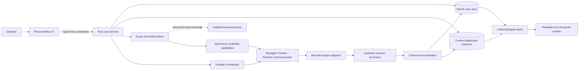
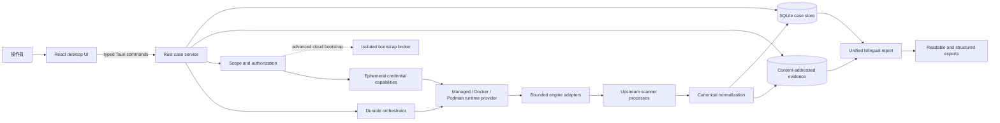

<a id="english"></a>

[← Public GitHub portfolio](./README.md) · [Ted's profile](../README.md) · **English** · [繁體中文](#traditional-chinese) · [GitHub repository](https://github.com/teddashh/ai-security-scanner) · [Public-testing build: v0.1.9](https://github.com/teddashh/ai-security-scanner/releases/tag/v0.1.9)

# ai-security-scanner

## Positioning and project snapshot

`ai-security-scanner` is an open-source desktop workbench for developers, small teams, and IT owners who need to assess several kinds of assets without first learning a separate interface and vocabulary for every scanner. A user can put selected repository folders, complete website or API URLs, and exact authorized internal hosts into one project, review one bounded plan, start the applicable checks once, and read the results in one product-owned report.

The project is deliberately more careful than its short name suggests. It does not equate a reachable port with a vulnerability, a zero-finding run with a secure system, or a failed engine with a passed check. Completed, partial, failed, disputed, unattributed, and not-tested work remain distinct. Raw upstream evidence and scanner identity stay attached to normalized findings so the friendlier report does not erase how a conclusion was produced.

This page was verified against the public repository on **September 9, 2026 (America/New_York)**. The default branch `main` was at [`16e063e`](https://github.com/teddashh/ai-security-scanner/commit/16e063ecd3ec409d1d49ec58cc853b69d20c5f41); its latest product-code checkpoint was [`9823a68`](https://github.com/teddashh/ai-security-scanner/commit/9823a68546b9e05e00a93bb14e444b22f57b639a). GitHub showed **1 star** and **0 forks**. The latest published build remains [`v0.1.9`](https://github.com/teddashh/ai-security-scanner/releases/tag/v0.1.9), built from the earlier [`5c95572`](https://github.com/teddashh/ai-security-scanner/commit/5c95572f54220adbd170d9bfb5af3159c56708ef), so the post-release source improvements described below are not represented as a newer downloadable build.

| Snapshot | Current public evidence |
|---|---|
| Product form | React 19 interface inside a Tauri 2 desktop application, backed by a Rust case service and separately feature-gated CLI, bootstrap-broker, adapter-launcher, egress-gateway, and release-verifier binaries |
| Current version | Source and desktop manifests remain `0.1.9`; `main` also contains post-release Cloudsplaining reporting work. GitHub publishes v0.1.9 without its prerelease flag, while the package contract still labels the channel `prerelease`; the release notes describe a public-testing build rather than stable or GA software. |
| Release status | **Public-testing build, not stable or GA.** The release notes explicitly call the Windows installers public testing artifacts and record platform evidence and missing observations separately |
| Guided first paths | One IT environment, one website/API origin, or one local project folder; cloud, infrastructure, container, and Kubernetes sources remain advanced paths |
| Core stack | Rust 2024 edition / Rust 1.98, TypeScript 5, React 19, Vite 8, SQLite, Tauri 2, and isolated third-party scanner processes or managed images |
| Evidence model | Durable case/run/task state, canonical findings, coverage records, preserved upstream output, content-addressed evidence, bilingual explanations, comparison, and redacted exports |
| v0.1.9 installer set | Linux x86_64 DEB, universal macOS DMG, and Windows x64 MSI/NSIS, accompanied by checksums, provenance, SBOMs, qualification records, notices, and supporting binaries |
| License | Project-owned source is Apache-2.0; every upstream engine, ruleset, feed, database, and redistributed component retains its own license and notice obligations |

## The problem it addresses

Security assessment is often presented as a bag of specialist tools. One scanner understands source patterns, another dependencies, another cloud identity, another web exposures, and another internal services. Their output formats and failure semantics differ, while the least experienced operator is left to decide whether an empty file means “clean,” “unsupported,” “never ran,” or “crashed.”

That fragmentation creates two risks. The first is usability: a small team may never reach a useful result because setup requires containers, feeds, credentials, templates, and scanner-specific terminology. The second is false confidence: disconnected green dashboards can hide an unavailable engine or a part of the requested scope that was silently omitted.

`ai-security-scanner` gives the work a case-oriented shape:

- a project records the assets the operator deliberately selected;
- an authorization grant records which external targets may be contacted;
- the product chooses bounded upstream profiles instead of making a beginner pick engines;
- every engine-to-asset task has its own durable outcome;
- finished work remains useful when an independent task fails; and
- one report answers what needs attention, what to do next, and what was not checked.

The product is not an aggressive penetration-testing suite, compliance opinion, automatic remediation service, or promise that a target is secure. Its first job is to make the actual evidence and its limits understandable.

## User experience and capabilities

### One project, several exact targets

The recommended **Scan my IT environment** path keeps setup additive rather than turning it into a long wizard. Repository folders, complete website URLs, and authorized internal systems appear as compact removable rows. Each internal-system row accepts one exact hostname or IP address; common TCP ports are preselected, while an Advanced control can replace them with up to 64 exact ports. It does not accept a CIDR, neighboring host, URL, or credential in that field.

Before contact begins, one review groups the requested work by asset type, explains the applicable checks and major exclusions, and shows one **Start scan** action. Validation is non-contacting. A single-target website or project shortcut enters the same durable project model, so more assets can be added later without discarding earlier reports.

### Website and API checks with an explicit origin boundary

The guided website profile accepts one complete `http://` or `https://` URL. Its contact boundary is the exact `scheme://host:port` origin. The entered path is retained as context, but applicable templates may request other paths on that origin; someone authorized for only one path should not use this profile.

The current pinned Nuclei snapshot contains **4,674 eligible bounded, read-only templates**. Nuclei detects the site's technology and selects applicable checks. The product limits this profile to 10 requests per second, five concurrent requests, and a ten-second per-request timeout. It does not sign in, submit forms or request bodies, follow redirects, use out-of-band callbacks, fuzz, upload, launch headless flows, try credentials, or run denial-of-service and exploit-oriented checks.

A completed zero-match run means only that the applicable checks that executed returned no findings. It does not mean every candidate template ran or every application workflow was tested.

### Local project checks use a read-only snapshot

For source and AI-project repositories, the application prepares a bounded read-only snapshot. Secret-bearing files such as `.env`, private keys, and `*.tfvars` remain visible to secret scanners even when Git ignores them; dependency, build, and cache directories remain excluded. The application does not upload or modify the project, push a fix, or test a discovered credential against a live service.

The public engine catalog currently describes upstream-backed paths for:

- Gitleaks and TruffleHog secret-pattern checks;
- 1,620 pinned Semgrep security rules across the declared language set;
- Trivy and Grype dependency and recognized-package vulnerabilities;
- Checkov and KICS infrastructure/configuration checks; and
- Syft component inventory, which remains inventory rather than a vulnerability verdict.

The exact engines that can run depend on target type, packaged/runtime availability, and the selected release's immutable catalog. The application is designed to say when a path was unavailable rather than substitute another conclusion.

### Internal systems stay exact and unauthenticated by default

An internal-system scan passes the one approved host and selected ports to a pinned Greenbone Community Feed profile. Greenbone performs product/service applicability and applies its current non-deprecated remote checks whose prerequisites match. The default path does not use credentials, expand to neighboring hosts, try default passwords, run denial-of-service checks, or perform authenticated local patch inspection.

The collapsed `127.0.0.1:9001` utility is intentionally labeled as a connection test. One accepted, refused, or timed-out TCP attempt is useful diagnostics, but it is neither a vulnerability scan nor a security conclusion.

### Advanced sources without flattening their boundaries

The source catalog also includes bounded paths for infrastructure artifacts, single-image OCI layouts, Kubernetes manifests and node snapshots, AWS/Azure/GCP identity or configuration evidence, and Microsoft 365. These paths use different credentials, network destinations, artifacts, and limitations. They are not silently folded into the beginner flow.

The catalog stays close to upstream scanners: CloudQuery, Steampipe, Prowler, ScoutSuite, Cloudsplaining, ScubaGear, Maester, Naabu, httpx, Nuclei, OpenVAS, Semgrep, Gitleaks, TruffleHog, Checkov, KICS, Trivy, Grype, Syft, Kubescape, and kube-bench each retain an exact revision, scope, license record, and adapter contract. Their presence in the source catalog does **not** mean every engine ships inside every desktop artifact. The v0.1.9 history specifically says Microsoft 365 and managed-image engines were separate artifacts rather than part of the desktop package.

The latest source checkpoint makes Cloudsplaining results more actionable without inventing product-owned IAM conclusions. It retains the upstream policy source, policy name, finding identity, affected actions, whether the action list is complete, and attached roles, groups, or users. Bounded typed context is validated as untrusted scanner evidence, rendered inertly in English and Traditional Chinese, carried through HTML/structured exports, and used to distinguish next steps for AWS-managed, customer-managed, and inline policies. Action or principal lists may be shortened or sanitized, incomplete attribution stays labeled, and the raw artifact remains authoritative. This work is on `main`; it is newer than the published v0.1.9 artifact.

### A report that preserves incomplete work

The report leads with affected assets, important findings, and next actions. Technical evidence, control relationships, and engine detail remain available through progressive disclosure and exports. Each result can carry:

- original engine, version, rule/check identifier, title, severity, message, remediation, and evidence;
- product-authored bilingual summary, impact, priority, next step, warning, tested dimension, and limitation;
- completed, partial, failed, disputed, unattributed, or not-tested coverage state; and
- reversible grouping of related observations from different scanners.

v0.1.9 also withholds cloud identifiers from redacted exports when they cannot be attributed to a known source. A later run can be compared without pretending that an engine, scope, rule database, or adapter change is the same thing as an environment change.

## Architecture and trust boundaries



The React frontend is deliberately outside the privileged boundary. It does not receive raw credentials or a Docker/Podman socket. The Rust backend owns validation, case state, persistence, scope decisions, orchestration, redaction, and export. Frontend checks improve usability; backend checks remain authoritative.

Runs and exact engine-to-asset tasks are persisted before runtime or credential preparation. That ordering lets setup fail without erasing the user's workspace and lets completed independent work remain visible. Third-party scanners execute out of process through narrow adapters. They receive only the declared snapshot, target allowlist, credential capability, mount, network destinations, rates, and limits.

The optional bootstrap broker is a separate Advanced cloud-only process. Its documented role is to exchange an administrative login for a short-lived, dedicated read-only scan role and pass only a capability handle onward. It is not a general shell or proxy and must not load scanner adapters, persist credentials, or expose a container socket. Local project, website, network, and unsigned-export paths do not depend on it.

Local persistence separates a SQLite case database from content-addressed evidence blobs. Credentials are excluded from serialized data sources and exports. Normalization keeps raw evidence rather than replacing it with friendlier prose, and the export path can redact sensitive identifiers while retaining verification data.

## Key engineering and design choices

### 1. Keep the beginner path outcome-first

The primary navigation is **New scan**, **Projects**, **Report**, and **Settings**, not a wall of engine names. The application asks for targets and authorization; it chooses reviewed defaults and reveals scanner/rate/runtime controls only when needed.

### 2. Treat inventory and connectivity as preparation

DNS, ping, an open port, target validation, runtime health, or a downloaded scanner may be necessary, but none is presented as first security value. The product requires an actual security-relevant check before it can describe a meaningful result.

### 3. Preserve upstream authority and original evidence

Adapters enforce boundaries and translate structure; they are not private detection engines. Product-written explanation and grouping sit above the original tool output. Severity, titles, rule identifiers, and remediation stay attributable, while downstream patches are documented, hash-bound exceptions with removal conditions.

### 4. Fail independently and report honestly

Each target-stage-engine task has its own lifecycle. An optional scanner failure affects its coverage rather than making the whole project disappear. Conversely, a partial report cannot turn that failure into a green result. This distinction is one of the project's most important product decisions.

### 5. Separate authorization from scanning credentials

External contact requires an explicit scope grant. High-privilege bootstrap material must never reach an engine. Cloud engines receive a case-scoped, ephemeral read-only credential capability for one exact account, subscription, project, or tenant path; serialized cases do not carry the token itself.

### 6. Pin the runtime supply chain

The managed runtime, engine images, templates, feeds, vulnerability databases, rules, launchers, and notices are treated as versioned release inputs. v0.1.9 publishes checksums, SBOMs, source/provenance records, runtime manifests, per-platform qualification files, and generated notices beside the installers. Recovery may replace product-owned material only from its digest-anchored packaged cache; ambiguous or unrelated state is left alone.

### 7. Make an empty result a scoped claim

“No findings” means an identified set of checks completed and produced no matches. It does not mean secure, fully assessed, or compliant. The report must name the tested dimensions and the missing ones, even when that makes the result less comforting.

## Quick start

### Install the v0.1.9 public-testing build

Open the [v0.1.9 release](https://github.com/teddashh/ai-security-scanner/releases/tag/v0.1.9), select the artifact for the intended platform, and verify it against `SHA256SUMS.txt` and its published provenance/qualification record before installing:

- Linux x86_64: `ai-security-scanner_0.1.9_amd64.deb`;
- macOS: `ai-security-scanner_0.1.9_universal.dmg`;
- Windows x64: `ai-security-scanner_0.1.9_x64_en-US.msi` or `ai-security-scanner_0.1.9_x64-setup.exe`.

This is a public test, not a stable or GA recommendation. Windows packages are unsigned and may show an Unknown publisher warning. Platform evidence and unobserved human paths are summarized below.

After opening the application:

1. Add only repositories, complete URLs, and exact systems that you own or are authorized to assess.
2. Review every target, selected port, expected contact boundary, applicable check, and exclusion.
3. Press **Start scan** once and read both the findings and the not-tested/failed coverage in the unified report.

### Explore the interface without scanning

The browser preview contains clearly labeled sample data and does not run an engine or contact a target:

```sh
git clone https://github.com/teddashh/ai-security-scanner.git
cd ai-security-scanner
npm ci
npm run dev
```

Open the local Vite URL printed by the command. Node.js 24 or newer is required.

### Build and verify from source

Source desktop work additionally requires Rust 1.98 and the platform prerequisites for Tauri:

```sh
npm ci
npm run typecheck
npm run test:frontend
npm run test:component
npm run build
cargo test --workspace --no-default-features --features cli
npm run tauri dev
```

These commands verify and launch the checked-out source. They do not convert a development build into a signed or externally qualified release artifact.

## Current scope, risks, and license

- **v0.1.9 is a public-testing build.** GitHub's release flag itself is not set to prerelease, but the package contract identifies a prerelease channel and the release notes explicitly say this is not a stable deployment. It should not be presented as GA; the archived `v0.2.0` proposal is also explicitly not a current plan, milestone, or work queue.
- **Current source is ahead of the published build.** The Cloudsplaining policy-context work at `9823a68` and the handover at `16e063e` are on `main`, while the downloadable v0.1.9 artifacts were built from `5c95572`. A source capability must not be described as present in that older installer without new release evidence.
- **The latest `main` workflow is not green.** Its changed-boundary classification failed two repository-contract tests and skipped the product lanes, so the new checkpoint is not presented here as fully CI-verified. The failures concern a missing Greenbone launcher path classification and exact beginner-README wording, rather than proof that the skipped product suite passed.
- **The current handover flags a Nuclei false-clean risk.** Automatic scan can currently finish with exit code 0 but no JSONL when technology detection, tag selection, or applicable-template loading fails; the existing adapter path may accept that as complete with zero findings. Until execution-outcome evidence and the incomplete path are fixed, an empty Nuclei result is not proof of a clean website.
- **Published does not mean every human path was observed.** The Linux DEB passed technical qualification, but its beginner path was not observed. The macOS DMG had installer qualification while runtime and beginner use were not observed. Both Windows installers passed technical qualification, while Authenticode identity, the exact-candidate beginner path, installed-app lifecycle, and data-preservation path were not observed in the published record.
- **Windows packages are unsigned.** An Unknown publisher warning is expected. Checksums, SBOMs, and provenance improve supply-chain evidence but do not provide an Authenticode publisher identity.
- **AppImage and RPM were not offered for v0.1.9.** Their technical qualification was not observed; absence must not be interpreted as support.
- **A scan is not a security guarantee.** Zero findings, partial coverage, unavailable engines, stale rules, and unsupported target dimensions all have narrower meanings than “secure.” The product is not a penetration-test report, compliance certification, or legal assurance.
- **Authorization remains the operator's responsibility.** The application narrows and records target scope, but it cannot grant permission to assess someone else's system. Origin-wide web checks are inappropriate when authorization covers only one URL path.
- **Default scans are intentionally bounded.** The web profile skips authentication, form submission, OOB callbacks, fuzzing, uploads, exploit-oriented checks, and redirects. The internal-host profile is exact-host/exact-port, unauthenticated, non-destructive, and not an authenticated patch audit.
- **Engine availability and knowledge are versioned.** Third-party tools, templates, feeds, and vulnerability databases can be incomplete or become stale. A catalog entry is not proof that its engine was included and runnable in a particular desktop installation; the report's coverage record is the authority for that run.
- **Cloud and Microsoft 365 paths are advanced and narrower than a full audit.** They depend on exact provider authorization and separate engine/runtime availability. v0.1.9 did not bundle Microsoft 365 and managed-image engines into the desktop package.
- **No automatic remediation is performed.** The report explains next actions but does not change a repository, target, cloud account, container, or cluster.
- **Case data relies on host protection.** Projects, findings, and evidence stay local unless the user deliberately connects an external source or exports them, but the app does not add its own encryption at rest. The operating-system account and disk encryption protect the stored case.
- **Browser preview is not a scanner.** It is sample UI only; connectivity utilities, inventory, and runtime preparation are also not vulnerability evidence.
- **License:** project-owned source is licensed under Apache-2.0 and provided without warranty. Upstream engines and their code, rules, feeds, templates, databases, images, and notices retain separate licenses documented in `THIRD_PARTY.md` and the generated release inventories.

## Source and documentation

- [Repository](https://github.com/teddashh/ai-security-scanner)
- [English README](https://github.com/teddashh/ai-security-scanner/blob/main/README.md) · [Traditional Chinese README](https://github.com/teddashh/ai-security-scanner/blob/main/README.zh-TW.md)
- [Canonical product specification](https://github.com/teddashh/ai-security-scanner/blob/main/docs/product-spec.md)
- [Architecture and trust boundaries](https://github.com/teddashh/ai-security-scanner/blob/main/docs/architecture.md) · [threat model](https://github.com/teddashh/ai-security-scanner/blob/main/docs/threat-model.md)
- [Engine catalog](https://github.com/teddashh/ai-security-scanner/blob/main/docs/engine-catalog.md) · [managed runtime contract](https://github.com/teddashh/ai-security-scanner/blob/main/docs/managed-runtime.md)
- [Current development handover](https://github.com/teddashh/ai-security-scanner/blob/main/docs/engine-alignment-handover.zh-TW.md)
- [Third-party inventory](https://github.com/teddashh/ai-security-scanner/blob/main/THIRD_PARTY.md)
- [v0.1.9 release](https://github.com/teddashh/ai-security-scanner/releases/tag/v0.1.9) · [v0.1.9 product history](https://github.com/teddashh/ai-security-scanner/blob/main/docs/release/v0.1.9.md) · [current Actions](https://github.com/teddashh/ai-security-scanner/actions)

---

[← Previous: MCP Memory Server](./mcp-memory-server.md) · [Next: Reset Therapy →](./reset-therapy.md)

---

<a id="traditional-chinese"></a>

[← GitHub 公開作品集](./README.md#traditional-chinese) · [Ted 的個人頁](../README.zh-TW.md) · [English](#english) · **繁體中文** · [GitHub Repository](https://github.com/teddashh/ai-security-scanner) · [公開測試版：v0.1.9](https://github.com/teddashh/ai-security-scanner/releases/tag/v0.1.9)

# ai-security-scanner

## 作品定位與現況快照

`ai-security-scanner` 是一套開源桌面安全檢查工作台，服務需要盤點多種資產、卻不想先學會每一套 scanner 介面與術語的開發者、小型團隊與 IT 負責人。使用者可以把指定的 repository 資料夾、完整網站／API URL，以及已授權的精確內部主機放進同一個 project，先檢查一次有界的執行計畫，再按一次 Start，最後在一份產品自己整理的報告裡閱讀所有適用檢查。

這個專案比名稱看起來更重視用字邊界。它不把可連線的 port 說成 vulnerability，不把 zero-finding run 說成安全，也不把 engine 失敗偽裝成通過。Completed、partial、failed、disputed、unattributed 與 not-tested work 都有不同狀態；原始 upstream evidence 與 scanner identity 會保留在正規化 finding 旁，讓比較好讀的說明不會抹掉結論是怎麼來的。

本頁於 **2026 年 9 月 9 日（America/New_York）**核對公開 repository。Default branch `main` 位於 [`16e063e`](https://github.com/teddashh/ai-security-scanner/commit/16e063ecd3ec409d1d49ec58cc853b69d20c5f41)；最新的產品程式 checkpoint 是 [`9823a68`](https://github.com/teddashh/ai-security-scanner/commit/9823a68546b9e05e00a93bb14e444b22f57b639a)。GitHub 顯示 **1 star**、**0 forks**。最新公開 build 仍是由較早的 [`5c95572`](https://github.com/teddashh/ai-security-scanner/commit/5c95572f54220adbd170d9bfb5af3159c56708ef) 建置的 [`v0.1.9`](https://github.com/teddashh/ai-security-scanner/releases/tag/v0.1.9)，所以下方說明的 post-release source 改善不會被寫成已有新的 downloadable build。

| 快照 | 目前公開證據 |
|---|---|
| 產品形式 | React 19 介面放在 Tauri 2 desktop app 裡，後端是 Rust case service；另有以 feature 分離的 CLI、bootstrap broker、adapter launcher、egress gateway 與 release verifier binaries |
| 目前版本 | Source 與 desktop manifest 仍是 `0.1.9`；`main` 也已包含 release 後的 Cloudsplaining report 改善。GitHub 發布 v0.1.9 時沒有勾 prerelease flag，但 package contract 仍把 channel 寫成 `prerelease`；release notes 則定位為公開測試 build，而不是 stable／GA。 |
| 發布狀態 | **公開測試 build，不是穩定版或 GA。** Release notes 明確把 Windows installers 稱為 public testing artifacts，也分開記錄各平台已有證據與尚未觀察的項目 |
| 引導式起點 | 一個 IT environment、一個 website／API origin，或一個本機 project folder；cloud、infrastructure、container、Kubernetes 留在進階路徑 |
| 核心技術 | Rust 2024 edition／Rust 1.98、TypeScript 5、React 19、Vite 8、SQLite、Tauri 2，以及隔離執行的第三方 scanner process 或 managed image |
| 證據模型 | Durable case／run／task state、canonical findings、coverage records、保留的 upstream output、content-addressed evidence、雙語解釋、比較與 redacted exports |
| v0.1.9 installer set | Linux x86_64 DEB、universal macOS DMG、Windows x64 MSI／NSIS；旁邊另有 checksums、provenance、SBOM、qualification record、notices 與支援 binaries |
| 授權 | 專案自有 source 採 Apache-2.0；每個 upstream engine、ruleset、feed、database 與 redistributed component 仍保留自己的 license／notice 義務 |

## 它要解決的問題

安全檢查常被拆成一袋專家工具：一套看 source pattern、一套看 dependency、一套看 cloud identity、一套看 web exposure，另一套又看 internal service。每套輸出與失敗語意不同，最後卻要讓經驗最少的操作員自己判斷空白報告究竟代表「乾淨」、「不支援」、「根本沒跑」還是「已經 crash」。

這種分裂帶來兩個風險。第一個是 usability：小團隊可能因 containers、feeds、credentials、templates 與 scanner-specific terminology 太複雜，永遠到不了第一個有用結果。第二個是假安全感：彼此分離的綠色 dashboard 可能掩蓋某套 engine 無法使用，或使用者要求的 scope 被悄悄略過。

`ai-security-scanner` 把這份工作整理成 case-oriented model：

- project 記錄操作員明確選進來的 assets；
- authorization grant 記錄哪些 external targets 可以被接觸；
- 產品替新手選擇有界的 upstream profile，不要求先挑 engines；
- 每個 engine-to-asset task 各自保留 durable outcome；
- 一個獨立 task 失敗時，其他已完成工作仍然可讀；
- 一份 report 說清楚哪個 asset 需要注意、下一步是什麼，以及哪些地方沒有被檢查。

它不是 aggressive penetration-testing suite、compliance opinion、自動修復服務，也不保證 target 安全。第一個任務是讓實際證據與限制都容易理解。

## 使用體驗與能力

### 一個 project，放入多個精確 targets

推薦的 **Scan my IT environment** 路徑採 additive setup，不把流程做成冗長 wizard。Repository folders、完整 website URLs 與已授權 internal systems 都顯示為容易移除的 compact rows。每個 internal-system row 只接受一個精確 hostname 或 IP address；常用 TCP ports 已預選，Advanced control 則可改成最多 64 個精確 ports。這個欄位不接受 CIDR、鄰近主機、URL 或 credential。

開始接觸 target 前，一頁 review 會依 asset type 分組，解釋適用 checks 與主要 exclusions，並只留下單一 **Start scan** action。表單 validation 本身不會接觸外部 target。單一 website／project shortcut 也會進入同一套 durable project model，之後能加入更多 assets 而不必丟掉舊報告。

### 有明確 origin 邊界的網站與 API 檢查

引導式 website profile 接受一個完整 `http://` 或 `https://` URL。Contact boundary 是精確的 `scheme://host:port` origin。輸入 path 會留作 context，但適用 template 可能 request 同一個 origin 上的其他 paths；如果授權只包含單一路徑，就不應使用這個 profile。

目前 pinned Nuclei snapshot 有 **4,674 個符合有界、唯讀條件的 eligible templates**。Nuclei 先偵測網站技術，再選擇適用 checks。產品把這個 profile 限制在每秒 10 requests、5 個 concurrent requests、每個 request timeout 10 秒。它不會 sign in、不會送 forms／request body、不 follow redirects、不用 out-of-band callback、不 fuzz、不 upload、不執行 headless flow、不試 credentials，也不跑 denial-of-service 或 exploit-oriented checks。

完成後 zero match，只代表確實執行的適用 checks 沒有回傳 findings；不代表所有 candidate templates 都跑過，也不代表所有 application workflows 都被測試。

### 本機 project 使用 read-only snapshot

Source 與 AI-project repository 會先被整理成 bounded read-only snapshot。`.env`、private key、`*.tfvars` 等 secret-bearing files 即使被 Git ignore，仍會交給 secret scanners；dependency、build、cache directories 則維持排除。App 不會 upload 或修改 project、不 push fix，也不會拿找到的 credential 去測 live service。

公開 engine catalog 目前記錄的 upstream-backed paths 包含：

- Gitleaks／TruffleHog 的 secret-pattern checks；
- 1,620 個 pinned Semgrep security rules 與其宣告的語言範圍；
- Trivy／Grype 的 dependency 與 recognized-package vulnerabilities；
- Checkov／KICS 的 infrastructure／configuration checks；
- Syft component inventory；inventory 本身不會被寫成 vulnerability verdict。

真正能跑哪些 engines，仍取決於 target kind、packaged/runtime availability 與該 release 的 immutable catalog。某條路徑不可用時，產品選擇誠實說明，而不是偷換成另一種結論。

### Internal systems 預設維持精確且不使用 credential

Internal-system scan 會把一台已核准 host 與選定 ports 交給 pinned Greenbone Community Feed profile。Greenbone 負責 product／service applicability，再套用 prerequisites 符合的 current non-deprecated remote checks。Default path 不使用 credentials、不擴展到鄰近 hosts、不試 default passwords、不做 denial-of-service checks，也不執行 authenticated local patch inspection。

摺疊在進階區的 `127.0.0.1:9001` utility 被刻意標為 connection test。一次 accepted／refused／timed-out TCP attempt 對診斷有用，但不是 vulnerability scan，也不是安全結論。

### 保留不同邊界的 Advanced sources

Source catalog 也收錄 infrastructure artifacts、single-image OCI layouts、Kubernetes manifests／node snapshots、AWS／Azure／GCP identity 或 configuration evidence，以及 Microsoft 365 的有界路徑。它們需要的 credential、network destinations、artifacts 與 limitations 都不同，因此不會被默默塞進 beginner flow。

Catalog 儘量貼近 upstream scanner：CloudQuery、Steampipe、Prowler、ScoutSuite、Cloudsplaining、ScubaGear、Maester、Naabu、httpx、Nuclei、OpenVAS、Semgrep、Gitleaks、TruffleHog、Checkov、KICS、Trivy、Grype、Syft、Kubescape 與 kube-bench 各自保留 exact revision、scope、license record 與 adapter contract。出現在 source catalog，**不代表每一個 desktop artifact 都內建每套 engine**。v0.1.9 history 特別說明 Microsoft 365 與 managed-image engines 當時是分開提供的 artifacts，不在 desktop package 內。

最新 source checkpoint 讓 Cloudsplaining 結果更能直接行動，但不會自行發明產品端的 IAM 結論。它保留 upstream policy source、policy name、finding identity、affected actions、action list 是否完整，以及附加的 roles、groups、users。這組有界的 typed context 會被當成不可信任的 scanner evidence 驗證，以無法執行的純內容形式顯示在英文與繁中界面，並帶進 HTML／structured exports；next step 也會區分 AWS-managed、customer-managed 與 inline policy。Action 或 principal list 可能被縮短或清理，不完整歸屬會明確標示，raw artifact 仍是權威來源。這份工作已在 `main`，比已發布的 v0.1.9 artifact 更新。

### 保留 incomplete work 的 report

Report 先顯示 affected assets、重要 findings 與 next actions；技術 evidence、control relationships、engine detail 則透過 progressive disclosure 與 exports 保留。每個 result 可以帶有：

- 原始 engine、version、rule／check identifier、title、severity、message、remediation 與 evidence；
- 產品自行撰寫的雙語 summary、impact、priority、next step、warning、tested dimension 與 limitation；
- completed、partial、failed、disputed、unattributed 或 not-tested coverage state；
- 不破壞各自 evidence 的跨 scanner reversible grouping。

v0.1.9 也會在 cloud identifier 無法歸屬 known source 時，不把它輸出到 redacted export。後續 run 可以互相比較，但不會把 engine、scope、rule database、adapter 的變化誤寫成環境本身的變化。

## 架構與信任邊界



React frontend 刻意留在 privileged boundary 外，不會收到 raw credentials 或 Docker／Podman socket。Rust backend 擁有 validation、case state、persistence、scope decision、orchestration、redaction 與 export。Frontend checks 是 usability；backend checks 才是 authority。

Run 與精確的 engine-to-asset tasks 會在 runtime 或 credential preparation 前先寫入。這個順序讓 setup 失敗時不會抹掉 workspace，也讓已完成的獨立工作繼續顯示。第三方 scanner 透過 narrow adapter 在 out-of-process 邊界執行，只收到已宣告 snapshot、target allowlist、credential capability、mount、network destinations、rate 與 limits。

選配 bootstrap broker 是分開的 Advanced cloud-only process。文件規定它只把 administrative login 換成短效、專用、唯讀的 scan role，再向後傳遞 capability handle。它不是 general shell 或 proxy，不能載入 scanner adapters、persist credentials 或暴露 container socket。Local project、website、network 與 unsigned-export paths 都不依賴它。

本機 persistence 把 SQLite case database 與 content-addressed evidence blobs 分開。Credential 不會進入 serialized data source 或 export。Normalization 保留 raw evidence，不用比較友善的文字覆蓋原始資料；export path 則能遮罩 sensitive identifiers，同時留下 verification data。

## 關鍵工程與設計選擇

### 1. Beginner path 以 outcome 為主

Primary navigation 是 **New scan**、**Projects**、**Report**、**Settings**，不是一整面 engine names。App 詢問 targets 與 authorization，自行選 reviewed defaults，只在需要時展開 scanner／rate／runtime controls。

### 2. Inventory 與 connectivity 只算準備

DNS、ping、open port、target validation、runtime health 或 scanner download 可能都是必要步驟，但不會被說成第一個 security value。產品必須真的執行 security-relevant check，才會描述為 meaningful result。

### 3. 保留 upstream authority 與原始 evidence

Adapter 負責 boundary 與 structure translation，不是私人 detection engine。產品撰寫的 explanation／grouping 放在 original tool output 上層；severity、title、rule identifier、remediation 仍能回溯來源。Downstream patch 是有文件、有 hash、帶 removal condition 的例外，不是預設整合方式。

### 4. 獨立失敗，誠實報告

每個 target-stage-engine task 有自己的 lifecycle。Optional scanner failure 只影響它的 coverage，不會讓整個 project 消失；反過來，partial report 也不能把失敗變成綠燈。這是本專案最重要的 product decisions 之一。

### 5. 把 authorization 與 scanning credential 分開

External contact 需要 explicit scope grant；高權限 bootstrap material 永遠不能進入 engine。Cloud engine 只會取得 case-scoped、ephemeral、read-only credential capability，並綁定一個精確 account、subscription、project 或 tenant path；serialized case 不保存 token 本身。

### 6. 固定 runtime supply chain

Managed runtime、engine images、templates、feeds、vulnerability databases、rules、launchers 與 notices 都是 versioned release inputs。v0.1.9 在 installer 旁提供 checksums、SBOM、source／provenance records、runtime manifests、per-platform qualification files 與 generated notices。Recovery 只會從 digest-anchored packaged cache 替換 product-owned material；ambiguous 或 unrelated state 維持不動。

### 7. Empty result 只是一個有 scope 的 claim

「No findings」代表一組可識別 checks 已完成且沒有 matches，不代表 secure、fully assessed 或 compliant。Report 必須說出 tested dimensions 與缺少的部分，即使這讓結果看起來沒那麼舒服。

## 快速開始

### 安裝 v0.1.9 公開測試 build

開啟 [v0.1.9 release](https://github.com/teddashh/ai-security-scanner/releases/tag/v0.1.9)，選擇適合平台的 artifact，安裝前以 `SHA256SUMS.txt` 與公開 provenance／qualification record 驗證：

- Linux x86_64：`ai-security-scanner_0.1.9_amd64.deb`；
- macOS：`ai-security-scanner_0.1.9_universal.dmg`；
- Windows x64：`ai-security-scanner_0.1.9_x64_en-US.msi` 或 `ai-security-scanner_0.1.9_x64-setup.exe`。

這是 public test，不是 stable 或 GA recommendation。Windows packages 未簽章，可能顯示 Unknown publisher；各平台已有證據與尚未觀察的人類流程列在下一節。

開啟 app 後：

1. 只加入你擁有或明確獲准檢查的 repositories、完整 URLs 與精確 systems。
2. 核對每個 target、selected port、預期 contact boundary、applicable check 與 exclusion。
3. 按一次 **Start scan**，在 unified report 同時閱讀 findings 與 not-tested／failed coverage。

### 只看介面，不執行 scan

Browser preview 使用清楚標示的 sample data，不會執行 engine，也不會接觸 target：

```sh
git clone https://github.com/teddashh/ai-security-scanner.git
cd ai-security-scanner
npm ci
npm run dev
```

打開 command 顯示的本機 Vite URL。需要 Node.js 24 或更新版本。

### 從 source build 與驗證

Desktop source development 另外需要 Rust 1.98 與對應平台的 Tauri prerequisites：

```sh
npm ci
npm run typecheck
npm run test:frontend
npm run test:component
npm run build
cargo test --workspace --no-default-features --features cli
npm run tauri dev
```

這些 commands 驗證並啟動目前 checkout 的 source，不會讓 development build 自動變成已簽章或通過外部 qualification 的 release artifact。

## 目前範圍、風險與授權

- **v0.1.9 是公開測試 build。** GitHub release 本身沒有勾 prerelease flag，但 package contract 把它列為 prerelease channel，release notes 也明確說這不是 stable deployment；不能把它寫成 GA。封存的 `v0.2.0` proposal 也明確不是目前 plan、milestone 或 work queue。
- **Current source 已超前 published build。** `9823a68` 的 Cloudsplaining policy context 與 `16e063e` 的 handover 已在 `main`，但可下載的 v0.1.9 artifacts 是從 `5c95572` 建置。沒有新的 release evidence 之前，不能把 source capability 寫成舊 installer 已經具備。
- **最新 `main` workflow 不是綠燈。** Changed-boundary classification 有兩個 repository-contract tests 失敗，因此 product lanes 被跳過；這個新 checkpoint 不會在這裡被寫成 fully CI-verified。失敗內容是 Greenbone launcher path 沒被納入分類，以及 beginner README 的 exact wording contract，不能反向當成未執行的 product suite 已通過。
- **目前 handover 明確標出 Nuclei 假乾淨風險。** Automatic scan 在 technology detection、tag selection 或 applicable-template loading 失敗時，可能 exit code 0 卻沒有 JSONL；現行 adapter path 可能把它接受為 complete 且 zero findings。在補上 execution-outcome evidence 並修正 incomplete path 之前，空的 Nuclei 結果不是網站乾淨的證明。
- **Published 不等於所有 human path 都已觀察。** Linux DEB 通過 technical qualification，但 beginner path 未觀察；macOS DMG 有 installer qualification，runtime 與 beginner use 未觀察；兩個 Windows installers 通過 technical qualification，但 Authenticode identity、exact-candidate beginner path、installed-app lifecycle、data-preservation path 都沒有公開觀察紀錄。
- **Windows packages 未簽章。** Unknown publisher warning 是預期現象。Checksums、SBOM、provenance 改善 supply-chain evidence，但不提供 Authenticode publisher identity。
- **v0.1.9 沒有提供 AppImage／RPM。** 它們的 technical qualification 未被觀察；沒有 artifact 不能被解讀為支援。
- **Scan 不是安全保證。** Zero findings、partial coverage、unavailable engines、stale rules、unsupported target dimensions 的意思都比「secure」更窄；產品不是 penetration-test report、compliance certification 或 legal assurance。
- **Authorization 仍由操作員負責。** App 會縮限並記錄 target scope，但無法替你取得檢查別人系統的權限。只被授權單一路徑時，不應執行 origin-wide web checks。
- **Default scans 刻意有界。** Web profile 不做 authentication、form submission、OOB callbacks、fuzzing、uploads、exploit-oriented checks、redirects；internal-host profile 綁 exact host／ports、不用 credential、不破壞 target，也不是 authenticated patch audit。
- **Engine availability 與 knowledge 都有版本。** 第三方 tools、templates、feeds、vulnerability databases 可能不完整或過時；catalog entry 不代表某次 desktop installation 一定內建並成功跑過那套 engine，該 run 的 coverage record 才是 authority。
- **Cloud／Microsoft 365 是較窄的 Advanced paths。** 它們依賴 exact provider authorization 與分開的 engine/runtime availability；v0.1.9 沒把 Microsoft 365 與 managed-image engines 包進 desktop package。
- **不執行 automatic remediation。** Report 提供 next actions，但不會修改 repository、target、cloud account、container 或 cluster。
- **Case data 依靠 host protection。** Projects、findings、evidence 除非使用者主動連接 external source 或 export，否則留在本機；但 app 沒有另外提供 encryption at rest，保存資料仍由 OS account 與 disk encryption 保護。
- **Browser preview 不是 scanner。** 它只顯示 sample UI；connectivity utility、inventory、runtime preparation 也都不是 vulnerability evidence。
- **授權：** 專案自有 source 採 Apache-2.0，且不提供 warranty。Upstream engines 與其 code、rules、feeds、templates、databases、images、notices 保留各自授權，記錄在 `THIRD_PARTY.md` 與 generated release inventories。

## 原始碼與文件

- [Repository](https://github.com/teddashh/ai-security-scanner)
- [英文 README](https://github.com/teddashh/ai-security-scanner/blob/main/README.md) · [繁中 README](https://github.com/teddashh/ai-security-scanner/blob/main/README.zh-TW.md)
- [Canonical product specification](https://github.com/teddashh/ai-security-scanner/blob/main/docs/product-spec.md)
- [架構與信任邊界](https://github.com/teddashh/ai-security-scanner/blob/main/docs/architecture.md) · [threat model](https://github.com/teddashh/ai-security-scanner/blob/main/docs/threat-model.md)
- [Engine catalog](https://github.com/teddashh/ai-security-scanner/blob/main/docs/engine-catalog.md) · [managed runtime contract](https://github.com/teddashh/ai-security-scanner/blob/main/docs/managed-runtime.md)
- [目前開發交接](https://github.com/teddashh/ai-security-scanner/blob/main/docs/engine-alignment-handover.zh-TW.md)
- [第三方 inventory](https://github.com/teddashh/ai-security-scanner/blob/main/THIRD_PARTY.md)
- [v0.1.9 release](https://github.com/teddashh/ai-security-scanner/releases/tag/v0.1.9) · [v0.1.9 產品變更歷史](https://github.com/teddashh/ai-security-scanner/blob/main/docs/release/v0.1.9.md) · [目前 Actions](https://github.com/teddashh/ai-security-scanner/actions)

---

[← 上一篇：MCP Memory Server](./mcp-memory-server.md#traditional-chinese) · [下一篇：Reset Therapy →](./reset-therapy.md#traditional-chinese)
