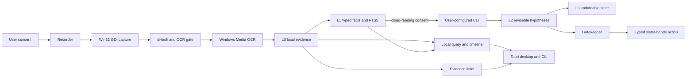
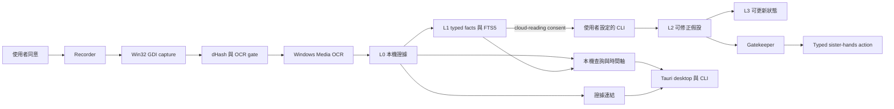

<a id="english"></a>

[← Public GitHub portfolio](./README.md) · [Ted's profile](../README.md) · **English** · [繁體中文](#traditional-chinese) · [GitHub repository](https://github.com/teddashh/AI-Sister) · [Latest downloadable release: v0.1.0-alpha.116](https://github.com/teddashh/AI-Sister/releases/tag/v0.1.0-alpha.116)

# AI-Sister

> A local-first desktop companion that remembers what happened on your screen, stays quiet by default, and makes every factual answer traceable to evidence on your own machine.

## Positioning and project snapshot

AI-Sister is an open-source Windows desktop memory companion. It observes the screen only after explicit consent, preserves selected screenshots and OCR text locally, extracts concrete facts without an LLM, and answers questions such as “What was I doing earlier?” or “What was that phone number?” with links back to the underlying local evidence.

The character in the corner is the approachable surface. Underneath it is a Rust evidence and memory system built around a strict distinction: raw observations are evidence, machine-extracted values are facts, model-written interpretations are revisable hypotheses, and longer-lived state can be closed or superseded. The product is designed to admit uncertainty instead of turning an unobserved event into a confident claim.

This page was verified on **September 9, 2026 (America/New_York)** against public default branch `main` at [`c85e648`](https://github.com/teddashh/AI-Sister/commit/c85e648a792faf3d0de46a173d6426f132a2d707). Source, tag, and the newest downloadable GitHub prerelease now all identify themselves as **v0.1.0-alpha.116**. Its release workflow completed successfully and published three Windows assets. GitHub showed **0 stars** at this snapshot.

| Snapshot | Current public evidence |
|---|---|
| Product form | Local-first Windows desktop companion plus a companion CLI |
| Current source | `v0.1.0-alpha.116` on `main`; the alpha.116 tag currently points to the same commit |
| Latest downloadable build | `v0.1.0-alpha.116` prerelease with a current-user Windows installer, a portable desktop executable, and a CLI executable |
| Core stack | Rust workspace, Tauri 2, native HTML/CSS/ES modules, SQLite/WAL, FTS5, Win32 GDI, and Windows Media OCR |
| Memory model | L0 raw evidence → L1 typed facts → L2 revisable hypotheses → L3 updateable state |
| Model boundary | L0/L1 remain programmatic; L2/L3 can use a user-configured local CLI only after separate consent to pass it raw OCR text |
| Persona surface | 17 locally bundled characters with layered workplace rigs and a WebP fallback; local Chinese speech is optional and off by default |
| Supported product path | Windows 10+ alpha; the repository's macOS diagnostic is not a product capture backend, and Linux/macOS use replay rather than live capture today |
| License | Apache-2.0 for project-owned code; bundled character imagery and app icons carry separate documented rights boundaries and are excluded from that code license |

Alpha.116 adds an evidence-backed local overview for narrow questions such as “What does she know?” The matching Windows installer, portable desktop executable, and CLI are now downloadable. It remains an alpha rather than Release 1.0.

## The problem it addresses

Desktop work is full of details that matter briefly and then vanish: a phone number inside a support page, an error code in a terminal, the last screen before an interruption, or the reason a task stopped. Saving every conversation does not solve this problem, because much of the context never entered a chat at all. Conventional screenshot recall products also create a harder question: can the user trust a system that is always watching?

AI-Sister treats trust and recall as the same product problem. It aims to make memory useful without asking the user to accept an opaque cloud recorder:

1. **The evidence stays local.** Captured pixels, retained frames, OCR, facts, and the SQLite memory database live on the user's machine.
2. **Recording requires explicit permission.** A missing, unreadable, damaged, or outdated consent record fails closed instead of silently enabling capture.
3. **Facts and interpretations are different objects.** A phone number extracted by code is not the same kind of claim as a model's guess about what the user intended.
4. **Answers expose their basis.** When a retained source exists, a result can point back to its frame, time, application, and title. When evidence is missing or excluded, the answer says so.
5. **Stopping and forgetting are first-class actions.** Pause does not wake itself up, retention can remove expired evidence, and time-bounded deletion cascades into derived memory.

The project therefore competes less on “a model can see the current screen” than on durable, inspectable memory: what was observed, what was inferred, what can still be proved, and what the user has chosen to remove.

## User experience and current capabilities

### From consent to an evidence-backed answer

A typical Windows path is deliberately concrete:

1. Install the current-user package or place the portable desktop and CLI executables together.
2. Read and grant only the consent scopes needed for the session.
3. Run `doctor` to verify the machine's actual URL-reading, OCR, and exclusion behavior.
4. Start the recorder. It captures the active monitor, deduplicates near-identical frames, performs native OCR on admitted frames, extracts typed facts, and writes local evidence.
5. Ask through the desktop companion or use `sister query` from the CLI.
6. Open the cited local source, inspect the timeline, pause, export, prune, or forget a selected interval.

The current repository implements these product surfaces:

- a desktop status view that distinguishes actively recording, paused, stopped, unavailable, and uncertain states instead of reducing them to one “on/off” light;
- local search over OCR and facts, including CJK-aware FTS5 indexes and direct typed-fact lookup for phone numbers, money, URLs, error codes, email addresses, dates, paths, and identifiers;
- time-oriented questions such as “What just happened?” that use recent evidence rather than searching the literal words in the question;
- an alpha.116 local L2 overview for narrow “what does she know/remember?” phrasing, capped to recent evidence-linked hypotheses and without invoking the configured CLI for that request;
- clickable provenance when the corresponding retained screenshot still exists, and honest text-only provenance when the frame was never stored or has expired;
- a recording timeline whose gaps distinguish pause, exclusion, unchanged content, and other observable causes;
- two-step time-range deletion through `forget`, retention preview through `prune --dry-run`, and a portable export that can be opened directly as another data directory;
- replay fixtures and evaluation commands that let contributors test retrieval without capturing their real screens;
- L2/L3 interpretation and review through a user-selected installed CLI, protected by a separate raw-OCR consent boundary;
- Gatekeeper and `sister-hands` foundations for narrowly typed, allowlisted actions, including a separate policy for unattended URLs; this is not yet the later bounded-takeover product;
- a single-instance Tauri desktop, an optional login-start setting for a verified installed copy, and a bounded supervisor only for the recorder launched by that desktop;
- 17 bundled persona choices, active-person-only layered decoding, reduced-motion-aware presentation, trusted-click speech, and an optional fixed voice pack with an explicit one-request download boundary;
- optional Azure Traditional Chinese answer speech that is disabled by default and requires its own consent, typed region, configured voice, and Windows Credential Manager key.

### Four independent consent gates

The four scopes are intentionally not one blanket “agree” button:

| Consent | What it permits | What happens without it |
|---|---|---|
| `local-recording` | Record the screen to the local data directory | Recording refuses to start |
| `cloud-reading` | Pass raw OCR text—not pixels—to the local CLI configured by the user for interpretation | L2/L3 model interpretation does not run; local retrieval remains available |
| `frame-storage` | Retain admitted screenshot frames | OCR text may still be recorded, but no screenshot is written |
| `azure-tts` | When Azure speech is separately enabled, send each newly completed answer body to the selected Azure Speech region for playback | Azure is never called; local speech remains separate |

The Azure body may contain names, phone numbers, and amounts and is not redacted before sending. The documented request excludes screenshots, source links, memory IDs, and the database. This exception is why “local-first” on this page does not mean “network-free.”

## Architecture and data flow



The main responsibilities are separated across Rust crates and a narrow desktop shell:

- **Capture and recorder:** Windows currently uses Win32 GDI to capture the active monitor. A 64-bit dHash and tile evidence reduce duplicate work; admitted frames proceed to Windows Media OCR. Content is rechecked around OS calls so a foreground change can fail closed before OCR or persistence.
- **L0 evidence:** OCR text, eligible frames, application/title context, timestamps, and audit transitions are stored locally. Evidence remains the lower-layer source of truth while retained, but user deletion and retention expiry are allowed to remove it.
- **L1 facts and retrieval:** deterministic code extracts typed values and indexes text with FTS5 trigram, Unicode, and CJK bigram paths. This layer does not call a model.
- **L2/L3 brain:** interpretation and review can be delegated to the user's chosen CLI only with `cloud-reading` consent. Hypotheses retain confidence and provenance; later interpretations can revise them rather than rewriting raw evidence.
- **Desktop shell:** a Tauri 2 Rust backend serves build-free local HTML/CSS/ES modules through IPC. It owns status, query, provenance, timeline, consent, persona settings, and explicit action prompts without opening a loopback web server.
- **Hands boundary:** CLI and desktop share typed permit and target policy in `sister-hands`. Screen content is data, never a direct instruction, and unattended URL use requires a separately chosen standing policy plus recent qualifying provenance.

Two named outbound features remain outside the recorder/core path. A user-triggered Persona request may perform one fixed, hash-verified HTTPS GET for an optional voice pack. Separately, default-off Azure speech may perform a fixed-region HTTPS POST containing only the current answer body. Neither capability turns the WebView, recorder, capture, brain, or hands crates into a general network client.

## Key engineering and product decisions

### 1. Preserve evidence aggressively; generate interpretation sparingly

The project calls this “use force for preservation, not generation.” OCR and deterministic extraction produce the durable foundation. Models are reserved for intent and explanation, where a claim can carry confidence and be revised later. This makes local recall useful even when no model path is configured.

### 2. Evidence, facts, hypotheses, and state cannot impersonate one another

L0/L1 are written by code. L2/L3 may involve a model, but neither may become the sole evidence for a factual answer. If a model and reviewer disagree, confidence drops and proactive behavior is suppressed rather than choosing the more fluent narrative.

### 3. Consent is enforced in execution, not only described in copy

Recording, screenshot retention, raw-OCR interpretation, and Azure answer speech each have a separate capability boundary. Revocation, stop requests, recorder ownership, login launch, and crash recovery use locks, durable markers, and bounded retries so a stale process cannot quietly reinterpret old permission.

### 4. “I do not know” must preserve the reason

A zero-result query may reflect exclusion, pause, missing OCR, expired frames, or simply absent text. The interface avoids claiming that an event never happened merely because it was not recorded. “The last thing I saw…” is a safer and more useful statement than “you did not do it.”

### 5. A character is a product surface, not an authority shortcut

Persona changes visual and speech presentation, not factual content, consent, evidence, or action permissions. The 17 bundled rigs decode only the active character, retain a static fallback, and do not trigger a model or network call when selected. Image rights are documented separately instead of being silently absorbed into the Apache code license.

### 6. Installation and recorder lifecycle are part of the trust model

Alpha.115 replaced a nested-uninstaller upgrade path with a pinned custom NSIS template. Repair and upgrade bind to exact current-user registry metadata and installation roots, while stale uninstall confirmations recheck version and path before removal. These automated protections reduce destructive mistakes, but the repository still records remaining legacy-process and loader race windows instead of claiming a fully atomic lifecycle.

## Quick start

### Use the latest downloadable Windows alpha

Open the [alpha.116 release](https://github.com/teddashh/AI-Sister/releases/tag/v0.1.0-alpha.116) and choose:

- `AI-Sister-Setup.exe` for the current-user installer with the matching CLI and offline WebView2 installer;
- `sister-desktop.exe` plus `sister.exe` in the same directory for portable use or installer diagnosis.

Then grant only the local scopes you want and verify the machine before recording:

```bat
sister.exe consent --grant local-recording --grant frame-storage
sister.exe doctor
sister.exe record --duration 60
sister.exe stats
sister.exe query 電話
sister.exe prune --dry-run
```

The default memory directory is `%APPDATA%\ted-h\AI-Sister\data\`. A separate `--data-dir` is useful for a disposable test. Do not copy only `sister.db` while the recorder is running: the database uses WAL, so a consistent backup should go through the product's export path.

### Exercise the current source without recording a screen

Linux and macOS can build the CLI and run the repository's synthetic replay even though they do not currently have a product capture backend:

```sh
git clone https://github.com/teddashh/AI-Sister.git
cd AI-Sister
cargo build --release -p sister-cli
./target/release/sister --data-dir ./data replay scenarios/bill-lookup.json
./target/release/sister --data-dir ./data query 電話
```

This replay path reads a checked-in scenario, not the user's screen, and therefore does not pretend to validate live Windows capture.

## Current scope, risks, and license

- **This is an alpha, not Release 1.0.** The public product path is Windows 10+. Code signing, the complete installer late-start/cross-version lifecycle boundary, and several real-artifact human checks remain unfinished.
- **It is still a prerelease.** Source, tag, and downloadable assets now align on alpha.116, but the project has not reached its Release 1.0 contract.
- **The Windows installer is unsigned and has no built-in updater.** Windows may warn. Upgrades require downloading a new installer and deliberately closing the desktop and recorder first.
- **“Local-first” has explicit exceptions.** With separate opt-in, raw OCR text may be handed to the user's configured CLI; optional Azure speech sends an unredacted answer body; and an optional Persona voice pack uses one fixed CDN GET. Screen pixels never leave through those paths.
- **Local storage is not application-encrypted.** SQLite and retained frames rely on the operating system account and full-disk protection such as BitLocker. An offline disk reader may be able to read them if OS encryption is absent.
- **The current performance baseline is honest but not yet the long-term target.** The repository reports a real Windows 60-second coding session at 44.0% average CPU and 73.7 MB peak RAM. A coarse post-WAL accounting estimate is roughly 469 MB/day at the current capture policy. The owner accepted those as alpha baselines while product work continues, not as finished efficiency claims.
- **Cross-platform support is not yet equivalent.** Windows GDI and Windows Media OCR are the implemented capture path. The macOS job documents a fail-closed permission diagnostic without executing the pixel path; Linux and macOS replay support does not make them capture previews.
- **The “hands” layer is bounded and incomplete.** Typed, allowlisted action and URL-policy foundations exist. The broader takeover mode remains a later phase and must not be described as autonomous desktop operation today.
- **Proactive companionship is a product direction, not a blanket current claim.** The alpha emphasizes query, evidence, review, Gatekeeper, and explicit actions. Roadmap scenarios about rare proactive speech or full handoff should remain labeled as future work.
- **Persona media has a separate rights boundary.** Project-owned source code is Apache-2.0. The bundled character images and derived app icons have their own manifests, owner grants, and exclusions; their presence in a release does not place them under Apache-2.0.
- **The software is provided without warranty.** Users should review the privacy and threat-model documents before enabling continuous capture or either optional text-sharing path.

## Source and documentation

- [Repository](https://github.com/teddashh/AI-Sister)
- [README](https://github.com/teddashh/AI-Sister/blob/main/README.md)
- [Product definition](https://github.com/teddashh/AI-Sister/blob/main/docs/PRODUCT.md)
- [Technical specification](https://github.com/teddashh/AI-Sister/blob/main/docs/SPEC.md)
- [Phases and Release 1.0 contract](https://github.com/teddashh/AI-Sister/blob/main/docs/PHASES.md)
- [Privacy boundaries](https://github.com/teddashh/AI-Sister/blob/main/docs/PRIVACY.md)
- [Threat model](https://github.com/teddashh/AI-Sister/blob/main/docs/THREAT_MODEL.md)
- [Windows verification checklist](https://github.com/teddashh/AI-Sister/blob/main/docs/WINDOWS-CHECKLIST.md)
- [Alpha.116 release](https://github.com/teddashh/AI-Sister/releases/tag/v0.1.0-alpha.116) · [All releases](https://github.com/teddashh/AI-Sister/releases) · [Current CI](https://github.com/teddashh/AI-Sister/actions)
- [Apache-2.0 license](https://github.com/teddashh/AI-Sister/blob/main/LICENSE)

---

[← Previous: Public GitHub portfolio](./README.md) · [Next: Multi-AI Chat Desktop →](./multi-ai-chat-desktop.md)

---

<a id="traditional-chinese"></a>

[← GitHub 公開作品集](./README.md#traditional-chinese) · [Ted 的個人頁](../README.zh-TW.md) · [English](#english) · **繁體中文** · [GitHub Repository](https://github.com/teddashh/AI-Sister) · [最新可下載版本：v0.1.0-alpha.116](https://github.com/teddashh/AI-Sister/releases/tag/v0.1.0-alpha.116)

# AI-Sister

> 一個 local-first 的桌面姊妹：記得螢幕上發生過什麼，預設保持安靜，並讓每一個事實答案都能回到你自己機器上的證據。

## 作品定位與現況快照

AI-Sister 是一個開源的 Windows 桌面記憶陪伴體。只有在使用者明確同意後，它才會觀察螢幕；選擇保留的截圖與 OCR 文字都先留在本機，具體事實由程式抽取，不必經過 LLM。使用者可以問「我剛才在做什麼？」或「那支電話是多少？」並回到答案所依據的本機證據。

桌面角落的角色是容易親近的產品表面；背後是一套用 Rust 建立的證據與記憶系統。它刻意區分四種東西：原始觀察是證據、程式抽出的值是事實、模型寫出的解釋是可被修正的假設、保存較久的狀態則可以結案或被新版取代。產品的目標不是用流暢語氣掩蓋不確定，而是清楚承認自己最後看到了什麼、哪些地方沒有證據。

本頁於 **2026 年 9 月 9 日（America/New_York）**核對公開 default branch `main`；目前位於 [`c85e648`](https://github.com/teddashh/AI-Sister/commit/c85e648a792faf3d0de46a173d6426f132a2d707)。Current source、tag 與最新可下載的 GitHub prerelease 現在都是 **v0.1.0-alpha.116**；release workflow 已成功完成，並發布三個 Windows assets。這次快照中 GitHub 顯示 **0 stars**。

| 快照 | 目前公開證據 |
|---|---|
| 產品形式 | Local-first Windows 桌面陪伴體，加上一支相同資料層的 CLI |
| Current source | `main` 為 `v0.1.0-alpha.116`；alpha.116 tag 目前指向相同 commit |
| 最新可下載版本 | `v0.1.0-alpha.116` prerelease，提供 current-user Windows installer、portable desktop 與 CLI 執行檔 |
| 核心技術 | Rust workspace、Tauri 2、原生 HTML/CSS/ES modules、SQLite/WAL、FTS5、Win32 GDI、Windows Media OCR |
| 記憶模型 | L0 原始證據 → L1 typed facts → L2 可修正假設 → L3 可更新狀態 |
| 模型邊界 | L0/L1 只由程式處理；L2/L3 必須另行同意傳送 OCR 原文，才可使用使用者自己設定的本機 CLI |
| Persona 表面 | 17 位離線 bundled 角色、分層 workplace rig 與 WebP 退路；本機中文語音可選且預設關閉 |
| 目前產品平台 | Windows 10+ alpha；repo 的 macOS diagnostic 不是產品 capture backend，Linux/macOS 現階段只能用 replay 取代 live capture |
| 授權 | 專案自行撰寫的程式碼採 Apache-2.0；bundled 角色圖與 app icon 有另外記錄的權利邊界，不包含在程式碼授權內 |

Alpha.116 新增針對「她知道了什麼？」這類窄問法的本機、證據連結式記憶總覽；對應的 Windows installer、portable desktop 與 CLI 現在也都可下載。它仍是 alpha，不是 Release 1.0。

## 它要解決的問題

桌面工作充滿只在短時間內重要、卻很容易消失的細節：客服頁上的電話、terminal 裡的 error code、被打斷前最後看到的畫面，或一件工作停住的原因。保存全部聊天紀錄也解決不了，因為許多關鍵上下文根本沒有進入聊天室。另一方面，會長時間截取螢幕的 recall 工具又帶來更難的問題：使用者敢不敢讓它一直開著？

AI-Sister 把記憶與信任當成同一個產品問題，不要求使用者接受一台看不見內部的 cloud recorder：

1. **證據先留在本機。** Captured pixels、保留的 frame、OCR、fact 與 SQLite 記憶資料庫都在使用者自己的裝置。
2. **開始記錄要先明確授權。** 同意檔缺失、讀不到、損壞或版本過期時，一律 fail closed，不會靜默開始擷取。
3. **事實與解釋是不同物件。** 程式辨識出的電話號碼，和模型猜測「使用者可能想做什麼」，不能被當成同一層真相。
4. **答案要露出依據。** 來源仍存在時，結果能指回 frame、時間、app 與 title；證據不存在或被排除時，回答會直接說明。
5. **停止與忘記是正式功能。** Pause 不會自行恢復；retention 可移除過期證據；刪除一段時間會連帶清掉由它衍生的記憶。

因此這個作品的核心不是「模型現在看得到螢幕」，而是可長期檢查的記憶：實際觀察了什麼、哪些是推論、哪些還能被證明，以及哪些內容已經由使用者選擇刪除。

## 使用體驗與目前能力

### 從同意到附有證據的答案

一次典型 Windows 路徑刻意保持具體：

1. 安裝 current-user 套件，或把 portable desktop 與 CLI 放在同一個資料夾。
2. 閱讀並只授權這次需要的 consent scope。
3. 先跑 `doctor`，實測這台機器目前的網址讀取、OCR 與 exclusion 規則是否真的生效。
4. 開始 recorder。它會擷取 active monitor、排除近似重複 frame、對通過 gate 的畫面執行 native OCR、抽出 typed facts，再寫入本機證據。
5. 從桌面姊妹提問，或使用 CLI 的 `sister query`。
6. 開啟引用的本機來源、檢查時間軸、暫停、匯出、prune，或忘掉指定的一段時間。

目前 repository 已實作的產品表面包括：

- 桌面狀態會分清楚真正錄製中、暫停、停止、不可用與無法確定，而不是全部壓成一顆 on/off 燈；
- 本機搜尋同時涵蓋 OCR 與 facts，包含 CJK-aware FTS5 indexes，以及對 phone、money、URL、error code、email、date、path 與 identifier 的 typed-fact direct lookup；
- 「剛才發生什麼事？」這類時間問題會看近期證據，不會拿問句字面去全文比對；
- alpha.116 對窄文法的「她知道／記得什麼？」提供本機 L2 總覽，只列近期、有 evidence link 的 hypotheses，而且這次總覽不會呼叫 configured CLI；
- 對應 screenshot 還在時提供可點開的 provenance；frame 沒有保存或已過期時，則只承諾文字型來源；
- recording timeline 會區分 pause、exclusion、畫面未變與其他能觀察到的空白原因；
- `forget` 以兩步驟刪除一段時間、`prune --dry-run` 預覽 retention，並提供可直接當另一個 data directory 開啟的 portable export；
- replay fixture 與 evaluation command 讓 contributor 不必擷取自己的真螢幕，也能測 retrieval；
- L2/L3 interpretation／review 透過使用者自己選擇的已安裝 CLI 執行，而且必須通過獨立的 OCR 原文 consent boundary；
- Gatekeeper 與 `sister-hands` 已提供窄化、typed、allowlisted action 的地基，包含另外詢問的 unattended URL policy；這還不是後期 bounded takeover 產品；
- Tauri desktop 只允許 single instance，verified installed copy 可選擇登入啟動，且只會 bounded supervise 由該 desktop 自己開啟的 recorder；
- 17 位 bundled persona、只解碼 current character 的分層 rig、reduced-motion presentation、trusted-click speech，以及需要明確下載同意的 optional fixed voice pack；
- 預設關閉的 Azure 繁中答案語音；只有具備獨立 consent、typed region、指定 voice 與 Windows Credential Manager key 時才會運作。

### 四張互相獨立的同意書

這四個 scope 刻意不是一顆包山包海的「同意」：

| 同意項目 | 允許什麼 | 沒有同意時 |
|---|---|---|
| `local-recording` | 把螢幕記錄到本機 data directory | Recorder 拒絕啟動 |
| `cloud-reading` | 把 OCR 原文（不是 pixels）交給使用者自己設定的本機 CLI 解讀 | L2/L3 模型解讀不執行；本機 retrieval 仍可使用 |
| `frame-storage` | 保留通過 gate 的 screenshot frame | 仍可記 OCR 文字，但不會寫入任何 screenshot |
| `azure-tts` | Azure 語音另行啟用後，把每份新完成答案的正文送到選定 Azure Speech region 播放 | Azure 一次都不會被呼叫；本機 speech 是另一條路 |

Azure body 可能含姓名、電話與金額，而且送出前不會遮罩；文件明確排除 screenshot、source link、memory ID 與資料庫。正因為有這項例外，本頁使用的是「local-first」，而不是「完全沒有網路」。

## 架構與資料流



主要責任分散在 Rust crates 與一個窄化的 desktop shell：

- **Capture 與 recorder：** Windows 目前以 Win32 GDI 擷取 active monitor；64-bit dHash 與 tile evidence 減少重複工作，通過 gate 的 frame 才交給 Windows Media OCR。OS call 前後會重新核對 content context，foreground 中途改變時可在 OCR／persistence 前 fail closed。
- **L0 evidence：** OCR text、eligible frame、app/title context、timestamp 與 audit transition 保存在本機。保留期間它是下層 source of truth，但使用者刪除與 retention 到期仍可真正移除它。
- **L1 facts 與 retrieval：** deterministic code 抽出 typed values，並用 FTS5 trigram、Unicode 與 CJK bigram 路徑建立索引；這一層不叫模型。
- **L2/L3 brain：** 只有具備 `cloud-reading` consent，interpretation/review 才能交給使用者所選 CLI。Hypothesis 保留 confidence 與 provenance；新解釋以 revision 取代舊理解，不會回頭改寫 raw evidence。
- **Desktop shell：** Tauri 2 Rust backend 透過 IPC 服務 build-free HTML/CSS/ES modules，負責 status、query、provenance、timeline、consent、persona setting 與 explicit action prompt，不另開 loopback web server。
- **Hands boundary：** CLI 與 desktop 共用 `sister-hands` 的 typed permit／target policy。螢幕內容只能是 data，不能直接變成 instruction；unattended URL 另須使用者選擇 standing policy，並具有近期、符合規則的 provenance。

Recorder/core 之外只有兩條具名 outbound。使用者親手觸發 Persona 下載時，可以對固定、hash-verified 的 optional voice pack 執行一次 HTTPS GET；另外，預設關閉的 Azure speech 可以向固定 region POST 當前答案正文。兩條能力都不能把 WebView、recorder、capture、brain 或 hands 擴張成一般用途 network client。

## 關鍵工程與產品選擇

### 1. 把力氣用在保存證據，不是大量生成敘事

專案把它稱為「暴力用在保存，不用在生成」。OCR 與 deterministic extraction 先建立持久地基；model 只用於 intent／explanation，而且 claim 必須保留 confidence、日後可被修正。即使沒有配置模型路徑，本機 recall 仍可運作。

### 2. 證據、事實、假設與狀態不能互相冒充

L0/L1 只由程式寫入；L2/L3 可以涉及模型，但不能成為一個 factual answer 唯一的 evidence。Interpreter 與 Reviewer 意見不一致時，系統會降低 confidence、壓住主動行為，而不是挑一句比較流暢的敘事當真相。

### 3. Consent 必須由 execution boundary 落實，不只寫在文案裡

Recording、screenshot retention、OCR 原文解讀與 Azure answer speech 各有獨立 capability。Revocation、stop request、recorder ownership、login launch 與 crash recovery 使用 lock、durable marker 與 bounded retry，避免 stale process 悄悄沿用舊 permission。

### 4. 「我不知道」仍要盡量保留原因

查到零筆可能來自 exclusion、pause、OCR 缺失、frame 過期，或真的沒有那段文字。介面不會因為沒有記錄就斷言某件事沒有發生；「我最後看到的是……」比「你沒有做」更安全，也更有用。

### 5. 角色是產品表面，不是繞過權限的捷徑

Persona 只能改變視覺與語音呈現，不會改 factual content、consent、evidence 或 action permission。17 套 bundled rig 只解碼目前角色，保留 static fallback；選角不會觸發模型或網路。圖像權利也另外記錄，不會因為放進 installer 就自動變成 Apache-2.0。

### 6. Installer 與 recorder lifecycle 也是信任模型的一部分

Alpha.115 以 pinned custom NSIS template 取代 nested-uninstaller upgrade。Repair／upgrade 綁定 exact current-user registry metadata 與 install root；停在確認頁的 stale uninstaller 也會在刪除前重新檢查版本與路徑。這些 automated protections 可降低 destructive mistake，但 repo 仍誠實列出 legacy process 與 loader 的窄競態，不宣稱 lifecycle 已完全 atomic。

## 快速開始

### 使用最新可下載的 Windows alpha

前往 [alpha.116 release](https://github.com/teddashh/AI-Sister/releases/tag/v0.1.0-alpha.116)，依需求選擇：

- `AI-Sister-Setup.exe`：current-user installer，內含同版 CLI 與 offline WebView2 installer；
- `sister-desktop.exe` 加 `sister.exe`：放在同一資料夾作 portable 使用或診斷 installer。

接著只授權需要的本機範圍，並在開始記錄前驗證這台機器：

```bat
sister.exe consent --grant local-recording --grant frame-storage
sister.exe doctor
sister.exe record --duration 60
sister.exe stats
sister.exe query 電話
sister.exe prune --dry-run
```

預設記憶目錄為 `%APPDATA%\ted-h\AI-Sister\data\`；想做 disposable test 可使用另外的 `--data-dir`。Recorder 運作時不要只複製 `sister.db`：資料庫採 WAL，完整一致的備份應使用產品的 export path。

### 不錄螢幕，只用 current source 跑 replay

Linux／macOS 可以 build CLI 並執行 repository 內的 synthetic replay；這不代表兩個平台目前已有產品 capture backend：

```sh
git clone https://github.com/teddashh/AI-Sister.git
cd AI-Sister
cargo build --release -p sister-cli
./target/release/sister --data-dir ./data replay scenarios/bill-lookup.json
./target/release/sister --data-dir ./data query 電話
```

這條 replay 讀的是 checked-in scenario，不會讀使用者螢幕，也不會把它包裝成 live Windows capture 驗證。

## 目前範圍、風險與授權

- **現在仍是 alpha，不是 Release 1.0。** 正式產品路徑是 Windows 10+；code signing、完整 installer late-start／cross-version lifecycle 邊界，以及多項真 artifact 人工檢查仍未完成。
- **仍是 prerelease。** Source、tag 與可下載 assets 現在已對齊 alpha.116，但專案還沒有達到 Release 1.0 contract。
- **Windows installer 未簽章，也沒有內建 updater。** Windows 可能顯示警告；升級要手動下載新版 installer，並先自行關閉 desktop 與 recorder。
- **Local-first 仍有明列的例外。** 另行 opt in 後，OCR 原文可交給使用者配置的 CLI；optional Azure speech 會送出未遮罩的答案正文；optional Persona voice pack 則會執行一個 fixed CDN GET。這些路徑都不會送出螢幕 pixels。
- **本機資料沒有 application-level encryption。** SQLite 與 retained frames 依賴 OS account 與 BitLocker 等 full-disk protection；未啟用 OS encryption 時，offline disk reader 可能讀得到。
- **目前 performance baseline 是誠實數字，不是長期目標已達成。** Repo 公開一場真 Windows、60 秒 coding session 的 44.0% average CPU 與 73.7 MB peak RAM；修正 WAL 計帳後的粗略估算約 469 MB/day。Owner 接受它們作 alpha baseline、繼續完成功能，不代表 efficiency 已結案。
- **跨平台能力目前不對等。** Windows GDI 與 Windows Media OCR 才是已實作 capture path；macOS job 證明的是未授權時 fail-closed diagnostic，沒有跑 pixel path。Linux／macOS 能 replay，不能因此稱作 capture preview。
- **Hands layer 有界而且尚未完整。** Typed、allowlisted action 與 URL policy 地基已存在；更廣的 takeover mode 仍屬後續階段，現在不能描述成 autonomous desktop operation。
- **主動陪伴是產品方向，不是現況的無條件主張。** Alpha 現階段重點是 query、evidence、review、Gatekeeper 與 explicit action；roadmap 裡罕見主動開口或完整交接情境都應繼續標成 future work。
- **Persona media 有獨立權利邊界。** 專案自行撰寫的 source code 採 Apache-2.0；bundled character image 與 derived app icon 有自己的 manifest、owner grant 與 exclusion，不能因為出現在 release 就套用 Apache-2.0。
- **軟體不附保固。** 開啟 continuous capture 或任一 optional text-sharing path 前，應先閱讀 privacy 與 threat-model 文件。

## 原始碼與文件

- [Repository](https://github.com/teddashh/AI-Sister)
- [README](https://github.com/teddashh/AI-Sister/blob/main/README.md)
- [產品定義](https://github.com/teddashh/AI-Sister/blob/main/docs/PRODUCT.md)
- [技術規格](https://github.com/teddashh/AI-Sister/blob/main/docs/SPEC.md)
- [開發階段與 Release 1.0 合約](https://github.com/teddashh/AI-Sister/blob/main/docs/PHASES.md)
- [隱私邊界](https://github.com/teddashh/AI-Sister/blob/main/docs/PRIVACY.md)
- [Threat model](https://github.com/teddashh/AI-Sister/blob/main/docs/THREAT_MODEL.md)
- [Windows 驗證清單](https://github.com/teddashh/AI-Sister/blob/main/docs/WINDOWS-CHECKLIST.md)
- [Alpha.116 release](https://github.com/teddashh/AI-Sister/releases/tag/v0.1.0-alpha.116) · [全部 Releases](https://github.com/teddashh/AI-Sister/releases) · [目前 CI](https://github.com/teddashh/AI-Sister/actions)
- [Apache-2.0 License](https://github.com/teddashh/AI-Sister/blob/main/LICENSE)

---

[← 上一頁：GitHub 公開作品集](./README.md#traditional-chinese) · [下一頁：Multi-AI Chat Desktop →](./multi-ai-chat-desktop.md#traditional-chinese)
