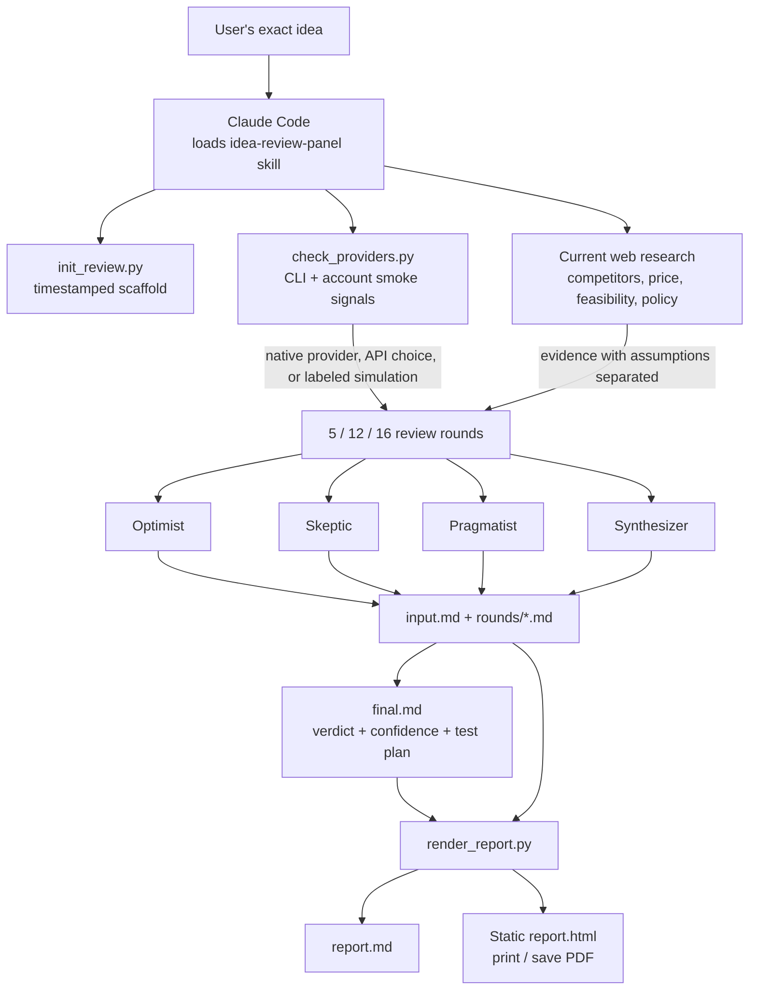
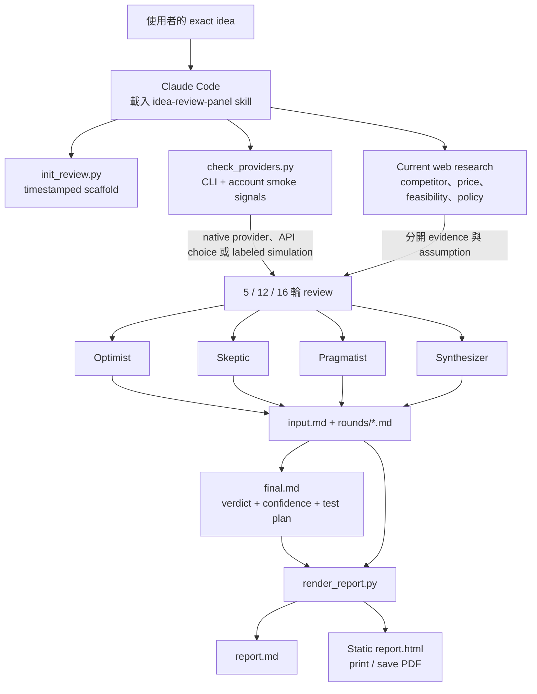

<a id="english"></a>

[← Public GitHub portfolio](./README.md) · [← Ted's profile](../README.md) · **English** · [繁體中文](#traditional-chinese) · [GitHub repository](https://github.com/teddashh/claude-idea-review-skill) · [Skill instructions](https://github.com/teddashh/claude-idea-review-skill/blob/main/SKILL.md) · [Repository README](https://github.com/teddashh/claude-idea-review-skill/blob/main/README.md)

# Claude Idea Review Skill

> A repeatable decision process inside Claude Code that turns an exciting idea into researched assumptions, visible disagreement, a verdict, and a two-week test—before the user spends serious time building.

## Positioning and verified snapshot

Claude Idea Review Skill is a small, installable Claude Code skill rather than a hosted product or model gateway. A user describes a product, startup, feature, creator-IP, content, community, or business idea. The skill creates a local workspace, researches the current context when tools are available, runs a structured 5-, 12-, or 16-round review, and renders the result as Markdown plus a printable static HTML report.

Its key design decision is to optimize for **decision quality**, not encouragement. Four named thinking personalities keep the argument legible: one expands the opportunity, one attacks assumptions, one converts disagreement into tests, and one integrates the evidence. Optional Codex, Gemini/Antigravity, and Grok access can add genuinely different providers; when they are unavailable, Claude continues and labels the simulated perspective rather than blocking the review.

This case study was verified against the public repository on **July 11, 2026**:

| Item | Repository evidence |
|---|---|
| Default branch reviewed | `main` at [`6c440b9`](https://github.com/teddashh/claude-idea-review-skill/commit/6c440b93aa8b368b7fc86c44c0f899d3ff8ca656) |
| Repository history | 6 commits; no tags or GitHub Releases |
| Repository shape | 7 tracked files: `README.md`, `SKILL.md`, three Python helpers, `LICENSE`, and `.gitignore` |
| Implementation size | 407 lines of Python helpers; 755 total lines across the two docs and three scripts |
| Tests and CI | No committed automated tests and no GitHub Actions workflow |
| Manual verification during this review | All helpers compiled; a five-round Traditional Chinese workspace was scaffolded and rendered successfully into Markdown and HTML |
| License | MIT |

There is no package version or release artifact. Installation intentionally follows Claude Code's directory-based skill discovery, so the reviewed commit is the most precise version reference.

## The problem

Ideas are usually reviewed in one of two weak modes. In the first, an assistant enthusiastically improves the pitch and leaves the founder with more confidence but no new evidence. In the second, a giant generic checklist produces dozens of concerns without a decision, test threshold, or stopping rule.

The most expensive failure is not “the idea was imperfect.” It is spending weeks building before testing the assumption that actually controls the outcome: whether the user has the problem, whether they will change behavior, whether distribution is reachable, whether the economics work, whether an API permits the product, or whether policy makes the concept impossible.

This skill creates an explicit review protocol:

- gather current competitor, market, pricing, feasibility, platform, and policy evidence first;
- separate evidence from assumptions;
- keep opposing interpretations visible for multiple rounds;
- force each perspective to react to earlier arguments instead of repeating a monologue;
- end with one verdict, confidence, a two-week validation plan, a success threshold, and a kill criterion;
- save every round so the conclusion can be audited instead of remembered vaguely.

## User experience and capabilities

### Trigger and review depth

After installation and a Claude Code restart, the user can ask naturally:

```text
Help me validate this idea: <the idea>
```

```text
幫我驗證這個點子：<你的 idea>
```

The default is five rounds. Twelve rounds provide more adversarial development; sixteen are intended for a decision that justifies a deeper evidence and trade-off trail. The scaffolder accepts only `5`, `12`, or `16`, preventing an accidental unbounded run.

### Four thinking personalities

These labels describe reasoning behavior, not departments, people, or a claim that four independent models are always present:

| Personality | Responsibility |
|---|---|
| `Optimist` | Construct the strongest credible version of the opportunity and revise it when real objections land |
| `Skeptic` | Attack a concrete premise, hidden cost, dependency, distribution assumption, or failure mode |
| `Pragmatist` | Translate conflict into MVP scope, constraints, measurable tests, and trade-offs |
| `Synthesizer` | Preserve disagreement, state the decision tension, and identify evidence that would change the verdict |

Round 1 establishes positions. Middle rounds require each personality to reference at least one earlier perspective, so objections and revisions form a chain rather than four isolated essays. In the last round, each side commits to build, validate, pivot, or stop; the Synthesizer names the deciding assumption.

### Provider-aware, but never provider-blocked

Before the review, `check_providers.py` looks for:

- `codex`, with a one-shot `codex exec` smoke path;
- Antigravity's `agy` first, then `gemini`, using `-p` for a one-shot response;
- `grok`, also using `-p`;
- the presence—not the value—of `OPENAI_API_KEY`, `GEMINI_API_KEY`, `GOOGLE_API_KEY`, `XAI_API_KEY`, `GROK_API_KEY`, and `OPENROUTER_API_KEY` environment variables.

With `--smoke`, each detected CLI receives only “Reply OK only,” has a 45-second timeout, and counts as usable only when it exits zero with non-empty stdout. The Gemini check explicitly explains that an empty non-TTY `agy -p` result can be inconclusive and provides a current migration hint when the older Gemini CLI exists but cannot answer.

The skill instructions then define the policy: prefer native provider access, ask once about an original-provider API or OpenRouter when a provider is missing, and continue with a clearly attributed Claude simulation if the user does not supply a key. Missing optional accounts should reduce independence, not prevent a result.

### Research before debate

When web tools exist, the skill tells Claude Code to gather direct competitors, adjacent products, price/business-model signals, observed demand, technical feasibility, current API/platform limitations, and legal or distribution constraints. The summary belongs near the top of `input.md` or in Round 1, and later reasoning must distinguish sourced facts from assumptions.

Research is an orchestration rule in `SKILL.md`; none of the Python helpers crawl the web. That keeps the repository small and lets Claude Code use whatever current research tools the host provides, but it also means evidence quality depends on the runtime's tools and the reviewing agent's source discipline.

### Durable local output

Each review receives a timestamped directory:

```text
.idea-review/<timestamp>-<short-slug>/
├── input.md
├── rounds/
│   ├── round-01.md
│   ├── round-02.md
│   └── ...
├── final.md
├── report.md
└── report.html
```

`input.md` preserves the exact idea and a research section. Each round starts with four named sections. `final.md` has a stable decision schema:

- `Verdict`: `worth_building`, `validate_first`, `pivot`, or `not_worth_building`;
- `Confidence`: 0–100;
- one-line conclusion;
- strongest reason and strongest counterargument;
- two-week validation plan;
- success threshold and kill criterion;
- next three actions.

The renderer places the final conclusion first, followed by the original idea and every round in lexical order. The HTML is a single local file with a sticky Print / Save PDF button and print CSS that hides controls, starts sections cleanly, and avoids splitting short paragraphs and list items when possible.

## Architecture and data flow



### Component responsibilities

| Component | Deterministic responsibility | What remains an LLM responsibility |
|---|---|---|
| `SKILL.md` | Defines trigger, round protocol, provider preference, output contract, verdict schema, and tone | Research judgment, argument quality, evidence weighting, and conclusion |
| `check_providers.py` | Finds CLI binaries, optionally smoke-tests them, reports key-variable names present, and emits JSON | Deciding how much to trust each provider and invoking a real review perspective |
| `init_review.py` | Validates round count, builds a safe timestamped slug, creates every required Markdown file, and refuses to overwrite an existing directory | Filling research, rounds, and conclusion |
| `render_report.py` | Reads required files, orders final/input/rounds, escapes HTML, renders a small Markdown subset, and writes static reports | Supplying meaningful report content |

This boundary is deliberate: scripts make the artifact shape reproducible, while Claude Code supplies the analysis. The repository does **not** contain a hidden autonomous multi-provider debate engine.

## Key engineering, security, and design choices

### 1. A review is an artifact, not just a conversation

Persisting the exact idea, research, each round, and the conclusion makes it possible to inspect where a premise first appeared, whether a Skeptic objection was answered, and which evidence changed confidence. It also lets a later reviewer rerender or continue the analysis without reconstructing chat history.

### 2. Disagreement is a workflow invariant

The prompt does not ask four personalities to reach consensus immediately. After Round 1, each must reference a prior position. Optimist must revise when the Skeptic finds a real issue; Skeptic must attack a premise rather than tone; Pragmatist must turn conflict into an experiment; Synthesizer must state what evidence would change the outcome. That structure makes disagreement useful instead of theatrical.

### 3. The output forces falsifiability

`validate_first` is not an excuse for indefinite research because the final schema requires a two-week plan, a success threshold, and a kill criterion. A good review says what measurement earns more investment and what result should stop the project.

### 4. Native providers are preferred; simulation is disclosed

The skill can use Codex, Gemini/Antigravity, or Grok when the host can actually invoke them. If it cannot, it instructs Claude to say “Claude simulation of Codex/Grok/Gemini” when attribution matters. A simulated style can expose another angle, but it is not misrepresented as independent model evidence.

### 5. Workspace creation is collision-safe and CJK-aware

The slugger accepts Latin letters, digits, and CJK ideographs, keeps at most the first eight tokens and 64 characters, prefixes local time to the second, and calls `mkdir(..., exist_ok=False)`. A same-name collision fails visibly rather than overwriting an earlier review.

### 6. Static reporting minimizes the attack and dependency surface

The report needs no web server, JavaScript framework, package install, CDN, or database. Text is escaped with `html.escape()` before limited inline formatting is added. Links are restricted to `http://` and `https://` syntax, and the only script behavior is the inline `window.print()` button generated by trusted code.

The renderer intentionally supports only what the report template needs: headings, paragraphs, horizontal rules, flat ordered/unordered lists, inline code, emphasis, strong text, and HTTP(S) links. This is smaller and safer than accepting arbitrary Markdown HTML, at the cost of incomplete Markdown fidelity.

### 7. Provider checks avoid printing secret values

The checker reports which recognized environment variable **names** are populated, never their contents. It launches command arrays without `shell=True`, captures output, enforces timeouts, and limits the diagnostic note to the last 500 characters. Smoke mode can still contact an external service and consume quota, so it is an explicit flag rather than the default behavior of the script.

## Quick start

### Install as a personal Claude Code skill

```bash
git clone https://github.com/teddashh/claude-idea-review-skill.git \
  ~/.claude/skills/idea-review-panel
```

Restart Claude Code or begin a new session; Claude Code discovers skills at startup. To install for one project only:

```bash
git clone https://github.com/teddashh/claude-idea-review-skill.git \
  .claude/skills/idea-review-panel
```

Windows PowerShell:

```powershell
git clone https://github.com/teddashh/claude-idea-review-skill.git `
  "$env:USERPROFILE\.claude\skills\idea-review-panel"
```

Requirements are Claude Code plus Python on `PATH` for the helper scripts. Codex, Antigravity/Gemini, Grok, provider API keys, and OpenRouter are optional.

### Run a review

Ask Claude Code directly:

```text
Validate this idea in 12 rounds: <your idea>
```

The skill normally creates `.idea-review/...` in the current project. The helpers can also be exercised manually from the project where the output should live:

```bash
SKILL_DIR="$HOME/.claude/skills/idea-review-panel"

python3 "$SKILL_DIR/scripts/check_providers.py" --smoke
python3 "$SKILL_DIR/scripts/init_review.py" \
  --idea "your idea" \
  --rounds 5

python3 "$SKILL_DIR/scripts/render_report.py" \
  .idea-review/<timestamp-and-slug>
```

On Windows, use the actual Python command installed on the machine—commonly `python` rather than `python3`.

Update a personal installation with:

```bash
git -C ~/.claude/skills/idea-review-panel pull --ff-only
```

## Current scope, risks, and license

### What the current repository delivers

- A complete Claude Code skill contract for researched 5/12/16-round idea reviews.
- Explicit personalities, cross-round interaction rules, convergence rules, and a fixed actionable verdict schema.
- Optional-provider discovery for Codex, Antigravity/Gemini, Grok, native API keys, and OpenRouter availability.
- A deterministic CJK-capable workspace scaffolder.
- Combined Markdown and printable static HTML reporting.
- Bilingual English/Traditional Chinese usage documentation and default Traditional Chinese output when the user asks in Chinese.

### Important limits and risks

- **Claude Code is the actual engine.** The Python scripts do not conduct research, call multiple models for debate, or write the rounds. They detect, scaffold, and render; `SKILL.md` tells Claude Code how to perform the reasoning.
- **Simulation is not independent validation.** When Codex, Gemini, or Grok is unavailable, a labeled Claude simulation can diversify style but not model training data or provider failure modes. Confidence should reflect that difference.
- **Research depends on available tools and source quality.** An offline or restricted Claude Code session can still review the idea, but competitor, price, policy, and technical claims may be stale or assumption-heavy.
- **Provider smoke tests have side effects.** `--smoke` can make up to three sequential external CLI calls, each with a 45-second timeout. It may consume account quota and may expose the last 500 characters of a provider error in the local JSON output.
- **Reports are local plaintext.** Product strategy, personal ideas, market research, and provider output are written unencrypted under `.idea-review/`. Users should decide whether to gitignore, encrypt, redact, or delete sensitive reviews before syncing a project.
- **The renderer is intentionally not full Markdown.** Fenced code blocks, tables, nested lists, images, relative links, and arbitrary HTML are not faithfully rendered. Markdown remains the canonical rich-text source when those features matter.
- **No test or release automation is committed.** The scripts passed this review's compile/scaffold/render smoke, but regressions are not automatically checked on pull requests and there is no versioned release to pin.
- **Provider interfaces can move.** The latest commit already exists to update Gemini/Antigravity guidance. CLI flags, account tiers, and auth flows should be rechecked before relying on a native provider.
- **Timestamp collisions fail rather than merge.** This protects prior output, but two identical reviews initialized within the same second need a retry or a different `--out` path.

The project is released under the **MIT License**. See [`LICENSE`](https://github.com/teddashh/claude-idea-review-skill/blob/main/LICENSE).

## Source and documentation

- [Repository](https://github.com/teddashh/claude-idea-review-skill)
- [Reviewed commit](https://github.com/teddashh/claude-idea-review-skill/tree/6c440b93aa8b368b7fc86c44c0f899d3ff8ca656)
- [Skill contract](https://github.com/teddashh/claude-idea-review-skill/blob/main/SKILL.md)
- [Installation and usage README](https://github.com/teddashh/claude-idea-review-skill/blob/main/README.md)
- [Provider checker](https://github.com/teddashh/claude-idea-review-skill/blob/main/scripts/check_providers.py)
- [Workspace scaffolder](https://github.com/teddashh/claude-idea-review-skill/blob/main/scripts/init_review.py)
- [Static report renderer](https://github.com/teddashh/claude-idea-review-skill/blob/main/scripts/render_report.py)
- [MIT License](https://github.com/teddashh/claude-idea-review-skill/blob/main/LICENSE)

---

[← Previous: Clawd-Lobster](./clawd-lobster.md) · [Public GitHub portfolio](./README.md) · [Next: MCP Memory Server →](./mcp-memory-server.md)

---

<a id="traditional-chinese"></a>

[← GitHub 公開作品集](./README.md#traditional-chinese) · [← Ted 的個人頁](../README.md#traditional-chinese) · [English](#english) · **繁體中文** · [GitHub 原始碼](https://github.com/teddashh/claude-idea-review-skill) · [Skill 指令](https://github.com/teddashh/claude-idea-review-skill/blob/main/SKILL.md) · [Repo README](https://github.com/teddashh/claude-idea-review-skill/blob/main/README.md)

# Claude Idea Review Skill

> 在 Claude Code 裡建立一套可重複的決策流程：把令人興奮的點子，轉成有研究、有可見分歧、有結論、也有兩週測試的計畫，再決定是否投入大量時間開發。

## 定位與已核對快照

Claude Idea Review Skill 是可安裝的 Claude Code skill，不是 hosted product 或 model gateway。使用者描述產品、startup、feature、creator-IP、內容、社群或商業點子後，skill 會建立 local workspace；工具可用時先研究現在的外部環境；再執行 5、12 或 16 輪結構化 review；最後輸出 Markdown 與可列印 static HTML report。

它最重要的設計選擇，是優化**決策品質**而不是鼓勵感。四個有名字的思考個性讓爭論容易閱讀：一個展開機會、一個攻擊假設、一個把分歧轉成測試、一個整合證據。Codex、Gemini/Antigravity、Grok 都是選用 provider；真的可用時能加入不同模型，無法使用時 Claude 仍會繼續，並明確標示 simulated perspective，不會讓 review 永久卡住。

本頁在 **2026 年 7 月 11 日**核對公開 repo：

| 項目 | Repo 實際證據 |
|---|---|
| 核對的預設分支 | `main`，commit [`6c440b9`](https://github.com/teddashh/claude-idea-review-skill/commit/6c440b93aa8b368b7fc86c44c0f899d3ff8ca656) |
| Repo history | 6 個 commits；沒有 tags 或 GitHub Releases |
| Repo 組成 | 7 個 tracked files：`README.md`、`SKILL.md`、三個 Python helpers、`LICENSE`、`.gitignore` |
| 實作規模 | 407 行 Python helpers；兩份 docs 加三個 scripts 共 755 行 |
| Tests / CI | 沒有 committed automated tests，也沒有 GitHub Actions workflow |
| 本次手動驗證 | 全部 helper 可 compile；成功 scaffold 五輪繁中 workspace，並 render 成 Markdown/HTML |
| 授權 | MIT |

Repo 沒有 package version 或 release artifact；安裝本來就依賴 Claude Code 的 directory-based skill discovery，因此本頁核對 commit 是最精確的 version reference。

## 它解決的問題

一般點子常落入兩種很弱的 review mode。第一種是 Assistant 很熱情地把 pitch 說得更漂亮，創辦人信心變強，證據卻沒有增加。第二種是巨大 generic checklist，列出幾十個問題，最後沒有 decision、test threshold 或 stopping rule。

最昂貴的錯誤不是「點子不完美」，而是在測到真正控制結果的假設之前，就花數週完成產品：使用者是否真的有問題、是否願意改變行為、distribution 是否可觸及、economics 是否成立、API 是否允許、policy 是否讓 concept 根本不可行。

這個 skill 建立明確 protocol：

- 先找 current competitor、market、pricing、feasibility、platform、policy evidence；
- 分開 evidence 與 assumption；
- 讓相反 interpretation 在多輪中維持可見；
- 要求各 perspective 回應前面論點，而不是各自重複 monologue；
- 最後一定給一個 verdict、confidence、two-week plan、success threshold、kill criterion；
- 每一輪都存檔，結論可以 audit，不靠模糊記憶。

## 使用體驗與能力

### 觸發方式與 review 深度

安裝並重啟 Claude Code 後，直接自然地問：

```text
幫我驗證這個點子：<你的 idea>
```

預設五輪；十二輪會有更完整 adversarial development；十六輪適合值得留下更深 evidence/trade-off trail 的重大決策。Scaffolder 只接受 `5`、`12`、`16`，避免不小心啟動無上限 run。

### 四個思考個性

這些 labels 描述 reasoning behavior，不是部門、人物，也不是宣稱每次真的有四個 independent models：

| 個性 | 職責 |
|---|---|
| `Optimist` | 建構機會的最強可信版本，真正 objection 出現時也要修正 |
| `Skeptic` | 攻擊具體 premise、hidden cost、dependency、distribution assumption 或 failure mode |
| `Pragmatist` | 把衝突轉成 MVP scope、constraints、measurable tests 與 trade-offs |
| `Synthesizer` | 保留分歧、說出 decision tension，指出什麼 evidence 會改變 verdict |

Round 1 建立立場。之後每輪都要求每個 personality 至少引用一個 prior perspective，讓 objection/revision 形成 chain，而不是四篇互不相干 essay。Final round 每一方都要承諾 build、validate、pivot 或 stop；Synthesizer 則說出 deciding assumption。

### 會看 provider，但不被 provider 卡住

Review 前，`check_providers.py` 會找：

- `codex`，smoke path 使用 one-shot `codex exec`；
- 先找 Antigravity `agy`，再找 `gemini`，one-shot 都用 `-p`；
- `grok`，同樣使用 `-p`；
- `OPENAI_API_KEY`、`GEMINI_API_KEY`、`GOOGLE_API_KEY`、`XAI_API_KEY`、`GROK_API_KEY`、`OPENROUTER_API_KEY` 這些 environment variable 是否存在——只報名稱，不報 value。

使用 `--smoke` 時，每個 detected CLI 只收到「Reply OK only」，timeout 45 秒；必須 exit zero 且 stdout 非空才算 usable。Gemini check 特別說明非 TTY 下 `agy -p` 的空輸出可能 inconclusive，也會在舊 Gemini CLI 存在卻無法回答時提供 migration hint。

接著由 skill instructions 決定政策：優先 native provider；缺 provider 時只問一次要不要 original API/OpenRouter；使用者沒給 key 就用明確 attribution 的 Claude simulation 繼續。缺少 optional account 會降低 independence，但不應阻止產出。

### Debate 前先做 research

Web tools 可用時，skill 要 Claude Code 搜集 direct competitors、adjacent products、price/business signals、observed demand、technical feasibility、current API/platform limits、legal/distribution constraints。Summary 放在 `input.md` 前段或 Round 1，後續 reasoning 必須區分 sourced fact 與 assumption。

Research 是 `SKILL.md` 的 orchestration rule；三個 Python helper 都不 crawl web。這讓 repo 很小，也能使用 host 當下提供的 research tools；代價是 evidence quality 取決於 runtime tool 與 reviewing agent 的 source discipline。

### 可長期保存的 local output

每次 review 都得到 timestamped directory：

```text
.idea-review/<timestamp>-<short-slug>/
├── input.md
├── rounds/
│   ├── round-01.md
│   ├── round-02.md
│   └── ...
├── final.md
├── report.md
└── report.html
```

`input.md` 保留 exact idea 與 research section；每輪預先建立四個 named sections。`final.md` 有固定 decision schema：

- `Verdict`：`worth_building`、`validate_first`、`pivot`、`not_worth_building`；
- `Confidence`：0–100；
- one-line conclusion；
- strongest reason / counterargument；
- two-week validation plan；
- success threshold / kill criterion；
- next three actions。

Renderer 把 final conclusion 放第一，再放 original idea，最後依 lexical order 放每一輪。HTML 是單一 local file，有 sticky Print / Save PDF button 與 print CSS；列印時隱藏 controls，盡量避免短 paragraph/list item 被切頁。

## 架構與資料流



### Component 分工

| Component | 確定性責任 | 仍由 LLM 負責 |
|---|---|---|
| `SKILL.md` | 定義 trigger、round protocol、provider preference、output contract、verdict schema、tone | Research judgment、argument quality、evidence weighting、conclusion |
| `check_providers.py` | 找 CLI、選用 smoke、報告存在的 key-variable names、輸出 JSON | 決定各 provider 可信度，以及實際叫出 review perspective |
| `init_review.py` | 驗證 round count、建立安全 timestamped slug、產生全部 Markdown、拒絕 overwrite | 填 research、rounds、conclusion |
| `render_report.py` | 讀 required files、排序 final/input/rounds、escape HTML、render 小型 Markdown subset、寫 static reports | 提供有內容的 report text |

這條 boundary 是刻意的：scripts 讓 artifact shape 可重複，Claude Code 提供分析。Repo 裡沒有隱藏 autonomous multi-provider debate engine。

## 關鍵工程、安全與設計選擇

### 1. Review 是 artifact，不只是 conversation

保存 exact idea、research、每輪與 conclusion，才能追查某個 premise 第一次在哪出現、Skeptic objection 是否被回答、哪份 evidence 改變 confidence。後續 reviewer 也能 rerender 或續做分析，不用重建 chat history。

### 2. Disagreement 是 workflow invariant

Prompt 不要求四個 personality 立即共識。Round 1 後，每個都要引用 earlier position；Optimist 遇到真問題要修正、Skeptic 要攻擊 premise 而非 vibe、Pragmatist 要把衝突變 experiment、Synthesizer 要說什麼 evidence 會改變 outcome。這讓 disagreement 有功能，不只是戲劇效果。

### 3. Output 強迫結論可被 falsify

`validate_first` 不是無限研究的藉口，因為 final schema 強制 two-week plan、success threshold、kill criterion。好的 review 必須說清楚：什麼 measurement 值得繼續投資，什麼 result 應該停止。

### 4. 優先 native provider，simulation 必須揭露

Host 真能 invoke 時，skill 可使用 Codex、Gemini/Antigravity、Grok；不能時，attribution 重要的地方要寫「Claude 模擬 Codex/Grok/Gemini」。Simulated style 能暴露另一個角度，但不能偽裝成 independent model evidence。

### 5. Workspace 建立防 collision，也支援 CJK

Slugger 接受 Latin letters、digits、CJK ideographs，只取前八個 tokens 與 64 chars，前綴 local time 到秒，並用 `mkdir(..., exist_ok=False)`。同名 collision 會明確失敗，不覆蓋舊 review。

### 6. Static report 降低 attack/dependency surface

Report 不需要 web server、JavaScript framework、package install、CDN 或 DB。Text 先經 `html.escape()`，再套有限 inline format；link 只接受 `http://`/`https://` syntax，唯一 script behavior 是 trusted generator 寫入的 `window.print()` button。

Renderer 只支援 template 真正需要的 headings、paragraphs、horizontal rules、flat ordered/unordered lists、inline code、emphasis、strong、HTTP(S) links。這比接受 arbitrary Markdown HTML 小且安全，但 Markdown fidelity 不完整。

### 7. Provider check 不顯示 secret value

Checker 只回報哪些 recognized environment variable **名稱**有值，不回傳內容。它用 command arrays 而非 `shell=True`，capture output、timeout，diagnostic note 只留最後 500 chars。Smoke mode 仍可能聯絡 external service、消耗 quota，所以它是明確 flag，不是 script default behavior。

## 快速開始

### 安裝成個人 Claude Code skill

```bash
git clone https://github.com/teddashh/claude-idea-review-skill.git \
  ~/.claude/skills/idea-review-panel
```

重啟 Claude Code 或開新 session；skill 在 startup discovery。若只想給單一 project：

```bash
git clone https://github.com/teddashh/claude-idea-review-skill.git \
  .claude/skills/idea-review-panel
```

Windows PowerShell：

```powershell
git clone https://github.com/teddashh/claude-idea-review-skill.git `
  "$env:USERPROFILE\.claude\skills\idea-review-panel"
```

需求是 Claude Code，加上 `PATH` 裡能跑的 Python helpers。Codex、Antigravity/Gemini、Grok、provider API key、OpenRouter 都是選用。

### 執行 review

直接問 Claude Code：

```text
用 12 輪幫我驗證這個點子：<你的 idea>
```

Skill 通常在 current project 建立 `.idea-review/...`。也可在希望存放 output 的 project 手動執行 helpers：

```bash
SKILL_DIR="$HOME/.claude/skills/idea-review-panel"

python3 "$SKILL_DIR/scripts/check_providers.py" --smoke
python3 "$SKILL_DIR/scripts/init_review.py" \
  --idea "你的點子" \
  --rounds 5

python3 "$SKILL_DIR/scripts/render_report.py" \
  .idea-review/<timestamp-and-slug>
```

Windows 請使用機器真正安裝的 Python command，常見是 `python` 而非 `python3`。

更新個人安裝：

```bash
git -C ~/.claude/skills/idea-review-panel pull --ff-only
```

## 目前範圍、風險與授權

### Current repo 已提供

- 完整 Claude Code skill contract，能跑 researched 5/12/16-round idea review。
- 明確 personalities、cross-round interaction、convergence rules、actionable verdict schema。
- Codex、Antigravity/Gemini、Grok、native API key、OpenRouter availability 的 optional-provider discovery。
- Deterministic、CJK-capable workspace scaffolder。
- Combined Markdown 與 printable static HTML reporting。
- 英文／繁中 usage docs；使用者用中文提問時預設繁中 output。

### 重要限制與風險

- **真正 engine 是 Claude Code。** Python scripts 不做 research、不自行呼叫多模型 debate，也不寫 rounds；它們只 detect、scaffold、render，`SKILL.md` 才告訴 Claude Code 如何推理。
- **Simulation 不是 independent validation。** Codex、Gemini、Grok 不可用時，labeled Claude simulation 可以改變 style，卻不會改變 model training data 或 provider failure mode；confidence 應反映差別。
- **Research 依賴 tools 與 source quality。** Offline/restricted Claude Code session 仍能 review，但 competitor、price、policy、technical claims 可能 stale 或 assumption-heavy。
- **Provider smoke test 有 side effect。** `--smoke` 最多 sequential 呼叫三個 external CLI，每個 timeout 45 秒；可能消耗 account quota，也可能把 provider error 最後 500 chars 顯示在 local JSON。
- **Reports 是 local plaintext。** Product strategy、personal ideas、market research、provider output 都未加密寫在 `.idea-review/`；同步 project 前應自行決定 gitignore、encrypt、redact 或 delete。
- **Renderer 刻意不是 full Markdown。** Fenced code blocks、tables、nested lists、images、relative links、arbitrary HTML 不會 faithful render；需要這些功能時，Markdown 才是 canonical rich-text source。
- **沒有 committed test/release automation。** Scripts 通過本次 compile/scaffold/render smoke，但 pull request 不會自動檢查 regression，也沒有 versioned release 可 pin。
- **Provider interface 會移動。** 最新 commit 本身就是更新 Gemini/Antigravity guidance；依賴 native provider 前應重查 CLI flag、account tier、auth flow。
- **Timestamp collision 會 fail，不會 merge。** 這能保護舊 output，但同一秒初始化兩次 identical idea 時要 retry 或改 `--out`。

本作品採 **MIT License**；詳見 [`LICENSE`](https://github.com/teddashh/claude-idea-review-skill/blob/main/LICENSE)。

## 原始碼與文件

- [GitHub repository](https://github.com/teddashh/claude-idea-review-skill)
- [本頁核對 commit](https://github.com/teddashh/claude-idea-review-skill/tree/6c440b93aa8b368b7fc86c44c0f899d3ff8ca656)
- [Skill contract](https://github.com/teddashh/claude-idea-review-skill/blob/main/SKILL.md)
- [安裝與使用 README](https://github.com/teddashh/claude-idea-review-skill/blob/main/README.md)
- [Provider checker](https://github.com/teddashh/claude-idea-review-skill/blob/main/scripts/check_providers.py)
- [Workspace scaffolder](https://github.com/teddashh/claude-idea-review-skill/blob/main/scripts/init_review.py)
- [Static report renderer](https://github.com/teddashh/claude-idea-review-skill/blob/main/scripts/render_report.py)
- [MIT License](https://github.com/teddashh/claude-idea-review-skill/blob/main/LICENSE)

---

[← 上一篇：Clawd-Lobster](./clawd-lobster.md#traditional-chinese) · [GitHub 公開作品集](./README.md#traditional-chinese) · [下一篇：MCP Memory Server →](./mcp-memory-server.md#traditional-chinese)
