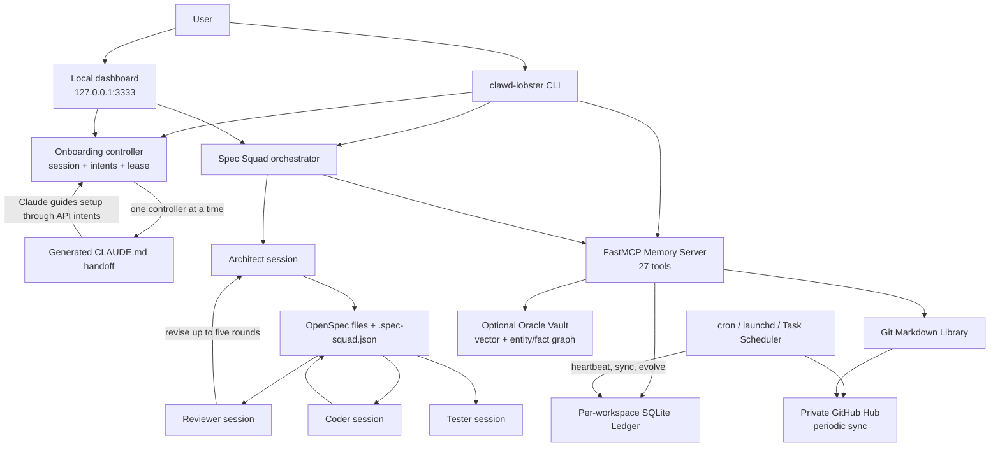
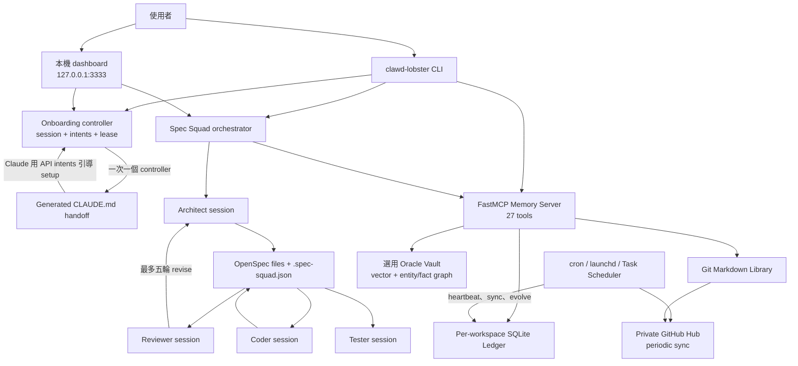

<a id="english"></a>

[← Public GitHub portfolio](./README.md) · [← Ted's profile](../README.md) · **English** · [繁體中文](#traditional-chinese) · [GitHub repository](https://github.com/teddashh/clawd-lobster) · [Architecture](https://github.com/teddashh/clawd-lobster/blob/master/ARCHITECTURE.md) · [Traditional Chinese README](https://github.com/teddashh/clawd-lobster/blob/master/README.zh-TW.md) · [Onboarding guide](https://github.com/teddashh/clawd-lobster/blob/master/docs/onboarding-guide.html)

# Clawd-Lobster

> A file-first operating layer for Claude Code: reviewed specifications, persistent memory, guided onboarding, reusable skills, local workspaces, and periodic multi-machine continuity without replacing the underlying coding agent.

## Positioning and verified snapshot

Clawd-Lobster starts from a pragmatic premise: Claude Code is already the capable execution engine, so the useful product is not another model loop. It is the surrounding operating discipline—how context survives a session, how an idea becomes a testable plan, how a second agent challenges that plan, how work is divided into workspaces, how recurring tasks are scheduled, and how learned patterns move to another machine.

The repository packages that discipline in several connected forms:

- a Python CLI named `clawd-lobster`;
- a local browser dashboard on `127.0.0.1:3333`;
- a stateful web/Claude onboarding handoff;
- a four-stage Spec Squad using the Claude Agent SDK;
- a FastMCP memory server backed by per-workspace SQLite;
- Git-synced knowledge and machine registries;
- optional Oracle Vector Search, Odoo, Codex, Gemini, NotebookLM, and deployment skills;
- Windows, macOS, Linux, and experimental Docker setup paths.

This case study was re-verified against the unchanged public repository on **July 18, 2026**:

| Item | Repository evidence |
|---|---|
| Default branch reviewed | `master` at [`5d497c9`](https://github.com/teddashh/clawd-lobster/commit/5d497c9c3307f9e5c9af3d8cbfe6656335dfc6f4) |
| Package version | `0.6.0` in both `pyproject.toml` and `clawd_lobster.__version__` |
| Release status | No Git tags or GitHub Releases in the reviewed repository |
| Repository shape | 209 tracked files; 22,658 lines of Python source in the tree |
| Skills on disk | 12 skill directories, 11 `skill.json` manifests, and 10 `SKILL.md` instruction files |
| Memory API | 27 functions actually decorated as MCP tools in `mcp_memory/server.py` |
| Tests run during this review | `pytest -q`: 32 passed; standalone HTTP E2E: 25 named steps passed and produced a contiguous 14-event audit trail |
| CI status | No GitHub Actions workflow is present, so those passing results are local evidence rather than an enforced merge gate |
| License | MIT |

Several README counters have drifted: the badge says 1.0.0, the changelog stops at 0.5.0, the package reports 0.6.0, and various files say 24, 27+, 28, or 32 memory tools. This page uses executable package metadata and counts the current decorators/files instead of choosing the largest marketing number.

## The problem

Raw coding-agent sessions are excellent at concentrated work but poor at organizational continuity. Each new session can require the user to restate conventions, architecture, previous decisions, unfinished tasks, and the reasoning behind a workaround. The human becomes the memory store and project manager.

Large autonomous-agent frameworks often address that problem with a second runtime, adapters, databases, orchestration services, and a long configuration surface. That can create a new maintenance burden and make upstream model improvements harder to inherit. Clawd-Lobster takes a thinner approach: use Claude Code's native CLI, Agent SDK, MCP, `CLAUDE.md`, hooks, permissions, and session-resume behavior, then add structured files and small local services around them.

The product therefore tries to solve five connected problems:

1. **Specification quality:** move from an idea to explicit requirements, scenarios, architecture, and small implementation tasks before code is written.
2. **Independent review:** let a separate model context challenge the spec instead of asking the author to approve its own reasoning.
3. **Persistent memory:** retain decisions, fixes, questions, knowledge, TODOs, provenance, and usefulness signals across sessions.
4. **Operational continuity:** revive sessions and synchronize selected files through the operating system and Git rather than a permanent polling daemon.
5. **Progressive onboarding:** let a visual dashboard and Claude Code share setup work without allowing both to mutate the same state simultaneously.

## User experience and capabilities

### One CLI, several entry points

The installed command has five primary routes:

| Command | Experience |
|---|---|
| `clawd-lobster setup` | Terminal onboarding and local configuration |
| `clawd-lobster serve` | Local dashboard, onboarding, skills, workspaces, credentials/settings surfaces, and Spec Squad pages |
| `clawd-lobster workspace create <name>` | Scaffolds a workspace, knowledge tree, SQLite database, OpenSpec area, Git repo, and optional private GitHub repo |
| `clawd-lobster squad start` | Runs the interactive spec → review → build → test flow in a terminal |
| `clawd-lobster status` | Reports tool versions, configuration, workspaces, memory database size, and the dashboard PID |

The web interface includes English, Traditional Chinese, Simplified Chinese, Japanese, and Korean presentation. The “Skill Parade” onboarding design gives the browser the visual role—cards, status, forms, progress—while a generated `CLAUDE.md` gives Claude Code the conversational role—explanation, commands, permission requests, and troubleshooting.

### Spec Squad: plan, challenge, build, verify

Spec Squad uses separate `claude_agent_sdk.query()` calls with different system prompts and tool allowances:

1. **Discovery** asks one or two questions at a time and captures a 3W1H-style project summary.
2. **Architect** writes an OpenSpec DAG: project context, proposal, design, capability specs with SHALL/MUST requirements and Gherkin scenarios, then file-referenced tasks.
3. **Reviewer** reads the artifacts in a separate agent invocation and returns `REVISE` or `APPROVED`. Architect and Reviewer can loop up to five rounds.
4. **Coder** receives read/write/edit/Bash tools, follows the approved task file, marks tasks complete, and is instructed to commit after each phase.
5. **Tester** receives read and Bash tools, maps the implementation back to every requirement, runs tests, and emits a pass/failure signal.

The same async orchestration core serves terminal and web modes. State is written to `<workspace>/.spec-squad.json`. The orchestrator queues phase and text records for a planned SSE path, while the current dashboard polls `/api/squad/state` every two seconds; the reviewed server does not yet expose an endpoint that drains the SSE queue.

### Thin Ledger memory

The memory subsystem separates operational facts from compiled knowledge and optional deep recall:

| Layer | Current implementation | Purpose |
|---|---|---|
| SQLite “Ledger” | One `.claude-memory/memory.db` per workspace | Fast decisions, fixes, questions, knowledge, TODOs, learned skills, action log, and claim challenges |
| Git/Markdown “Library” | `knowledge/raw`, `knowledge/wiki`, `INDEX.md`, `log.md`, and `.pending/` | Human-readable sources, compiled pages, citations, correction proposals, and cross-machine sync |
| Oracle “Vault” | Optional `oracledb` schema, migration, parser, API, and Agent SDK MCP scripts | Semantic retrieval over documents, chunks, entities, facts, relations, and events across machines |

The SQLite initializer creates nine operational tables. Knowledge records can carry `source_agent`, confidence, upstream IDs, lifecycle state, machine ID, access count, last access, and salience. The FastMCP server exposes 27 current tools for storing, listing, retrieving, searching, deleting, TODOs, corrections, action audit, learned skills, reinforcement, compaction, status, and optional Oracle summaries.

Search opens workspace databases lazily, queries knowledge, decisions, resolved items, and open questions, boosts accessed records by 5%, then ranks by salience. Manual reinforcement adds 20% up to a 2.0 ceiling. The scheduled decay is designed to multiply untouched items by 0.95 after 30 days; with the current schema it works for records that have `created_at`, while two older table shapes are silently skipped as noted under risks. The token estimator treats CJK and emoji differently from Latin text rather than assuming one English-centric characters-per-token ratio.

The optional Oracle code is more substantial than a configuration checkbox: `vault_init.py` currently defines twelve domain tables plus schema metadata, vectors with 1,536 float dimensions, indexes and views; `vault_parsers.py` contains ten parser classes and a deduplication path; `vault_mcp_server.py` exposes seven Agent SDK tools. It is nevertheless an optional integration, not part of the default `pip install -e .` runtime.

### Curated skill surface

The repository contains twelve skill directories:

- `memory-server` for persistent MCP memory;
- `spec` for spec-driven delivery and Spec Squad;
- `evolve` for extracting patterns, generating proposals, decaying salience, and linting the wiki;
- `absorb` for turning repositories, files, URLs, email, images, meetings, and other sources into knowledge;
- `heartbeat` for OS-scheduled session revival;
- `migrate` for one-time import from existing Claude/OpenClaw/Hermes setups;
- `codex-bridge` and `gemini-bridge` for independent worker/critic perspectives;
- `connect-odoo` for XML-RPC ERP operations and polling;
- `notebooklm-bridge` for document synchronization and media-oriented deliverables;
- `deploy` for spec-guided container/deployment artifacts;
- `learned` as the generated pattern library.

Eleven have machine-readable manifests; six currently include onboarding metadata consumed by the new Skill Parade controller. The skill manager also inventories selected Claude-native skills and commands, reconciles MCP/settings files, records enabled state, runs health checks, and stores manifest credentials outside the repository under `~/.clawd-lobster/credentials/`.

### Multi-machine continuity and self-evolution

The classic installer can create or join a private GitHub “Hub.” Each machine receives an ID and domain, while `workspaces.json` describes projects and deployment scope. Every 30 minutes, OS cron or launchd runs:

- `sync-all.sh`, which pulls repositories, stages tracked changes plus selected source/document extensions, commits them, pushes them, and runs daily salience decay;
- `heartbeat.sh`, which checks registered workspaces for matching Claude processes and attempts `claude --resume` through Terminal, GNOME Terminal, tmux, or nohup.

`evolve-tick.py` scans completed work and audit actions, skips workspaces with a `.blitz-active` gate, asks Claude to extract reusable patterns, writes OpenSpec improvement proposals, decays stale memory, checks broken/orphan/stale wiki pages, and syncs knowledge through Git.

## Architecture and data flow



### Onboarding state flow

The redesigned onboarding backend is its own small state machine:

- `POST /api/onboarding/session` creates an `ob_<id>` directory and returns a raw token once.
- Only a truncated SHA-256 token digest is saved in `state.json`; most API calls require the bearer token.
- `controller.json` grants one of `web`, `claude`, or `tui` a 90-second lease, intended to renew every 30 seconds.
- Mutations go through named intents, dependency and transition checks, the lease ID, and optional optimistic revision matching.
- State writes flush, `fsync`, and use `os.replace`; events append to `events.jsonl` with sequence numbers.
- Side-effect-free probes compare saved state with the real machine. Recovery expires stale leases and reconciles drift after interruption.
- Handoff writes a session-specific `CLAUDE.md` and `.clawd-onboarding.json`; Claude receives API examples and must acquire the same controller lease before acting.

This design resolves a real UI/agent race: the web page and Claude can both help, but there is only one mutation authority at a time.

## Key engineering, security, and design choices

### 1. Extend the official engine instead of wrapping model behavior

The core orchestration calls the Claude Agent SDK and limits each role with explicit tool lists. Claude Code still owns authentication, model execution, native file tools, and upstream capabilities. Prompt-pattern skills, `CLAUDE.md`, MCP servers, settings, and OS jobs are inspectable extension points rather than a shadow chat protocol.

Optional Codex, Gemini, NotebookLM, Oracle, and Odoo integrations mean the whole repository is not literally “Anthropic tools only,” despite broad README phrasing. The more precise claim is that the main Spec Squad execution path does not implement its own model runtime.

### 2. Independent review is represented by an independent invocation

The Reviewer is not a checklist appended to the Architect prompt. It receives a separate system prompt, read-only tools, and the generated files as evidence. The Coder and Tester are also separate invocations with different permissions. This reduces same-context anchoring and makes the spec an explicit contract between phases.

### 3. The onboarding controller treats concurrency as a data problem

The backend combines a bearer token, one active controller lease, dependency-aware intents, revision numbers, atomic state replacement, append-only events, probes, and recovery. The reviewed test suite covers conflicting leases, handoff, expiration, invalid transitions, revision mismatch, dependency checks, token storage, event continuity, reconciliation, and a full HTTP flow.

### 4. Localhost is the web security boundary

The production `start_server()` binds only `127.0.0.1`, and static asset routes reject path traversal. Protected onboarding, controller, skills, health, events, reconciliation, and Vault APIs require a token. Oracle passwords are written to a separate credentials file and `chmod 0600` is attempted on Unix.

This is a local administration surface, not a hardened multi-user web service. It uses Python's standard-library HTTP server, has no TLS or browser-origin controls, and retains a few intentionally unauthenticated legacy workspace/Squad endpoints. The localhost bind is therefore load-bearing.

### 5. Memory is structured, source-aware, and correctable

Decisions, fixes, questions, knowledge, tasks, actions, and learned skills do not collapse into one opaque embedding collection. Provenance and lifecycle fields preserve who asserted a claim and whether it is raw, accepted, or superseded. Agents propose wiki corrections through `claim_challenges` and `.pending/` rather than silently rewriting compiled pages.

### 6. Files and Git are the cross-machine protocol

The repository favors Markdown, JSON, JSONL, SQLite, and Git over a mandatory cloud control plane. A user can inspect or recover most state with ordinary tools. The cost is eventual, conflict-prone synchronization rather than transactional fleet coordination; “instant” inheritance in the README is aspirational wording for a default 30-minute sync job.

### 7. Security scanning is executable and optional

`scripts/security-scan.py` discovers and runs whichever of Bandit, pip-audit, Gitleaks, Semgrep, and Trivy are installed. It excludes database, wallet, certificate, dependency, and build artifacts to reduce false positives, caps individual tools at five minutes, and writes a structured report under `.claude-memory/security-scan.json`.

### 8. Most long-running behavior is scheduled, not resident

The dashboard and MCP server are the only intended persistent processes. Heartbeat, sync, evolution, and NotebookLM work run and exit through native schedulers. Documentation estimates roughly 25 MB resident RAM for the memory MCP process and zero idle CPU for scheduled jobs; those figures are design claims in the repo and were not independently benchmarked during this review.

## Quick start

### Dashboard and CLI

Python 3.11+ is the safest common baseline: the root package declares 3.10+, but the bundled memory-server package declares 3.11+.

```bash
git clone https://github.com/teddashh/clawd-lobster.git
cd clawd-lobster

python3.11 -m venv .venv
source .venv/bin/activate
python -m pip install --upgrade pip
python -m pip install -e .

clawd-lobster setup
clawd-lobster serve
```

The server opens `http://127.0.0.1:3333`. Use `--no-open`, `--port`, or `--daemon` when appropriate.

### Enable Spec Squad and memory

The Agent SDK is an optional root dependency, so install the `agent` extra before using Squad. The memory server is a separate editable package:

```bash
python -m pip install -e '.[agent]'
python -m pip install -e skills/memory-server

python scripts/init_db.py /path/to/workspace/.claude-memory/memory.db
clawd-lobster squad start --workspace /path/to/workspace
```

Useful diagnostics:

```bash
clawd-lobster --version
clawd-lobster status
python scripts/skill-manager.py list
python scripts/skill-manager.py health
python scripts/evolve-tick.py --dry-run
python scripts/security-scan.py --install
```

### Classic machine setup

The classic installers do more than install a Python package: they can authenticate Claude/GitHub, create or clone a private Hub, merge Claude configuration, initialize memory databases, register 30-minute schedulers, and write a machine record. Review them before execution.

```bash
# macOS / Linux
chmod +x install.sh
./install.sh
```

```powershell
# Windows PowerShell
.\install.ps1
```

The repository includes Docker files, but the current Docker path has concrete issues described below and should be treated as experimental rather than the recommended quick start.

## Current scope, risks, and license

### What is solidly represented in the current tree

- A functional CLI and localhost dashboard shell.
- Stateful onboarding with token auth, controller leasing, intent transitions, manifests, probes, event history, recovery, and a generated Claude handoff.
- Spec Squad orchestration with separate Agent SDK invocations and a web/terminal shared core.
- A substantial per-workspace memory MCP server and optional Oracle Vault implementation.
- Cross-platform installer, workspace scaffolding, skill registry, heartbeat, sync, evolution, security scan, and integration skills.
- Five README languages plus detailed design and roundtable documents.
- Passing local acceptance and standalone HTTP E2E paths at the reviewed commit.

### Important limits and discrepancies

- **The project is Beta.** `pyproject.toml` classifies it as Development Status 4, and there is no release tag or CI workflow.
- **Version and feature counters disagree.** README badge 1.0.0, package 0.6.0, changelog 0.5.0, and multiple memory-tool counts coexist. Current executable metadata should be used in user-facing claims.
- **Quick start does not install Squad's SDK.** `pip install -e .` creates the CLI and dashboard, but `claude-agent-sdk` is an optional extra; Squad fails at its lazy import until `.[agent]` is installed.
- **Python requirements are split.** The root accepts 3.10 while memory-server requires 3.11. The classic shell installer prints “3.11+” but only verifies that some Python executable exists.
- **Five failed reviews still become “approved.”** After `MAX_REVIEW_ROUNDS = 5`, `_run_squad_async` sets `approved = True` even if no Reviewer returned `APPROVED`. That is a progress fallback, not a true quality gate, and should be changed before treating approval as compliance evidence.
- **Tester results do not gate completion or trigger repair.** The pipeline records the Tester signal and moves to `done` whether it says `PASSED` or `ISSUES`.
- **Squad state is less durable than onboarding state.** `.spec-squad.json` is overwritten directly rather than using the onboarding subsystem's `fsync` + atomic replace pattern.
- **The web server is single-process and mostly single-threaded.** `start_server()` uses `HTTPServer`; a synchronous discovery request can wait for an Agent SDK turn while other requests queue. The discovery history and SSE queue are global in-process objects, not isolated by browser session.
- **Live event delivery is unfinished.** Squad emits records into an SSE-named queue, but `server.py` has no event-stream route. The dashboard can poll coarse phase state, not consume the queued agent text stream described by the orchestrator comments.
- **Some local endpoints bypass token auth.** Workspace creation and legacy Squad chat/start are exempt. Binding to localhost reduces exposure but does not protect against an untrusted process or browser context on the same machine.
- **SQLite WAL is documented but not enabled by the connection code.** Concurrent MCP and evolve access can therefore encounter the lock contention mentioned in the project's own gotchas.
- **Salience decay does not cover every advertised table.** Both decay implementations query `created_at`, but the `resolved` and `open_questions` schemas use `date` and `raised` instead. Their SQL errors are caught and ignored, so those record types do not currently decay with `decisions` and `knowledge_items`.
- **Scheduled Git sync is broad and optimistic.** It auto-stages selected extensions, commits, pushes, suppresses many errors, and does not implement sophisticated conflict resolution or approval.
- **“Close the laptop” assumes an awake host.** cron/launchd cannot revive a session while the machine is powered off or suspended.
- **Optional integrations add real requirements.** Oracle, embeddings, Odoo, NotebookLM, Codex, Gemini, Docker, and cloud deployment need their own software, credentials, licensing, network access, or costs. They are not guaranteed by the zero-key base install.
- **Docker is currently inconsistent.** The image switches to user `clawd` but its startup command invokes `sudo cron` without installing `sudo`; stderr is hidden, so cron can silently remain stopped. Compose mounts configuration under `/root/...` while the image and process use `/home/clawd/...`, so the declared persistence paths do not align.
- **A machine-specific registry entry is committed.** The public `workspaces.json` contains an absolute Windows path and should be replaced with a neutral sample for a clean distribution.

Clawd-Lobster is released under the **MIT License**. See [`LICENSE`](https://github.com/teddashh/clawd-lobster/blob/master/LICENSE). Optional third-party services and generated outputs remain subject to their own terms.

## Source and documentation

- [Repository](https://github.com/teddashh/clawd-lobster)
- [Reviewed commit](https://github.com/teddashh/clawd-lobster/tree/5d497c9c3307f9e5c9af3d8cbfe6656335dfc6f4)
- [Traditional Chinese README](https://github.com/teddashh/clawd-lobster/blob/master/README.zh-TW.md)
- [Architecture and runtime layers](https://github.com/teddashh/clawd-lobster/blob/master/ARCHITECTURE.md)
- [Onboarding guide](https://github.com/teddashh/clawd-lobster/blob/master/docs/onboarding-guide.html)
- [Onboarding redesign specification](https://github.com/teddashh/clawd-lobster/blob/master/docs/onboarding-redesign-spec.md)
- [Memory architecture](https://github.com/teddashh/clawd-lobster/blob/master/openspec/MEMORY-ARCHITECTURE.md)
- [Vault architecture](https://github.com/teddashh/clawd-lobster/blob/master/openspec/VAULT-ARCHITECTURE.md)
- [Changelog](https://github.com/teddashh/clawd-lobster/blob/master/CHANGELOG.md)
- [Memory Server documentation](https://github.com/teddashh/clawd-lobster/blob/master/skills/memory-server/README.md)
- [Spec skill documentation](https://github.com/teddashh/clawd-lobster/blob/master/skills/spec/README.md)

---

[← Previous: openclaw-hermes-watcher](./openclaw-hermes-watcher.md) · [Public GitHub portfolio](./README.md) · [Next: Claude Idea Review Skill →](./claude-idea-review-skill.md)

---

<a id="traditional-chinese"></a>

[← GitHub 公開作品集](./README.md#traditional-chinese) · [← Ted 的個人頁](../README.zh-TW.md) · [English](#english) · **繁體中文** · [GitHub 原始碼](https://github.com/teddashh/clawd-lobster) · [架構文件](https://github.com/teddashh/clawd-lobster/blob/master/ARCHITECTURE.md) · [繁體中文 README](https://github.com/teddashh/clawd-lobster/blob/master/README.zh-TW.md) · [Onboarding 指南](https://github.com/teddashh/clawd-lobster/blob/master/docs/onboarding-guide.html)

# Clawd-Lobster

> 給 Claude Code 的 file-first operating layer：規格先審查、記憶可延續、onboarding 有引導、skills 可重用、workspace 可管理，並能在不取代底層 coding agent 的前提下週期性同步多台機器。

## 定位與已核對快照

Clawd-Lobster 從一個很務實的前提出發：Claude Code 已經是有能力的 execution engine，真正值得做的產品不是再造 model loop，而是補齊周圍的操作紀律——context 怎麼跨 session、idea 怎麼先變成可測試計畫、第二個 Agent 怎麼挑戰該計畫、工作如何分 workspace、週期性工作如何排程、學到的模式如何移到另一台機器。

Repo 把這些能力包成幾種互相連接的形式：

- 名為 `clawd-lobster` 的 Python CLI；
- 跑在 `127.0.0.1:3333` 的本機 dashboard；
- 有 state 的 Web/Claude onboarding handoff；
- 使用 Claude Agent SDK 的四階段 Spec Squad；
- per-workspace SQLite 支撐的 FastMCP memory server；
- 透過 Git 同步的知識與 machine registry；
- 選用 Oracle Vector Search、Odoo、Codex、Gemini、NotebookLM 與 deploy skills；
- Windows、macOS、Linux，以及實驗性 Docker setup path。

本頁在 **2026 年 7 月 18 日**重新核對未變動的公開 repo：

| 項目 | Repo 實際證據 |
|---|---|
| 核對的預設分支 | `master`，commit [`5d497c9`](https://github.com/teddashh/clawd-lobster/commit/5d497c9c3307f9e5c9af3d8cbfe6656335dfc6f4) |
| Package version | `pyproject.toml` 與 `clawd_lobster.__version__` 都是 `0.6.0` |
| Release 狀態 | 核對 repo 沒有 Git tags 或 GitHub Releases |
| Repo 規模 | 209 個 tracked files；tree 中有 22,658 行 Python source |
| Skills 現況 | 12 個 skill directories、11 份 `skill.json` manifests、10 份 `SKILL.md` instructions |
| Memory API | `mcp_memory/server.py` 實際有 27 個以 MCP tool decorator 註冊的 functions |
| 本次測試 | `pytest -q`：32 passed；standalone HTTP E2E：25 個命名步驟成功，產生連續 14-event audit trail |
| CI 狀態 | 沒有 GitHub Actions workflow；上述 passing results 是本機證據，不是 merge gate |
| 授權 | MIT |

多份 README counter 已經 drift：badge 寫 1.0.0、changelog 停在 0.5.0、package 回報 0.6.0，memory tools 則同時出現 24、27+、28、32 等數字。本頁使用可執行 package metadata 與 current decorators/files 實際計數，而不是挑最大的宣傳數字。

## 它解決的問題

原始 coding-agent session 很擅長集中執行，卻不擅長組織延續。每開一個新 session，使用者可能要重講 conventions、architecture、前次 decisions、unfinished tasks，以及某個 workaround 為何存在。最後人類自己變成 memory store 與 project manager。

大型 autonomous-agent framework 常用第二套 runtime、adapters、databases、orchestration services 與很長的 config surface 解決問題，結果可能製造新的維護負擔，也更難直接繼承 upstream model 的進步。Clawd-Lobster 採更薄的方式：使用 Claude Code 原生 CLI、Agent SDK、MCP、`CLAUDE.md`、hooks、permissions 與 session resume，再在外圍加上結構化檔案與小型 local services。

因此它試圖一起解決五件事：

1. **規格品質：** 寫 code 前先把 idea 變成明確 requirements、scenarios、architecture 與小型 implementation tasks。
2. **獨立審查：** 讓不同 model context 挑戰 spec，不讓作者批准自己的推理。
3. **長期記憶：** 跨 session 保留 decisions、fixes、questions、knowledge、TODO、provenance 與 usefulness signal。
4. **操作延續：** 用 OS 與 Git revive session、同步 selected files，而不是永遠輪詢的 custom daemon。
5. **漸進 onboarding：** 讓視覺 dashboard 與 Claude Code 分工 setup，同時避免兩者同時改同一份 state。

## 使用體驗與能力

### 一個 CLI，多個入口

安裝後 command 有五個主要路徑：

| Command | 體驗 |
|---|---|
| `clawd-lobster setup` | Terminal onboarding 與本機 config |
| `clawd-lobster serve` | Local dashboard、onboarding、skills、workspaces、credential/settings surfaces 與 Spec Squad pages |
| `clawd-lobster workspace create <name>` | 建立 workspace、knowledge tree、SQLite DB、OpenSpec area、Git repo，並可選擇建立 private GitHub repo |
| `clawd-lobster squad start` | 在 terminal 跑 spec → review → build → test |
| `clawd-lobster status` | 顯示工具版本、config、workspaces、memory DB 大小與 dashboard PID |

Web UI 有英文、繁中、簡中、日文、韓文。稱為「Skill Parade」的 onboarding 把 browser 當視覺層——cards、status、forms、progress；generated `CLAUDE.md` 則把 Claude Code 當對話層——解釋、commands、permission requests 與 troubleshooting。

### Spec Squad：先規劃、再挑戰、才建置與驗證

Spec Squad 使用不同 system prompts 與 tool allowances 分別呼叫 `claude_agent_sdk.query()`：

1. **Discovery** 每次問一兩個問題，整理 3W1H-style project summary。
2. **Architect** 依 DAG 寫 OpenSpec：project context、proposal、design、含 SHALL/MUST 與 Gherkin 的 capability specs、file-referenced tasks。
3. **Reviewer** 在獨立 Agent invocation 中讀 artifacts，回傳 `REVISE` 或 `APPROVED`；最多和 Architect 往返五輪。
4. **Coder** 取得 read/write/edit/Bash tools，依 approved tasks 工作、勾選完成項目，並被要求每 phase commit。
5. **Tester** 取得 read 與 Bash tools，把 implementation 對回每條 requirement、跑 tests、輸出 pass/failure signal。

Terminal 與 web 共用同一 async orchestration core。State 存在 `<workspace>/.spec-squad.json`。Orchestrator 會把 phase/text records 放進預定給 SSE 使用的 queue；目前 dashboard 則每兩秒 poll `/api/squad/state`，核對的 server 尚未提供 drain SSE queue 的 endpoint。

### Thin Ledger memory

Memory subsystem 把 operational facts、compiled knowledge 與選用 deep recall 分開：

| Layer | 目前實作 | 目的 |
|---|---|---|
| SQLite「Ledger」 | 每個 workspace 一份 `.claude-memory/memory.db` | decisions、fixes、questions、knowledge、TODO、learned skills、action log、claim challenges |
| Git/Markdown「Library」 | `knowledge/raw`、`knowledge/wiki`、`INDEX.md`、`log.md`、`.pending/` | 人可閱讀的 sources、compiled pages、citations、correction proposals 與跨機同步 |
| Oracle「Vault」 | 選用 `oracledb` schema、migration、parser、API、Agent SDK MCP scripts | 跨機 documents、chunks、entities、facts、relations、events 的 semantic retrieval |

SQLite initializer 建立九個 operational tables。Knowledge record 可帶 `source_agent`、confidence、upstream IDs、lifecycle、machine ID、access count、last access、salience。FastMCP server 目前提供 27 個 tools，涵蓋 store/list/get/search/delete、TODO、correction、action audit、learned skills、reinforcement、compaction、status 與選用 Oracle summary。

Search 會 lazy-open workspace DB，查 knowledge、decisions、resolved、open questions；被取用的 record 增加 5%，之後依 salience 排名。手動 reinforce 增加 20%，最高 2.0。Scheduled decay 的設計是對 30 天未觸碰項目乘上 0.95；目前 schema 只有具 `created_at` 的 records 能正常執行，兩種舊 table shape 會被靜默略過，詳見風險段落。Token estimator 也區分 CJK、emoji 與 Latin，不假設所有語言都適用同一套 English-centric characters/token 比例。

選用 Oracle code 並不只是 config checkbox：`vault_init.py` 目前定義十二個 domain tables 加 schema metadata、1,536 維 float vectors、indexes/views；`vault_parsers.py` 有十個 parser classes 與 dedup path；`vault_mcp_server.py` 提供七個 Agent SDK tools。但它仍是 optional integration，不在預設 `pip install -e .` runtime 裡。

### 精選 skill surface

Repo 有十二個 skill directories：

- `memory-server`：persistent MCP memory；
- `spec`：spec-driven delivery 與 Spec Squad；
- `evolve`：抽取 pattern、產生 proposals、salience decay、wiki lint；
- `absorb`：把 repo、files、URLs、email、image、meeting 等 sources 變成 knowledge；
- `heartbeat`：OS-scheduled session revival；
- `migrate`：從既有 Claude/OpenClaw/Hermes setup 一次性匯入；
- `codex-bridge`、`gemini-bridge`：獨立 worker/critic perspective；
- `connect-odoo`：XML-RPC ERP operation 與 polling；
- `notebooklm-bridge`：document sync 與 media-oriented deliverables；
- `deploy`：spec-guided container/deployment artifacts；
- `learned`：generated pattern library。

其中十一個有 machine-readable manifest，六個已放入新版 Skill Parade 會讀取的 onboarding metadata。Skill manager 也盤點 selected Claude-native skills/commands、reconcile MCP/settings、記錄 enabled state、跑 health check，並把 manifest credentials 放在 repo 外的 `~/.clawd-lobster/credentials/`。

### 多機延續與自我演進

Classic installer 可以建立或加入 private GitHub「Hub」。每台機器有 ID 與 domain，`workspaces.json` 描述 projects 與 deployment scope。每 30 分鐘由 OS cron 或 launchd 執行：

- `sync-all.sh`：pull repos、stage tracked changes 與指定 source/document extensions、commit、push，並每日跑 salience decay；
- `heartbeat.sh`：檢查 registered workspaces 是否有相符 Claude process，嘗試透過 Terminal、GNOME Terminal、tmux 或 nohup 執行 `claude --resume`。

`evolve-tick.py` 掃 completed work 與 audit actions，略過有 `.blitz-active` gate 的 workspace，請 Claude 抽取 reusable patterns，寫 OpenSpec improvement proposals、decay stale memory、檢查 broken/orphan/stale wiki pages，再透過 Git sync knowledge。

## 架構與資料流



### Onboarding state flow

重做後的 onboarding backend 本身就是小型 state machine：

- `POST /api/onboarding/session` 建立 `ob_<id>` directory，raw token 只回傳一次。
- `state.json` 只保存截短的 SHA-256 token digest；多數 API calls 要求 bearer token。
- `controller.json` 讓 `web`、`claude`、`tui` 其中一方取得 90 秒 lease，預期每 30 秒 renew。
- Mutation 走 named intent、dependency/transition checks、lease ID，以及選用 optimistic revision matching。
- State write 會 flush、`fsync`、`os.replace`；events 以 sequence number append 到 `events.jsonl`。
- Side-effect-free probes 比較 saved state 與 real machine；recovery 在中斷後 expire stale lease、reconcile drift。
- Handoff 寫 session-specific `CLAUDE.md` 與 `.clawd-onboarding.json`；Claude 取得 API 範例，行動前也必須取得同一把 controller lease。

這解決了一個真實 UI/Agent race：Web 與 Claude 都能協助，但同一時間只有一個 mutation authority。

## 關鍵工程、安全與設計選擇

### 1. 擴充官方 engine，而不是包住 model behavior

核心 orchestration 呼叫 Claude Agent SDK，並用明確 tool list 限制每個 role。Claude Code 仍負責 auth、model execution、native file tools 與 upstream capabilities。Prompt-pattern skills、`CLAUDE.md`、MCP servers、settings 與 OS jobs 是可檢查的 extension points，而非自建 shadow chat protocol。

Repo 另有選用 Codex、Gemini、NotebookLM、Oracle、Odoo，因此整個專案並非部分 README 廣義文案所說的字面「只有 Anthropic tools」。較準確的說法是：主要 Spec Squad execution path 沒有自行實作 model runtime。

### 2. Independent review 用 independent invocation 表達

Reviewer 不是附在 Architect prompt 後面的 checklist，而是取得不同 system prompt、read-only tools，並以 generated files 為證據。Coder 與 Tester 也是不同 invocation、不同 permission。這能減少 same-context anchoring，並讓 spec 成為 phases 之間的明確 contract。

### 3. Onboarding controller 把 concurrency 當資料問題

Backend 結合 bearer token、單一 active controller lease、dependency-aware intents、revision、atomic state replacement、append-only events、probes、recovery。核對的 tests 涵蓋 conflicting leases、handoff、expiration、invalid transitions、revision mismatch、dependency、token storage、event continuity、reconciliation 與完整 HTTP flow。

### 4. Localhost 是 Web security boundary

正式 `start_server()` 只 bind `127.0.0.1`，static asset routes 拒絕 path traversal。受保護的 onboarding、controller、skills、health、events、reconciliation、Vault APIs 要求 token；Oracle password 另存 credentials file，Unix 上嘗試設為 `0600`。

這是 local administration surface，不是 hardened multi-user web service。它使用 Python stdlib HTTP server，沒有 TLS 或 browser-origin controls，也保留幾個刻意不驗 token 的 legacy workspace/Squad endpoints；因此 localhost bind 是 load-bearing boundary。

### 5. Memory 有結構、能追來源，也能提出更正

Decisions、fixes、questions、knowledge、tasks、actions、learned skills 不會全部塞進一個 opaque embedding collection。Provenance/lifecycle 保留誰提出 claim、狀態是 raw、accepted 或 superseded。Agent 要透過 `claim_challenges` 與 `.pending/` 提議 wiki correction，而不是靜默覆寫 compiled page。

### 6. Files 與 Git 是跨機 protocol

Repo 偏好 Markdown、JSON、JSONL、SQLite、Git，而不是 mandatory cloud control plane。大部分 state 都能用普通工具檢查與救援；代價是 eventual、可能 conflict 的同步，而不是 transactional fleet coordination。README 所說「instant」inheritance，對預設每 30 分鐘 sync job 來說是 aspirational wording。

### 7. Security scan 是可執行且選用的

`scripts/security-scan.py` 會找出目前已安裝的 Bandit、pip-audit、Gitleaks、Semgrep、Trivy 並執行；排除 DB、wallet、certificate、dependency 與 build artifacts 以減少 false positives，每個工具上限五分鐘，最後把 structured report 寫到 `.claude-memory/security-scan.json`。

### 8. 多數長期行為用 scheduler，不常駐

Dashboard 與 MCP server 是設計上主要 persistent processes；heartbeat、sync、evolution、NotebookLM 工作由 native scheduler 啟動後結束。文件估計 memory MCP resident RAM 約 25 MB、scheduled jobs idle CPU 為零；這是 repo 的 design claim，本次沒有另做 benchmark。

## 快速開始

### Dashboard 與 CLI

Python 3.11+ 是最安全的共同基線：root package 宣告 3.10+，但 bundled memory-server package 宣告 3.11+。

```bash
git clone https://github.com/teddashh/clawd-lobster.git
cd clawd-lobster

python3.11 -m venv .venv
source .venv/bin/activate
python -m pip install --upgrade pip
python -m pip install -e .

clawd-lobster setup
clawd-lobster serve
```

Server 會開在 `http://127.0.0.1:3333`；需要時可用 `--no-open`、`--port`、`--daemon`。

### 啟用 Spec Squad 與 memory

Agent SDK 是 root optional dependency，使用 Squad 前要安裝 `agent` extra。Memory server 則是另一個 editable package：

```bash
python -m pip install -e '.[agent]'
python -m pip install -e skills/memory-server

python scripts/init_db.py /path/to/workspace/.claude-memory/memory.db
clawd-lobster squad start --workspace /path/to/workspace
```

常用 diagnostics：

```bash
clawd-lobster --version
clawd-lobster status
python scripts/skill-manager.py list
python scripts/skill-manager.py health
python scripts/evolve-tick.py --dry-run
python scripts/security-scan.py --install
```

### Classic machine setup

Classic installers 不只裝 Python package：它可以登入 Claude/GitHub、建立或 clone private Hub、merge Claude config、初始化 memory DB、註冊 30-minute scheduler、寫 machine record。執行前應先閱讀腳本。

```bash
# macOS / Linux
chmod +x install.sh
./install.sh
```

```powershell
# Windows PowerShell
.\install.ps1
```

Repo 也有 Docker files，但目前 Docker path 有下列具體問題，應視為 experimental，而不是推薦 quick start。

## 目前範圍、風險與授權

### Current tree 已清楚實作的部分

- 可運作的 CLI 與 localhost dashboard shell。
- Token auth、controller lease、intent transition、manifest、probe、event history、recovery 與 generated Claude handoff 的 stateful onboarding。
- 不同 Agent SDK invocation 組成的 Spec Squad，以及 web/terminal shared core。
- 有實質規模的 per-workspace memory MCP server 與選用 Oracle Vault。
- Cross-platform installer、workspace scaffold、skill registry、heartbeat、sync、evolution、security scan 與 integration skills。
- 五種 README 語言，加上詳細 design/roundtable docs。
- 本頁核對 commit 的 local acceptance 與 standalone HTTP E2E 都通過。

### 重要限制與落差

- **專案是 Beta。** `pyproject.toml` 分類為 Development Status 4，而且沒有 release tag 或 CI workflow。
- **Version 與 feature counters 不一致。** README badge 1.0.0、package 0.6.0、changelog 0.5.0，多種 memory-tool count 同時存在；對外說明應以 current executable metadata 為準。
- **Quick start 不會裝 Squad SDK。** `pip install -e .` 會建立 CLI/dashboard，但 `claude-agent-sdk` 是 optional extra；未安裝 `.[agent]` 時 Squad 會在 lazy import 失敗。
- **Python requirements 分裂。** Root 接受 3.10，memory-server 要求 3.11；classic shell installer 雖印出「3.11+」，實際只檢查某個 Python executable 是否存在。
- **五輪 review 都失敗仍會變成「approved」。** `MAX_REVIEW_ROUNDS = 5` 用完後，即使 Reviewer 從未回 `APPROVED`，`_run_squad_async` 仍設定 `approved = True`。這是 progress fallback，不是真正 quality gate；不能把它當 compliance evidence。
- **Tester 結果不會 gate completion 或觸發 repair。** Pipeline 記錄 Tester signal 後，不論 `PASSED` 或 `ISSUES` 都進入 `done`。
- **Squad state 比 onboarding state 不耐 crash。** `.spec-squad.json` 是直接 overwrite，沒有沿用 onboarding 的 `fsync` + atomic replace。
- **Web server 是單 process 且大致 single-threaded。** `start_server()` 使用 `HTTPServer`；同步 discovery request 等 Agent SDK turn 時，其他 requests 會排隊。Discovery history 與 SSE queue 也是 global in-process object，沒有依 browser session 隔離。
- **Live event delivery 尚未完成。** Squad 會把 records 寫入 SSE-named queue，但 `server.py` 沒有 event-stream route。Dashboard 能 poll 粗粒度 phase state，卻不能消費 orchestrator 註解所描述的 queued agent text stream。
- **部分 local endpoints 不驗 token。** Workspace creation 與 legacy Squad chat/start 被列為 exempt；localhost 降低 exposure，但擋不住同機不可信 process 或 browser context。
- **文件提到 WAL，connection code 卻沒有啟用。** MCP 與 evolve concurrent access 仍可能遇到 repo gotchas 自己提到的 SQLite lock contention。
- **Salience decay 沒涵蓋所有宣稱的 tables。** 兩份 decay implementation 都查 `created_at`，但 `resolved`、`open_questions` schema 分別使用 `date`、`raised`。SQL error 被 catch/ignore，因此這兩種 record 目前不會和 `decisions`、`knowledge_items` 一起 decay。
- **Scheduled Git sync 範圍寬且 optimistic。** 它 auto-stage selected extensions、commit、push，suppresses 多種 errors，沒有 sophisticated conflict resolution 或 approval。
- **「關上 laptop」仍假設 host 醒著。** 機器關機或 suspend 時，cron/launchd 不可能 revive session。
- **選用整合都有真實需求。** Oracle、embeddings、Odoo、NotebookLM、Codex、Gemini、Docker、cloud deployment 各自需要 software、credential、license、network 或費用，不由 zero-key base install 保證。
- **Docker 目前不一致。** Image 切到 `clawd` user，startup 卻執行未安裝 `sudo` 的 `sudo cron`；stderr 又被隱藏，所以 cron 可能靜默沒啟動。Compose 把 config mounts 放在 `/root/...`，image/process 卻使用 `/home/clawd/...`，persistence paths 對不起來。
- **Repo commit 了一筆 machine-specific registry。** Public `workspaces.json` 內含 absolute Windows path；乾淨 distribution 應換成 neutral sample。

Clawd-Lobster 採 **MIT License**；詳見 [`LICENSE`](https://github.com/teddashh/clawd-lobster/blob/master/LICENSE)。選用第三方服務與 generated output 仍受各自條款約束。

## 原始碼與文件

- [GitHub repository](https://github.com/teddashh/clawd-lobster)
- [本頁核對 commit](https://github.com/teddashh/clawd-lobster/tree/5d497c9c3307f9e5c9af3d8cbfe6656335dfc6f4)
- [繁體中文 README](https://github.com/teddashh/clawd-lobster/blob/master/README.zh-TW.md)
- [Architecture 與 runtime layers](https://github.com/teddashh/clawd-lobster/blob/master/ARCHITECTURE.md)
- [Onboarding guide](https://github.com/teddashh/clawd-lobster/blob/master/docs/onboarding-guide.html)
- [Onboarding redesign specification](https://github.com/teddashh/clawd-lobster/blob/master/docs/onboarding-redesign-spec.md)
- [Memory architecture](https://github.com/teddashh/clawd-lobster/blob/master/openspec/MEMORY-ARCHITECTURE.md)
- [Vault architecture](https://github.com/teddashh/clawd-lobster/blob/master/openspec/VAULT-ARCHITECTURE.md)
- [Changelog](https://github.com/teddashh/clawd-lobster/blob/master/CHANGELOG.md)
- [Memory Server 文件](https://github.com/teddashh/clawd-lobster/blob/master/skills/memory-server/README.md)
- [Spec skill 文件](https://github.com/teddashh/clawd-lobster/blob/master/skills/spec/README.md)

---

[← 上一篇：openclaw-hermes-watcher](./openclaw-hermes-watcher.md#traditional-chinese) · [GitHub 公開作品集](./README.md#traditional-chinese) · [下一篇：Claude Idea Review Skill →](./claude-idea-review-skill.md#traditional-chinese)
