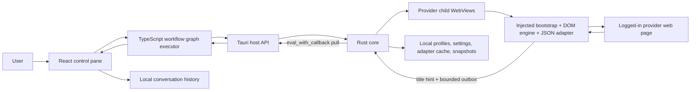
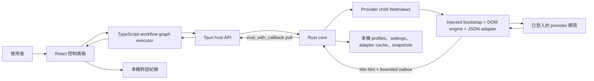

<a id="english"></a>

[← Public GitHub portfolio](./README.md) · [Ted's profile](../README.md) · **English** · [繁體中文](#traditional-chinese) · [GitHub repository](https://github.com/teddashh/multi-ai-chat-desktop) · [Latest published release: v0.6.0](https://github.com/teddashh/multi-ai-chat-desktop/releases/tag/v0.6.0)

# Multi-AI Chat Desktop

## Positioning and project snapshot

Multi-AI Chat Desktop is a local desktop workflow hub for people who already use ChatGPT, Claude, Gemini, and Grok on the web. It does not put four generic chat boxes beside one another and it does not ask for model API keys. Instead, one React control pane coordinates the real provider pages in native Tauri child WebViews, passes one answer into the next step when a workflow requires it, and gathers the result into a readable conversation.

This page was verified against the public repository on **July 11, 2026**, with default branch `main` at [`458e0f5`](https://github.com/teddashh/multi-ai-chat-desktop/commit/458e0f5e97319d1cc60104cc270b6b7aa96557ef).

| Snapshot | Current repository evidence |
|---|---|
| Product form | Tauri 2 desktop application for Windows, macOS, and Linux |
| Provider set | ChatGPT, Claude, Gemini, and Grok; the set is fixed in code |
| Identity and billing | The user's existing logged-in web sessions; no model API key |
| Core stack | React 18, TypeScript, Zustand, Vite, Tailwind CSS, Rust, Tauri 2 |
| Built-in workflows | Free, Debate, Consult, Coding, and Roundtable |
| Local history | Up to 30 recent conversation transcripts |
| Published version | v0.6.0 is the latest public GitHub Release described by the README |
| Source status | The current `main` commit is tagged `v0.7.0`; its GitHub Release is still a draft, so it is source state rather than the latest public release |
| Verification at current source | TypeScript typecheck, ESLint, adapter contract checks, 40 Vitest files / 320 passing tests; the Rust source contains 41 test cases, and CI plus the three-platform release build passed for the tagged commit |

The project is best understood as the full-featured sibling of the lighter [Multi-AI Chat Chrome extension](./multi-ai-chat.md): the extension controls tabs already open in Chrome, while the desktop edition owns its WebView layout, local provider profiles, snapshots, replay, checkpoints, and local-file workflow.

## The problem it addresses

Using several AI services normally creates work around the work. A person asks the same question repeatedly, changes tabs, copies long answers between providers, remembers which model is playing which role, and manually reconstructs the final conclusion. A multi-step review is especially fragile: one missed paste or stale answer can invalidate everything that follows.

API-based orchestration removes some of that friction but introduces a different barrier—developer credentials, separate billing, model/API availability, and another backend that can receive conversation data. Multi-AI Chat Desktop explores another route: coordinate the web products the user is already authorized to use, keep orchestration and history local, and make multi-model collaboration reproducible enough to inspect or replay.

## User experience and capabilities

A typical run looks like this:

1. Open each provider once and sign in inside its WebView.
2. Choose a built-in workflow, optionally adjust provider roles or Free-mode targets, and attach supported local text files when useful.
3. Ask one question in the control pane.
4. Watch the process trace as the graph sends prompts, waits for responses, and feeds earlier outputs into later steps.
5. Read the combined Markdown transcript, focus a provider's live page when direct inspection is useful, then continue the conversation or start a clean one.
6. Optionally export Markdown, preserve a privacy-tiered execution snapshot, or replay a prior run.

### Five workflows, not one fan-out button

| Mode | Execution shape | Useful when |
|---|---|---|
| Free | Selected ready providers answer in parallel | Comparing answers, brainstorming, or trying an image prompt quickly |
| Debate | Pro → Con → Judge → Synthesis | Stress-testing a claim or decision from opposed positions |
| Consult | Two independent answers in parallel → Review → Final answer | Research, second opinions, and finding agreement or gaps |
| Coding | Specification → spec review → v1 → code review → tests → v2 → acceptance → final | Structured software planning and adversarial review |
| Roundtable | Five rounds × four providers = 20 turns | Sustained argument, revision, and convergence on a difficult question |

The current source also includes:

- a conversation-first layout with one live provider focus area and a larger transcript/composer area;
- `chip`, `side`, and `center` WebView presentation states, with only one provider centered at a time;
- safe Markdown rendering, including headings, lists, links, quotations, and code blocks;
- completion handling for image-only ChatGPT responses instead of waiting forever for text;
- local conversation titles and reopening of the 30 most recent sessions;
- step timeout state with retry, skip, and cancel paths rather than an invisible indefinite wait;
- optional execution snapshots carrying graph version, app version, adapter versions, role map, step status, and human edits;
- four snapshot privacy tiers: metadata only, hashes, prompt text, and full local text;
- startup session checkpoints and replay support for interrupted or previous runs;
- text-file insertion for a documented set of source, markup, data, and log formats—up to eight files and an aggregate limit of 256 KiB / 120,000 characters;
- an in-memory, deduplicated diagnostic log capped at 2,000 meaningful events, plus an explicitly requested local debug-bundle export;
- English, Traditional Chinese, Japanese, and German UI strings;
- repository-scoped Codex and Claude Code Skills that inspect prerequisites and manage a local development launch.

## Architecture and data flow



The responsibilities are deliberately split:

- **React control pane:** owns the visible conversation, provider roles, preset catalog, process trace, checkpoints, replay controls, and the TypeScript workflow executor.
- **Workflow graph layer:** represents all five modes as versioned graphs. Free mode fans out; serial graphs resolve roles, build prompts from earlier node outputs, enforce preflight, and record step state.
- **Rust/Tauri core:** creates, moves, shows, hides, reloads, and closes child WebViews; assigns each provider an app-data directory; enforces navigation policy; persists settings and snapshots; and fetches adapters outside provider-page CSP restrictions.
- **Injected bootstrap and engine:** run inside each provider page. The engine finds the current composer and response DOM through the selected adapter, verifies that input landed, retries send activation, observes and polls for output, and emits chunks or completion events.
- **Bridge:** control-to-provider messages use Tauri `eval`. Provider-to-control data does not expose general remote Tauri IPC. A small encoded `document.title` change signals that data is ready; Rust then pulls a bounded outbox with `eval_with_callback` and acknowledges consumed message IDs.
- **Local persistence:** provider WebView data, settings, adapter cache, optional durable snapshots, and the minimum session checkpoint live under app data. Conversation transcripts use local browser storage in the control pane. Cookies and provider storage are not copied into snapshots.

## Key engineering and design choices

### 1. Web-session orchestration instead of an API facade

The product intentionally uses real provider pages. That keeps model credentials and separate model billing out of the app, and lets a user work with the web subscriptions they already have. It also means the provider, not this application, remains the destination for prompts.

### 2. Native child WebViews around one trusted control surface

The main window contains the local control pane plus child WebViews for external sites. Only the `main` control WebView receives Tauri capabilities; provider WebView labels receive no Tauri permissions. Provider navigation and pop-ups are allowlisted, while unrelated HTTP(S) destinations are blocked in the child view and opened externally.

### 3. Data-driven adapters with a last-known-good path

Provider-specific URLs, selectors, login/thinking detectors, input strategy, send strategy, and timing live in `adapters/*.json`. Contributors can repair a selector without rewriting Rust. The Rust layer validates provider identity and schema, applies only allowed version changes, limits a fetched file to 64 KiB, stores a local cache, and pushes the adapter into an already-open WebView.

The current implementation checks the repository's raw adapter files at startup and every six hours. That is useful for recovering from provider redesigns, but it is also real outbound network behavior even though the product has no telemetry or conversation backend.

### 4. A constrained bridge instead of remote-origin IPC

The design assumes that script injected into an AI site shares that site's security context and therefore must not inherit privileged desktop commands. Outbound `eval`, title hints, a bounded outbox, sequence/boot identifiers, acknowledgement, and pull retries provide a narrower transport. If the pull path degrades, the workflow surfaces failure rather than silently assigning a late response to the wrong step.

### 5. Reproducibility is opt-in and privacy-tiered

Every graph carries a version. A snapshot can record provider/adapter mapping and step lifecycle, but durable snapshot storage is off by default and defaults to metadata-only redaction when enabled. Higher tiers deliberately choose whether to retain hashes, prompts, or full local text. Cookies, provider profile files, and provider storage are outside the snapshot model.

### 6. Release builds and source launches are separate products

Git tags drive a three-platform GitHub Actions build. The workflow injects a release version into source manifests, produces NSIS, DMG, AppImage, and Windows portable artifacts, and creates a draft release for human review. The repository itself keeps `0.0.0` development versions. Separately, the repo Skills can diagnose and start `tauri dev`, but they will not install missing system toolchains or build an installer without an explicit developer action.

## Quick start

### Install a published build

Use the [latest GitHub Release](https://github.com/teddashh/multi-ai-chat-desktop/releases/latest):

- **Windows x64:** choose the portable ZIP or `x64-setup.exe`. WebView2 is normally present on Windows 10/11; the installer is configured to download its bootstrapper when needed.
- **macOS Apple Silicon:** use the `aarch64.dmg`. There is currently no published Intel build.
- **Linux x64:** download the AppImage, run `chmod +x Multi-AI*.AppImage`, and open it. Ubuntu 22.04 / Debian 12 or newer is the documented baseline.

After launch, open each provider and complete its own login once. The application never asks you to type a provider password into the control pane.

### Run from source

Common prerequisites are Node.js 20+, pnpm (or Corepack), stable Rust, and the platform packages required by Tauri 2.

```sh
git clone https://github.com/teddashh/multi-ai-chat-desktop.git
cd multi-ai-chat-desktop
corepack enable
pnpm install --frozen-lockfile
pnpm build:injected
pnpm verify
pnpm tauri dev
```

The repository also exposes lifecycle helpers used by its local Skills:

```sh
node scripts/agent/doctor.mjs
node scripts/agent/launch.mjs
node scripts/agent/status.mjs --lines 80
node scripts/agent/stop.mjs
```

The first Rust compilation can take several minutes and must run in a graphical local session if you expect to see the application window.

## Current scope, risks, and license

- **Web automation is inherently fragile.** A ChatGPT, Claude, Gemini, or Grok DOM change can invalidate selectors or completion detection until an adapter is repaired. The app has update, diagnostics, retry, timeout, and broken-adapter reporting paths, but it cannot make a third-party page stable.
- **Terms and account eligibility still apply.** Automated interaction may be restricted by each provider's terms. Users must only operate accounts and content they are authorized to use.
- **Embedded login is not equivalent to a normal browser.** Project architecture notes identify Google/Gemini OAuth as the highest-risk login path because Google may block embedded browsers. Other providers and Cloudflare challenges may also change behavior.
- **The provider set is not plug-and-play.** Adapters can update an existing provider, but adding a fifth provider requires type, UI, profile, and workflow changes.
- **Packaging is still young.** Windows and macOS artifacts are unsigned; SmartScreen or Gatekeeper may require confirmation. Windows portable builds update manually, and the current Tauri config does not generate updater artifacts. Only Apple Silicon macOS packages are published.
- **Release/source distinction matters.** v0.6.0 is the latest published release; `main` is already tagged v0.7.0 while that release remains a draft. The README therefore describes the latest public release rather than every source-only change.
- **Local-first does not mean network-free.** Prompts go to selected provider sites, and the app checks GitHub-hosted adapter JSON at startup and periodically. There is no project conversation server, account system, analytics, or model API credential.
- **License:** the repository includes a complete MIT License with Ted Huang's 2026 copyright notice and attribution for MIT-licensed reference work. This project is formally open source under that file; the software is provided without warranty.

## Source and documentation

- [Repository](https://github.com/teddashh/multi-ai-chat-desktop)
- [English README](https://github.com/teddashh/multi-ai-chat-desktop/blob/main/README.md) · [Traditional Chinese README](https://github.com/teddashh/multi-ai-chat-desktop/blob/main/README.zh-TW.md)
- [Architecture decision record](https://github.com/teddashh/multi-ai-chat-desktop/blob/main/docs/ARCHITECTURE.md)
- [Product and protocol specification](https://github.com/teddashh/multi-ai-chat-desktop/blob/main/docs/SPEC.md)
- [Implementation plan](https://github.com/teddashh/multi-ai-chat-desktop/blob/main/docs/PLAN.md)
- [Release guide](https://github.com/teddashh/multi-ai-chat-desktop/blob/main/docs/RELEASE.md)
- [Adapter contribution guide](https://github.com/teddashh/multi-ai-chat-desktop/blob/main/CONTRIBUTING.md)
- [Published releases](https://github.com/teddashh/multi-ai-chat-desktop/releases) · [Current CI](https://github.com/teddashh/multi-ai-chat-desktop/actions)

---

[← Previous: Public GitHub portfolio](./README.md) · [Next: Multi-AI Chat →](./multi-ai-chat.md)

---

<a id="traditional-chinese"></a>

[← GitHub 公開作品集](./README.md#traditional-chinese) · [Ted 的個人頁](../README.zh-TW.md) · [English](#english) · **繁體中文** · [GitHub Repository](https://github.com/teddashh/multi-ai-chat-desktop) · [最新正式版：v0.6.0](https://github.com/teddashh/multi-ai-chat-desktop/releases/tag/v0.6.0)

# Multi-AI Chat Desktop

## 作品定位與現況快照

Multi-AI Chat Desktop 是一個本機桌面多 AI 工作流中樞，服務已經在網頁上使用 ChatGPT、Claude、Gemini、Grok 的人。它不是把四個通用聊天框並排，也不要求模型 API key；它以一個 React 控制面板協調 Tauri 原生 child WebView 裡的真實 provider 頁面，需要串接時會把前一步回答送進下一步，最後再收回成為可閱讀的對話。

本頁於 **2026 年 7 月 11 日**依公開 repository 核對；default branch `main` 當時位於 [`458e0f5`](https://github.com/teddashh/multi-ai-chat-desktop/commit/458e0f5e97319d1cc60104cc270b6b7aa96557ef)。

| 快照 | 目前 repository 的實際狀態 |
|---|---|
| 產品形式 | Windows、macOS、Linux 的 Tauri 2 桌面應用 |
| Provider | ChatGPT、Claude、Gemini、Grok；集合固定在程式碼中 |
| 身分與計費 | 使用者既有的登入網頁 session；不需模型 API key |
| 核心技術 | React 18、TypeScript、Zustand、Vite、Tailwind CSS、Rust、Tauri 2 |
| 內建工作流 | 自由分送、四方辯證、多方諮詢、Coding、道理辯證 |
| 本機紀錄 | 最多 30 個近期對話 transcript |
| 最新正式版 | README 所指向、目前公開發布的版本是 v0.6.0 |
| 原始碼狀態 | 現在 `main` 的 commit 已標上 `v0.7.0` tag，但 GitHub Release 仍是 draft，因此它是目前原始碼狀態，不是最新公開正式版 |
| 當前驗證 | TypeScript typecheck、ESLint、adapter 契約檢查、40 個 Vitest 檔／320 個通過案例；Rust 原始碼含 41 個測試案例，同一 tagged commit 的 CI 與三平台 release build 皆成功 |

它也可以視為輕量版 [Multi-AI Chat Chrome 外掛](./multi-ai-chat.md#traditional-chinese)的完整桌面兄弟：外掛控制已開啟的 Chrome 分頁；Desktop 則自行管理 WebView 版面、本機 provider profile、snapshot、replay、checkpoint 與本機檔案流程。

## 它要解決的問題

同時使用多家 AI 時，真正耗時的常常是 AI 之外的搬運工作：重複問同一題、切換分頁、複製長篇回答、記住每家扮演的角色，再手動拼出結論。多步審查尤其脆弱；只要貼錯一次內容，後面所有步驟都可能建立在錯誤上下文上。

API 編排可以移除部分摩擦，但會帶來開發者 credential、獨立計費、模型/API 可用性，以及另一個可能接收對話資料的後端。Multi-AI Chat Desktop 探索的是另一條路：協調使用者已獲授權使用的網頁產品，把編排與紀錄留在本機，並讓多模型合作至少能被檢查、保存與重播。

## 使用體驗與能力

一次典型操作如下：

1. 逐家開啟 provider，並在它自己的 WebView 裡登入一次。
2. 選工作流；需要時調整角色或自由模式目標，也可以附加支援的本機文字檔。
3. 在控制面板輸入一個問題。
4. 從 process trace 觀看 graph 如何送 prompt、等待回答，並把前面輸出帶入後續節點。
5. 閱讀整合後的 Markdown transcript；想直接核對時可聚焦真實 provider 頁面，結束後可繼續追問或開新對話。
6. 視需要匯出 Markdown、保留具隱私分級的 execution snapshot，或 replay 過去執行。

### 不只 fan-out：五種工作流

| 模式 | 執行形狀 | 適合情境 |
|---|---|---|
| 自由分送 | 所選且 ready 的 provider 平行回答 | 快速比較、腦力激盪、圖片 prompt |
| 四方辯證 | 正方 → 反方 → 判官 → 綜合 | 壓力測試一項決策或論點 |
| 多方諮詢 | 兩份獨立回答平行產生 → 審查 → 最終答案 | 研究、第二意見、找共識與遺漏 |
| Coding | 規格 → 規格審查 → v1 → code review → 測試 → v2 → 驗收 → 最終版 | 結構化軟體規劃與攻防式 review |
| 道理辯證 | 5 輪 × 4 家 = 20 次發言 | 對困難問題持續攻防、修正與收斂 |

目前原始碼還包含：

- 以對話為主的版面：一個真實 provider 聚焦區，加上更大的 transcript／輸入區；
- `chip`、`side`、`center` 三種 WebView 呈現狀態，且同時只允許一個 provider 位於 center；
- 安全 Markdown 顯示，支援標題、清單、連結、引用與 code block；
- ChatGPT 只有圖片而沒有文字時的完成判斷，不會為了等文字永久卡住；
- 以第一則問題產生本機對話標題，並重開最近 30 個 session；
- step timeout 狀態，以及 retry、skip、cancel 路徑，而不是無提示地無限等待；
- 可選 execution snapshot，紀錄 graph/app 版本、adapter 版本、角色對應、step 狀態與 human edit；
- 四種 snapshot 隱私層級：只留 metadata、hash、保留 prompt 文字、完整本機文字；
- 啟動時的 session checkpoint，以及中斷／過去執行的 replay 支援；
- 一組明確列出的原始碼、markup、資料與 log 文字格式，可附最多 8 檔，合計上限 256 KiB／120,000 字元；
- 最多 2,000 筆有意義事件的記憶體內去重診斷 log，並只在使用者明確要求時匯出本機 debug bundle；
- English、繁體中文、日本語、Deutsch 四種 UI；
- repo 內建 Codex 與 Claude Code Skills，可檢查前置環境並管理本機開發版啟停。

## 架構與資料流



職責刻意被分成幾層：

- **React 控制面板：** 管理可見對話、provider 角色、preset catalog、process trace、checkpoint、replay 控制與 TypeScript workflow executor。
- **Workflow graph：** 五種模式都用有版本的 graph 表達。自由模式 fan-out；串行 graph 會解析角色、以先前 node output 建 prompt、執行 preflight 並記錄 step 狀態。
- **Rust／Tauri core：** 建立、移動、顯示、隱藏、重載與關閉 child WebView；為 provider 指定 app-data 目錄；執行 navigation policy；保存 settings／snapshots；並在 provider CSP 之外抓 adapter。
- **Injected bootstrap 與 engine：** 在各 provider 頁面中執行。Engine 依 adapter 找目前 composer 與回答 DOM，確認文字真的進入輸入框、重試送出、監看並輪詢輸出，再送出 chunk／完成事件。
- **Bridge：** control → provider 使用 Tauri `eval`；provider → control 不開放通用 remote Tauri IPC。編碼後的 `document.title` 小訊號先提示資料已到，Rust 再以 `eval_with_callback` 拉取 bounded outbox，並 ack 已消費的 message ID。
- **本機持久化：** provider WebView data、settings、adapter cache、可選 durable snapshot 與最低限度 session checkpoint 存在 app data；控制面板 conversation transcript 使用本機 browser storage；snapshot 不會複製 cookie 或 provider storage。

## 關鍵工程與設計選擇

### 1. 以 Web session 編排，而不是包一層模型 API

產品刻意操作真實 provider 頁面，讓 app 不必持有模型 credential，也不另外建立模型帳單；使用者可沿用現有網頁訂閱。Prompt 的實際目的地仍是使用者選擇的 provider，而不是本專案的聊天後端。

### 2. 一個可信控制面板，加上原生 child WebView

主視窗包含本機 control pane 與外部網站 child WebView。只有 `main` control WebView 取得 Tauri capability；provider WebView label 得到零 Tauri 權限。Provider navigation／popup 依 allowlist 判斷；無關的 HTTP(S) 目的地不會在 child view 裡繼續，而會改到外部瀏覽器。

### 3. Data-driven adapter 與 last-known-good 路徑

Provider URL、selector、登入／thinking detector、輸入策略、送出策略與 timing 都放在 `adapters/*.json`。貢獻者可以只修 selector，不必改 Rust。Rust 會驗證 schema 與 provider identity，只套用允許的版本變化，把遠端檔案限制在 64 KiB，保存本機 cache，再把 adapter push 到已開啟 WebView。

目前實作會在啟動時及每六小時檢查 repo raw adapter。它能更快修復 provider 改版，但也代表即使沒有 telemetry 或對話 backend，app 仍存在這項真實的對外網路行為。

### 4. 受限 bridge，而不是把 remote origin 接上 IPC

設計假設注入 AI 網站的 script 與該網站共處同一安全 context，因此不應繼承桌面特權 command。Outbound `eval`、title hint、bounded outbox、sequence／boot ID、ack 與 pull retry 組成更窄的 transport。Pull path 退化時，workflow 應顯示失敗，而不是把晚到答案誤配給下一步。

### 5. Reproducibility 採 opt-in 與隱私分級

每個 graph 都有 version。Snapshot 可以記錄 provider／adapter mapping 與 step lifecycle，但 durable snapshot 預設關閉；開啟時預設仍是 metadata-only。更高層級明確選擇保留 hash、prompt 或完整本機文字。Cookie、provider profile 檔與 provider storage 不屬於 snapshot model。

### 6. 正式套件與原始碼啟動是兩條不同產品路徑

Git tag 驅動三平台 GitHub Actions build；workflow 將版本注入 manifest，產生 NSIS、DMG、AppImage、Windows portable，並先建立 draft release 供人類檢查。Repo 本身維持 `0.0.0` 開發版。另一邊，repo Skills 能診斷並啟動 `tauri dev`，但不會在未明確授權時安裝系統 toolchain 或建立 installer。

## 快速開始

### 安裝正式版

從 [最新 GitHub Release](https://github.com/teddashh/multi-ai-chat-desktop/releases/latest) 下載：

- **Windows x64：** portable ZIP 或 `x64-setup.exe`。Windows 10/11 通常已有 WebView2；installer 可在缺少時下載 bootstrapper。
- **macOS Apple Silicon：** 使用 `aarch64.dmg`；目前沒有公開 Intel build。
- **Linux x64：** 下載 AppImage，執行 `chmod +x Multi-AI*.AppImage` 後開啟。文件建議 Ubuntu 22.04／Debian 12 或更新版本。

啟動後逐家開啟 provider 並完成它自己的登入。App 不會要求使用者把 provider 密碼輸入 control pane。

### 從原始碼執行

共同前置需求是 Node.js 20+、pnpm（或 Corepack）、stable Rust，以及 Tauri 2 對各平台要求的系統套件。

```sh
git clone https://github.com/teddashh/multi-ai-chat-desktop.git
cd multi-ai-chat-desktop
corepack enable
pnpm install --frozen-lockfile
pnpm build:injected
pnpm verify
pnpm tauri dev
```

Repo Skills 使用的 lifecycle helper 也可以直接執行：

```sh
node scripts/agent/doctor.mjs
node scripts/agent/launch.mjs
node scripts/agent/status.mjs --lines 80
node scripts/agent/stop.mjs
```

第一次 Rust compile 可能花數分鐘；若要真的看到 app 視窗，必須從本機圖形登入 session 執行。

## 目前範圍、風險與授權

- **網頁自動化本質上很脆弱。** ChatGPT、Claude、Gemini、Grok 只要改 DOM，selector 或完成判斷就可能失效，直到 adapter 修好。App 有 update、diagnostics、retry、timeout 與 broken-adapter report，但不能把第三方頁面變成穩定 API。
- **仍受各服務條款與帳號資格約束。** 自動化操作可能受到 provider terms 限制；只能使用自己有權操作的帳號與內容。
- **Embedded login 不等於一般瀏覽器。** 架構文件把 Google／Gemini OAuth 列為最高風險登入路徑，因 Google 可能阻擋 embedded browser；其他 provider 與 Cloudflare challenge 也可能隨時改變。
- **Provider 不是任意 plug-in。** Adapter 可更新既有 provider；加入第五家仍要改 type、UI、profile 與 workflow。
- **打包仍在早期階段。** Windows／macOS 套件未簽章，可能遇到 SmartScreen／Gatekeeper；Windows portable 手動更新，目前 Tauri config 不產生 updater artifact；macOS 只發布 Apple Silicon。
- **正式版與 source 要分開看。** v0.6.0 是最新公開 release；`main` 已 tag v0.7.0，但 release 還是 draft。README 因此描述的是最新正式版，不一定涵蓋所有 source-only 變化。
- **Local-first 不代表完全離線。** Prompt 送到所選 provider，app 也會在啟動及固定週期檢查 GitHub adapter JSON；但沒有本專案對話 server、帳號系統、analytics 或模型 API credential。
- **授權：** repo 含完整 MIT License、Ted Huang 2026 copyright notice，以及對 MIT reference work 的 attribution。本作品依法有明確的開源授權；軟體仍依授權條款不附保固。

## 原始碼與文件

- [Repository](https://github.com/teddashh/multi-ai-chat-desktop)
- [英文 README](https://github.com/teddashh/multi-ai-chat-desktop/blob/main/README.md) · [繁中 README](https://github.com/teddashh/multi-ai-chat-desktop/blob/main/README.zh-TW.md)
- [架構決策紀錄](https://github.com/teddashh/multi-ai-chat-desktop/blob/main/docs/ARCHITECTURE.md)
- [產品與協定規格](https://github.com/teddashh/multi-ai-chat-desktop/blob/main/docs/SPEC.md)
- [實作計畫](https://github.com/teddashh/multi-ai-chat-desktop/blob/main/docs/PLAN.md)
- [發布指南](https://github.com/teddashh/multi-ai-chat-desktop/blob/main/docs/RELEASE.md)
- [Adapter 貢獻指南](https://github.com/teddashh/multi-ai-chat-desktop/blob/main/CONTRIBUTING.md)
- [正式 Releases](https://github.com/teddashh/multi-ai-chat-desktop/releases) · [目前 CI](https://github.com/teddashh/multi-ai-chat-desktop/actions)

---

[← 上一頁：GitHub 公開作品集](./README.md#traditional-chinese) · [下一頁：Multi-AI Chat →](./multi-ai-chat.md#traditional-chinese)
