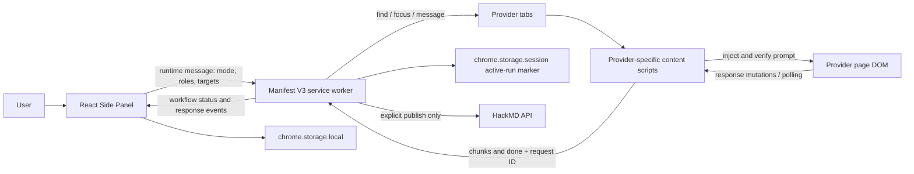
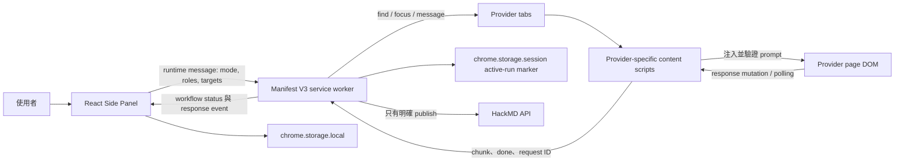

<a id="english"></a>

[← Public GitHub portfolio](./README.md) · [Ted's profile](../README.md) · **English** · [繁體中文](#traditional-chinese) · [GitHub repository](https://github.com/teddashh/multi-ai-chat) · [Latest release: v0.2.1](https://github.com/teddashh/multi-ai-chat/releases/tag/v0.2.1)

# Multi-AI Chat

## Positioning and project snapshot

Multi-AI Chat is a lightweight Chrome Side Panel extension that turns already-open, already-authenticated ChatGPT, Claude, Gemini, and Grok tabs into one coordinated workflow. It keeps the provider's own page as the model interface, uses a Manifest V3 service worker as the orchestrator, and displays the combined conversation in a compact React panel.

This page was re-verified against the public repository on **September 8, 2026**, with default branch `master` at [`8f601ae`](https://github.com/teddashh/multi-ai-chat/commit/8f601aea89e01b681a9c855c989cd623bde3d039). GitHub showed **13 stars** and **5 forks** at this snapshot. Source and the first published GitHub Release are both v0.2.1.

| Snapshot | Current repository evidence |
|---|---|
| Product form | Chrome 114+ Manifest V3 Side Panel extension |
| Current source version | v0.2.1 in `package.json` and the extension manifest; the same version is published as the first GitHub Release |
| Provider set | ChatGPT, Claude, Gemini, and Grok |
| Identity | Existing logged-in provider tabs; no model API keys and no Multi-AI Chat backend |
| Core stack | React 18, TypeScript, Webpack 5, Tailwind CSS, Chrome Extension APIs |
| Workflow modes | Free, Debate, Consult, Coding, and Roundtable |
| Local history | Up to 30 conversations, bounded to approximately 7.5 MB before older data is trimmed |
| Languages | English, Traditional Chinese, Japanese, German, and Korean |
| Distribution status | The built `dist/` folder remains committed; v0.2.1 also publishes a checksum-paired Chrome package with `manifest.json` at its root for extraction and Load unpacked or manual Web Store submission |
| Verification scope | `npm run verify` runs typechecking, 42 Node tests, a production Webpack build, and version consistency; CI adds a high-severity dependency audit and committed-`dist/` check, while CodeQL reported zero open alerts at the snapshot |

This edition is for someone who wants a small control surface inside Chrome and is comfortable keeping the provider tabs open. The [desktop edition](./multi-ai-chat-desktop.md) is the better fit when isolated app profiles, native provider panes, execution snapshots, replay, checkpoints, and local-file workflows matter.

### What changed in v0.2.1

- **Roundtable failures became recoverable.** A failed provider turn pauses and offers **Retry**, **Skip this turn**, or **Cancel**. Retry creates a fresh provider request ID. Skip inserts the fixed safe placeholder `(no response — skipped)` into the remaining Roundtable context instead of relaying raw provider error text. Cancel ends the workflow through its normal cancellation path.
- **Recovery actions are scoped to their exact owner.** A decision must match the recovery, workflow, session, panel client, provider, and failed request IDs. When the Side Panel reloads, ownership can be rebound with a rotated recovery ID; stale or late actions from an earlier panel or another window are rejected. Waiting for a decision is bounded to four minutes.
- **Provider URLs are parsed rather than substring-matched.** Only HTTPS URLs on the exact supported hostnames are accepted. Lookalike domains, non-HTTPS schemes, user-info tricks, and provider-looking text in a query string no longer identify a provider tab.
- **The project gained a release and verification pipeline.** The first GitHub Release includes a store-ready ZIP and SHA-256 file. CI pins Node.js 22.18.0 and GitHub Actions, runs `npm audit`, 42 tests, typechecking, the production build, version checks, and a committed-build freshness check. CodeQL and dependency alerts were at zero when the release was published.

## The problem it addresses

Comparing several AI systems is easy once; conducting a disciplined multi-step review across them is not. The user has to discover the right tabs, verify that every account is logged in, paste outputs into the next provider, keep responses attached to the right request, and recover when Chrome reloads a tab or suspends an extension worker.

Multi-AI Chat moves that coordination into the Side Panel while preserving the original web products. It aims to make a four-provider debate or code review feel like one operation, without introducing a server that proxies prompts or requiring the user to obtain four API credentials.

## User experience and capabilities

The interaction stays close to normal browser use:

1. Load the extension, pin it, and open the Side Panel.
2. Open each desired provider in a normal tab and log in. A provider is shown as ready only after its content script finds a usable composer.
3. Pick a workflow. Free mode can target any selected ready providers; serial modes let the user assign providers to roles.
4. Enter one question and follow the compact status trace. Streaming response text appears in a safe Markdown transcript.
5. If a Roundtable provider fails, choose Retry, Skip this turn, or Cancel; otherwise stop at any time, continue the resulting conversation, begin a clean chat, export Markdown, or explicitly publish a guest-readable HackMD note.

### Built-in workflow shapes

| Mode | Execution |
|---|---|
| Free | Send to the selected ready providers in parallel |
| Debate | Pro → Con → Judge → Synthesis |
| Consult | Two independent answers in parallel → Review → Final answer |
| Coding | Eight steps: specification, review, implementation, code review, test analysis, revision, acceptance, final code |
| Roundtable | Five rounds with four sequential speakers, for 20 total turns; a failed turn pauses for Retry, Skip, or Cancel |

Other behavior visible in the current source includes:

- provider connection cards that open/focus missing tabs and distinguish checking, ready, disconnected, and login-required states;
- request IDs and workflow/session/client IDs so a late result cannot silently complete a different run or conversation;
- a bounded Roundtable recovery coordinator that requires an exact recovery identity, rotates ownership after a panel reload, uses a fresh request ID on retry, and prevents skipped provider errors from entering later prompts;
- automatic rediscovery of provider tabs after service-worker startup and reinjection of packaged content scripts when a tab predates an extension reload;
- verified rich-editor input, scoped send-button lookup, Enter fallback, retry, and a final check that the draft actually left the composer;
- `MutationObserver` response watching plus backup polling, debounced chunks, thinking detection, image-only completion text, and structured DOM-to-Markdown serialization;
- true cancellation: active waiters are rejected and each active provider receives a request to press its stop-generation control;
- a ten-minute per-provider response timeout for stalled work;
- up to 30 locally stored conversations, titles derived from the first user prompt, and restoration of saved provider URLs when reopening a conversation;
- continuation context built from at most the latest 16 replayable transcript messages, 2,500 characters per message, and 12,000 characters overall when a saved conversation is resumed;
- a semantic Markdown transcript with safe links, fenced code, nested lists, blockquotes, horizontally scrollable tables, and auto-scroll that respects someone reading older content;
- local Markdown export and optional HackMD publishing;
- a compact role/status trace and five UI languages.

## Architecture and data flow


```mermaid
flowchart LR
    U[User] --> P[React Side Panel]
    P -->|runtime message: mode, roles, targets| S[Manifest V3 service worker]
    S -->|find / focus / message| T[Provider tabs]
    T --> C[Provider-specific content scripts]
    C -->|inject and verify prompt| D[Provider page DOM]
    D -->|response mutations / polling| C
    C -->|chunks and done + request ID| S
    S -->|workflow status and response events| P
    P --> L[chrome.storage.local]
    S --> Q[chrome.storage.session active-run marker]
    S -->|explicit publish only| H[HackMD API]
```

The extension has four main layers:

- **React Side Panel:** owns mode selection, role configuration, targets, transcript rendering, conversation drawer, export/publish actions, localization, and the current UI-side workflow identity.
- **Manifest V3 service worker:** discovers tabs, maintains connection state, chooses parallel or serial workflow steps, builds prompts from prior outputs, registers response waiters, applies a ten-minute timeout, and routes status to the active panel/session.
- **Shared content engine:** provides retryable selector lookup, input injection and verification, send activation, response baselining, streaming observation, semantic response serialization, completion detection, and cancellation.
- **Provider adapters in TypeScript:** define each site's selectors, login detector, thinking detector, stop controls, and any editor-specific insertion behavior.

Data is deliberately split by lifetime. Conversations, settings, free-mode targets, language, and an optional HackMD token live in `chrome.storage.local`. A small active-workflow marker lives in `chrome.storage.session` so a restarted worker can tell the panel that a run was interrupted; it does not reconstruct and resume the middle of that workflow.

## Key engineering and design choices

### 1. Reuse trusted browser sessions

The extension never asks for provider API credentials. Prompts travel from the service worker to a content script in the selected provider tab, then into that provider's own composer. There is no Multi-AI Chat conversation server or telemetry endpoint in the manifest or source.

### 2. Treat “tab exists” and “ready to send” as different states

Finding a matching URL is not enough. A content script reports login readiness based on the current composer, and the Side Panel only marks that provider ready after confirmation. If a service worker restarts, the extension re-queries all tabs and asks each content script for fresh status.

### 3. Verify DOM automation instead of trusting a click

The shared engine retries input lookup, inserts text using provider-appropriate editor behavior, checks that normalized editor text matches the requested prompt, scopes the send button to the composer when possible, and falls back to Enter. If the draft remains after retry and verification, it returns an explicit error rather than waiting forever for a response that never started.

### 4. Preserve useful response structure without trusting provider markup

The content layer does not inject provider HTML into the extension UI. It walks the response DOM, drops hidden and interactive elements, permits only safe HTTP(S) links, and serializes supported structure into Markdown. The React panel then renders that smaller format itself, including fenced code and scrollable tables. This preserves readability while keeping remote page markup outside the trusted extension surface.

### 5. Isolate requests, recovery, and cancellation

Every provider call gets a unique request ID tied to the workflow. Response waiters accept completion only from the expected provider and ID. Navigating, reloading, or closing a provider tab rejects its waiters. Stop both rejects pending promises and sends `STOP_GENERATION` to active tabs.

v0.2.1 applies the same identity discipline to a failed Roundtable step. A retry uses a fresh request ID, while a recovery choice is accepted only when every ownership field still matches. A reloaded Side Panel can take over the still-pending decision through a rotated recovery ID; the previous panel's action no longer has authority. Skip contributes one known placeholder to later Roundtable turns, not the provider's raw exception text.

### 6. Keep sensitive extension storage away from page scripts

At worker startup, `chrome.storage.local` is limited to trusted extension contexts. Provider content scripts therefore cannot read the stored HackMD token. The extension still requests the permissions it needs—`sidePanel`, `tabs`, `storage`, `scripting`, four provider host patterns, and the HackMD API—and those permissions should be reviewed before installation.

### 7. Make sharing explicit

Markdown download stays local. HackMD publishing happens only after the user invokes it and supplies a token. The created note uses `guest` read permission, owner-only write permission, and disabled comments; the Settings UI warns that the resulting published note is readable by guests.

## Quick start

The easiest package is the checksum-paired [`multi-ai-chat-store-v0.2.1.zip`](https://github.com/teddashh/multi-ai-chat/releases/download/v0.2.1/multi-ai-chat-store-v0.2.1.zip) from the [v0.2.1 release](https://github.com/teddashh/multi-ai-chat/releases/tag/v0.2.1). Extract it, then select that directory with Chrome's **Load unpacked** action; `manifest.json` is at the archive root.

To verify and build from source, requirements are Chrome 114+, Node.js 22.18+, and npm:

```sh
git clone https://github.com/teddashh/multi-ai-chat.git
cd multi-ai-chat
npm ci
npm run verify
```

Then install the generated extension:

1. Open `chrome://extensions`.
2. Enable **Developer mode**.
3. Choose **Load unpacked** and select the repository's `dist/` directory.
4. Pin **Multi-AI Chat** and click its icon to open the Side Panel.
5. Open and log in to each provider you want to use; wait for its card to report ready.

During development, run `npm run dev`, reload the unpacked extension at `chrome://extensions`, and reopen the Side Panel after changes.

## Current scope, risks, and license

- **Web automation is fragile by nature.** The extension depends on third-party DOM selectors, editor behavior, and thinking/completion controls. A provider redesign can break sending or collection until its TypeScript adapter is updated.
- **Automated use can be policy-sensitive.** Each provider's terms, account limits, and content rules still apply. The project does not grant permission to automate an account.
- **Serial workflows depend on browser lifetime.** The README instructs users to keep the Side Panel open. Chrome can suspend a Manifest V3 worker; the code detects an interrupted run and asks the user to rerun it, but does not resume midway through a serial graph.
- **A stalled step can still be long.** A provider response can wait up to 600 seconds. Roundtable failures now expose Retry, Skip, and Cancel, with a four-minute decision window; Debate, Consult, and Coding do not gain a general checkpoint/resume system from this change.
- **History is bounded and local.** Only 30 conversations are retained. When serialized history exceeds about 7.5 MB, older conversations are dropped; if one conversation alone is too large, its oldest messages are removed while at least two remain.
- **Release automation is not live-provider proof.** v0.2.1 has a GitHub Release, CI, 42 tests, CodeQL, dependency auditing, version checks, and a reproducible committed bundle. Those checks do not sign into or exercise the current ChatGPT, Claude, Gemini, and Grok production pages. The repository documents assets for Web Store submission but does not establish that a public store listing or hosted demo is live.
- **The desktop-only features are intentionally absent.** This repository does not provide isolated Tauri profiles, native focused WebViews, durable execution snapshots, replay records, checkpoints, or local-file insertion.
- **License:** v0.2.1 adds a root MIT `LICENSE`, and `package.json` now declares MIT. The license grants reuse rights subject to its notice and warranty terms; third-party services, provider accounts, and provider page content retain their own terms.

## Source and documentation

- [Repository](https://github.com/teddashh/multi-ai-chat)
- [English README](https://github.com/teddashh/multi-ai-chat/blob/master/README.md) · [Traditional Chinese README](https://github.com/teddashh/multi-ai-chat/blob/master/README.zh-TW.md)
- [Manifest V3 configuration](https://github.com/teddashh/multi-ai-chat/blob/master/public/manifest.json)
- [Workflow service worker](https://github.com/teddashh/multi-ai-chat/blob/master/src/background/service-worker.ts)
- [Shared DOM automation engine](https://github.com/teddashh/multi-ai-chat/blob/master/src/content/base.ts)
- [Semantic response serializer](https://github.com/teddashh/multi-ai-chat/blob/master/src/content/responseSerializer.ts)
- [Conversation continuity policy](https://github.com/teddashh/multi-ai-chat/blob/master/src/shared/conversationContinuity.ts)
- [React Side Panel](https://github.com/teddashh/multi-ai-chat/tree/master/src/sidepanel)
- [Repository screenshot](https://github.com/teddashh/multi-ai-chat/blob/master/screenshot.png)
- [Roundtable recovery coordinator](https://github.com/teddashh/multi-ai-chat/blob/master/src/background/roundtableRecovery.ts) · [exact provider URL parser](https://github.com/teddashh/multi-ai-chat/blob/master/src/shared/providerUrl.ts)
- [CI workflow](https://github.com/teddashh/multi-ai-chat/blob/master/.github/workflows/ci.yml) · [MIT License](https://github.com/teddashh/multi-ai-chat/blob/master/LICENSE)
- [v0.2.1 release](https://github.com/teddashh/multi-ai-chat/releases/tag/v0.2.1) · [store submission notes](https://github.com/teddashh/multi-ai-chat/blob/master/store/SUBMISSION.md) · [privacy disclosure](https://github.com/teddashh/multi-ai-chat/blob/master/store/PRIVACY.md)
- [Desktop edition](https://github.com/teddashh/multi-ai-chat-desktop)

---

[← Previous: Multi-AI Terminal](./multi-ai-terminal.md) · [Next: AI Brainstorming →](./ai-brainstorming.md)

---

<a id="traditional-chinese"></a>

[← GitHub 公開作品集](./README.md#traditional-chinese) · [Ted 的個人頁](../README.zh-TW.md) · [English](#english) · **繁體中文** · [GitHub Repository](https://github.com/teddashh/multi-ai-chat) · [最新版本：v0.2.1](https://github.com/teddashh/multi-ai-chat/releases/tag/v0.2.1)

# Multi-AI Chat

## 作品定位與現況快照

Multi-AI Chat 是一個輕量 Chrome Side Panel 外掛，把已開啟、已登入的 ChatGPT、Claude、Gemini、Grok 分頁變成同一套工作流。Provider 自己的頁面仍是模型介面；Manifest V3 service worker 負責編排，React Side Panel 則顯示整合後的對話。

本頁於 **2026 年 9 月 8 日**重新核對公開 repository；default branch `master` 位於 [`8f601ae`](https://github.com/teddashh/multi-ai-chat/commit/8f601aea89e01b681a9c855c989cd623bde3d039)。這次快照中 GitHub 顯示 **13 stars**、**5 forks**；source 與第一個正式發布的 GitHub Release 都是 v0.2.1。

| 快照 | 目前 repository 的實際狀態 |
|---|---|
| 產品形式 | Chrome 114+ 的 Manifest V3 Side Panel extension |
| 目前原始碼版本 | `package.json` 與 extension manifest 都是 v0.2.1；第一個 GitHub Release 也發布相同版本 |
| Provider | ChatGPT、Claude、Gemini、Grok |
| 身分 | 沿用已登入的 provider 分頁；不需模型 API key，也沒有 Multi-AI Chat backend |
| 核心技術 | React 18、TypeScript、Webpack 5、Tailwind CSS、Chrome Extension APIs |
| 工作流 | 自由分送、四方辯證、多方諮詢、Coding、道理辯證 |
| 本機紀錄 | 最多 30 個對話；序列化資料超過約 7.5 MB 時會裁掉較舊資料 |
| 語言 | English、繁體中文、日本語、Deutsch、한국어 |
| 發布狀態 | Repo 繼續 commit `dist/`；v0.2.1 另提供帶 checksum 的 Chrome package，ZIP root 就有 `manifest.json`，可解壓後 Load unpacked 或由開發者手動提交 Web Store |
| 驗證範圍 | `npm run verify` 執行 typecheck、42 個 Node tests、production Webpack build 與版本一致性；CI 另做 high-severity dependency audit、committed-`dist/` freshness check，快照時 CodeQL 為 0 open alerts |

它適合想在 Chrome 裡使用小型控制面板、也能接受 provider 分頁保持開啟的人。如果更重視獨立 app profile、原生 provider pane、execution snapshot、replay、checkpoint 與本機檔案工作流，則應選 [Desktop 版](./multi-ai-chat-desktop.md#traditional-chinese)。

### v0.2.1 更新了什麼

- **Roundtable failure 現在可以恢復。** Provider turn 失敗時會暫停，提供 **Retry／Skip this turn／Cancel**。Retry 會建立新的 provider request ID；Skip 把固定安全 placeholder `(no response — skipped)` 放進剩餘 Roundtable context，不會把 raw provider error text 傳給後續 prompt；Cancel 走正常 cancellation path 結束 workflow。
- **Recovery action 綁定精確 owner。** Decision 必須同時匹配 recovery、workflow、session、panel client、provider 與 failed request IDs。Side Panel reload 後可以用新 recovery ID 重新綁定 ownership；舊 panel 或另一個 window 的 stale／late action 會被拒絕。等待 decision 的上限是四分鐘。
- **Provider URL 改用 parser，不做 substring match。** 只接受 exact supported hostname 上的 HTTPS URL；lookalike domain、非 HTTPS scheme、user-info trick，以及 query string 裡看起來像 provider 的文字都不能再冒充 provider tab。
- **加入 release 與 verification pipeline。** 第一個 GitHub Release 提供 store-ready ZIP 與 SHA-256；CI pin Node.js 22.18.0 與 GitHub Actions，執行 `npm audit`、42 tests、typecheck、production build、version check 與 committed-build freshness check。發布時 CodeQL 與 dependency alerts 都是 0。

## 它要解決的問題

偶爾比較幾家 AI 很容易；在它們之間執行嚴謹的多步審查卻不容易。使用者必須找到正確分頁、確認每個帳號已登入、把輸出貼到下一家、確保回答沒有對錯 request，還要處理 Chrome 重載分頁或暫停 extension worker 的情況。

Multi-AI Chat 把這些協調工作搬進 Side Panel，同時保留原本的網頁產品。它希望把四家 AI 的辯論或 code review 變成一次操作，卻不增加會 proxy prompt 的伺服器，也不要求四組 API credential。

## 使用體驗與能力

操作方式仍很接近日常瀏覽器使用：

1. 載入並固定 extension，打開 Side Panel。
2. 用一般分頁開啟 provider 並登入。Content script 只有在找到可用 composer 後才回報 ready。
3. 選工作流。自由模式可勾選任何 ready provider；串行模式可指定 provider 角色。
4. 輸入一個問題，從精簡 status trace 觀看進度；response streaming 進入安全的 Markdown transcript。
5. Roundtable provider 失敗時選 Retry、Skip this turn 或 Cancel；其他時候仍可隨時停止、延續完成後的對話、開新對話、匯出 Markdown，或明確選擇發佈成訪客可讀的 HackMD note。

### 內建工作流

| 模式 | 執行方式 |
|---|---|
| 自由分送 | 平行送給所選且 ready 的 provider |
| 四方辯證 | 正方 → 反方 → 判官 → 綜合 |
| 多方諮詢 | 兩份獨立回答平行產生 → 審查 → 最終答案 |
| Coding | 八步：規格、審查、實作、code review、測試分析、修正、驗收、最終版 |
| 道理辯證 | 五輪、每輪四家依序發言，共 20 turns；單一 turn 失敗會暫停，等待 Retry／Skip／Cancel |

目前原始碼中還能看到：

- Provider connection card，可開啟／聚焦缺少的分頁，並區分 checking、ready、disconnected、login-required；
- request ID 與 workflow／session／client ID，避免晚到結果悄悄完成另一個 run 或對話；
- 有界的 Roundtable recovery coordinator：decision 必須匹配 exact recovery identity，panel reload 會 rotate ownership，retry 使用新的 request ID，skip 也不會讓 provider error 進入後續 prompts；
- service worker 啟動後自動重新發現 provider tab；若 tab 比 extension reload 更早開啟，會補注入打包好的 content script；
- rich editor input 驗證、限縮在 composer 的 send-button 查找、Enter fallback、retry，以及確認 draft 真的離開 composer 的最後檢查；
- `MutationObserver` 加 backup polling、debounced chunk、thinking detection、只有圖片時的完成文字，以及結構化 DOM-to-Markdown serialization；
- 真正 cancellation：拒絕 active waiter，並要求每個 active provider 執行 stop-generation control；
- 每家 provider 10 分鐘 response timeout；
- 最多 30 個本機對話、依第一個問題產生標題，以及重開對話時復原保存的 provider URL；
- 重開保存對話時，continuation context 最多取最後 16 則可 replay transcript、每則 2,500 字元、合計 12,000 字元；
- 語意化 Markdown transcript，包含 safe link、fenced code、nested list、blockquote、可水平捲動的 table，以及尊重舊內容閱讀位置的 auto-scroll；
- 本機 Markdown export 與可選 HackMD publish；
- 精簡 role／status trace 與五種 UI 語言。

## 架構與資料流


```mermaid
flowchart LR
    U[使用者] --> P[React Side Panel]
    P -->|runtime message: mode, roles, targets| S[Manifest V3 service worker]
    S -->|find / focus / message| T[Provider tabs]
    T --> C[Provider-specific content scripts]
    C -->|注入並驗證 prompt| D[Provider page DOM]
    D -->|response mutation / polling| C
    C -->|chunk、done、request ID| S
    S -->|workflow status 與 response event| P
    P --> L[chrome.storage.local]
    S --> Q[chrome.storage.session active-run marker]
    S -->|只有明確 publish| H[HackMD API]
```

Extension 分成四個主要層次：

- **React Side Panel：** 管理模式、角色、目標、transcript、conversation drawer、export／publish、localization 與 UI 端 workflow identity。
- **Manifest V3 service worker：** 找 tab、維護 connection state、決定平行／串行步驟、用先前輸出建 prompt、登記 response waiter、套用 10 分鐘 timeout，再把狀態送給 active panel／session。
- **共用 content engine：** 提供可重試 selector lookup、input injection／verification、send activation、response baseline、streaming observation、語意化 response serialization、completion detection 與 cancellation。
- **TypeScript provider adapter：** 定義各網站 selector、login detector、thinking detector、stop control 與特定 editor 的輸入方式。

資料依生命週期分開保存。Conversation、setting、free-mode target、language 與可選 HackMD token 放在 `chrome.storage.local`；小型 active-workflow marker 放在 `chrome.storage.session`。Worker 重啟時可以通知 panel 上一個 run 被打斷，但不會從 workflow 中間重建並續跑。

## 關鍵工程與設計選擇

### 1. 沿用可信任的 browser session

Extension 不要求 provider API credential。Prompt 從 service worker 送到所選分頁的 content script，再進入 provider 自己的 composer。Manifest 與 source 中沒有 Multi-AI Chat conversation server 或 telemetry endpoint。

### 2. 「有 tab」與「可以送」是不同狀態

找到符合 URL 的分頁不代表 ready。Content script 依目前 composer 回報 login readiness；Side Panel 收到確認後才把 provider 標成 ready。Service worker 重啟時也會重查所有 tab，向 content script 索取最新狀態。

### 3. 驗證 DOM automation，而不是相信一次 click

共用 engine 會重試查找 input，以 provider 適用方式插入文字，驗證 normalized editor text 與要求的 prompt 相符，盡量把 send button 限制在 composer，並用 Enter fallback。如果重試與驗證後 draft 仍在，它會回傳明確錯誤，而不是等待一個根本沒開始的回答。

### 4. 保留有用的 response 結構，但不信任 provider markup

Content layer 不會把 provider HTML 注入 extension UI；它遍歷 response DOM、移除 hidden／interactive element、只接受安全 HTTP(S) link，再把支援的結構序列化成 Markdown。React panel 自己顯示這個較小的格式，包括 fenced code 與可捲動 table。這樣既保留可讀性，也不會讓遠端頁面 markup 進入可信任的 extension surface。

### 5. Request isolation、recovery 與 cancellation

每次 provider call 都有綁定 workflow 的唯一 request ID。Response waiter 只接受預期 provider／ID 的完成訊號。Provider tab navigation、reload 或 close 都會拒絕相關 waiter。Stop 同時拒絕 pending promise，並送出 `STOP_GENERATION`。

v0.2.1 把同一套 identity discipline 用在失敗的 Roundtable step。Retry 使用新的 request ID；recovery choice 只有在每個 ownership field 仍相符時才會被接受。Reload 後的新 Side Panel 可透過 rotated recovery ID 接手 pending decision，先前 panel 的 action 就不再有 authority。Skip 只把一個已知 placeholder 交給後續 Roundtable turns，不會傳遞 provider raw exception text。

### 6. 讓敏感 extension storage 遠離頁面 script

Worker 啟動時把 `chrome.storage.local` 限制在 trusted extension context，所以 provider content script 不能讀 HackMD token。Extension 仍需要 `sidePanel`、`tabs`、`storage`、`scripting`、四家 provider host 與 HackMD API 權限；安裝前應直接檢查這些權限。

### 7. 分享必須是明確動作

Markdown download 留在本機。HackMD 只在使用者主動呼叫並提供 token 後發布；note 設定為 `guest` 可讀、owner 才能寫、comments disabled，Settings 也會提醒發布結果可被訪客讀取。

## 快速開始

最簡單的套件是 [v0.2.1 release](https://github.com/teddashh/multi-ai-chat/releases/tag/v0.2.1) 裡帶 checksum 的 [`multi-ai-chat-store-v0.2.1.zip`](https://github.com/teddashh/multi-ai-chat/releases/download/v0.2.1/multi-ai-chat-store-v0.2.1.zip)。解壓後在 Chrome 用 **Load unpacked** 選擇該目錄；`manifest.json` 就在 ZIP root。

如果要從 source 驗證並 build，需要 Chrome 114+、Node.js 22.18+ 與 npm：

```sh
git clone https://github.com/teddashh/multi-ai-chat.git
cd multi-ai-chat
npm ci
npm run verify
```

接著安裝產生的 extension：

1. 開啟 `chrome://extensions`。
2. 打開 **Developer mode**。
3. 選 **Load unpacked**，指定 repo 的 `dist/`。
4. 固定 **Multi-AI Chat**，點 icon 打開 Side Panel。
5. 開啟並登入要用的 provider，等待 connection card 顯示 ready。

開發時執行 `npm run dev`；變更後回到 `chrome://extensions` reload unpacked extension，再重開 Side Panel。

## 目前範圍、風險與授權

- **網頁自動化天生脆弱。** Extension 依賴第三方 DOM selector、editor 行為與 thinking／completion control。Provider 改版可能使送出或收集失效，直到 TypeScript adapter 更新。
- **自動化可能涉及服務政策。** 各 provider 的 terms、帳號限制與內容規則仍適用；本專案不會自動賦予操作帳號的權限。
- **串行流程受 browser lifetime 影響。** README 要求 Side Panel 保持開啟。Chrome 可能 suspend Manifest V3 worker；程式能偵測中斷並要求重跑，但不能從 serial graph 中間續接。
- **卡住的 step 仍可能很久。** Provider response 最長可等 600 秒；Roundtable failure 現在有 Retry／Skip／Cancel 與四分鐘 decision window，但 Debate、Consult、Coding 並沒有因此得到通用 checkpoint／resume system。
- **History 有本機上限。** 只保留 30 個對話。序列化資料超過約 7.5 MB 時會先移除較舊 conversation；若單一 conversation 自己就過大，會移除最舊 message，但至少留下兩則。
- **Release automation 不等於 live-provider evidence。** v0.2.1 已有 GitHub Release、CI、42 tests、CodeQL、dependency audit、version check 與可重現的 committed bundle；這些 checks 不會登入或操作目前線上的 ChatGPT、Claude、Gemini、Grok 頁面。Repo 提供 Web Store submission assets，但不能因此宣稱已經有公開 store listing 或 hosted demo。
- **刻意不含 Desktop 專屬能力。** 本 repo 沒有 isolated Tauri profile、原生 focused WebView、durable execution snapshot、replay record、checkpoint 或本機檔案插入。
- **授權：** v0.2.1 已加入 root MIT `LICENSE`，`package.json` 也宣告 MIT。重用權依 notice／warranty 條款執行；第三方 services、provider accounts 與 provider page content 仍有自己的 terms。

## 原始碼與文件

- [Repository](https://github.com/teddashh/multi-ai-chat)
- [英文 README](https://github.com/teddashh/multi-ai-chat/blob/master/README.md) · [繁中 README](https://github.com/teddashh/multi-ai-chat/blob/master/README.zh-TW.md)
- [Manifest V3 設定](https://github.com/teddashh/multi-ai-chat/blob/master/public/manifest.json)
- [Workflow service worker](https://github.com/teddashh/multi-ai-chat/blob/master/src/background/service-worker.ts)
- [共用 DOM automation engine](https://github.com/teddashh/multi-ai-chat/blob/master/src/content/base.ts)
- [語意化 response serializer](https://github.com/teddashh/multi-ai-chat/blob/master/src/content/responseSerializer.ts)
- [Conversation continuity policy](https://github.com/teddashh/multi-ai-chat/blob/master/src/shared/conversationContinuity.ts)
- [React Side Panel](https://github.com/teddashh/multi-ai-chat/tree/master/src/sidepanel)
- [Repository screenshot](https://github.com/teddashh/multi-ai-chat/blob/master/screenshot.png)
- [Roundtable recovery coordinator](https://github.com/teddashh/multi-ai-chat/blob/master/src/background/roundtableRecovery.ts) · [exact provider URL parser](https://github.com/teddashh/multi-ai-chat/blob/master/src/shared/providerUrl.ts)
- [CI workflow](https://github.com/teddashh/multi-ai-chat/blob/master/.github/workflows/ci.yml) · [MIT License](https://github.com/teddashh/multi-ai-chat/blob/master/LICENSE)
- [v0.2.1 release](https://github.com/teddashh/multi-ai-chat/releases/tag/v0.2.1) · [store submission notes](https://github.com/teddashh/multi-ai-chat/blob/master/store/SUBMISSION.md) · [privacy disclosure](https://github.com/teddashh/multi-ai-chat/blob/master/store/PRIVACY.md)
- [Desktop 版](https://github.com/teddashh/multi-ai-chat-desktop)

---

[← 上一頁：Multi-AI Terminal](./multi-ai-terminal.md#traditional-chinese) · [下一頁：AI Brainstorming →](./ai-brainstorming.md#traditional-chinese)
