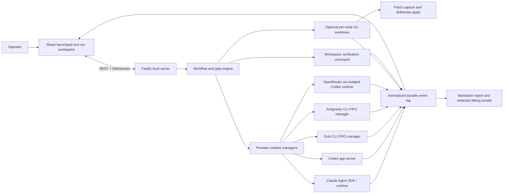
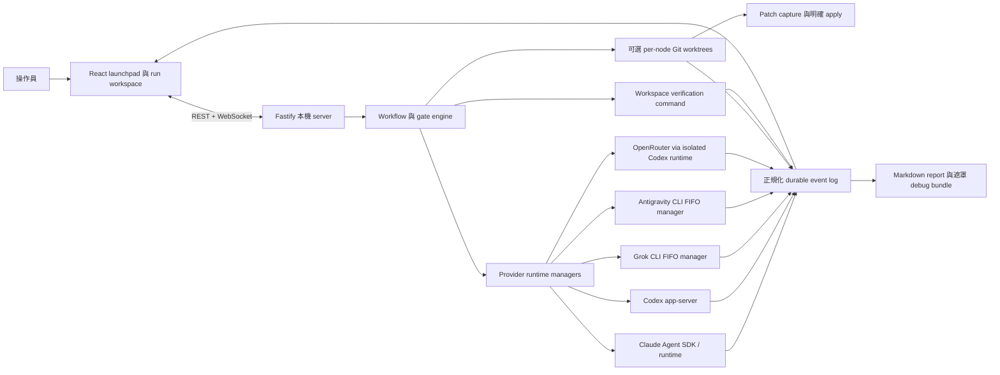

<a id="english"></a>

[← Public GitHub portfolio](./README.md) · [Ted's profile](../README.md) · **English** · [繁體中文](#traditional-chinese) · [GitHub repository](https://github.com/teddashh/multi-ai-terminal) · [Latest release: v0.2.10](https://github.com/teddashh/multi-ai-terminal/releases/tag/v0.2.10)

# Multi-AI Terminal

## Positioning and project snapshot

Multi-AI Terminal is a local workbench for composing multi-stage coding workflows across real headless agent runtimes. A project begins as a directory on the user's machine. Claude Code, Codex, Grok, Antigravity (Gemini), or an OpenRouter model then occupy configurable workflow slots, stream their work into one durable event model, and pass through an optional LLM gate before the next stage advances.

It is the architectural successor to [Multi-AI Chat Desktop](./multi-ai-chat-desktop.md): instead of automating consumer chat pages through WebViews and DOM adapters, it talks to coding-agent CLIs, app servers, and SDKs. The product therefore moves from “carry an answer between websites” to “coordinate agents that can inspect and change a real workspace,” with patches, verification output, and process evidence treated as first-class results.

This page was verified against the public repository and release on **September 8, 2026**. The `main` branch and v0.2.10 tag both point to [`b968af1`](https://github.com/teddashh/multi-ai-terminal/commit/b968af1526b0f24812a6d9e7b8881f9bb6139eed); GitHub showed **4 stars** at this snapshot.

| Snapshot | Current repository evidence |
|---|---|
| Product form | Local web UI and API, plus a Tauri 2 desktop shell around the same bundled server |
| Published version | v0.2.10; the repository has 68 commits and 288 tracked files at the reviewed commit |
| Provider paths | Claude Agent SDK / resolved Claude runtime, persistent Codex app-server, Grok CLI, Antigravity `agy` CLI, OpenRouter through an isolated Codex runtime, and an in-process mock for tests |
| Core stack | TypeScript npm workspaces, Node.js 20+, Fastify 5 and WebSockets, React 18, Vite 6, Zustand, Tailwind CSS, Rust, and Tauri 2 |
| Workflow model | Ordered stages, up to 12 agent instances per stage, configurable parallelism/retries, optional LLM gates, and Planning / Build / Review / Pipeline presets |
| Evidence model | Append-only run events, normalized raw adapter output, binary-capable patches, verification logs, decisions, reports, and redacted debug bundles under the local data directory |
| Distribution | Nine v0.2.10 assets: Windows NSIS/MSI, Linux DEB/AppImage/RPM, and both Apple Silicon and Intel macOS DMG/app archives |
| Verification | Current-sha CI passed on Ubuntu and Windows; it builds, tests, typechecks, checks the version contract, exercises the agent lifecycle and runtime catalog, and runs evidence/browser suites |
| License | A standard MIT License is committed at the repository root |

## The problem it addresses

Running several coding agents is not the same as having a dependable multi-agent workflow. Separate terminals leave the operator to copy context, remember which agent changed which file, decide whether a failed test invalidates a candidate, and reconstruct why one answer advanced while another was rejected. Parallel agents can also collide in one working tree or leave partial processes and edits behind.

Multi-AI Terminal gives that work an explicit shape:

- a workspace identifies where agents are allowed to operate;
- a workflow says who runs, in what stage, with which model and permission tier;
- an event contract translates provider-specific streams into one replayable vocabulary;
- optional worktrees keep candidate edits apart;
- a gate records advance, targeted retry, or abort decisions; and
- verification, patches, and reports preserve evidence beyond the final prose answer.

The aim is not to make the agents interchangeable. It is to expose their unequal runtime behavior through a common control plane without pretending that plain text, tool-rich JSON streams, resumable threads, and silent tool execution carry the same evidence.

## User experience and capabilities

### From a directory to a reviewable run

1. Add a project by absolute path. Multi-AI Terminal detects its Git context and stores the workspace definition locally.
2. Choose Planning, Build, Review, or the evidence-gated Implement → Test → Review Pipeline; open **Customize** only when stage or slot details need to change.
3. Bind each slot to a provider, model, reasoning effort, permission tier, prompt template, and instance count. The schema enforces no more than 12 instances in one stage.
4. Start the run. Candidate processes stream thinking, text, tools, usage, lifecycle state, and errors through provider adapters into a common event log.
5. Read the narrative-first **Conversation** view or inspect the categorized, virtualized **Timeline** with node, role, and text filters.
6. Review the orchestrator's decision, verification status, patch, and Markdown report. A worktree-isolated candidate's patch can be inspected and deliberately applied from the UI.

### Real gates, bounded retries, and explicit degradation

For a gated stage, a selected provider acts as the orchestrator. It receives a bounded digest of candidates and must return strict JSON for one of three actions:

| Gate action | Meaning |
|---|---|
| `advance` | Accept the stage and provide context for the next one |
| `retry` | Rerun selected nodes with an additional instruction, within the workflow retry budget |
| `abort` | Stop the workflow and preserve the evidence already collected |

Malformed gate output does not deadlock the run; v0.2.10 degrades to a recorded safe advance. A stage can also set `requireVerified`. If a verification command failed and no candidate passed, the engine converts an attempted advance into a targeted retry while budget remains. If the retry budget is exhausted, it advances as **degraded** rather than presenting the result as verified.

### Worktree isolation and the evidence plane

Worktree isolation is optional per stage. When enabled for a Git workspace, each candidate gets its own worktree. After the attempt, Multi-AI Terminal captures even binary changes as a patch, then runs the workspace's configured verification command when there is a non-empty patch. The normalized result is `passed`, `failed`, `error`, or `skipped`; the full log remains an artifact.

The generated Markdown report brings together:

- stage and node outcomes, duration, provider/runtime version, usage, and tool counts where available;
- gate decisions, retries, handoff context, and degraded state;
- patch metadata and verification evidence; and
- enough lifecycle information for a PR description or retrospective without reducing everything to one “success” badge.

### Steering a run without hiding the interruption

An operator can add up to eight FIFO steering messages:

- **Interrupt** terminates active candidate process trees, preserves partial logs and patches, runs the new instruction through the normal evidence path, then reviews whether to redo, continue, or abort.
- **Queue** waits for the next stage boundary and applies the instruction without writing into a running child's standard input.

This is deliberately different from an invisible mid-prompt edit. The interruption, partial work, new instruction, and resulting decision all remain part of the run record.

### Provider paths are normalized, not flattened

| Provider | Runtime path in v0.2.10 | Evidence boundary |
|---|---|---|
| Claude | Agent SDK driving the resolved Claude runtime; explicit legacy CLI mode remains | Text, thinking, tools, usage, and a persistent session runtime |
| Codex | One persistent `codex app-server` JSON-RPC/JSONL controller | Resumable threads plus text, thinking, tools, and usage |
| Grok | `grok --prompt-file … --output-format streaming-json` behind a FIFO manager | Thinking and text; Grok's stream does not report tool events |
| Antigravity | `agy -p … --model …` behind a FIFO manager | Plain text only; no JSON mode or session resume |
| OpenRouter | Persistent Codex app-server with an isolated OpenRouter configuration | Exact selected request slug; richness depends on the chosen model |
| Mock | In-process deterministic adapter | Scripted fixtures and `MOCK_REPLY:` echo behavior for tests |

The Health drawer separates “CLI detected” from “authenticated and ready,” provides fixed Setup or sign-in guidance where supported, and can produce a redacted diagnostic log or a complete debug bundle. Environment-variable values are not intentionally recorded.

## Architecture and data flow



The repository is split into four product layers:

- **`shared/`:** Zod-validated provider, workflow, run, and event contracts plus the built-in presets.
- **`server/`:** Fastify REST/WebSocket API, provider managers, process-tree lifecycle, gate engine, worktree and patch handling, verification, stores, reporting, diagnostics, and retention.
- **`web/`:** project/launch UI, workflow editor, narrative and timeline views, health drawer, patch/report/debug interactions, localization, and three persistent themes.
- **`desktop/`:** a small Tauri host that starts the exact bundled Node server on an ephemeral loopback port, opens it in a native WebView, and adds a native folder picker.

Local state defaults to `~/.multi-ai-terminal/`. Workspace and workflow definitions sit beside per-run `run.json`, append-oriented `events.jsonl`, environment-value-sanitized raw streams, patches, and verification logs. Retention keeps the newest 100 runs per workspace and prunes associated worktrees and branches when older runs are deleted.

## Key engineering and design choices

### 1. Drive official agent surfaces rather than scrape chat pages

Each provider adapter owns a real headless runtime boundary. Codex uses its app-server protocol; Claude defaults to the Agent SDK; Grok and Antigravity use their documented CLIs. This is more appropriate for code-changing work than a DOM selector, but it also means the machine must satisfy each provider's installation, authentication, licensing, and account rules.

### 2. Normalize evidence while preserving provider differences

All adapters emit the same event categories and lifecycle states, yet the UI does not invent missing tool calls or resume support. Grok tool counts remain “n/a”; Antigravity is explicitly plain text and re-briefed at each gate. The durable event log is the replay source, not a transient terminal buffer.

### 3. Separate generated, reviewed, advanced, and verified

A good answer, an orchestrator approval, a passing workspace command, and an applied patch are four different claims. The data model and report keep them separate. `requireVerified` strengthens a gate but stays bounded by the declared retry budget, so exhaustion is visible as degradation rather than an endless loop.

### 4. Capture changes outside the shared working tree

Per-node Git worktrees reduce write collisions and let candidates be compared before anything reaches the original workspace. Binary-capable patch capture makes the result portable. Isolation is optional because read-only planning and non-Git directories do not always need it.

### 5. Use process trees and explicit steering instead of terminal keystrokes

The engine spawns and terminates owned process trees, records stale PIDs for recovery, and never implements steering by writing to a child's PTY/stdin. This makes interruption reproducible, though platform process semantics—especially Windows forced tree termination and PID reuse after reboot—remain real limitations.

### 6. Keep the server local by default

The default bind is `127.0.0.1:7788`. A non-loopback bind requires the operator to choose it and should use `--token`, which protects REST with a bearer token and WebSockets with a query token. This is an important boundary because anyone who can reach an unprotected server can start agents with access to configured workspaces.

### 7. Make source launch agent-readable but explicitly invoked

The repository includes machine-readable lifecycle contracts and matching Codex/Claude Code Skills for doctor, audit, launch, status, and identity-safe stop. They cover the source-web lane only, do not install host toolchains, and must be explicitly requested. Lifecycle state stays under the ignored `.agent-runtime/` directory.

## Quick start

### Install a desktop release

Use the [v0.2.10 release](https://github.com/teddashh/multi-ai-terminal/releases/tag/v0.2.10):

- Windows x64: NSIS `-setup.exe` or MSI;
- Debian/Ubuntu x64: DEB;
- other Linux x64 systems: AppImage or RPM; and
- macOS: Apple Silicon or Intel DMG.

The desktop app still requires Node.js 20+ on `PATH` (or an explicit `MAT_NODE`) because the shell launches the bundled Node server. Version 1 macOS builds are unsigned and not notarized.

### Run the local web edition from source

Requirements are Node.js 20+, npm, Git, and the runtimes for the providers you intend to use. Git 2.32+ is recommended for the strongest patch checks.

```sh
git clone https://github.com/teddashh/multi-ai-terminal.git
cd multi-ai-terminal
npm install
npm run build
npm test
npm run typecheck
npm start
```

Open `http://127.0.0.1:7788`, add an absolute workspace path, select a preset, and verify provider readiness before starting a real run.

The agent-ready source-web lane exposes:

```sh
npm run agent:doctor -- --json
npm run agent:launch -- --wait --json
npm run agent:status -- --json
npm run agent:audit -- --json
npm run agent:stop -- --json
```

## Current scope, risks, and license

- **Agents can execute real code and edit real files.** `safe`, `auto`, and `full` map to each runtime's native policies; `full` deliberately bypasses a provider sandbox. The UI is an orchestration surface, not an additional security sandbox.
- **Local access is privileged access.** Exposing `--host 0.0.0.0` without a strong `--token` can give another network user the ability to launch arbitrary agents in a workspace. The README recommends Tailscale-only exposure when remote access is needed.
- **Authentication remains provider-owned.** CLI detection is not proof of sign-in. Parallel sessions of the same provider can race OAuth refresh-token rotation; spacing launches by 1.5 seconds reduces but cannot eliminate that upstream behavior.
- **Provider evidence is unequal.** Grok omits tool events; Antigravity has no structured stream or resume; an OpenRouter run is constrained by the selected model and the Codex-as-runtime path.
- **A gate is advice plus policy, not formal proof.** Invalid JSON safely advances, and `requireVerified` eventually advances as degraded when retry budget is exhausted. Operators must read the label and report rather than treating “advanced” as “passed.”
- **Worktree isolation has operational edges.** Non-Git workspaces cannot provide Git isolation, old Git falls back to a weaker apply check, and crash recovery accepts a documented PID-reuse risk.
- **Run data may be sensitive.** Raw provider output is sanitized for environment-variable values, but answers, tool activity, patches, and verification logs can still contain source or workspace content. The local data directory and exported debug bundles need the same protection as the project.
- **Desktop packaging still has trust friction.** macOS packages are unsigned and unnotarized. The desktop app depends on a compatible external Node runtime, and its Tauri configuration currently sets no Content Security Policy.
- **Scale is intentionally bounded.** One stage is capped at 12 instances, steering at eight queued messages, browser memory at roughly 20,000 recent events before paging, and local retention at 100 runs per workspace.
- **License:** the project includes the standard MIT License and is provided without warranty. Provider runtimes, models, and accounts retain their own licenses and terms.

## Source and documentation

- [Repository](https://github.com/teddashh/multi-ai-terminal)
- [English README](https://github.com/teddashh/multi-ai-terminal/blob/main/README.md) · [Traditional Chinese README](https://github.com/teddashh/multi-ai-terminal/blob/main/README.zh-TW.md)
- [Engineering specification](https://github.com/teddashh/multi-ai-terminal/blob/main/SPEC.md)
- [Current hardening audit](https://github.com/teddashh/multi-ai-terminal/blob/main/docs/project-audit-2026-07-20.md)
- [Four-model specification review](https://github.com/teddashh/multi-ai-terminal/blob/main/docs/spec-review-panel.md) · [code review](https://github.com/teddashh/multi-ai-terminal/blob/main/docs/code-review-panel.md)
- [Agent release contract](https://github.com/teddashh/multi-ai-terminal/blob/main/agent-release.json)
- [v0.2.10 release](https://github.com/teddashh/multi-ai-terminal/releases/tag/v0.2.10) · [current CI](https://github.com/teddashh/multi-ai-terminal/actions)

---

[← Previous: Multi-AI Chat Desktop](./multi-ai-chat-desktop.md) · [Next: Multi-AI Chat →](./multi-ai-chat.md)

---

<a id="traditional-chinese"></a>

[← GitHub 公開作品集](./README.md#traditional-chinese) · [Ted 的個人頁](../README.zh-TW.md) · [English](#english) · **繁體中文** · [GitHub Repository](https://github.com/teddashh/multi-ai-terminal) · [最新版本：v0.2.10](https://github.com/teddashh/multi-ai-terminal/releases/tag/v0.2.10)

# Multi-AI Terminal

## 作品定位與現況快照

Multi-AI Terminal 是一套本機工作台，用來組合跨真實 headless coding-agent runtime 的多階段工作流。每個 project 從使用者電腦上的一個目錄開始；Claude Code、Codex、Grok、Antigravity（Gemini）或 OpenRouter model 進入可設定的 workflow slot，把過程串流到同一套 durable event model，並在下一階段開始前選擇性地交給真正的 LLM gate 判斷。

它是 [Multi-AI Chat Desktop](./multi-ai-chat-desktop.md#traditional-chinese) 在架構上的後繼者：不再透過 WebView 與 DOM adapter 自動操作 consumer chat page，而是直接面對 coding-agent CLI、app server 與 SDK。產品因此從「在網站間搬回答」前進到「協調能檢查、修改真實 workspace 的 agent」，並把 patch、verification output 與 process evidence 視為一等結果。

本頁於 **2026 年 9 月 8 日**核對公開 repository 與 release。`main` 與 v0.2.10 tag 都位於 [`b968af1`](https://github.com/teddashh/multi-ai-terminal/commit/b968af1526b0f24812a6d9e7b8881f9bb6139eed)；這次快照中 GitHub 顯示 **4 stars**。

| 快照 | 目前 repository 的實際狀態 |
|---|---|
| 產品形式 | 本機 Web UI／API，另有包住同一套 bundled server 的 Tauri 2 desktop shell |
| 公開版本 | v0.2.10；受核對 commit 有 68 個 commits、288 個 tracked files |
| Provider 路徑 | Claude Agent SDK／已解析 Claude runtime、persistent Codex app-server、Grok CLI、Antigravity `agy` CLI、透過隔離 Codex runtime 的 OpenRouter，以及測試用 in-process mock |
| 核心技術 | TypeScript npm workspaces、Node.js 20+、Fastify 5／WebSocket、React 18、Vite 6、Zustand、Tailwind CSS、Rust、Tauri 2 |
| Workflow model | 有序 stages、每階段最多 12 個 agent instances、可調 parallelism／retry、可選 LLM gate，以及 Planning／Build／Review／Pipeline presets |
| Evidence model | 本機 append-only run events、正規化 raw adapter output、支援 binary 的 patch、verification log、decision、report 與已遮罩 debug bundle |
| 發布 | v0.2.10 有九個 assets：Windows NSIS／MSI、Linux DEB／AppImage／RPM，以及 Apple Silicon／Intel macOS 的 DMG／app archive |
| 驗證 | current-sha CI 在 Ubuntu、Windows 通過；包含 build、test、typecheck、version contract、agent lifecycle、runtime catalog、evidence 與 browser suites |
| 授權 | Repository root 已提交標準 MIT License |

## 它要解決的問題

同時打開幾個 coding agent，不等於擁有可靠的多代理工作流。分散的 terminal 仍把 context 搬運、檔案變更歸屬、失敗測試是否淘汰候選，以及為何接受某份答案的判斷留給操作員手動重建。平行 agent 也可能撞進同一個 working tree，留下半套 process 或改動。

Multi-AI Terminal 把這件事變成明確結構：

- workspace 指出 agent 可以在哪裡工作；
- workflow 說明誰在哪個 stage、用什麼 model 與 permission tier 執行；
- event contract 把 provider-specific stream 翻成同一套可 replay 語彙；
- 可選 worktree 把候選改動隔開；
- gate 記錄 advance、targeted retry 或 abort；以及
- verification、patch、report 讓 evidence 不會只剩最終 prose answer。

它的目標不是假裝所有 agent 都一樣，而是在共同 control plane 中呈現各 runtime 的不對等：plain text、tool-rich JSON stream、resumable thread 與看不到 tool event 的執行，證據力本來就不同。

## 使用體驗與能力

### 從一個目錄走到可審查的 run

1. 以 absolute path 新增 project；Multi-AI Terminal 偵測 Git context，並在本機保存 workspace 定義。
2. 選 Planning、Build、Review，或有 evidence gate 的 Implement → Test → Review Pipeline；只有要調 stage／slot 時才打開 **Customize**。
3. 為每個 slot 指定 provider、model、reasoning effort、permission tier、prompt template 與 instance count；schema 強制每階段不超過 12 個 instances。
4. 開始執行。Candidate process 的 thinking、text、tool、usage、lifecycle state 與 error 透過 adapter 進入共同 event log。
5. 從 narrative-first **Conversation** 閱讀，或用 node、role、文字 filter 檢查分類、virtualized 的 **Timeline**。
6. 檢查 orchestrator decision、verification status、patch 與 Markdown report；worktree-isolated candidate 的 patch 可以在 UI 內先看再明確套用。

### 真正的 gate、有界 retry、明確 degradation

在 gated stage 中，選定的 provider 會擔任 orchestrator。它收到有界 candidate digest，必須以 strict JSON 回覆三種 action：

| Gate action | 意義 |
|---|---|
| `advance` | 接受這個 stage，並提供下一階段 context |
| `retry` | 在 workflow retry budget 內，帶附加指示重跑指定 nodes |
| `abort` | 停止 workflow，但保留已產生的 evidence |

格式錯誤不會讓整個 run 卡死；v0.2.10 會降級成有紀錄的 safe advance。Stage 也可設定 `requireVerified`。若 verification command 失敗且沒有 candidate 通過，引擎會在 budget 尚存時把 advance 改成 targeted retry；budget 用完後則以 **degraded** 狀態前進，不會冒充已驗證。

### Worktree isolation 與 evidence plane

每個 stage 可選 worktree isolation。Git workspace 啟用後，每個 candidate 得到獨立 worktree；attempt 結束時會把包含 binary change 的改動捕捉成 patch。有非空 patch 時，再執行 workspace 設定的 verification command。正規化結果為 `passed`、`failed`、`error` 或 `skipped`，完整 log 留作 artifact。

產生的 Markdown report 整合：

- stage／node outcome、duration、provider/runtime version、usage，以及能取得時的 tool count；
- gate decision、retry、handoff context 與 degraded state；
- patch metadata 與 verification evidence；以及
- 足以用於 PR description 或 retrospective 的 lifecycle 資訊，而不是把一切壓成一顆「success」燈號。

### Steering 不把中斷藏起來

每個 run 可加入最多八則 FIFO steering message：

- **Interrupt** 終止 active candidate process tree、保留 partial log 與 patch，讓新指示走過正常 evidence path，再審查該重做、繼續或 abort。
- **Queue** 等到下一個 stage boundary 才套用，不會把文字寫進執行中 child 的 stdin。

這與偷偷改動半途 prompt 不同；中斷、部分成品、新指示與後續決策都留在 run record。

### Provider 被正規化，但沒有被假裝成一樣

| Provider | v0.2.10 runtime 路徑 | Evidence 邊界 |
|---|---|---|
| Claude | Agent SDK 驅動解析後的 Claude runtime；仍可明確選 legacy CLI mode | Text、thinking、tool、usage 與 persistent session runtime |
| Codex | 單一 persistent `codex app-server` JSON-RPC/JSONL controller | 可續談 thread，加上 text、thinking、tool、usage |
| Grok | FIFO manager 後的 `grok --prompt-file … --output-format streaming-json` | Thinking、text；Grok stream 不回報 tool event |
| Antigravity | FIFO manager 後的 `agy -p … --model …` | 只有 plain text；無 JSON mode 或 session resume |
| OpenRouter | 使用隔離 OpenRouter 設定的 persistent Codex app-server | 送出所選 exact request slug；內容豐富度取決於 model |
| Mock | In-process deterministic adapter | 測試用 scripted fixture 與 `MOCK_REPLY:` echo |

Health drawer 會區分「偵測到 CLI」與「已登入、可用」，在支援時提供固定 Setup／sign-in guidance，並可輸出遮罩 diagnostic log 或完整 debug bundle。系統不會刻意記錄 environment variable 的值。

## 架構與資料流



Repository 分成四個產品層：

- **`shared/`：** 以 Zod 驗證的 provider、workflow、run、event contracts，以及 built-in presets。
- **`server/`：** Fastify REST／WebSocket API、provider manager、process-tree lifecycle、gate engine、worktree／patch、verification、store、report、diagnostic 與 retention。
- **`web/`：** project／launch UI、workflow editor、narrative／timeline、health drawer、patch／report／debug 操作、localization 與三套持久 theme。
- **`desktop/`：** 小型 Tauri host，在隨機 loopback port 啟動完全相同的 bundled Node server、用 native WebView 開啟，並加入原生 folder picker。

本機狀態預設放在 `~/.multi-ai-terminal/`。Workspace／workflow 定義與每個 run 的 `run.json`、append-oriented `events.jsonl`、已移除 environment value 的 raw stream、patch、verification log 共存。每個 workspace 保留最新 100 次 run；刪除舊 run 時也清除其 worktree 與 branch。

## 關鍵工程與設計選擇

### 1. 驅動正式 agent surface，而不是 scrape chat page

每個 provider adapter 都擁有真實 headless runtime boundary。Codex 使用 app-server protocol、Claude 預設 Agent SDK、Grok／Antigravity 使用其 CLI。這比 DOM selector 更適合會改 code 的工作，但也代表主機必須自行滿足各 provider 的安裝、登入、授權與帳號規則。

### 2. 正規化 evidence，同時保留 provider 差異

Adapter 會發出相同 event category／lifecycle state，UI 卻不捏造缺少的 tool call 或 resume。Grok tool count 保持「n/a」；Antigravity 明確標為 plain text，並在每個 gate 重新 brief。Durable event log 才是 replay source，不是短暫 terminal buffer。

### 3. 把 generated、reviewed、advanced、verified 分開

好答案、orchestrator 同意、workspace command 通過、patch 已套用是四種不同主張。Data model／report 不會把它們混在一起。`requireVerified` 能強化 gate，但仍受 retry budget 約束；用盡時會清楚降級，不會無限迴圈。

### 4. 在 shared working tree 外捕捉改動

Per-node Git worktree 降低寫入衝突，讓 candidate 能在碰到原 workspace 前先比較。支援 binary 的 patch capture 讓結果可攜。Isolation 採選配，是因為唯讀 planning 與非 Git directory 不一定需要。

### 5. 用 process tree 與明確 steering，而不是 terminal keystroke

引擎 spawn／terminate 自己擁有的 process tree，保存 stale PID 供 recovery，且不靠寫入 child PTY／stdin 來 steering。這讓中斷可重現；不過平台 process semantics——特別是 Windows 強制 tree kill 與 reboot 後 PID reuse——仍是真實限制。

### 6. Server 預設只留在本機

預設綁定 `127.0.0.1:7788`。要 non-loopback 必須由操作員主動指定，且應搭配 `--token`；REST 使用 bearer，WebSocket 使用 query token。這個邊界很重要，因為能連上未保護 server 的人，就能啟動可存取已設定 workspace 的 agent。

### 7. Source launch 可由 agent 理解，但只能明確呼叫

Repo 內有 machine-readable lifecycle contract，以及供 Codex／Claude Code 使用的 doctor、audit、launch、status、identity-safe stop Skills。它們只負責 source-web lane、不安裝 host toolchain，而且必須明確要求才可使用。Lifecycle state 留在 gitignored `.agent-runtime/`。

## 快速開始

### 安裝 desktop release

使用 [v0.2.10 release](https://github.com/teddashh/multi-ai-terminal/releases/tag/v0.2.10)：

- Windows x64：NSIS `-setup.exe` 或 MSI；
- Debian／Ubuntu x64：DEB；
- 其他 Linux x64：AppImage 或 RPM；以及
- macOS：Apple Silicon 或 Intel DMG。

Desktop app 仍需要 `PATH` 上的 Node.js 20+（或明確 `MAT_NODE`），因為 shell 會啟動 bundled Node server。v1 macOS build 尚未簽章、未 notarize。

### 從原始碼執行本機 Web 版

需求為 Node.js 20+、npm、Git，以及實際要使用的 provider runtime。建議 Git 2.32+，以取得較強的 patch check。

```sh
git clone https://github.com/teddashh/multi-ai-terminal.git
cd multi-ai-terminal
npm install
npm run build
npm test
npm run typecheck
npm start
```

打開 `http://127.0.0.1:7788`，加入 absolute workspace path、選 preset，並在真實執行前確認 provider readiness。

Agent-ready source-web lane 提供：

```sh
npm run agent:doctor -- --json
npm run agent:launch -- --wait --json
npm run agent:status -- --json
npm run agent:audit -- --json
npm run agent:stop -- --json
```

## 目前範圍、風險與授權

- **Agent 會真的執行程式、修改檔案。** `safe`、`auto`、`full` 對應各 runtime native policy；`full` 刻意繞過 provider sandbox。UI 是 orchestration surface，不是額外 security sandbox。
- **本機 access 就是 privileged access。** 未搭配強 `--token` 就暴露 `--host 0.0.0.0`，可能讓其他 network user 在 workspace 啟動任意 agent。README 建議 remote access 只走 Tailscale。
- **登入仍由 provider 管理。** 找到 CLI 不等於已登入。同 provider 的平行 session 可能競爭 OAuth refresh-token rotation；啟動間隔 1.5 秒只能降低、不能消除這個上游行為。
- **Provider evidence 不對等。** Grok 不提供 tool event；Antigravity 沒有 structured stream／resume；OpenRouter run 受選定 model 與 Codex-as-runtime 路徑限制。
- **Gate 是建議加 policy，不是 formal proof。** Invalid JSON 會 safe advance；`requireVerified` 用盡 retry budget 後也會 degraded advance。操作員必須讀 label／report，不能把「advanced」當成「passed」。
- **Worktree isolation 有操作邊角。** 非 Git workspace 無法提供 Git isolation；舊 Git 退回較弱 apply check；crash recovery 接受文件中明列的 PID-reuse risk。
- **Run data 可能敏感。** Raw provider output 會移除 environment-variable value，但回答、tool activity、patch、verification log 仍可能包含 source／workspace 內容。本機 data directory 與匯出的 debug bundle 應和專案本身同等保護。
- **Desktop packaging 仍有信任摩擦。** macOS package 未簽章、未 notarize；desktop 依賴外部相容 Node runtime，Tauri 設定目前也沒有 Content Security Policy。
- **Scale 刻意有界。** 每階段 12 instances、steering queue 八則、browser memory 約 20,000 個近期 events 後開始 paging、每 workspace 本機保留 100 runs。
- **授權：** 專案包含標準 MIT License，軟體不附保固；provider runtime、model 與 account 仍受自己的 license／terms 管轄。

## 原始碼與文件

- [Repository](https://github.com/teddashh/multi-ai-terminal)
- [English README](https://github.com/teddashh/multi-ai-terminal/blob/main/README.md) · [繁體中文 README](https://github.com/teddashh/multi-ai-terminal/blob/main/README.zh-TW.md)
- [工程規格](https://github.com/teddashh/multi-ai-terminal/blob/main/SPEC.md)
- [目前 hardening audit](https://github.com/teddashh/multi-ai-terminal/blob/main/docs/project-audit-2026-07-20.md)
- [四模型規格審查](https://github.com/teddashh/multi-ai-terminal/blob/main/docs/spec-review-panel.md) · [code review](https://github.com/teddashh/multi-ai-terminal/blob/main/docs/code-review-panel.md)
- [Agent release contract](https://github.com/teddashh/multi-ai-terminal/blob/main/agent-release.json)
- [v0.2.10 release](https://github.com/teddashh/multi-ai-terminal/releases/tag/v0.2.10) · [目前 CI](https://github.com/teddashh/multi-ai-terminal/actions)

---

[← 上一頁：Multi-AI Chat Desktop](./multi-ai-chat-desktop.md#traditional-chinese) · [下一頁：Multi-AI Chat →](./multi-ai-chat.md#traditional-chinese)
