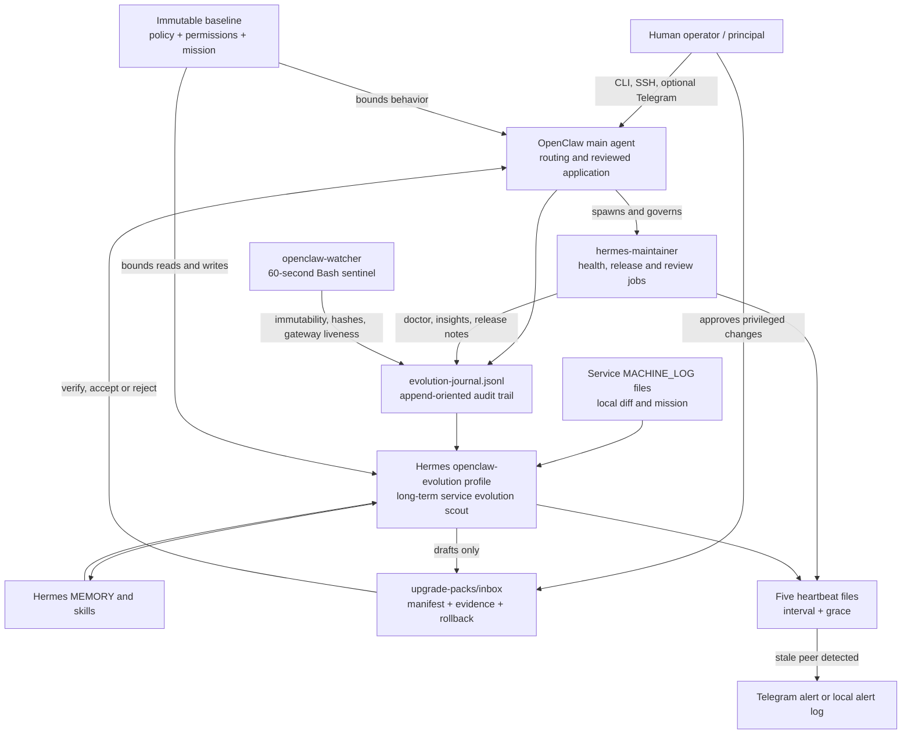
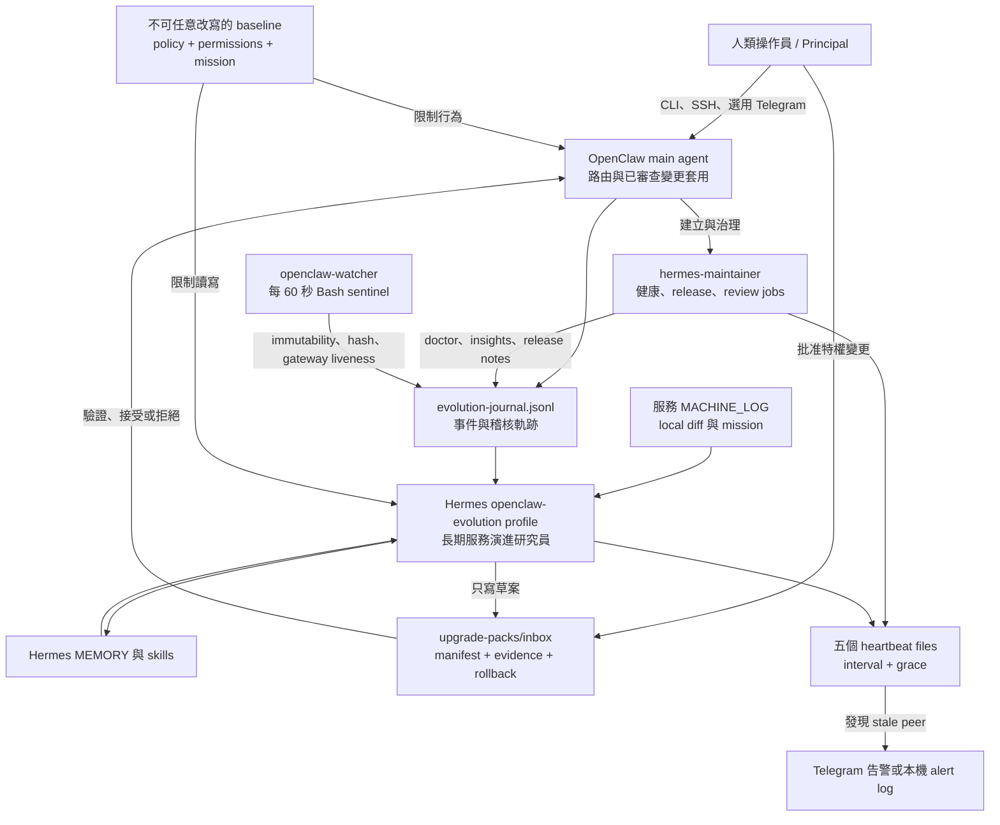

<a id="english"></a>

[← Public GitHub portfolio](./README.md) · [← Ted's profile](../README.md) · **English** · [繁體中文](#traditional-chinese) · [GitHub repository](https://github.com/teddashh/openclaw-hermes-watcher) · [Releases](https://github.com/teddashh/openclaw-hermes-watcher/releases) · [Architecture](https://github.com/teddashh/openclaw-hermes-watcher/blob/main/ARCHITECTURE.md) · [Install guide](https://github.com/teddashh/openclaw-hermes-watcher/blob/main/docs/INSTALL.md)

# openclaw-hermes-watcher

> A guarded evolution layer for a long-running OpenClaw host: Hermes studies what should improve, a maintainer watches Hermes, deterministic scripts watch both, and the human remains the principal.

## Positioning and verified snapshot

`openclaw-hermes-watcher` is not another agent runtime and it does not fork either OpenClaw or Hermes Agent. It is an operations layer installed around an **existing Linux OpenClaw host**. The layer creates one purpose-built Hermes profile, one narrow OpenClaw maintainer subagent, an immutable policy baseline, scheduled health work, and a cross-patrol heartbeat system. It integrates through public CLIs and conventional state directories instead of editing either product's installed source.

The product is aimed at a difficult middle ground: an operator wants an agent to learn from months of service history and continuously study useful improvements, but does not want that same agent to grant itself permission, apply its own upgrades, rewrite the alarm, or demand attention every day.

This case study was verified against the public repository on **July 11, 2026**:

| Item | Repository evidence |
|---|---|
| Default branch reviewed | `main` at [`45ef886`](https://github.com/teddashh/openclaw-hermes-watcher/commit/45ef886fb2b5f870829abb635ddef6da6963f6ad) |
| Latest published release | [`v0.1.7`](https://github.com/teddashh/openclaw-hermes-watcher/releases/tag/v0.1.7), published May 7, 2026 |
| Repository shape | 50 tracked files; Bash, rendered templates, YAML, Markdown, JSONL contracts, and a systemd user unit |
| Core implementation size | 3,300 lines across the shell scripts, templates, and PII test counted in the reviewed commit |
| Automated checks | GitHub Actions runs shell syntax checks, the PII guard, and a ten-template render smoke test |
| Local verification during this review | The same three CI paths completed successfully against the reviewed commit |
| License | Apache License 2.0 |

The README's introductory sentence still says “v0.1.0, 39 files,” but the repository has advanced beyond that snapshot. The release history and current tree above are the more accurate status.

## The problem

A conventional daily “check upstream and notify me” cron solves only the easiest part of long-term agent maintenance. It does not remember why the host diverged from upstream, relate a release to the services that actually run on the machine, or distinguish an important break from routine noise. Over time that becomes alert fatigue and upgrade debt.

An ad-hoc coding-agent session has the opposite weakness. It may reason well, but it starts cold, rebuilds context repeatedly, and can develop a different opinion in every session. Giving a persistent agent autonomous update power fixes the context problem by creating a much larger governance problem: the system proposing a change can also apply it, alter the policy, and potentially silence the mechanism meant to catch it.

This repository separates those concerns:

- **Hermes learns and proposes.** Its long-lived `openclaw-evolution` profile accumulates service signals, upstream findings, community candidates, memory, and reusable skills.
- **OpenClaw operates.** The main agent remains the host-side router and the only agent intended to apply a reviewed evolution pack.
- **A maintainer observes Hermes.** The `hermes-maintainer` subagent runs health, release, weekly-review, and compaction jobs without being allowed to upgrade Hermes by itself.
- **Deterministic code guards the cognitive systems.** Bash and systemd perform hash, liveness, and heartbeat checks that do not depend on an LLM agreeing with the policy.
- **The operator remains principal.** `sudo chattr -i`, major upgrades, credential changes, high-risk configuration changes, and final judgment remain human-controlled.

## User experience and capabilities

### What the operator experiences

After installation, normal operation is deliberately quiet. The default schedule runs four maintainer jobs in the host's configured timezone and one Hermes study job in UTC:

| Job | Default cadence | What it contributes |
|---|---|---|
| `hermes_daily_doctor` | Daily at 04:30 local | Runs `hermes doctor`, records health, and creates an issue note only when needed |
| `hermes_upstream_watch` | Daily at 05:00 local | Compares the installed Hermes version with upstream releases and queues a review event |
| `hermes_weekly_review` | Monday at 05:00 local | Summarizes seven days of Hermes activity, packs, drift signals, and storage use |
| `hermes_monthly_compress` | First day of the month at 05:30 local | Compacts the Hermes profile's session memory and records before/after size |
| `openclaw-daily-study` | Daily at 10:00 UTC | Runs the service-first Hermes research rotation |

Every scheduled job writes its heartbeat **before** doing the potentially long cognitive task. A healthy run produces files and journal entries, not a stream of chat notifications. Telegram is optional and is used for stale-job alerts or direct operator conversations, not for autonomous proposal marketing.

The daily Hermes rotation is grounded in the actual template, not the stale abbreviated rotation in one README section:

- Monday reads one service's `MACHINE_LOG.md` and looks for real operational pain.
- Tuesday checks recent OpenClaw commits and issues against those service signals.
- Wednesday rotates among community skill/plugin sources and rejects candidates that fail activity, license, safety, compatibility, or service-relevance checks.
- Thursday synthesizes evidence into draft evolution packs.
- Friday checks manifests, rollback commands, evidence, and source stability before marking a pack ready.
- Saturday cleans memory, promotes recurring patterns to skills, and reviews Hermes releases.
- Sunday writes the heartbeat and rests.

The study prompt caps a run at 30 minutes or 30 turns. The repository documents an expected **10,000–30,000 tokens per day**; that is a design estimate in the documentation, not a benchmark reproduced by this portfolio review.

### What the system produces

The system's product is a set of rescue-friendly files:

- `evolution-journal.jsonl` — an append-oriented event trail for deployments, watcher findings, maintenance work, and operator decisions.
- `openclaw-local-diff.md` — the operator's explanation of intentional local divergence from upstream.
- `MACHINE_LOG.md` and `study-notes/` — service evidence and maintainer observations.
- `MEMORY.md` and `~/.hermes/skills/` — accumulated Hermes knowledge and repeated patterns.
- `upgrade-packs/inbox/<topic>/` — proposals with target services, expected impact, evidence, a declared pack kind, and executable rollback.
- heartbeat files — timestamp, interval, grace, and job identity in a one-line format that Bash can verify without interpretation.

Evolution packs are classified as `install_skill`, `install_plugin`, `apply_upstream_patch`, `synthesize_custom`, or `config_change`. The policy treats extension-point installs as the lowest structural risk, upstream patches as context-dependent, and custom synthesis or direct configuration changes as requiring more review. Daily and weekly change budgets are also written into policy so the system has a vocabulary for limiting proposal volume.

Convenience wrappers provide `talk-main`, `talk-maintainer`, and `talk-hermes`; project subagents can receive generated `talk-<agent>` wrappers. Optional Telegram setup gives the maintainer and Hermes separate bot identities so the operator can tell which side detected a problem.

## Architecture and data flow

The most important architectural rule is that the agents do not negotiate through a hidden live RPC. They exchange structured files that the operator can inspect with `cat`, `jq`, or an editor.



### Installation layers

The numbered scripts make the deployment order explicit and re-runnable:

1. `00-prereqs.sh` checks Bash 4+, `jq`, `curl`, `git`, `envsubst`, hashing and extended-attribute tools, user systemd, an authenticated `gh`, and a healthy existing OpenClaw workspace.
2. `01-render.sh` renders ten templates through `envsubst` with an explicit variable allowlist into a gitignored cache.
3. `02-deploy-baseline.sh` installs policy files and the watcher, generates content hashes plus a meta-hash, freezes the files with `chattr +i`, and refuses to continue if the watcher cannot start.
4. `03-install-hermes.sh` installs Hermes with `--skip-setup`, deliberately avoids importing OpenClaw state, then re-renders the known-good version into the frozen baseline.
5. `04-configure-hermes.sh` creates the `openclaw-evolution` profile while preserving a self-corrected `SOUL.md` on later runs.
6. `05-register-maintainer.sh` prepares and registers the narrow OpenClaw subagent without replacing existing allowed agents.
7. `06-cron-setup.sh` installs the patrol script, seeds five heartbeats, replaces duplicate jobs idempotently, and registers both OpenClaw-side and Hermes-side schedules.
8. `07-smoke-test.sh` checks tools, files, hashes, immutability, services, heartbeats, profiles, crons, the maintainer registration, and product health.
9. Steps 08–11 print the handoff, add conversation helpers, and optionally configure the two Telegram paths.

## Key engineering, security, and design choices

### 1. Layer-only integration preserves upstream upgrades

The repository writes to OpenClaw workspaces, a Hermes profile, user-level executables, and user systemd configuration. It does not patch `/usr/lib/node_modules/openclaw/`, the Hermes source checkout, or write `openclaw.json` directly. Configuration changes go through the product CLI. This keeps `openclaw upgrade` and an operator-approved `hermes update` separate from the watcher layer.

### 2. The baseline combines immutability, fingerprints, and a meta-fingerprint

Four baseline artifacts—policy, Hermes permissions, machine mission, and the watcher—receive `chattr +i`. `.expected-hashes` fingerprints those artifacts; `.expected-hashes.sha256` fingerprints the fingerprint file. The watcher checks all three properties. An operator edit follows a controlled unfreeze → edit → rehash → refreeze path and records an `operator_edited_baseline` event.

This is stronger than ordinary owner-writable Unix permissions against the stated threat model: an unprivileged agent process. It is not protection from root, raw-device access, or a compromised kernel, and the security policy explicitly places root-required attacks outside scope.

### 3. Deterministic checks are kept outside the model loop

`lib/watcher.sh` is a 200-line Bash loop. Every 60 seconds it verifies the immutable flag, the meta-hash, all recorded hashes, and an `openclaw.*gateway` process; once an hour it emits its own heartbeat event. It records anomalies rather than trying to repair them.

`lib/heartbeat-patrol.sh` is another rule-driven path. It writes and reads back its own heartbeat, computes peer age against interval plus grace, appends stale alerts locally, and sends Telegram through `curl` only when credentials exist. `set -euo pipefail` and the read-back prevent a failed disk write from being reported as healthy.

### 4. “Heartbeat first” is a reliability property, not prompt style

An earlier design placed the patrol call at the end of an agent prompt. The agent could produce its final textual summary first, causing the scheduler to consider the job complete before the heartbeat call. The current prompts make heartbeat creation Step 1, before any reasoning that can consume the turn budget or terminate early.

The Hermes-side job is a special case: Hermes's shell and file tools resolve paths inside its profile sandbox. Its prompt therefore uses an absolute host path and a native file-writing tool, then performs its side of peer patrol from the prompt. The maintainer side uses the deterministic Bash patrol executable. That distinction matters when evaluating how much of “cross-patrol” is script-enforced versus instruction-enforced.

### 5. The watcher is independent and resource-bounded

The user unit is ordered after the gateway but deliberately does not use `PartOf=`, so a gateway stop does not automatically stop its observer. It uses `ProtectSystem=strict`, read-only and read-write path declarations, `NoNewPrivileges`, `PrivateTmp`, restricted address families, a 128 MB memory ceiling, 16-task ceiling, and a 4,096-file-descriptor limit. The comments also document stronger system-service hardening flags that cannot be used reliably by an unprivileged user unit.

### 6. Secrets and public configuration are intentionally separated

Operator identity, machine mission, schedules, version pins, bot usernames, and non-secret IDs live in `config/machine.env`. Bot tokens live in the gitignored `config/machine.env.secrets`. The installed patrol environment is mode `0600`. CI's PII check looks for email, Telegram-token, and public-IP shapes, supports a gitignored operator-specific pattern list, and evaluates individual matches so an allowlisted private IP cannot hide a public one on the same line.

### 7. Re-runs are designed as normal operations

The installer removes duplicate cron jobs, preserves existing subagent allowlists, refreshes version pins after Hermes appears on `PATH`, preserves evolved identity state, restarts gateways when credentials rotate, and compares files before replacing them. `scripts/all.sh` stops at the first failing numbered stage and tells the operator to fix that stage and rerun the whole idempotent sequence.

## Quick start

This is an add-on for an already working host, not an OpenClaw installer. Before starting, confirm Linux user systemd with linger, an OpenClaw main workspace, Bash 4+, `jq`, `curl`, `git`, `envsubst`, `sha256sum`, `lsattr`/`chattr`, and an authenticated GitHub CLI.

```bash
git clone https://github.com/teddashh/openclaw-hermes-watcher.git
cd openclaw-hermes-watcher

cp config/machine.env.example config/machine.env
cp config/machine.env.secrets.example config/machine.env.secrets

$EDITOR config/machine.env
$EDITOR config/machine.env.secrets   # optional bot tokens; never commit this file

bash scripts/all.sh
bash scripts/07-smoke-test.sh
```

Useful operational checks after installation:

```bash
tail -50 ~/.openclaw/workspace/evolution-journal.jsonl \
  | jq -c '{ts,event,actor}'

systemctl --user status openclaw-watcher openclaw-gateway
openclaw cron list
hermes -p openclaw-evolution cron list
hermes doctor
ls -la ~/.openclaw/workspace/heartbeats/ ~/.hermes/heartbeats/
```

Updating the layer is intentionally the same flow:

```bash
git pull --ff-only
bash scripts/all.sh
```

Review [`docs/ROLLBACK.md`](https://github.com/teddashh/openclaw-hermes-watcher/blob/main/docs/ROLLBACK.md) before removing an installation; it distinguishes stopping services, unregistering jobs and agents, unfreezing the baseline, removing optional messaging, and uninstalling Hermes itself.

## Current scope, risks, and license

### What is implemented now

- A complete numbered deployment path for one existing OpenClaw host.
- The Hermes profile, maintainer workspace, five schedules, watcher, heartbeat patrol, alert log, optional Telegram configuration, talk helpers, smoke test, examples, rollback guide, security policy, and CI.
- English and Traditional Chinese long-form READMEs.
- A public v0.1.7 release and a successful CI run for the reviewed `main` commit.

### Boundaries and risks to understand

- **One host, not a fleet.** Cross-machine coordination is explicitly out of scope.
- **The watcher cannot prove its own absence.** A stopped watcher emits nothing. Peer heartbeats mitigate missed scheduled work, but if the watcher and all patrol paths fail together, the host can drift silently.
- **A fresh heartbeat proves invocation, not task completion.** Because each prompt writes its heartbeat first, patrol can prove that the scheduled run began. A doctor, research, or compaction step that fails afterward may still leave a fresh heartbeat; task output and journal status need separate review.
- **Policy is broader than enforcement.** The YAML names many forbidden actions, approval gates, budgets, and future checks. The watcher directly enforces only baseline immutability/integrity and gateway observation. Several rules are marked `main_pre_apply` or `todo_implement`; they rely on main-agent behavior until corresponding code exists.
- **The upstream installer is a supply-chain risk.** Hermes is installed with `curl | bash` from `HERMES_INSTALL_REF`. Pinning a release improves reproducibility, but this repository does not verify the downloaded installer with a checksum or signature.
- **Linux filesystem assumptions matter.** `chattr +i`, user systemd, and linger make this a Linux-oriented design and may not work on every filesystem, container, macOS host, or Windows system.
- **Hermes path isolation needs care.** The daily prompt compensates for sandboxed `~` resolution with absolute paths, but some explanatory examples are Ubuntu-specific. Operators using a different home layout should inspect rendered output.
- **Telegram is optional, not guaranteed delivery.** Without a token and chat ID, alerts remain in local logs. Network or Telegram API failure also falls back to logging.
- **Documentation has stale passages.** The README's “v0.1.0 / 39 files” line is old. Its known-limitations section also says CI and examples are absent even though v0.1.6 added both. Current files and the changelog should win when they disagree.

The project is released under the **Apache License 2.0**, including its explicit patent grant and notice requirements. See the repository's [`LICENSE`](https://github.com/teddashh/openclaw-hermes-watcher/blob/main/LICENSE).

## Source and documentation

- [Repository](https://github.com/teddashh/openclaw-hermes-watcher)
- [Reviewed commit](https://github.com/teddashh/openclaw-hermes-watcher/tree/45ef886fb2b5f870829abb635ddef6da6963f6ad)
- [Latest release: v0.1.7](https://github.com/teddashh/openclaw-hermes-watcher/releases/tag/v0.1.7)
- [Traditional Chinese repository README](https://github.com/teddashh/openclaw-hermes-watcher/blob/main/README.zh-TW.md)
- [Architecture](https://github.com/teddashh/openclaw-hermes-watcher/blob/main/ARCHITECTURE.md)
- [Install guide](https://github.com/teddashh/openclaw-hermes-watcher/blob/main/docs/INSTALL.md)
- [Rollback / uninstall](https://github.com/teddashh/openclaw-hermes-watcher/blob/main/docs/ROLLBACK.md)
- [Phase 2 Telegram guide](https://github.com/teddashh/openclaw-hermes-watcher/blob/main/docs/PHASE-2-TELEGRAM.md)
- [Security policy](https://github.com/teddashh/openclaw-hermes-watcher/blob/main/SECURITY.md)
- [Changelog](https://github.com/teddashh/openclaw-hermes-watcher/blob/main/CHANGELOG.md)

---

[← Previous: AI Brainstorming](./ai-brainstorming.md) · [Public GitHub portfolio](./README.md) · [Next: Clawd-Lobster →](./clawd-lobster.md)

---

<a id="traditional-chinese"></a>

[← GitHub 公開作品集](./README.md#traditional-chinese) · [← Ted 的個人頁](../README.md#traditional-chinese) · [English](#english) · **繁體中文** · [GitHub 原始碼](https://github.com/teddashh/openclaw-hermes-watcher) · [版本發布](https://github.com/teddashh/openclaw-hermes-watcher/releases) · [架構文件](https://github.com/teddashh/openclaw-hermes-watcher/blob/main/ARCHITECTURE.md) · [安裝指南](https://github.com/teddashh/openclaw-hermes-watcher/blob/main/docs/INSTALL.md)

# openclaw-hermes-watcher

> 給長期運作 OpenClaw 主機的一層受控演進機制：Hermes 負責研究該改進什麼、maintainer 負責照顧 Hermes、確定性的腳本負責監看兩邊，而人類始終保有最高權限。

## 定位與已核對快照

`openclaw-hermes-watcher` 不是另一套 Agent runtime，也沒有 fork OpenClaw 或 Hermes Agent。它是安裝在**既有 Linux OpenClaw 主機周圍**的維運層：建立一個專用 Hermes profile、一個職責很窄的 OpenClaw maintainer subagent、一份不可任意改寫的 policy baseline、排程健康檢查，以及互相巡邏的 heartbeat 系統。整合只使用公開 CLI 與慣用資料目錄，不改兩個上游產品的安裝原始碼。

它處理的是一個很難拿捏的中間地帶：操作員希望 Agent 能累積數月的服務歷史、持續研究值得做的改進；但又不希望同一個 Agent 可以替自己擴權、套用自己的升級、改寫警報規則，或每天用大量通知消耗人的注意力。

本頁在 **2026 年 7 月 11 日**逐項核對公開 repo：

| 項目 | Repo 實際證據 |
|---|---|
| 核對的預設分支 | `main`，commit [`45ef886`](https://github.com/teddashh/openclaw-hermes-watcher/commit/45ef886fb2b5f870829abb635ddef6da6963f6ad) |
| 最新公開 release | [`v0.1.7`](https://github.com/teddashh/openclaw-hermes-watcher/releases/tag/v0.1.7)，發布於 2026-05-07 |
| Repo 組成 | 50 個 tracked files；Bash、render templates、YAML、Markdown、JSONL contract 與 systemd user unit |
| 核心實作規模 | 核對 commit 中的 shell、templates 與 PII test 合計 3,300 行 |
| 自動檢查 | GitHub Actions 執行 shell 語法、PII guard，以及十個 template 的 render smoke test |
| 本次額外驗證 | 在核對 commit 上重跑相同三條 CI 路徑，皆成功完成 |
| 授權 | Apache License 2.0 |

README 開頭仍寫著「v0.1.0、39 files」，但 repo 已經超過那個時間點；上表使用目前 tree 與 release history，才是更準確的狀態。

## 它解決的問題

一般的「每天看 upstream，有更新就通知我」cron，只處理了長期 Agent 維運最簡單的一小部分。它不記得主機為什麼偏離 upstream、不知道某個 release 與機器上真正提供的服務有什麼關係，也很難分辨嚴重異常和例行雜訊。時間一久，結果通常是告警疲勞與升級債務。

臨時叫 coding agent 來看，問題剛好相反：推理可能很好，但每個 session 都從冷啟動開始、反覆重建背景，而且每次可能形成不同偏好。若把完整自動升級權交給長期 Agent，雖然解決 context 問題，卻會創造更大的治理風險——提出變更的系統，同時也能套用變更、修改 policy，甚至關掉原本用來抓它出錯的監看機制。

這個 repo 把責任拆開：

- **Hermes 學習與提案。** 長期存在的 `openclaw-evolution` profile 累積服務訊號、upstream 研究、社群候選、記憶與可重用 skills。
- **OpenClaw 執行維運。** main agent 保持主機層 router 的角色，也是設計上唯一會套用已審查 evolution pack 的 Agent。
- **Maintainer 觀察 Hermes。** `hermes-maintainer` 執行健康檢查、release 追蹤、週報與壓縮工作，但不能自行升級 Hermes。
- **確定性的程式監看認知系統。** Bash 與 systemd 負責 hash、liveness、heartbeat；不需要 LLM「同意」policy 才會執行。
- **操作員始終是 principal。** `sudo chattr -i`、major upgrade、credential 變更、高風險 config 與最後判斷都保留給人。

## 使用體驗與能力

### 操作員每天會感受到什麼

安裝後的正常狀態刻意保持安靜。預設排程在主機設定時區執行四個 maintainer jobs，另由 Hermes 在 UTC 執行一個 study job：

| Job | 預設頻率 | 產出 |
|---|---|---|
| `hermes_daily_doctor` | 每日當地時間 04:30 | 跑 `hermes doctor`、留下健康紀錄，只在有問題時建立 issue note |
| `hermes_upstream_watch` | 每日當地時間 05:00 | 比較目前 Hermes 與 upstream release，建立待審查事件 |
| `hermes_weekly_review` | 每週一當地時間 05:00 | 摘要七天活動、packs、drift signals 與空間使用量 |
| `hermes_monthly_compress` | 每月 1 日當地時間 05:30 | 壓縮 Hermes session memory，記錄前後大小 |
| `openclaw-daily-study` | 每日 10:00 UTC | 執行 service-first 的 Hermes 研究輪替 |

每個排程都在可能耗時的認知工作**之前**先寫 heartbeat。健康運作的主要輸出是檔案與 journal event，不是一串聊天通知。Telegram 是選用功能，用在 stale-job 告警或操作員主動對話，而不是讓 Agent 自動推銷自己的提案。

實際 daily-study template 的每週輪替如下；它比 README 某一段仍保留的舊摘要更準確：

- 週一讀一個服務的 `MACHINE_LOG.md`，找真正發生過的維運痛點。
- 週二把近期 OpenClaw commits 與 issues 對照那些服務訊號。
- 週三輪替掃描社群 skill/plugin 來源，活動度、授權、安全、相容性或服務關聯任一不過就淘汰。
- 週四把證據合成 draft evolution packs。
- 週五檢查 manifest、rollback、evidence 與來源穩定時間，決定是否 ready。
- 週六清理記憶、把重複模式提升成 skill，並檢查 Hermes release。
- 週日寫完 heartbeat 就休息。

Study prompt 將每次執行限制在 30 分鐘或 30 turns。Repo 文件估計每日約耗用 **10,000–30,000 tokens**；這是設計估值，不是本作品頁重新跑出的 benchmark。

### 系統會留下什麼

這套系統的核心產物是一組救援時也能直接閱讀的檔案：

- `evolution-journal.jsonl`：部署、watcher 發現、維護工作與操作員決策的事件軌跡。
- `openclaw-local-diff.md`：操作員說明本機為何刻意與 upstream 不同。
- `MACHINE_LOG.md` 與 `study-notes/`：服務證據與 maintainer 觀察。
- `MEMORY.md` 與 `~/.hermes/skills/`：Hermes 的累積知識與重複模式。
- `upgrade-packs/inbox/<topic>/`：包含目標服務、預期影響、證據、pack kind 與可執行 rollback 的提案。
- heartbeat files：一行就寫清 timestamp、interval、grace、job identity，Bash 不需推理即可驗證。

Evolution pack 分為 `install_skill`、`install_plugin`、`apply_upstream_patch`、`synthesize_custom`、`config_change`。Policy 把 extension-point 安裝視為最低結構風險，把 upstream patch 視內容而定，custom synthesis 與直接 config change 則需要更深審查；另外也寫入每日／每週 change budget，避免提案無限堆積。

操作員可用 `talk-main`、`talk-maintainer`、`talk-hermes` 快速進入各角色；系統也能替 project subagent 產生 `talk-<agent>`。若啟用 Telegram，maintainer 與 Hermes 使用不同 bot identity，告警一出現便能看出是誰偵測到問題。

## 架構與資料流

最重要的架構規則是：Agents 不透過隱藏的 live RPC 私下協商，而是交換操作員能用 `cat`、`jq` 或 editor 檢查的結構化檔案。



### 安裝層次

編號腳本把部署順序與可重跑性寫得很明確：

1. `00-prereqs.sh` 檢查 Bash 4+、`jq`、`curl`、`git`、`envsubst`、hash 與 extended-attribute 工具、user systemd、已登入的 `gh`，以及健康的既有 OpenClaw workspace。
2. `01-render.sh` 透過有明確變數 allowlist 的 `envsubst`，把十個 templates render 到 gitignored cache。
3. `02-deploy-baseline.sh` 安裝 policy 與 watcher，產生 content hashes 與 meta-hash，用 `chattr +i` 凍結檔案；watcher 無法啟動就停止部署。
4. `03-install-hermes.sh` 用 `--skip-setup` 安裝 Hermes，刻意不匯入 OpenClaw state，之後把正確 known-good version 重新 render 進 baseline。
5. `04-configure-hermes.sh` 建立 `openclaw-evolution` profile，後續重跑時保留已自我修正的 `SOUL.md`。
6. `05-register-maintainer.sh` 準備並註冊窄職責 OpenClaw subagent，不覆蓋既有 allowed agents。
7. `06-cron-setup.sh` 安裝 patrol、seed 五個 heartbeat、可重入地清掉同名重複 jobs，並註冊 OpenClaw 與 Hermes 兩側排程。
8. `07-smoke-test.sh` 檢查工具、檔案、hash、immutability、service、heartbeat、profile、cron、maintainer registration 與產品健康。
9. 08–11 負責交接摘要、對話 helper，以及兩條選用 Telegram 設定。

## 關鍵工程、安全與設計選擇

### 1. Layer-only 整合保留上游升級路徑

Repo 寫入 OpenClaw workspaces、Hermes profile、user executables 與 user systemd config；不 patch `/usr/lib/node_modules/openclaw/`、Hermes source checkout，也不直接寫 `openclaw.json`。Config change 走產品 CLI。因此 `openclaw upgrade` 與操作員批准的 `hermes update` 不會和 watcher layer 糾纏在一起。

### 2. Baseline 結合 immutable flag、fingerprint 與 meta-fingerprint

Policy、Hermes permissions、machine mission、watcher 四個 baseline artifacts 會設 `chattr +i`；`.expected-hashes` fingerprint 這些 artifacts，`.expected-hashes.sha256` 再 fingerprint 第一份 hash file。Watcher 同時檢查三層。操作員編輯時走 unfreeze → edit → rehash → refreeze，並記錄 `operator_edited_baseline` event。

以 repo 宣告的 threat model——未取得 root 的 Agent process——來看，這比一般 owner-writable Unix permission 更強。但它不能防 root、raw-device access 或 compromised kernel；security policy 也明確把需要 root 的攻擊放在範圍外。

### 3. 確定性檢查放在 model loop 外面

`lib/watcher.sh` 是 200 行 Bash loop。每 60 秒檢查 immutable flag、meta-hash、全部 recorded hashes 與 `openclaw.*gateway` process；每小時寫一次自己的 heartbeat event。它只報告異常，不自行修復。

`lib/heartbeat-patrol.sh` 是另一條 rule-driven path：寫入並讀回自己的 heartbeat、以 interval + grace 計算 peers 年齡、把 stale alert append 到本機，只有 credential 存在時才用 `curl` 送 Telegram。`set -euo pipefail` 與 read-back 避免磁碟寫入失敗卻謊報健康。

### 4. Heartbeat-first 是可靠性，不只是 prompt 文案

早期設計把 patrol 放在 prompt 最後；Agent 可能先產生 final summary，scheduler 因此把 job 視為完成，heartbeat 根本沒跑。現在每個 prompt 都把 heartbeat 放在 Step 1，早於任何可能吃完 turn budget 或提早結束的推理。

Hermes-side job 是特殊情況：Hermes shell 與 file tools 會在 profile sandbox 裡解析路徑，所以 prompt 使用 absolute host path 與 native file writer，再從 prompt 執行該側 peer patrol。Maintainer 這一側才直接使用 deterministic Bash patrol executable。評估「cross-patrol 有多少是程式強制、有多少是 instruction 強制」時，這個差別不能省略。

### 5. Watcher 獨立並有資源上限

User unit 雖然在 gateway 之後啟動，卻刻意不使用 `PartOf=`，因此 gateway 停止不會順便關掉觀察它的 watcher。Unit 使用 `ProtectSystem=strict`、read-only/read-write path declarations、`NoNewPrivileges`、`PrivateTmp`、受限 address families、128 MB memory ceiling、16-task ceiling 與 4,096 file-descriptor limit。註解也說明哪些更強的 system-service hardening flags 無法可靠用在 unprivileged user unit。

### 6. 公開設定與 secrets 分離

操作員身分、machine mission、schedules、version pins、bot usernames 與非 secret ID 放在 `config/machine.env`；bot tokens 放在 gitignored `config/machine.env.secrets`。安裝後 patrol environment 權限為 `0600`。CI 的 PII test 會抓 email、Telegram token、public IP 形狀，也支援 gitignored operator-specific patterns；它逐一比對 match，避免同一行的 allowlisted private IP 把 public IP 一起放過。

### 7. 重跑安裝是正常操作，不是例外

Installer 會清同名重複 cron、保留原有 subagent allowlist、Hermes 出現在 `PATH` 後更新 version pin、保留演進後的 identity state、credential rotation 時 restart gateway、替換檔案前先 compare。`scripts/all.sh` 在第一個失敗 stage 停止，請操作員修正後重跑整條 idempotent sequence。

## 快速開始

這是既有主機的 add-on，不是 OpenClaw installer。開始前請確認 Linux user systemd + linger、OpenClaw main workspace、Bash 4+、`jq`、`curl`、`git`、`envsubst`、`sha256sum`、`lsattr`/`chattr`，以及已登入的 GitHub CLI。

```bash
git clone https://github.com/teddashh/openclaw-hermes-watcher.git
cd openclaw-hermes-watcher

cp config/machine.env.example config/machine.env
cp config/machine.env.secrets.example config/machine.env.secrets

$EDITOR config/machine.env
$EDITOR config/machine.env.secrets   # 選用 bot tokens；絕對不要 commit

bash scripts/all.sh
bash scripts/07-smoke-test.sh
```

安裝後常用檢查：

```bash
tail -50 ~/.openclaw/workspace/evolution-journal.jsonl \
  | jq -c '{ts,event,actor}'

systemctl --user status openclaw-watcher openclaw-gateway
openclaw cron list
hermes -p openclaw-evolution cron list
hermes doctor
ls -la ~/.openclaw/workspace/heartbeats/ ~/.hermes/heartbeats/
```

更新這一層仍是相同流程：

```bash
git pull --ff-only
bash scripts/all.sh
```

移除前請先讀 [`docs/ROLLBACK.md`](https://github.com/teddashh/openclaw-hermes-watcher/blob/main/docs/ROLLBACK.md)；它把停止 service、移除 jobs/agents、解除 baseline、清理選用 messaging，以及完全移除 Hermes 分開處理。

## 目前範圍、風險與授權

### 現在已完成的部分

- 一台既有 OpenClaw 主機的完整編號部署路徑。
- Hermes profile、maintainer workspace、五個 schedules、watcher、heartbeat patrol、alert log、選用 Telegram、talk helpers、smoke test、examples、rollback guide、security policy 與 CI。
- 英文與繁體中文長篇 README。
- 公開 v0.1.7 release；本頁核對的 `main` commit 也有成功 CI run。

### 必須理解的邊界與風險

- **一台主機，不是 fleet。** 跨機協調明確不在範圍內。
- **Watcher 無法證明自己已不存在。** 停掉的 watcher 不會發 event。Peer heartbeat 能減輕 missed scheduled work，但若 watcher 與所有 patrol paths 同時死掉，主機仍可能靜默 drift。
- **Fresh heartbeat 證明 job 開始，不證明 task 完成。** 因為 prompt 先寫 heartbeat，patrol 能確認 scheduled run 已啟動；但 doctor、research、compaction 後續失敗時仍可能留下 fresh heartbeat，task output 與 journal status 必須分開檢查。
- **Policy 範圍大於程式 enforcement。** YAML 列出很多 forbidden actions、approval gates、budgets 與未來檢查；watcher 直接強制的主要是 baseline immutability/integrity 與 gateway observation。多條規則仍標示 `main_pre_apply` 或 `todo_implement`，對應 code 出現前依賴 main-agent 行為。
- **Upstream installer 有 supply-chain risk。** Hermes 透過 `curl | bash` 從 `HERMES_INSTALL_REF` 安裝。Pin release 可改善 reproducibility，但目前未用 checksum 或 signature 驗證下載內容。
- **依賴 Linux filesystem 行為。** `chattr +i`、user systemd、linger 讓它本質上是 Linux-oriented design，不保證適用每種 filesystem、container、macOS 或 Windows。
- **Hermes path isolation 必須小心。** Daily prompt 用 absolute paths 補償 sandboxed `~`，但部分說明範例是 Ubuntu-specific；不同 home layout 應檢查 render 結果。
- **Telegram 是選用，不保證送達。** 沒有 token/chat ID 時只留本機 log；網路或 Telegram API 失敗也只會 fallback 到 logging。
- **文件有 stale passages。** README 的「v0.1.0 / 39 files」已過時；known-limitations 也還說沒有 CI 與 examples，但 v0.1.6 已加入兩者。內容衝突時應以 current files 與 changelog 為準。

本作品採 **Apache License 2.0**，包含明確 patent grant 與 notice 條件；詳見 repo 的 [`LICENSE`](https://github.com/teddashh/openclaw-hermes-watcher/blob/main/LICENSE)。

## 原始碼與文件

- [GitHub repository](https://github.com/teddashh/openclaw-hermes-watcher)
- [本頁核對 commit](https://github.com/teddashh/openclaw-hermes-watcher/tree/45ef886fb2b5f870829abb635ddef6da6963f6ad)
- [最新 release：v0.1.7](https://github.com/teddashh/openclaw-hermes-watcher/releases/tag/v0.1.7)
- [Repo 繁體中文 README](https://github.com/teddashh/openclaw-hermes-watcher/blob/main/README.zh-TW.md)
- [架構文件](https://github.com/teddashh/openclaw-hermes-watcher/blob/main/ARCHITECTURE.md)
- [安裝指南](https://github.com/teddashh/openclaw-hermes-watcher/blob/main/docs/INSTALL.md)
- [Rollback / uninstall](https://github.com/teddashh/openclaw-hermes-watcher/blob/main/docs/ROLLBACK.md)
- [Phase 2 Telegram 指南](https://github.com/teddashh/openclaw-hermes-watcher/blob/main/docs/PHASE-2-TELEGRAM.md)
- [Security policy](https://github.com/teddashh/openclaw-hermes-watcher/blob/main/SECURITY.md)
- [Changelog](https://github.com/teddashh/openclaw-hermes-watcher/blob/main/CHANGELOG.md)

---

[← 上一篇：AI Brainstorming](./ai-brainstorming.md#traditional-chinese) · [GitHub 公開作品集](./README.md#traditional-chinese) · [下一篇：Clawd-Lobster →](./clawd-lobster.md#traditional-chinese)
