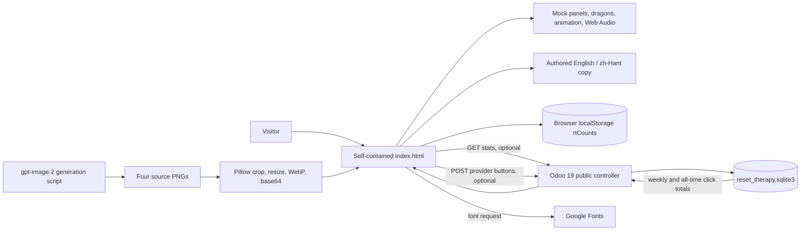
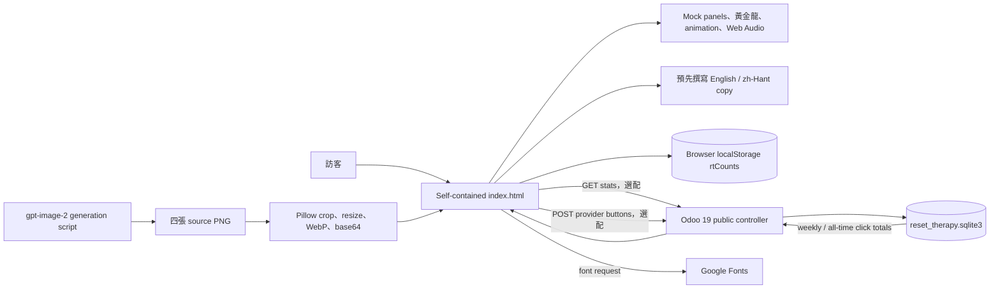

<a id="english"></a>

[← Public GitHub portfolio](./README.md) · [Ted's profile](../README.md) · **English** · [繁體中文](#traditional-chinese) · [GitHub repository](https://github.com/teddashh/reset-therapy) · [Live English page](https://www.ted-h.com/reset-therapy) · [Live Traditional Chinese page](https://www.ted-h.com/zh_TW/reset-therapy)

# Reset Therapy

> A deliberately fake quota-reset machine for the very real feeling of watching every AI plan run dry.

## Positioning and project snapshot

Reset Therapy is a bilingual browser toy about AI-tool quota anxiety. Four carefully drawn mock settings panels—ChatGPT/Codex, Claude, Gemini, and Grok—slowly burn toward their limits. Each has a chained golden dragon and an impossible button: press it, the quota animates back to full, the chains break, the dragon celebrates, and nothing whatsoever happens to the real account.

The joke is packaged as a complete little product rather than a screenshot. It has per-provider and reset-all paths, a relapse loop, generated sound effects, reduced-motion handling, personal counts, a weekly leaderboard, responsive English/Traditional Chinese layouts, and an optional shared counter API. It is best understood as an interactive parody and anti-burnout artifact—not an account utility, provider integration, or measurement dashboard.

This page was verified against the public repository and live site on **July 30, 2026**. The one-commit `main` branch is at [`4a3dea1`](https://github.com/teddashh/reset-therapy/commit/4a3dea1682a4df9a53dccd5031c293f5b3e65d2b); GitHub showed **1 star** at this snapshot.

| Snapshot | Current repository evidence |
|---|---|
| Product form | One responsive static page, with an optional two-endpoint shared-counter backend |
| Live routes | `www.ted-h.com/reset-therapy`, `/zh_TW/reset-therapy`, and a matching GitHub Pages deployment |
| Frontend | One 1,465-line / 557,854-byte `index.html` containing the markup, CSS, JavaScript, SVG chain art, and base64 WebP dragons |
| Runtime dependencies | No build step or JavaScript package dependency; Google Fonts is external, and the shared counter API is optional |
| Interaction | Four individual resets, reset-all, relapse, live quota burn, chain-break animation, Web Audio cues, personal counts, and ranked weekly cards |
| Localization | Authored English and Taiwan Traditional Chinese; query-string switching on a static host and Odoo language routes/cookies on ted-h.com |
| Optional backend | A 89-line Odoo 19 controller using one local SQLite file and Monday-start weeks fixed to UTC+8 |
| Art pipeline | Four `gpt-image-2` dragon generations, cropped/resized to 600×750 WebP by a Pillow script, then inlined as data URIs |
| Repository maturity | 16 tracked files, one commit, no tags or GitHub Releases, and no project test/CI workflow; GitHub Pages deployment completed successfully |
| License | Root page and scripts under MIT; the optional Odoo module declares LGPL-3 in its manifest |

## The problem it addresses

Quota exhaustion is a tiny but recurring emotional tax in an AI-heavy workflow. The user watches several unrelated reset clocks, sees a plan at 76%, 83%, or 99%, and knows the only real actions are to wait, switch tools, buy more capacity, or stop. The numbers are operationally mundane but psychologically loud.

Reset Therapy does not solve capacity. It gives the frustration a physical, comic action:

- imitate the familiar visual language closely enough to trigger recognition;
- let the user choose exactly which depleted service to “heal”;
- turn a progress bar into an immediate, exaggerated recovery;
- make the chained dragon a visible stand-in for the blocked workflow; and
- invite a relapse so the ritual can be repeated.

That distinction is essential. Every quota percentage, reset date, and headline leaderboard baseline is theatre. The only real usage-like data in this project is how many reset buttons were pressed—not how many accounts were fixed and not how much anyone used a provider.

## User experience and capabilities

### Four fake settings panels that keep getting worse

On first load, the page establishes a depleted state:

- the ChatGPT/Codex panel shows remaining weekly capacity;
- Claude shows current-session, all-model, and Fable-style limits;
- Gemini shows current and weekly usage;
- Grok shows a segmented weekly limit and a DeepSearch-style meter.

The exact values are authored fiction. A 900 ms loop nudges the meters farther toward their caps while the matching provider remains untreated. Reset dates are generated a few days beyond the current visit, so the scene always feels freshly inconvenient.

Each column pairs its panel with an original golden-dragon image, dynamically drawn SVG chains and lock, a provider-colored reset button, and a status indicator. The Gemini dragon is intentionally the comic one; the other three keep the dark-fantasy relic pose.

### Heal one provider or all four

A visitor can click either the reset button or the keyboard-focusable dragon:

1. The selected provider is marked healed.
2. Its personal local count increments.
3. Meters ease back to the authored “full” state.
4. The lock breaks into particles and the dragon brightens and hops.
5. A short Web Audio cue plays after user interaction.
6. The leaderboard appears or updates.

The sticky **Reset all four** control applies the same flow to every provider that is not already healed. When all four are complete, the background softens, the mood line declares world peace, a bilingual therapy quote appears, and the reset button becomes a completed state.

The **Burned out again…** / **哭啊，又全部燒光了** action reverses the visual state without deleting the visitor's accumulated click counts. The impossible cure is therefore repeatable by design.

### A leaderboard made from two explicitly different ingredients

The leaderboard combines:

- a date-seeded deterministic baseline, weighted across the four provider names so a standalone static copy still looks alive; and
- either shared backend button counts or, when the API is absent, that browser's `localStorage` counts.

Rows and the four main columns reorder by the resulting weekly rank. The server stores one integer for each `(provider, week)` and also derives all-time totals by summing rows. A “reset all” action increments each provider once.

This is not a unique-person metric. The public copy calls the numbers “people healed,” but technically they are a fictional baseline plus unauthenticated button presses. Reloading, relapsing, scripted requests, or multiple devices can create more counts.

### Bilingual behavior that works inside and outside Odoo

English and Taiwan Traditional Chinese copy live together in the document. Language choice also updates the document title, `lang` attribute, labels, dates, quotes, panel text, and accessible dragon names.

- On a static host or `file://`, `?lang=en` and `?lang=zh` select the authored copy.
- On ted-h.com, the switcher calls Odoo's language endpoint and redirects between `/reset-therapy` and `/zh_TW/reset-therapy`.
- Direct query helpers such as `?healed=1` or `?heal=claude,gemini` can stage a visual state for a screenshot or demonstration without recording a server heal.

The layout collapses for mobile, interactive dragons respond to Enter/Space, and `prefers-reduced-motion` replaces major motion with immediate state changes.

## Architecture and data flow



There are two independently useful pieces:

- **Static experience:** `index.html` contains the entire shipped UI. Four WebPs are embedded as data URIs, so dragon rendering does not need an image request. Browser storage keeps per-provider personal counts. If fetch fails or the page is opened from disk, all reset interactions, ranking, sound, and visual states still work.
- **Optional shared counter:** `server/reset_therapy_stats/` is an Odoo 19 module with two public JSON routes. It creates `reset_therapy.sqlite3` under Odoo's data directory, uses a `(provider, week)` primary key, increments through an SQLite upsert, and returns current-week plus all-time maps.

The backend week is calculated as a Monday-start index at a fixed UTC+8 offset. It accepts only the four known provider keys, caps the raw request body at 4,096 characters, uses parameterized SQL, disables session saving, and marks responses `Cache-Control: no-store`.

## Key engineering and design choices

### 1. Make the artifact portable before making it connected

The static page is the product. It can be opened directly, placed on GitHub Pages, or embedded in ted-h.com without a frontend build. The shared counter fails soft: a missing backend changes only which click delta feeds the theatrical leaderboard, not whether the toy works.

### 2. Separate the emotional truth from factual claims

The panels intentionally evoke provider settings, but the README and footer say that the app is unaffiliated, reads no account, and resets no real quota. The engineering reinforces that boundary: there is no OAuth, provider API, cookie access, browser extension permission, or account identifier anywhere in the runtime.

### 3. Use deterministic fiction rather than pretending clicks are adoption

A stable formula makes the leaderboard feel populated even on a fresh static deployment. Real shared clicks are added, not relabeled as provider usage. This is honest at the code level, though the visible “people” wording is looser than the actual metric and should not be reused as an analytics claim.

### 4. Keep global state deliberately tiny

The production reference backend needs one table and two routes. There is no Odoo ORM model, user account, session, background job, or analytics schema. The SQLite file survives module uninstall by design, so the operator can preserve or explicitly remove the small ledger separately.

### 5. Build delight from native browser primitives

Quota interpolation uses `requestAnimationFrame`; ongoing burn uses one interval; chain art is generated SVG; celebration and relapse particles use canvas; sound comes from Web Audio oscillators. The page therefore avoids shipping animation/audio libraries while still producing a tactile sequence.

### 6. Keep generated art reproducible as an authored pipeline

`art/gen_dragons.py` records one shared style prompt and four character-specific directions for `gpt-image-2`. `art/drg_post.py` detects the bright top edge, crops to 4:5, resizes to 600×750, writes quality-80 WebP, and injects base64 into placeholder tokens. The committed page already contains the output; regenerating it requires restoring a placeholder template first.

### 7. Treat language as product copy, not runtime translation

Both languages are committed and reviewed in the page. The same interaction state chooses corresponding labels, dates, quotes, and footer text; no translation API or late-loading locale bundle is involved.

## Quick start

### Open the standalone page

Clone the repository and open the file directly:

```sh
git clone https://github.com/teddashh/reset-therapy.git
cd reset-therapy
python3 -m http.server 8000
```

Then visit:

```text
http://127.0.0.1:8000/?lang=en
http://127.0.0.1:8000/?lang=zh
```

Opening `index.html` with `file://` also works. In either standalone mode, the unavailable `/reset-therapy/api/*` calls fail softly and the leaderboard uses local counts.

### Use the live edition

- [English](https://www.ted-h.com/reset-therapy)
- [Traditional Chinese](https://www.ted-h.com/zh_TW/reset-therapy)
- [GitHub Pages copy](https://teddashh.github.io/reset-therapy/)

### Add a shared counter

Install the reference `server/reset_therapy_stats/` module into an Odoo 19 instance, or implement the two documented routes in another framework:

```text
GET  /reset-therapy/api/stats
POST /reset-therapy/api/heal
     {"providers":["claude","gemini"]}
```

The frontend does not require Odoo-specific response fields beyond the documented `weekIdx`, `week`, and `all` maps.

## Current scope, risks, and license

- **Nothing here resets a real quota.** The page is a parody and is not affiliated with OpenAI, Anthropic, Google, or xAI. It reads no account, plan, cookie, token, or provider API.
- **The percentages and dates are fabricated.** Their motion is deliberately theatrical. They must never be cited as a provider limit, current plan rule, or usage observation.
- **The leaderboard is not a people counter.** It combines a deterministic fake baseline with button presses. There is no account, device deduplication, bot filter, or proof that one click represents one person.
- **The public POST route has no abuse control.** It is unauthenticated, `csrf=False`, and has no rate limit or origin check. A script can inflate counts. The 4 KiB body cap and provider allowlist limit shape, not volume.
- **The tiny backend has a tiny-data assumption.** Every stats response scans all ledger rows to compute all-time totals. That is acceptable for a four-provider weekly toy, not a general analytics design.
- **Frontend verification is manual.** The repository has screenshots and a successful Pages deployment but no lint, automated interaction tests, accessibility audit, or custom CI workflow.
- **“Self-contained” does not mean zero network.** Dragon art and application code are inline, but the page requests Google Fonts and attempts the optional same-origin stats API. Browser fallback fonts and local counters keep it functional if either fails.
- **The HTML is intentionally heavy.** Inlining four WebPs makes one portable file but grows it to roughly 558 KB and duplicates the separately committed source WebPs.
- **Provider-like visual design needs context.** The disclaimer is essential because a cropped panel could otherwise be mistaken for a real provider screen or real reset control.
- **Personal counts remain in browser storage.** `rtCounts` persists until the user clears site data; the relapse button does not clear it. No server receives that local history except each newly pressed provider increment.
- **Art regeneration is not one command from the shipped HTML.** The committed page no longer contains `__DRG_*__` placeholders. A maintainer needs the template form before running the injection script.
- **License:** the root page and art scripts are released under MIT. The optional Odoo module declares LGPL-3 in `__manifest__.py`, following its stated Odoo convention. Generated artwork and provider marks should also be evaluated under the applicable service and trademark terms before reuse.

## Source and documentation

- [Repository](https://github.com/teddashh/reset-therapy)
- [Repository README](https://github.com/teddashh/reset-therapy/blob/main/README.md)
- [Self-contained page](https://github.com/teddashh/reset-therapy/blob/main/index.html)
- [Odoo counter controller](https://github.com/teddashh/reset-therapy/blob/main/server/reset_therapy_stats/controllers/main.py) · [module manifest](https://github.com/teddashh/reset-therapy/blob/main/server/reset_therapy_stats/__manifest__.py)
- [Dragon generation script](https://github.com/teddashh/reset-therapy/blob/main/art/gen_dragons.py) · [post-processing/inlining script](https://github.com/teddashh/reset-therapy/blob/main/art/drg_post.py)
- [Desktop screenshot](https://github.com/teddashh/reset-therapy/blob/main/docs/screenshot-desktop.png) · [mobile screenshot](https://github.com/teddashh/reset-therapy/blob/main/docs/screenshot-mobile.png)
- [Live English page](https://www.ted-h.com/reset-therapy) · [live Traditional Chinese page](https://www.ted-h.com/zh_TW/reset-therapy)

---

[← Previous: MCP Memory Server](./mcp-memory-server.md) · [Next: IDN Homograph Attack Awareness Demo →](./idn-homograph-example.md)

---

<a id="traditional-chinese"></a>

[← GitHub 公開作品集](./README.md#traditional-chinese) · [Ted 個人頁](../README.zh-TW.md) · [English](#english) · **繁體中文** · [GitHub 原始碼](https://github.com/teddashh/reset-therapy) · [英文線上版](https://www.ted-h.com/reset-therapy) · [繁中線上版](https://www.ted-h.com/zh_TW/reset-therapy)

# Reset Therapy 重置 Therapy

> 給那個真的看著四家 AI 額度一起燒光的心情，一台完全假的 quota-reset machine。

## 作品定位與現況快照

Reset Therapy 是一個拿 AI tool quota anxiety 開玩笑的雙語 browser toy。四個精心畫出的 mock settings panel——ChatGPT／Codex、Claude、Gemini、Grok——慢慢燒向上限；每家旁邊都有一條被鎖住的黃金龍，以及一顆現實中不可能存在的按鈕：按下去，額度動畫回滿、鎖鏈斷掉、龍歡呼，而真實 account 完全不會發生任何事。

這個笑點被做成完整小作品，而不只是一張 screenshot：有單家／全部 reset、relapse loop、程式生成音效、reduced-motion handling、個人次數、每週排行榜、responsive English／繁中 layout，以及選配 shared-counter API。它最適合被理解成互動 parody 與 anti-burnout artifact，不是 account utility、provider integration 或 measurement dashboard。

本頁於 **2026 年 7 月 30 日**核對公開 repository 與 live site。只有一個 commit 的 `main` 位於 [`4a3dea1`](https://github.com/teddashh/reset-therapy/commit/4a3dea1682a4df9a53dccd5031c293f5b3e65d2b)；這次快照中 GitHub 顯示 **1 star**。

| 快照 | 目前 repository 的實際狀態 |
|---|---|
| 產品形式 | 一個 responsive static page，另有選配 two-endpoint shared-counter backend |
| 線上路徑 | `www.ted-h.com/reset-therapy`、`/zh_TW/reset-therapy`，以及相同的 GitHub Pages deployment |
| Frontend | 1,465 行／557,854 bytes 的單一 `index.html`，內含 markup、CSS、JavaScript、SVG 鎖鏈與 base64 WebP 黃金龍 |
| Runtime dependencies | 無 build step、無 JavaScript package dependency；Google Fonts 是外部資源，shared counter API 為選配 |
| 互動 | 四顆單家 reset、reset-all、relapse、live quota burn、斷鏈 animation、Web Audio cue、個人次數、每週排名卡 |
| 語言 | 預先撰寫 English 與台灣正體；static host 用 query string，ted-h.com 用 Odoo language route／cookie |
| 選配 backend | 89 行 Odoo 19 controller，使用一個 local SQLite file，week 固定 UTC+8、週一起算 |
| Art pipeline | 四張 `gpt-image-2` 黃金龍，經 Pillow crop／resize 成 600×750 WebP，再 inline 成 data URI |
| Repository 成熟度 | 16 tracked files、一個 commit、無 tag／GitHub Release、無 project test／CI workflow；GitHub Pages deployment 已成功 |
| 授權 | Root page／scripts 採 MIT；選配 Odoo module 在 manifest 宣告 LGPL-3 |

## 它要解決的問題

Quota exhaustion 是 AI-heavy workflow 裡很小、卻會不斷重複的情緒稅。使用者看著幾個彼此無關的 reset clock，看到 plan 走到 76%、83%、99%，也知道現實選項只有等待、換工具、買更多容量或停下。數字在操作上很平凡，在心理上卻很吵。

Reset Therapy 不解決 capacity，而是給 frustration 一個具體、漫畫式動作：

- 以足夠熟悉的 visual language 觸發「就是這個」的辨識；
- 讓使用者選出最想「治癒」的 depleted service；
- 把 progress bar 變成立刻、誇張的 recovery；
- 用被鎖住的龍代替卡住的 workflow；以及
- 提供 relapse，讓療癒儀式可以重複。

這個區分非常重要：每個 quota percentage、reset date 與排行榜 baseline 都是演出。專案裡唯一接近真實 usage 的資料，是 reset button 被按了幾次——不是幾個 account 被修好，也不是任何人真的用了多少 provider。

## 使用體驗與能力

### 四個會自己越來越慘的假 settings panels

第一次載入時，頁面建立 depleted state：

- ChatGPT／Codex panel 顯示剩餘 weekly capacity；
- Claude 顯示 current-session、all-model、Fable-style limits；
- Gemini 顯示 current／weekly usage；
- Grok 顯示 segmented weekly limit 與 DeepSearch-style meter。

所有數值都是 authored fiction。每 900 ms 的 loop 會在 provider 尚未治癒時，把 meter 再推向 cap；reset date 則動態設在訪客當下幾天之後，所以每次看起來都剛好很不方便。

每一欄把 panel 和原創黃金龍、dynamic SVG chain／lock、provider-colored reset button、status indicator 放在一起。Gemini 的龍刻意負責搞笑，另外三條維持 dark-fantasy relic pose。

### 單獨救一家，或四家一起復活

訪客可以按 reset button，也能點擊／用鍵盤操作可 focus 的龍：

1. 所選 provider 標為 healed。
2. 個人 local count 加一。
3. Meter ease 回 authored「full」state。
4. 鎖炸成粒子，龍變亮並跳一下。
5. User interaction 後播放短 Web Audio cue。
6. Leaderboard 顯示或更新。

Sticky **全部重置吧** 對每個尚未 healed 的 provider 執行相同流程。四家完成後，背景變柔和、mood line 宣告世界和平、出現雙語 therapy quote，reset button 也轉成 completed state。

**哭啊，又全部燒光了**／**Burned out again…** 會反轉 visual state，但不刪除訪客累積的 click count；這個不可能的療法本來就設計成可以再來一次。

### 由兩種明確不同成分組成的排行榜

Leaderboard 結合：

- date-seeded deterministic baseline，依四個 provider 名稱加權，讓完全 static 的 copy 仍看起來活著；以及
- shared backend button counts；API 不存在時則用該 browser 的 `localStorage` counts。

Rows 與四個主欄會依合成 weekly rank 重排。Server 每個 `(provider, week)` 保存一個 integer，並把 rows 加總成 all-time totals。「全部重置」會讓每個 provider 各增加一次。

這不是 unique-person metric。Public copy 把數字稱為「獲得療癒的人」，技術上其實是 fictional baseline 加 unauthenticated button presses；reload、relapse、scripted request 或多台裝置都能產生更多 counts。

### 在 Odoo 內外都能工作的雙語行為

English／台灣正體 copy 一起寫在 document 裡。切換語言也會更新 title、`lang` attribute、label、date、quote、panel text 與 accessible dragon name。

- Static host／`file://` 使用 `?lang=en`、`?lang=zh`。
- ted-h.com 透過 Odoo language endpoint，在 `/reset-therapy` 與 `/zh_TW/reset-therapy` 間 redirect。
- `?healed=1`、`?heal=claude,gemini` 這類 query helper 可為 screenshot／demo 直接布置 visual state，且不會記錄 server heal。

Layout 會為 mobile 收合；interactive dragon 支援 Enter／Space；`prefers-reduced-motion` 會把主要 motion 改成立刻完成 state。

## 架構與資料流



兩個部分都能獨立產生價值：

- **Static experience：** `index.html` 包含整個 shipped UI。四張 WebP 以 data URI 內嵌，所以黃金龍不需 image request；browser storage 保存 per-provider personal counts。即使 fetch 失敗或直接從磁碟開啟，所有 reset interaction、ranking、sound、visual state 都能用。
- **Optional shared counter：** `server/reset_therapy_stats/` 是只有兩個 public JSON routes 的 Odoo 19 module。它在 Odoo data directory 建立 `reset_therapy.sqlite3`，以 `(provider, week)` 為 primary key、用 SQLite upsert 累加，回傳 current-week／all-time maps。

Backend week 是固定 UTC+8 的 Monday-start index。它只接受四個已知 provider key、把 raw request body 限在 4,096 characters、使用 parameterized SQL、不保存 session，response 標記 `Cache-Control: no-store`。

## 關鍵工程與設計選擇

### 1. 先把 artifact 做成可攜，再讓它連線

Static page 本身就是產品，可以直接開啟、放 GitHub Pages，或嵌進 ted-h.com，不需 frontend build。Shared counter 採 fail-soft：backend 缺少時只改變哪一種 click delta 餵給戲劇化排行榜，不影響 toy 能否運作。

### 2. 把情緒真實與事實主張分開

Panels 刻意喚起 provider settings，但 README／footer 明確說明 app 無 affiliation、不讀 account、不 reset 真實 quota。工程也強化邊界：runtime 沒有 OAuth、provider API、cookie access、browser extension permission 或 account identifier。

### 3. 使用 deterministic fiction，不把 click 冒充 adoption

穩定公式讓排行榜在 fresh static deployment 也像有人使用；真實 shared clicks 只是加上去，沒有改名成 provider usage。Code 層很誠實，但 visible「people」文案比實際 metric 寬鬆，不應被拿去當 analytics claim。

### 4. Global state 刻意保持極小

Production reference backend 只要一張 table、兩個 routes；沒有 Odoo ORM model、user account、session、background job 或 analytics schema。SQLite file 設計上會在 module uninstall 後保留，操作員可另外保存或明確刪除這本小 ledger。

### 5. 用 browser 原生 primitive 做出 delight

Quota interpolation 用 `requestAnimationFrame`；持續 burn 用一個 interval；chain art 是 generated SVG；celebration／relapse particles 使用 canvas；sound 來自 Web Audio oscillator。因此不用 animation／audio library，也能產生有手感的 sequence。

### 6. 把 generated art 保留成可理解的 authored pipeline

`art/gen_dragons.py` 記錄共用 style prompt，以及四種角色-specific direction；`art/drg_post.py` 找出 bright top edge、crop 成 4:5、resize 600×750、輸出 quality-80 WebP，再注入 base64 placeholder。Committed page 已含 output；重新生成前必須先恢復帶 placeholder 的 template。

### 7. Language 是產品 copy，不是 runtime translation

兩種語言都 commit、可 review；相同 interaction state 選出對應 label、date、quote、footer，不使用 translation API 或 late-loading locale bundle。

## 快速開始

### 開啟 standalone page

Clone repository，直接提供 static file：

```sh
git clone https://github.com/teddashh/reset-therapy.git
cd reset-therapy
python3 -m http.server 8000
```

接著打開：

```text
http://127.0.0.1:8000/?lang=en
http://127.0.0.1:8000/?lang=zh
```

用 `file://` 開 `index.html` 也能使用。兩種 standalone mode 都會讓不可用的 `/reset-therapy/api/*` request fail soft，排行榜改用 local counts。

### 使用線上版

- [English](https://www.ted-h.com/reset-therapy)
- [台灣正體](https://www.ted-h.com/zh_TW/reset-therapy)
- [GitHub Pages copy](https://teddashh.github.io/reset-therapy/)

### 加上 shared counter

把 reference `server/reset_therapy_stats/` module 安裝到 Odoo 19 instance，或用其他 framework 實作兩個 documented routes：

```text
GET  /reset-therapy/api/stats
POST /reset-therapy/api/heal
     {"providers":["claude","gemini"]}
```

Frontend 除了 documented `weekIdx`、`week`、`all` maps，不依賴其他 Odoo-specific response field。

## 目前範圍、風險與授權

- **這裡不會 reset 任何真實 quota。** Page 是 parody，與 OpenAI、Anthropic、Google、xAI 無 affiliation；不讀 account、plan、cookie、token 或 provider API。
- **Percentage／date 全是假造。** Motion 刻意為戲劇效果，絕不能被引用成 provider limit、current plan rule 或 usage observation。
- **Leaderboard 不是 people counter。** 它把 deterministic fake baseline 與 button press 加在一起；沒有 account、device deduplication、bot filter，也沒有證據說一個 click 等於一個人。
- **Public POST route 沒有 abuse control。** 它 unauthenticated、`csrf=False`，也沒有 rate limit／origin check；script 可以灌 counts。4 KiB body cap／provider allowlist 只限制 shape，不限制 volume。
- **Tiny backend 假設資料真的很小。** 每個 stats response 都掃完整 ledger 計算 all-time total；對四 provider weekly toy 可以接受，不是一般 analytics design。
- **Frontend verification 仍靠人工。** Repo 有 screenshots 與 successful Pages deployment，但沒有 lint、automated interaction tests、accessibility audit 或 custom CI workflow。
- **「Self-contained」不等於 zero network。** 黃金龍與 application code inline，但頁面會 request Google Fonts，也會嘗試 same-origin stats API；browser fallback font／local counter 讓兩者失敗時仍能運作。
- **HTML 刻意偏重。** Inline 四張 WebP 換來單檔可攜，代價是約 558 KB，且和另外 committed source WebP 重複。
- **Provider-like visual design 必須帶 context。** Disclaimer 很重要，否則 cropped panel 可能被誤認成真 provider screen 或真 reset control。
- **Personal counts 留在 browser storage。** `rtCounts` 一直保存到使用者清除 site data；relapse 不會清除。除了每次新按的 provider increment，server 不會收到這段 local history。
- **不能直接對 shipped HTML 一鍵重生 art。** Committed page 已沒有 `__DRG_*__` placeholders；maintainer 要先取得 template 形態才能跑 injection script。
- **授權：** Root page／art scripts 採 MIT；選配 Odoo module 在 `__manifest__.py` 依其 Odoo convention 宣告 LGPL-3。Generated artwork 與 provider marks 若要再利用，也應依適用 service／trademark terms 另行評估。

## 原始碼與文件

- [Repository](https://github.com/teddashh/reset-therapy)
- [Repository README](https://github.com/teddashh/reset-therapy/blob/main/README.md)
- [Self-contained page](https://github.com/teddashh/reset-therapy/blob/main/index.html)
- [Odoo counter controller](https://github.com/teddashh/reset-therapy/blob/main/server/reset_therapy_stats/controllers/main.py) · [module manifest](https://github.com/teddashh/reset-therapy/blob/main/server/reset_therapy_stats/__manifest__.py)
- [黃金龍 generation script](https://github.com/teddashh/reset-therapy/blob/main/art/gen_dragons.py) · [post-processing／inlining script](https://github.com/teddashh/reset-therapy/blob/main/art/drg_post.py)
- [Desktop screenshot](https://github.com/teddashh/reset-therapy/blob/main/docs/screenshot-desktop.png) · [mobile screenshot](https://github.com/teddashh/reset-therapy/blob/main/docs/screenshot-mobile.png)
- [英文線上版](https://www.ted-h.com/reset-therapy) · [繁中線上版](https://www.ted-h.com/zh_TW/reset-therapy)

---

[← 上一頁：MCP Memory Server](./mcp-memory-server.md#traditional-chinese) · [下一頁：IDN Homograph Attack Awareness Demo →](./idn-homograph-example.md#traditional-chinese)
