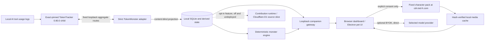
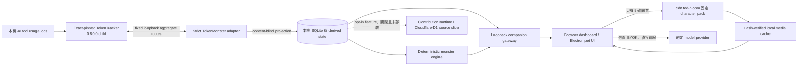

<a id="english"></a>

[← Public GitHub portfolio](./README.md) · [Ted's profile](../README.md) · **English** · [繁體中文](#traditional-chinese) · [GitHub repository](https://github.com/teddashh/TokenMonster) · [Latest public release: v0.1.0-rc.22](https://github.com/teddashh/TokenMonster/releases/tag/v0.1.0-rc.22)

# TokenMonster

## Positioning and project snapshot

TokenMonster is a local-first AI-usage companion. It turns aggregate token activity from Claude Code, Codex, Gemini CLI, and Grok CLI into a browser dashboard, daily/weekly/28-day trends, model rankings, and a progression system for eleven companion characters. The practical tool answers “how much am I using?”; the playful layer makes that answer feel like a relationship that grows over time instead of another billing chart.

The repository deliberately does not implement four log parsers or maintain a TokenTracker fork. A supervised, exact-pinned `tokentracker-cli@0.80.0` child remains the collection engine. TokenMonster puts a strict loopback adapter in front of its reviewed aggregate routes, projects only content-blind usage data, and owns the local experience, character rules, privacy contracts, packaging, and optional desktop pet around that boundary.

This page was verified against the public repository on **September 8, 2026**. The default branch is at [`8df862d`](https://github.com/teddashh/TokenMonster/commit/8df862d27d2dd6460ab8ce73814916045afbc2c8), three documentation/screenshot commits after the latest release source. GitHub showed **0 stars** at this snapshot.

| Snapshot | Current repository evidence |
|---|---|
| Product form | Cross-platform CLI launching a loopback browser dashboard, plus an Electron tray/pet application and public Windows installer |
| Latest public build | `v0.1.0-rc.22`, built from [`2f72a49`](https://github.com/teddashh/TokenMonster/commit/2f72a49864d39b19c66397fb881f853ca7708e5c); publishable workspace packages use 0.1.0 while the private root coordinator is 0.0.0 |
| Usage sources | Claude Code, Codex, Gemini CLI, and Grok CLI through exact-pinned TokenTracker aggregate endpoints |
| Core stack | Strict TypeScript npm workspaces, Node.js 24.15.0, npm 11.12.1, React 19, Vite 8, Electron 43, Zod 4, local SQLite, and optional Hono / Cloudflare D1 source slices |
| Companion system | 11 characters; four built-in starters, seven milestone-unlocked friends, 20 wardrobe/pose themes per character, and deterministic local progression |
| Built-in media | Starter art for four characters and 168 fixed English/Traditional Chinese lines; no built-in audio |
| Optional media | One consent-gated, integrity-verified pack with 891 images and 55 prerecorded WAV files—946 entries for all 11 characters; voice is off by default |
| Release verification | The rc.22 source passed Node verification, sidecar compatibility, companion desktop, and installed-release smoke jobs on Linux, macOS, and Windows, plus native Windows install/start/uninstall smoke |
| Repository scale | 193 commits and 692 tracked files at the reviewed default branch |
| License | Standard MIT License, with a separate third-party notices inventory |

## The problem it addresses

AI coding tools keep their own logs, terminology, caches, and usage shapes. A person switching among several CLIs can feel that tokens are disappearing without a single local view of the pattern. A conventional telemetry dashboard can aggregate that information, but often asks the user to create an account, send activity to a service, or accept a collector that sees more of the underlying session than the chart needs.

TokenMonster takes a narrower route:

- the existing TokenTracker engine collects and deduplicates locally;
- a strict adapter accepts reviewed aggregate shapes rather than prompts or raw sessions;
- the dashboard stays useful without a TokenMonster cloud account;
- progress is derived from explainable local milestones; and
- optional network features are separated from the default offline path.

The character layer addresses a softer problem as well. Token usage is normally framed as cost, depletion, or guilt. TokenMonster reframes real work into a small companion ritual without selling progress or rewarding pointless consumption: lifetime totals, active-day streaks, and provider breadth unlock characters and outfits, while every unlock remains local and monotonic.

## User experience and capabilities

### Start one local dashboard

The CLI resolves and supervises its exact TokenTracker dependency, launches the local collector boundary, then prints a session-bearing loopback URL. The browser opens to a dashboard with:

- today, seven-day, and 28-day aggregate totals;
- daily usage trends across the four supported tool families;
- a Top 10 model ranking built from allowed local labels;
- a character stage, roster, wardrobe progress, and explainable next milestone;
- a local share card; and
- a compact desktop-pet view when using the Electron edition.

On an SSH host, `--no-open` suppresses browser launch and prints the corresponding `ssh -L` command. No separate TokenTracker installation or TokenMonster account is required.

### Eleven companions with earned progression

The first companion is chosen from ChatGPT, Claude, Gemini, and Grok. Seven more—DeepSeek, Qwen, Mistral, Llama, Sakana, Perplexity, and GLM—unlock from local milestones. The rules use combinations of:

- cumulative usage in a tool/model family;
- lifetime aggregate usage;
- consecutive active days; and
- breadth across supported providers.

Progress only moves forward and lives on the device. There is no gacha currency, in-app purchase, pay-to-win path, or server-authoritative profile. “Use” is a descriptive input to progression, not an instruction to waste tokens.

### A two-tier character-media model

The install is functional offline from first launch. It includes one avatar and one base `tech` outfit for each of the four starters, plus 168 fixed bilingual text lines. The complete media pack is separate:

1. The app explains the download and asks for explicit consent.
2. One fixed, usage-independent ZIP is fetched from `cdn.ted-h.com`.
3. The archive and every allowed entry are checked against the embedded descriptor, manifest, hashes, media signatures, paths, and character associations.
4. Verified files are used from local cache; the pack can be repaired or removed.
5. Missing, declined, failed, offline, or revoked states fall back to built-in starter art, letter placeholders, and silence.

The complete pack contains 891 images and 55 canonical WAV files. Voice playback starts disabled and never streams one file per character event; it reads only verified local cache entries.

### Desktop pet and BYOK conversation

The Electron edition adds a tray application, draggable pet window, compact usage views, and a BYOK chat path. A provider key is kept through the OS-backed secret-vault boundary where available, conversation state remains in memory, and requests go directly from the device to the selected provider rather than through a TokenMonster conversation service.

This feature changes the network boundary and is therefore optional. The default usage dashboard does not need a model API key.

### Privacy controls are part of the product contract

The code and documentation prohibit persisting or transmitting prompts, responses, source code, filenames, project paths, API keys, raw session IDs, environment variables, or raw model IDs as usage telemetry. The supported local flow keeps only projected aggregates and derived companion state.

Default runtime network behavior is intentionally small:

- no TokenMonster account or telemetry;
- no character-pack request until explicit consent;
- a one-time fixed-pack download when enabled;
- direct BYOK provider traffic only when the user invokes chat; and
- an anonymous aggregate contribution feature present in source but disabled by default, with its cloud service not deployed for the current build.

The cloud/D1 packages are therefore implementation and test evidence for an opt-in future surface, not evidence that current users are uploading usage.

## Architecture and data flow



The monorepo keeps the boundaries inspectable:

- **Collection boundary:** `token-tracker-runtime` resolves and supervises the exact dependency; `token-tracker-adapter` validates fixed loopback responses and projects allowed fields.
- **Local product domain:** `local-store`, `usage-domain`, `monster-engine`, and `characters` own aggregates, milestones, roster state, fixed lines, and media authority.
- **Presentation and process:** `companion-gateway`, `companion-ui`, and the CLI expose a session-protected local site and one-command lifecycle.
- **Desktop shell:** `apps/companion` builds the Electron main/preload/renderer surfaces, tray/pet interactions, secret storage, and Windows packaging.
- **Optional cloud source:** `contribution-runtime`, `api-domain`, `api-cloudflare`, `cloud-d1`, `apps/api`, and `apps/web` implement and test an opt-in daily-aggregate design whose production cloud is not currently deployed.

The supported collector has one authority. Legacy Tokscale/Electron collection packages remain migration history in the tree but are not a second runtime source and must not be added to TokenTracker totals.

## Key engineering and design choices

### 1. Exact-pin TokenTracker instead of owning a collector fork

`tokentracker-cli@0.80.0` is a real registry dependency with a locked integrity chain. TokenMonster neither vendors parser code nor reads TokenTracker's private databases/queues. Its adapter speaks only to fixed loopback aggregate endpoints. Supporting a new upstream source requires contract, semantic, privacy, lifecycle, and cross-platform fixtures—not merely a successful upstream install.

### 2. Project to content-blind aggregates at the boundary

Upstream local logs are treated as untrusted and potentially sensitive. The adapter uses strict schemas and allowlists; local product state needs totals, date buckets, tool family, and filtered model labels, not prompt text or project identity. Unknown, malformed, oversized, redirected, or privacy-violating responses are meant to fail closed.

### 3. Keep collection and progression deterministic

Absolute aggregate snapshots, a single collection authority, and explicit derivation rules make correction and replay possible. Character unlocks use versioned local facts rather than a remote profile or random purchase. The UI can explain what unlocked a character and what remains for the next wardrobe state.

### 4. Make optional art one fixed, auditable request

The complete media authority is embedded in the release, while the large bytes remain outside it. One fixed pack prevents per-character requests from revealing roster, usage, or unlock state. Exact inventory and hash checks reject extra, missing, or altered media; removal returns the app to a useful offline base.

### 5. Separate BYOK from TokenMonster infrastructure

The central design never needs provider credentials. BYOK chat is a companion-only path: keys stay behind the local secret-vault abstraction, request content goes directly to the provider, and conversation history is not written as usage data. This keeps “local-first” honest without pretending that an invoked model request is offline.

### 6. Treat packaging as a supply-chain product

Release assembly transforms the workspace into a bounded CLI tarball, carries a shrinkwrap and checksums, validates exact package inventories, authenticates native zstd prebuilds, verifies the embedded starter-art authority, and emits provenance receipts. The rc.22 Windows Squirrel updater was reproducibly rebuilt, byte-compared, then exercised through clean install, launch, and uninstall before publication.

### 7. Reuse one reviewed agent lifecycle

Codex and Claude Code source-launch Skills both call the same doctor, audit, build, readiness, status, and identity-bound stop scripts. They are explicit-only, do not install or alter either agent CLI or credentials, and do not represent a source checkout as an OS-installed application.

## Quick start

### Windows desktop public test

Download `TokenMonsterSetup.exe` from [v0.1.0-rc.22](https://github.com/teddashh/TokenMonster/releases/tag/v0.1.0-rc.22). The installer is unsigned, so Windows SmartScreen is expected to warn. It installs the tray application and can upgrade rc.19–rc.21 in place.

### Cross-platform CLI release

The CLI deliberately checks exact Node.js and npm versions: Node.js `24.15.0` and npm `11.12.1`.

```sh
# Download tokenmonster-0.1.0-rc.22.tgz and the checksum file from Releases first.
npm install /path/to/tokenmonster-0.1.0-rc.22.tgz
npx tokenmonster
```

TokenMonster is not yet published to the npm registry. The release tarball and `SHA256SUMS`-style evidence must be downloaded from GitHub first.

### Run from source

```sh
git clone https://github.com/teddashh/TokenMonster.git tokenmonster
cd tokenmonster
npm ci
npm run build
npm test
npm exec -- tokenmonster
```

An already installed and authenticated Codex or Claude Code can also use the explicit in-repo source-development launch:

```text
Codex:      $launch-tokenmonster start
Claude Code: /launch-tokenmonster start
```

## Current scope, risks, and license

- **This is still a release candidate.** v0.1.0-rc.22 is the latest public test build, not a signed general-availability release.
- **Desktop distribution is Windows-first.** The public Windows installer exists today. macOS and Linux users have the CLI/browser path; public desktop installers and signing/notarization remain roadmap items.
- **The Windows installer is unsigned.** SmartScreen friction is expected. The release pipeline proves source/provenance and native smoke, but that is not a substitute for an Authenticode identity.
- **The runtime toolchain is unusually strict.** The CLI rejects Node/npm drift outside 24.15.0/11.12.1. This improves reviewed reproducibility but makes installation less forgiving, and the package is not yet on npm.
- **Collection inherits an upstream boundary.** Exact pinning and fixtures contain TokenTracker drift; they cannot guarantee that a future AI tool log or upstream parser remains compatible. TokenMonster totals are a usage companion, not a provider billing authority.
- **“Local-first” has explicit exceptions.** The default dashboard can be offline, but consented media downloads contact `cdn.ted-h.com`, and BYOK chat contacts the selected provider. Those actions are disclosed and optional.
- **The full character pack is not built in.** Without consent or a valid cache, only the four starter characters have embedded art; the remaining roster uses fallback presentation and voice stays silent.
- **The contribution cloud is not live.** Source code for opt-in anonymous daily aggregates exists, but the feature defaults off and its cloud side is undeployed. Current builds should not be described as contributing to a public global counter.
- **The latest default-branch CI is not fully green.** The documentation-only HEAD's run passed the main Node verification, three desktop jobs, three release-smoke jobs, and Linux/macOS sidecar jobs, but its Windows sidecar-compatibility job failed on asset-count assertions and two timeouts. The rc.22 release commit itself passed the complete three-platform release gate.
- **Local files still deserve protection.** TokenMonster is designed not to retain prompt/code/path content, but it necessarily lets the supervised collector read local tool usage sources. A compromised host or dependency is outside what an application-level projection can solve.
- **BYOK data follows the provider's policy.** Conversation content leaves the device when the optional chat is used, even though it bypasses TokenMonster's cloud and stays only in memory locally.
- **License:** TokenMonster's source is under the standard MIT License. `THIRD_PARTY_NOTICES.md` and packaged license inventories cover dependencies and redistributed components; the software is provided without warranty.

## Source and documentation

- [Repository](https://github.com/teddashh/TokenMonster)
- [English README](https://github.com/teddashh/TokenMonster/blob/main/README.en.md) · [Traditional Chinese README](https://github.com/teddashh/TokenMonster/blob/main/README.md)
- [Product specification](https://github.com/teddashh/TokenMonster/blob/main/docs/PRODUCT_SPEC.md) · [technical specification](https://github.com/teddashh/TokenMonster/blob/main/docs/TECHNICAL_SPEC.md)
- [Permanent TokenTracker sidecar ADR](https://github.com/teddashh/TokenMonster/blob/main/docs/adr/0005-permanent-tokentracker-sidecar-adapter.md)
- [Data inventory](https://github.com/teddashh/TokenMonster/blob/main/docs/DATA_INVENTORY.md) · [threat model](https://github.com/teddashh/TokenMonster/blob/main/docs/THREAT_MODEL.md)
- [Release process](https://github.com/teddashh/TokenMonster/blob/main/docs/RELEASE.md) · [deployment runbook](https://github.com/teddashh/TokenMonster/blob/main/docs/DEPLOYMENT_RUNBOOK.md)
- [Agent-ready source-development contract](https://github.com/teddashh/TokenMonster/blob/main/docs/AGENT_READY_SOURCE_RELEASE.md)
- [v0.1.0-rc.22 release](https://github.com/teddashh/TokenMonster/releases/tag/v0.1.0-rc.22) · [current Actions](https://github.com/teddashh/TokenMonster/actions)

---

[← Previous: AI Brainstorming](./ai-brainstorming.md) · [Next: openclaw-hermes-watcher →](./openclaw-hermes-watcher.md)

---

<a id="traditional-chinese"></a>

[← GitHub 公開作品集](./README.md#traditional-chinese) · [Ted 的個人頁](../README.zh-TW.md) · [English](#english) · **繁體中文** · [GitHub Repository](https://github.com/teddashh/TokenMonster) · [最新公開版：v0.1.0-rc.22](https://github.com/teddashh/TokenMonster/releases/tag/v0.1.0-rc.22)

# TokenMonster

## 作品定位與現況快照

TokenMonster 是一套 local-first AI 用量陪伴工具。它把 Claude Code、Codex、Gemini CLI、Grok CLI 的 aggregate token activity 轉成 browser dashboard、每日／7 日／28 日趨勢、model 排行，以及 11 位陪伴角色的成長系統。實用層回答「我到底用了多少？」；遊戲感則讓答案像一段會隨時間成長的關係，而不只是另一張帳單圖表。

Repository 刻意不實作四套 log parser，也不維護 TokenTracker fork。受監督、精確鎖版的 `tokentracker-cli@0.80.0` child 仍是 collection engine；TokenMonster 在受審核 aggregate route 前加上 strict loopback adapter，只投影 content-blind 用量資料，並擁有周圍的本機體驗、角色規則、隱私 contract、packaging 與選配 desktop pet。

本頁於 **2026 年 9 月 8 日**核對公開 repository。Default branch 位於 [`8df862d`](https://github.com/teddashh/TokenMonster/commit/8df862d27d2dd6460ab8ce73814916045afbc2c8)，比最新 release source 多三個文件／截圖 commits。這次快照中 GitHub 顯示 **0 stars**。

| 快照 | 目前 repository 的實際狀態 |
|---|---|
| 產品形式 | 啟動 loopback browser dashboard 的跨平台 CLI，另有 Electron tray／pet app 與公開 Windows installer |
| 最新公開版 | `v0.1.0-rc.22`，由 [`2f72a49`](https://github.com/teddashh/TokenMonster/commit/2f72a49864d39b19c66397fb881f853ca7708e5c) 建置；可發布 workspace packages 使用 0.1.0，private root coordinator 則是 0.0.0 |
| 用量來源 | 透過 exact-pinned TokenTracker aggregate endpoints 讀取 Claude Code、Codex、Gemini CLI、Grok CLI |
| 核心技術 | Strict TypeScript npm workspaces、Node.js 24.15.0、npm 11.12.1、React 19、Vite 8、Electron 43、Zod 4、本機 SQLite，以及選配 Hono／Cloudflare D1 source slices |
| 陪伴系統 | 11 位角色；四位內建 starter、七位 milestone-unlocked friends，每位 20 套 wardrobe／pose theme，搭配 deterministic local progression |
| 內建 media | 四位角色的 starter art 與 168 條 English／繁中固定台詞；沒有內建音訊 |
| 選配 media | 一個 consent-gated、integrity-verified pack，含 891 張圖片與 55 條預錄 WAV——11 位角色共 946 entries；voice 預設關閉 |
| Release 驗證 | rc.22 source 在 Linux、macOS、Windows 通過 Node verification、sidecar compatibility、companion desktop 與 installed-release smoke，另有原生 Windows install/start/uninstall smoke |
| Repository 規模 | 受核對 default branch 有 193 commits、692 tracked files |
| 授權 | 標準 MIT License，另有 third-party notices inventory |

## 它要解決的問題

AI coding tool 各自保存 log、術語、cache 與 usage shape。在幾種 CLI 間切換的人，常感覺 token 一直消失，卻沒有一個本機視圖看清模式。一般 telemetry dashboard 能聚合資料，代價卻常是建立帳號、把 activity 送去服務，或接受一個看見超出圖表需求內容的 collector。

TokenMonster 選擇更窄的路：

- 既有 TokenTracker engine 在本機 collection／deduplication；
- strict adapter 接受已審核 aggregate shape，而不是 prompt／raw session；
- dashboard 不需 TokenMonster cloud account 也能使用；
- progression 來自可解釋的本機 milestone；以及
- 選配 network feature 與 default offline path 分離。

角色層也在處理比較柔軟的問題。Token usage 通常只被描述成成本、耗盡或罪惡感；TokenMonster 把真實工作重構成小小陪伴儀式，同時不販售 progression、也不鼓勵無意義消耗。Lifetime total、active-day streak、provider breadth 解鎖角色／衣裝，每個 unlock 都留在本機且只往前。

## 使用體驗與能力

### 一個指令啟動本機 dashboard

CLI 解析並監督精確 TokenTracker dependency，啟動本機 collector boundary，再印出帶 session 的 loopback URL。Browser dashboard 包含：

- 今日、7 日、28 日 aggregate totals；
- 四種支援 tool family 的每日趨勢；
- 由允許本機 label 建立的 Top 10 model ranking；
- 角色舞台、名冊、wardrobe progress 與可解釋的下一個 milestone；
- 本機 share card；以及
- 使用 Electron edition 時的精簡 desktop-pet view。

在 SSH host 上，`--no-open` 會停用 browser launch，並印出對應 `ssh -L` 指令。不需另裝 TokenTracker，也不需 TokenMonster account。

### 十一位角色，進度只能用出來

第一位陪伴角色從 ChatGPT、Claude、Gemini、Grok 選擇。DeepSeek、Qwen、Mistral、Llama、Sakana、Perplexity、GLM 七位朋友則依本機 milestone 解鎖，規則組合：

- tool／model family cumulative usage；
- lifetime aggregate usage；
- 連續 active days；以及
- 支援 providers 的使用廣度。

進度只會往前、只留在裝置。沒有 gacha currency、in-app purchase、pay-to-win 或 server-authoritative profile。「使用」是 progression 的描述性輸入，不是在叫人浪費 token。

### 兩層 character-media model

安裝後第一次開啟就能離線使用：四位 starter 各有一張 avatar、一套 `tech` base outfit，以及 168 條雙語固定台詞。完整 media pack 獨立處理：

1. App 先說明下載內容並要求明確同意。
2. 從 `cdn.ted-h.com` 取得一個固定、與 usage 無關的 ZIP。
3. 依 release 內嵌 descriptor／manifest 驗證 archive、每個 entry 的 hash、media signature、path 與 character association。
4. 驗證後只從本機 cache 使用，且可 repair／remove。
5. 缺少、拒絕、失敗、offline 或撤銷時，退回內建 starter art、letter placeholder 與 silence。

完整 pack 有 891 張圖片與 55 個 canonical WAV。Voice playback 預設關閉，不會為每個角色事件逐檔串流；只讀取已驗證 local cache。

### Desktop pet 與 BYOK conversation

Electron edition 加入 tray application、可拖曳 pet window、精簡 usage view 與 BYOK chat。Provider key 在可用時經 OS-backed secret-vault boundary 保存；conversation state 留在 memory；request 由裝置直達選定 provider，不經 TokenMonster conversation service。

這項功能會改變 network boundary，因此是選配。Default usage dashboard 不需要 model API key。

### Privacy control 本身就是產品 contract

程式與文件禁止把 prompt、response、source code、filename、project path、API key、raw session ID、environment variable 或 raw model ID 當 usage telemetry 保存／傳送。支援的本機 flow 只保留 projected aggregate 與 derived companion state。

Default runtime network behavior 刻意壓到很小：

- 沒有 TokenMonster account／telemetry；
- 明確同意前不請求 character pack；
- 啟用後一次 fixed-pack download；
- 只有使用者呼叫 chat 時才產生 direct BYOK provider traffic；以及
- source 裡雖有 anonymous aggregate contribution 功能，但預設關閉，current build 的 cloud service 也尚未部署。

因此 cloud／D1 packages 是未來 opt-in surface 的 implementation／test evidence，不代表現在使用者正在 upload usage。

## 架構與資料流



Monorepo 讓邊界可以直接檢查：

- **Collection boundary：** `token-tracker-runtime` 解析／監督 exact dependency；`token-tracker-adapter` 驗證 fixed loopback response 並投影允許欄位。
- **Local product domain：** `local-store`、`usage-domain`、`monster-engine`、`characters` 擁有 aggregate、milestone、roster state、fixed line 與 media authority。
- **Presentation／process：** `companion-gateway`、`companion-ui` 與 CLI 提供 session-protected local site 及 one-command lifecycle。
- **Desktop shell：** `apps/companion` 建置 Electron main／preload／renderer、tray／pet interaction、secret storage 與 Windows packaging。
- **Optional cloud source：** `contribution-runtime`、`api-domain`、`api-cloudflare`、`cloud-d1`、`apps/api`、`apps/web` 實作／測試 opt-in daily-aggregate design；production cloud 目前未部署。

支援的 collector 只有一個 authority。Legacy Tokscale／Electron collection packages 仍以 migration history 留在 tree，但不是第二 runtime source，也不得和 TokenTracker totals 相加。

## 關鍵工程與設計選擇

### 1. Exact-pin TokenTracker，而不是擁有 collector fork

`tokentracker-cli@0.80.0` 是帶 locked integrity chain 的正式 registry dependency。TokenMonster 不 vendor parser code，也不讀 TokenTracker private database／queue；adapter 只對 fixed loopback aggregate endpoints 說話。加入新 upstream source 必須先通過 contract、semantic、privacy、lifecycle、cross-platform fixtures，不是「裝得起來」就算支援。

### 2. 在 boundary 投影成 content-blind aggregate

上游本機 log 被視為不可信、可能敏感的輸入。Adapter 使用 strict schema／allowlist；本機產品狀態需要 total、date bucket、tool family、filtered model label，不需要 prompt text 或 project identity。Unknown、malformed、oversized、redirected 或違反 privacy 的 response 應 fail closed。

### 3. Collection／progression 都維持 deterministic

Absolute aggregate snapshot、single collection authority、explicit derivation rule 讓 correction／replay 可行。Character unlock 使用 versioned local fact，而不是 remote profile 或隨機購買；UI 能解釋為何解鎖，以及下一套 wardrobe 還差什麼。

### 4. 選配美術只做一個固定、可稽核 request

完整 media authority 內嵌在 release，大型 bytes 留在外部。一個 fixed pack 避免 per-character request 洩露 roster、usage 或 unlock state。Exact inventory／hash check 拒絕多出、缺少或被改動的 media；移除後 app 回到仍可用的 offline base。

### 5. BYOK 與 TokenMonster infrastructure 分離

核心設計不需要 provider credential。BYOK chat 是 companion-only path：key 留在 local secret-vault abstraction、request content 直達 provider、conversation history 不會寫成 usage data。這讓「local-first」保持誠實，也不會假裝使用者主動呼叫的 model request 是 offline。

### 6. 把 packaging 當成 supply-chain 產品

Release assembly 把 workspace 轉成有界 CLI tarball，帶 shrinkwrap／checksums、驗證 exact package inventory、authenticate native zstd prebuild、檢查 embedded starter-art authority，並輸出 provenance receipt。rc.22 的 Windows Squirrel updater 在發布前做 reproducible rebuild、byte comparison，最後跑 clean install、launch、uninstall。

### 7. 兩種 agent 入口共用一條審核過的 lifecycle

Codex／Claude Code source-launch Skills 都呼叫同一組 doctor、audit、build、readiness、status、identity-bound stop scripts。它們只能明確呼叫、不安裝／修改 agent CLI 或 credential，也不把 source checkout 描述成 OS-installed app。

## 快速開始

### Windows desktop 公開測試版

從 [v0.1.0-rc.22](https://github.com/teddashh/TokenMonster/releases/tag/v0.1.0-rc.22) 下載 `TokenMonsterSetup.exe`。Installer 未簽章，因此 Windows SmartScreen 會警告；它會安裝 tray app，也可直接原地升級 rc.19–rc.21。

### 跨平台 CLI release

CLI 刻意精確檢查 Node.js／npm：Node.js `24.15.0`、npm `11.12.1`。

```sh
# 先從 Releases 下載 tokenmonster-0.1.0-rc.22.tgz 與 checksum。
npm install /path/to/tokenmonster-0.1.0-rc.22.tgz
npx tokenmonster
```

TokenMonster 尚未發布到 npm registry；必須先從 GitHub 下載 release tarball 與 `SHA256SUMS` 類型 evidence。

### 從原始碼執行

```sh
git clone https://github.com/teddashh/TokenMonster.git tokenmonster
cd tokenmonster
npm ci
npm run build
npm test
npm exec -- tokenmonster
```

已安裝且登入的 Codex／Claude Code 也能明確使用 repo 內 source-development launch：

```text
Codex:       $launch-tokenmonster start
Claude Code: /launch-tokenmonster start
```

## 目前範圍、風險與授權

- **仍是 release candidate。** v0.1.0-rc.22 是最新 public test build，不是已簽章 general-availability release。
- **Desktop distribution 以 Windows 為先。** 公開 Windows installer 已存在；macOS／Linux 目前使用 CLI／browser path，公開 desktop installer 與 signing／notarization 仍在 roadmap。
- **Windows installer 未簽章。** SmartScreen 摩擦是預期行為。Release pipeline 能證明 source／provenance 與 native smoke，但不能取代 Authenticode identity。
- **Runtime toolchain 特別嚴格。** CLI 拒絕 24.15.0／11.12.1 以外的 Node／npm drift；這提高 reviewed reproducibility，也讓安裝較不寬容，而且 package 尚未上 npm。
- **Collection 繼承 upstream boundary。** Exact pin／fixture 能控制 TokenTracker drift，不能保證未來 AI tool log 或 upstream parser 永遠相容。TokenMonster totals 是 usage companion，不是 provider billing authority。
- **「Local-first」有明確例外。** Default dashboard 可以 offline，但同意 media download 會連 `cdn.ted-h.com`，BYOK chat 會連選定 provider；兩者都有揭露且為選配。
- **完整 character pack 不在內建包。** 沒有 consent／valid cache 時，只有四位 starter 有 embedded art；其餘 roster 使用 fallback presentation，voice 保持靜音。
- **Contribution cloud 尚未 live。** Source 有 opt-in anonymous daily aggregates，但功能預設 off、cloud side 未部署；不能把 current build 描述成正在貢獻 public global counter。
- **最新 default-branch CI 並非全綠。** 文件-only HEAD 的 run 通過主要 Node verification、三個 desktop jobs、三個 release-smoke jobs 與 Linux／macOS sidecar jobs，但 Windows sidecar-compatibility job 在 asset-count assertions 與兩個 timeout 失敗。rc.22 release commit 本身通過完整三平台 release gate。
- **本機檔案仍需保護。** TokenMonster 設計上不保存 prompt／code／path 內容，但受監督 collector 必然能讀取本機 tool usage source；遭入侵的 host 或 dependency 不是 application-level projection 能解決的。
- **BYOK data 受 provider policy 管理。** 使用選配 chat 時，conversation content 會離開裝置，即使它繞過 TokenMonster cloud、在本機只留 memory。
- **授權：** TokenMonster source 採標準 MIT License；`THIRD_PARTY_NOTICES.md` 與 packaged license inventories 涵蓋 dependencies／redistributed components，軟體不附保固。

## 原始碼與文件

- [Repository](https://github.com/teddashh/TokenMonster)
- [English README](https://github.com/teddashh/TokenMonster/blob/main/README.en.md) · [繁體中文 README](https://github.com/teddashh/TokenMonster/blob/main/README.md)
- [產品規格](https://github.com/teddashh/TokenMonster/blob/main/docs/PRODUCT_SPEC.md) · [技術規格](https://github.com/teddashh/TokenMonster/blob/main/docs/TECHNICAL_SPEC.md)
- [Permanent TokenTracker sidecar ADR](https://github.com/teddashh/TokenMonster/blob/main/docs/adr/0005-permanent-tokentracker-sidecar-adapter.md)
- [Data inventory](https://github.com/teddashh/TokenMonster/blob/main/docs/DATA_INVENTORY.md) · [threat model](https://github.com/teddashh/TokenMonster/blob/main/docs/THREAT_MODEL.md)
- [Release process](https://github.com/teddashh/TokenMonster/blob/main/docs/RELEASE.md) · [deployment runbook](https://github.com/teddashh/TokenMonster/blob/main/docs/DEPLOYMENT_RUNBOOK.md)
- [Agent-ready source-development contract](https://github.com/teddashh/TokenMonster/blob/main/docs/AGENT_READY_SOURCE_RELEASE.md)
- [v0.1.0-rc.22 release](https://github.com/teddashh/TokenMonster/releases/tag/v0.1.0-rc.22) · [目前 Actions](https://github.com/teddashh/TokenMonster/actions)

---

[← 上一頁：AI Brainstorming](./ai-brainstorming.md#traditional-chinese) · [下一頁：openclaw-hermes-watcher →](./openclaw-hermes-watcher.md#traditional-chinese)
